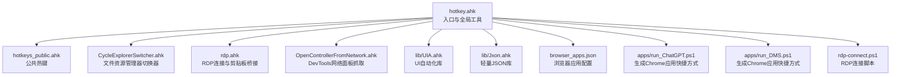
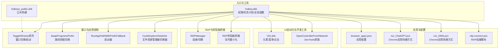
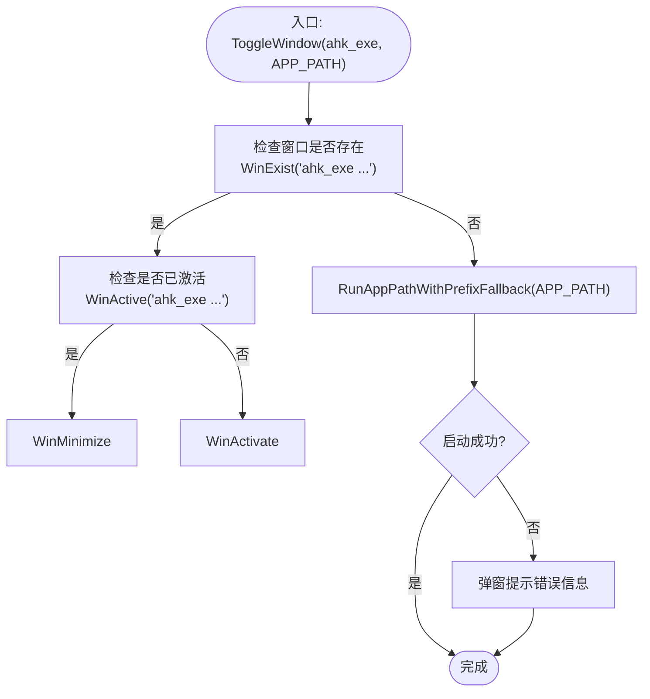
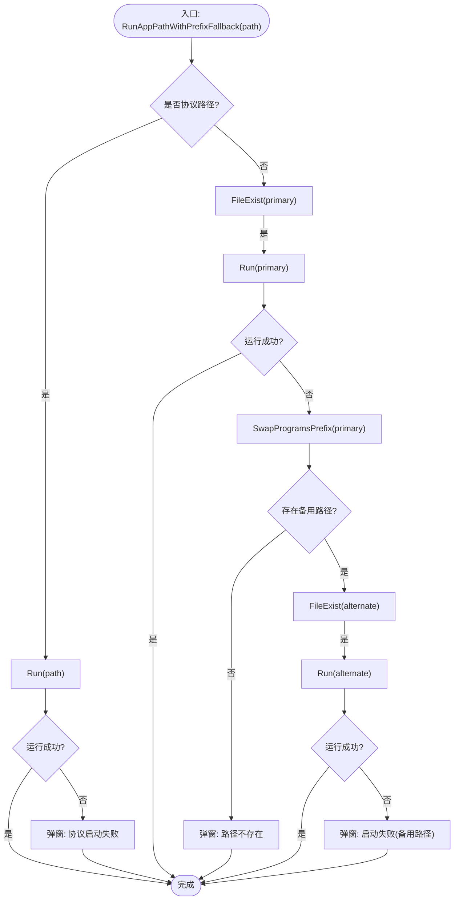
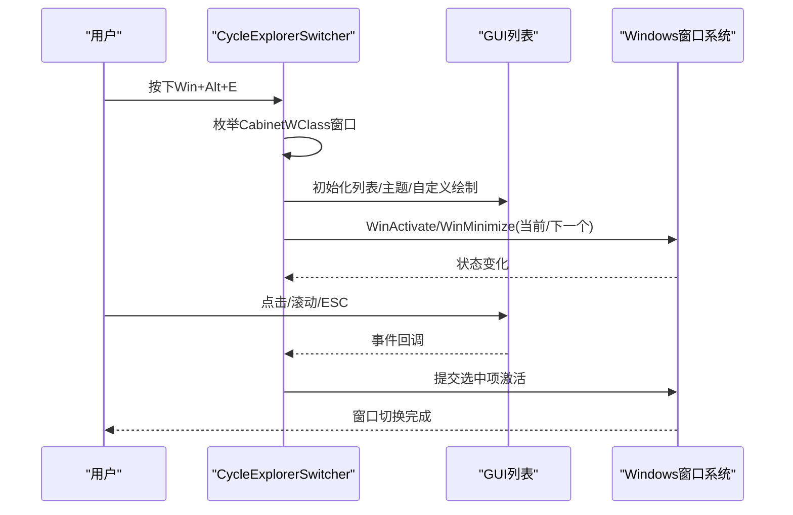
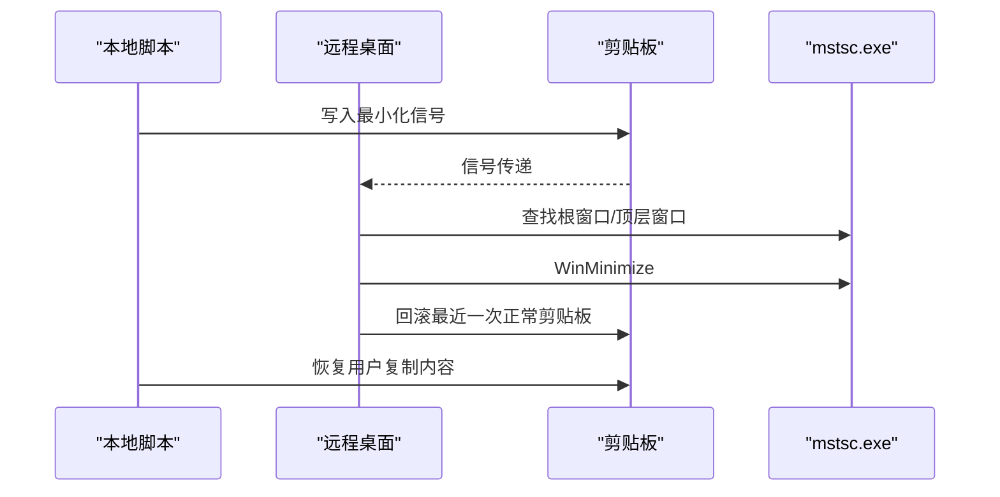
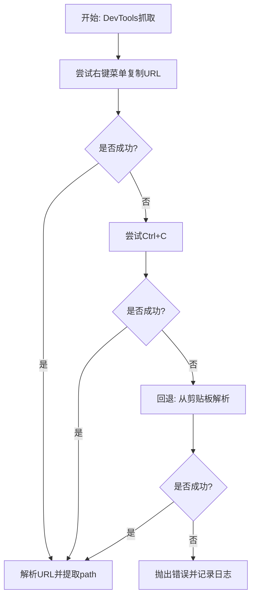
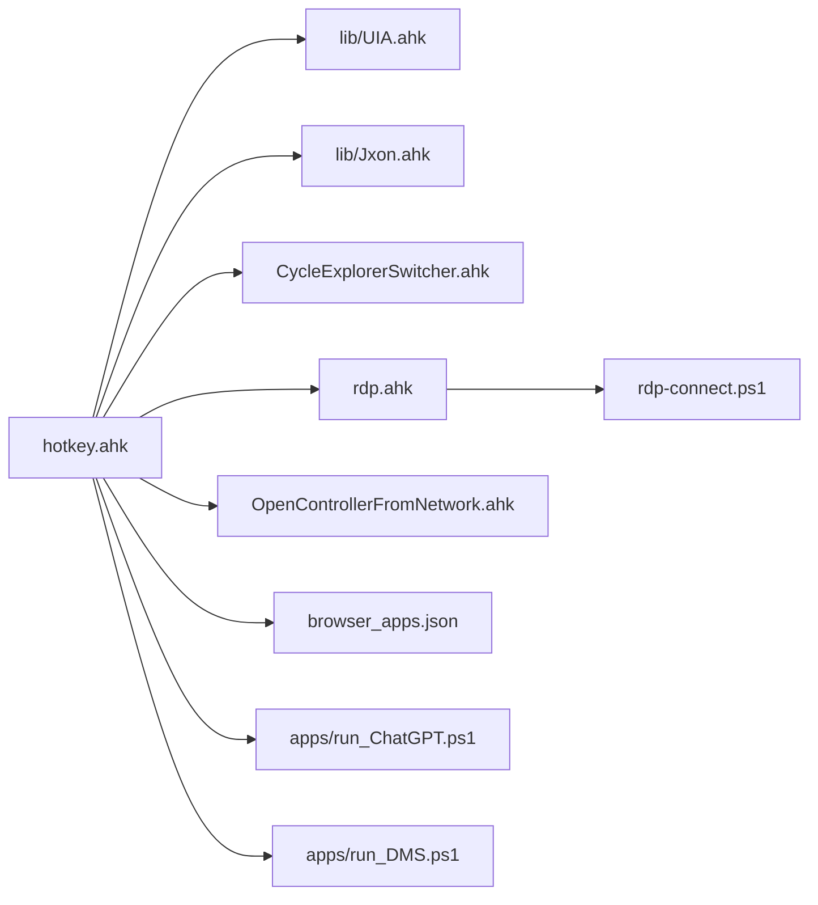

# 应用程序控制

<cite>
**本文引用的文件**
- [hotkey.ahk](file://hotkey.ahk)
- [hotkeys_public.ahk](file://hotkeys_public.ahk)
- [CycleExplorerSwitcher.ahk](file://CycleExplorerSwitcher.ahk)
- [rdp.ahk](file://rdp.ahk)
- [OpenControllerFromNetwork.ahk](file://OpenControllerFromNetwork.ahk)
- [browser_apps.json](file://browser_apps.json)
- [UIA.ahk](file://lib/UIA.ahk)
- [Jxon.ahk](file://lib/Jxon.ahk)
- [run_ChatGPT.ps1](file://apps/run_ChatGPT.ps1)
- [run_DMS.ps1](file://apps/run_DMS.ps1)
- [rdp-connect.ps1](file://rdp-connect.ps1)
</cite>

## 目录
1. [简介](#简介)
2. [项目结构](#项目结构)
3. [核心组件](#核心组件)
4. [架构总览](#架构总览)
5. [详细组件分析](#详细组件分析)
6. [依赖关系分析](#依赖关系分析)
7. [性能考量](#性能考量)
8. [故障排查指南](#故障排查指南)
9. [结论](#结论)
10. [附录](#附录)

## 简介
本文件面向hotkey项目的“应用程序控制系统”，系统性梳理窗口管理（ToggleWindow系列函数）、应用程序启动机制、路径前缀切换逻辑、协议应用程序支持、窗口激活/最小化算法、多实例应用程序处理策略、应用程序生命周期管理、窗口切换器GUI交互设计与用户体验优化，并提供具体使用示例与配置方法。文档同时覆盖应用程序路径解析、跨磁盘空间支持与错误处理机制，帮助读者在不同环境下稳定地使用与扩展该系统。

## 项目结构
hotkey项目采用模块化组织，核心入口脚本负责权限自提升、任务计划注册、全局常量与通用工具函数，以及热键绑定；公共热键与工具脚本分别位于独立文件中；UI自动化能力通过lib目录下的UIA库提供；RDP连接与剪贴板桥接在rdp模块中实现；浏览器应用通过JSON配置与PowerShell脚本生成快捷方式。

图表来源
- [hotkey.ahk](file://hotkey.ahk)
- [hotkeys_public.ahk](file://hotkeys_public.ahk)
- [CycleExplorerSwitcher.ahk](file://CycleExplorerSwitcher.ahk)
- [rdp.ahk](file://rdp.ahk)
- [OpenControllerFromNetwork.ahk](file://OpenControllerFromNetwork.ahk)
- [browser_apps.json](file://browser_apps.json)
- [UIA.ahk](file://lib/UIA.ahk)
- [Jxon.ahk](file://lib/Jxon.ahk)
- [run_ChatGPT.ps1](file://apps/run_ChatGPT.ps1)
- [run_DMS.ps1](file://apps/run_DMS.ps1)
- [rdp-connect.ps1](file://rdp-connect.ps1)

章节来源
- [hotkey.ahk:1-800](file://hotkey.ahk#L1-L800)

## 核心组件
- 窗口管理与切换
  - ToggleWindow系列函数：根据进程名或窗口标题切换激活/最小化，或启动对应路径。
  - 文件资源管理器切换器：提供类似Alt+Tab的窗口切换体验，支持GUI列表与自定义绘制。
- 应用程序启动机制
  - RunAppPathWithPrefixFallback：支持协议路径、文件存在性校验、主备路径切换与错误提示。
  - 浏览器应用：通过JSON配置与PowerShell脚本生成Chrome应用快捷方式，支持AUMID。
- 路径前缀切换逻辑
  - SwapProgramsPrefix：在ProgramFiles与ProgramData之间互换路径前缀，支持跨磁盘空间。
- 协议应用程序支持
  - 协议路径（如ms-phone:/obsidian://）直接运行，无需文件存在性检查。
- RDP连接与剪贴板桥接
  - RDPManager：统一RDP窗口切换与连接流程，支持安全/快速两种模式。
  - 剪贴板桥接：在远程桌面与本地之间通过剪贴板信号最小化本地mstsc。
- UI自动化与开发者工具
  - UIA库：提供元素定位、菜单项选择、点击/调用等能力。
  - DevTools抓取：从浏览器开发者工具Network面板复制选中请求URL并解析path。

章节来源
- [hotkey.ahk:64-180](file://hotkey.ahk#L64-L180)
- [hotkey.ahk:180-250](file://hotkey.ahk#L180-L250)
- [CycleExplorerSwitcher.ahk:68-160](file://CycleExplorerSwitcher.ahk#L68-L160)
- [CycleExplorerSwitcher.ahk:169-289](file://CycleExplorerSwitcher.ahk#L169-L289)
- [rdp.ahk:70-146](file://rdp.ahk#L70-L146)
- [OpenControllerFromNetwork.ahk:34-96](file://OpenControllerFromNetwork.ahk#L34-L96)
- [UIA.ahk:51-152](file://lib/UIA.ahk#L51-L152)
- [browser_apps.json:1-48](file://browser_apps.json#L1-L48)

## 架构总览
hotkey系统围绕“入口脚本 + 模块化功能 + UI自动化 + RDP桥接”的架构展开。入口脚本负责权限与任务计划、全局常量与工具函数；各功能模块通过热键绑定或函数调用被激活；UIA库提供跨应用自动化能力；RDP模块负责远程桌面连接与本地最小化协调。

图表来源
- [hotkey.ahk](file://hotkey.ahk)
- [hotkeys_public.ahk](file://hotkeys_public.ahk)
- [CycleExplorerSwitcher.ahk](file://CycleExplorerSwitcher.ahk)
- [rdp.ahk](file://rdp.ahk)
- [OpenControllerFromNetwork.ahk](file://OpenControllerFromNetwork.ahk)
- [browser_apps.json](file://browser_apps.json)
- [run_ChatGPT.ps1](file://apps/run_ChatGPT.ps1)
- [run_DMS.ps1](file://apps/run_DMS.ps1)
- [rdp-connect.ps1](file://rdp-connect.ps1)

## 详细组件分析

### 窗口管理与切换（ToggleWindow系列）
- 功能概述
  - 根据进程名或窗口标题判断窗口是否存在与是否激活，执行最小化或激活；若不存在则尝试启动对应路径。
  - 支持基于进程名、窗口标题与路径的多种变体函数，满足不同应用窗口特征。
- 关键流程
  - 存在性检查：WinExist
  - 激活状态检查：WinActive
  - 最小化/激活：WinMinimize/WinActivate
  - 启动：RunAppPathWithPrefixFallback
- 多实例处理
  - 通过WinGetList枚举匹配窗口，结合标题/类名筛选，必要时逐一激活或最小化。
- 错误处理
  - 启动失败时弹窗提示，包含原始路径与错误信息；路径不存在时给出明确提示。

图表来源
- [hotkey.ahk:123-134](file://hotkey.ahk#L123-L134)
- [hotkey.ahk:135-146](file://hotkey.ahk#L135-L146)
- [hotkey.ahk:152-163](file://hotkey.ahk#L152-L163)

章节来源
- [hotkey.ahk:123-163](file://hotkey.ahk#L123-L163)

### 应用程序启动机制与路径前缀切换
- RunAppPathWithPrefixFallback
  - 协议路径：直接运行，不进行文件存在性检查。
  - 文件路径：优先尝试主路径，若不存在则使用SwapProgramsPrefix生成备用路径并再次尝试。
  - 错误处理：路径不存在时弹窗提示，包含主/备路径信息。
- SwapProgramsPrefix
  - 在ProgramFiles与ProgramData之间互换路径前缀，支持跨磁盘空间（如C:/D:）。
- 跨磁盘空间支持
  - 通过正则替换实现路径前缀切换，便于在不同磁盘布局下保持可用性。

图表来源
- [hotkey.ahk:76-118](file://hotkey.ahk#L76-L118)
- [hotkey.ahk:64-74](file://hotkey.ahk#L64-L74)

章节来源
- [hotkey.ahk:64-118](file://hotkey.ahk#L64-L118)

### 协议应用程序支持
- 协议路径识别：以[a-z][a-z0-9+.-]*:开头且非[a-z]:\格式的URI。
- 直接运行：不进行文件存在性检查，适合ms-phone:/obsidian://等协议。
- 错误处理：运行异常时弹窗提示，包含协议与错误信息。

章节来源
- [hotkey.ahk:77-86](file://hotkey.ahk#L77-L86)

### 文件资源管理器切换器（GUI交互与用户体验）
- 功能特性
  - Win+Alt+E：轮询文件资源管理器窗口，支持最小化/激活与GUI列表展示。
  - GUI列表：使用系统主题风格，支持自定义绘制（字体/颜色），动态高亮当前选中项。
  - 键盘/鼠标交互：支持点击、Esc取消、Win键释放提交。
- 窗口激活算法
  - 优先使用WinActivate，失败时重试并发送Alt键以降低焦点竞争失败概率。
  - 对最小化窗口先恢复再激活，提升成功率。
- 用户体验优化
  - 自定义绘制字体与颜色，保证在不同系统主题下清晰可读。
  - 使用定时器延迟提示，避免干扰用户操作。

图表来源
- [CycleExplorerSwitcher.ahk:68-160](file://CycleExplorerSwitcher.ahk#L68-L160)
- [CycleExplorerSwitcher.ahk:169-289](file://CycleExplorerSwitcher.ahk#L169-L289)
- [CycleExplorerSwitcher.ahk:431-453](file://CycleExplorerSwitcher.ahk#L431-L453)

章节来源
- [CycleExplorerSwitcher.ahk:68-160](file://CycleExplorerSwitcher.ahk#L68-L160)
- [CycleExplorerSwitcher.ahk:169-289](file://CycleExplorerSwitcher.ahk#L169-L289)
- [CycleExplorerSwitcher.ahk:431-453](file://CycleExplorerSwitcher.ahk#L431-L453)

### RDP连接与剪贴板桥接
- RDPManager
  - 统一RDP窗口切换与连接流程，支持安全/快速两种模式。
  - 安全模式：先探测端口3389，再启动mstsc。
  - 快速模式：直接解析主机名并启动mstsc。
- 剪贴板桥接
  - 通过剪贴板信号在远程桌面与本地之间最小化本地mstsc。
  - 本地收到信号时最小化并回滚剪贴板，避免污染用户复制内容。
- 错误处理
  - 启动失败/解析失败时记录日志并弹窗提示。

图表来源
- [rdp.ahk:16-45](file://rdp.ahk#L16-L45)
- [rdp.ahk:223-270](file://rdp.ahk#L223-L270)
- [rdp.ahk:332-349](file://rdp.ahk#L332-L349)

章节来源
- [rdp.ahk:16-45](file://rdp.ahk#L16-L45)
- [rdp.ahk:223-270](file://rdp.ahk#L223-L270)
- [rdp.ahk:332-349](file://rdp.ahk#L332-L349)

### 浏览器应用与快捷方式生成
- 配置文件
  - browser_apps.json：定义浏览器路径、常用参数与应用清单（名称、标题、URL、热键、AUMID）。
- PowerShell脚本
  - run_ChatGPT.ps1 / run_DMS.ps1：生成Chrome应用快捷方式，注入AUMID以便系统识别。
- 使用建议
  - 将生成的.lnk放置在常用位置，配合热键快速启动。
  - 如需跨磁盘空间，结合路径前缀切换逻辑使用。

章节来源
- [browser_apps.json:1-48](file://browser_apps.json#L1-L48)
- [run_ChatGPT.ps1:1-18](file://apps/run_ChatGPT.ps1#L1-L18)
- [run_DMS.ps1:1-18](file://apps/run_DMS.ps1#L1-L18)

### UI自动化与开发者工具（DevTools抓取）
- UIA库能力
  - 元素定位、属性访问、点击/调用、菜单项查找与选择。
- DevTools抓取流程
  - 优先通过右键菜单复制URL，失败时回退到Ctrl+C或直接从剪贴板解析。
  - 支持快速/可靠两种路径，自动缓存菜单锚点以提升命中率。
- 性能与稳定性
  - 多级重试与等待时间自适应，避免慢机器/渲染慢导致的失败。
  - 性能日志输出，便于问题定位。

图表来源
- [OpenControllerFromNetwork.ahk:34-96](file://OpenControllerFromNetwork.ahk#L34-L96)
- [OpenControllerFromNetwork.ahk:139-195](file://OpenControllerFromNetwork.ahk#L139-L195)
- [OpenControllerFromNetwork.ahk:471-496](file://OpenControllerFromNetwork.ahk#L471-L496)
- [UIA.ahk:51-152](file://lib/UIA.ahk#L51-L152)

章节来源
- [OpenControllerFromNetwork.ahk:34-96](file://OpenControllerFromNetwork.ahk#L34-L96)
- [OpenControllerFromNetwork.ahk:139-195](file://OpenControllerFromNetwork.ahk#L139-L195)
- [OpenControllerFromNetwork.ahk:471-496](file://OpenControllerFromNetwork.ahk#L471-L496)
- [UIA.ahk:51-152](file://lib/UIA.ahk#L51-L152)

## 依赖关系分析
- 模块耦合
  - hotkey.ahk作为入口，依赖lib/UIA.ahk与lib/Jxon.ahk；同时包含多个功能模块（窗口管理、RDP、DevTools）。
  - CycleExplorerSwitcher.ahk与rdp.ahk相对独立，通过热键或函数调用被入口脚本激活。
- 外部依赖
  - Windows系统API：Win32窗口API、UIA、剪贴板、TCP探测等。
  - PowerShell：RDP连接与浏览器应用快捷方式生成。
- 循环依赖
  - 未发现循环依赖；模块间通过函数调用与热键绑定交互。

图表来源
- [hotkey.ahk](file://hotkey.ahk)
- [UIA.ahk](file://lib/UIA.ahk)
- [Jxon.ahk](file://lib/Jxon.ahk)
- [CycleExplorerSwitcher.ahk](file://CycleExplorerSwitcher.ahk)
- [rdp.ahk](file://rdp.ahk)
- [OpenControllerFromNetwork.ahk](file://OpenControllerFromNetwork.ahk)
- [browser_apps.json](file://browser_apps.json)
- [run_ChatGPT.ps1](file://apps/run_ChatGPT.ps1)
- [run_DMS.ps1](file://apps/run_DMS.ps1)
- [rdp-connect.ps1](file://rdp-connect.ps1)

章节来源
- [hotkey.ahk:1-20](file://hotkey.ahk#L1-L20)
- [CycleExplorerSwitcher.ahk:1-20](file://CycleExplorerSwitcher.ahk#L1-L20)
- [rdp.ahk:1-15](file://rdp.ahk#L1-L15)
- [OpenControllerFromNetwork.ahk:1-20](file://OpenControllerFromNetwork.ahk#L1-L20)

## 性能考量
- 窗口切换
  - 使用WinActivate/WinMinimize时，若首次失败可重试并发送Alt键，降低焦点竞争失败概率。
  - 文件资源管理器切换器通过自定义绘制与定时器减少视觉干扰。
- RDP连接
  - 快速模式跳过端口探测，提升响应速度；安全模式增加探测步骤，提高成功率。
  - TCP快速探测与DNS解析多策略回退，兼顾速度与稳定性。
- DevTools抓取
  - 多级重试与等待时间自适应，避免慢机器/渲染慢导致的失败。
  - 菜单锚点缓存减少全桌面扫描次数，提升命中率。

[本节为通用指导，无需特定文件引用]

## 故障排查指南
- 启动失败
  - 检查路径是否存在，必要时使用SwapProgramsPrefix切换前缀。
  - 协议路径运行失败时查看协议格式与目标应用是否支持。
- 窗口未激活/最小化
  - 使用WinWaitActive重试，或发送Alt键后再激活。
  - 文件资源管理器切换器中，确认GUI列表是否正确高亮当前项。
- RDP连接问题
  - 安全模式下端口3389不可达时，检查防火墙与网络连通性。
  - 本地最小化失败时，确认当前会话与mstsc窗口可见性。
- DevTools抓取失败
  - 检查开发者工具Network面板是否处于选中状态。
  - 查看性能日志文件，定位菜单项查找失败原因。

章节来源
- [hotkey.ahk:76-118](file://hotkey.ahk#L76-L118)
- [CycleExplorerSwitcher.ahk:431-453](file://CycleExplorerSwitcher.ahk#L431-L453)
- [rdp.ahk:223-270](file://rdp.ahk#L223-L270)
- [OpenControllerFromNetwork.ahk:301-311](file://OpenControllerFromNetwork.ahk#L301-L311)

## 结论
hotkey项目的应用程序控制系统通过模块化设计实现了窗口管理、应用启动、路径前缀切换、协议应用支持、RDP桥接与UI自动化等能力。其核心优势在于：
- 统一的窗口切换与启动接口，适配多实例与不同窗口特征。
- 跨磁盘空间的路径前缀切换，增强部署灵活性。
- GUI切换器提供直观的窗口切换体验，结合自定义绘制提升可用性。
- RDP桥接与连接脚本保障远程桌面场景下的稳定与便捷。
- UIA与DevTools抓取能力为开发者工具链提供自动化支撑。

建议在实际使用中结合自身环境调整路径、热键与超时参数，并利用日志与错误提示快速定位问题。

[本节为总结，无需特定文件引用]

## 附录

### 窗口控制示例与配置方法
- 热键示例（来自入口脚本）
  - Win+F2：打开腾讯会议
  - Win+F3：打开Clash Verge（带主窗口识别）
  - Win+F4/F5：打开小红书/微信读书
  - Win+F6：打开搜狗PDF阅读编辑器
  - Win+F9：打开LocalSend
  - Win+`：打开Obsidian
  - Win+Ctrl+R：打开PowerShell（Windows Terminal）
  - Win+9：打开PowerDesigner
  - Win+8：打开Navicat
  - Win+y：打开手机连接（协议ms-phone:）
  - Win+Ctrl+T：打开Telegram（指定D盘路径）
  - Win+f：打开Microsoft Edge
- 配置要点
  - 确保程序路径存在或启用SwapProgramsPrefix。
  - 协议应用需确保系统已注册对应协议处理器。
  - 多实例应用建议使用窗口标题或主窗口识别逻辑。

章节来源
- [hotkey.ahk:590-750](file://hotkey.ahk#L590-L750)

### 应用程序生命周期管理
- 启动：RunAppPathWithPrefixFallback
- 切换：ToggleWindow系列
- 最小化：WinMinimize
- 激活：WinActivate
- 退出：OnExit钩子（入口脚本中定义）

章节来源
- [hotkey.ahk:751-800](file://hotkey.ahk#L751-L800)