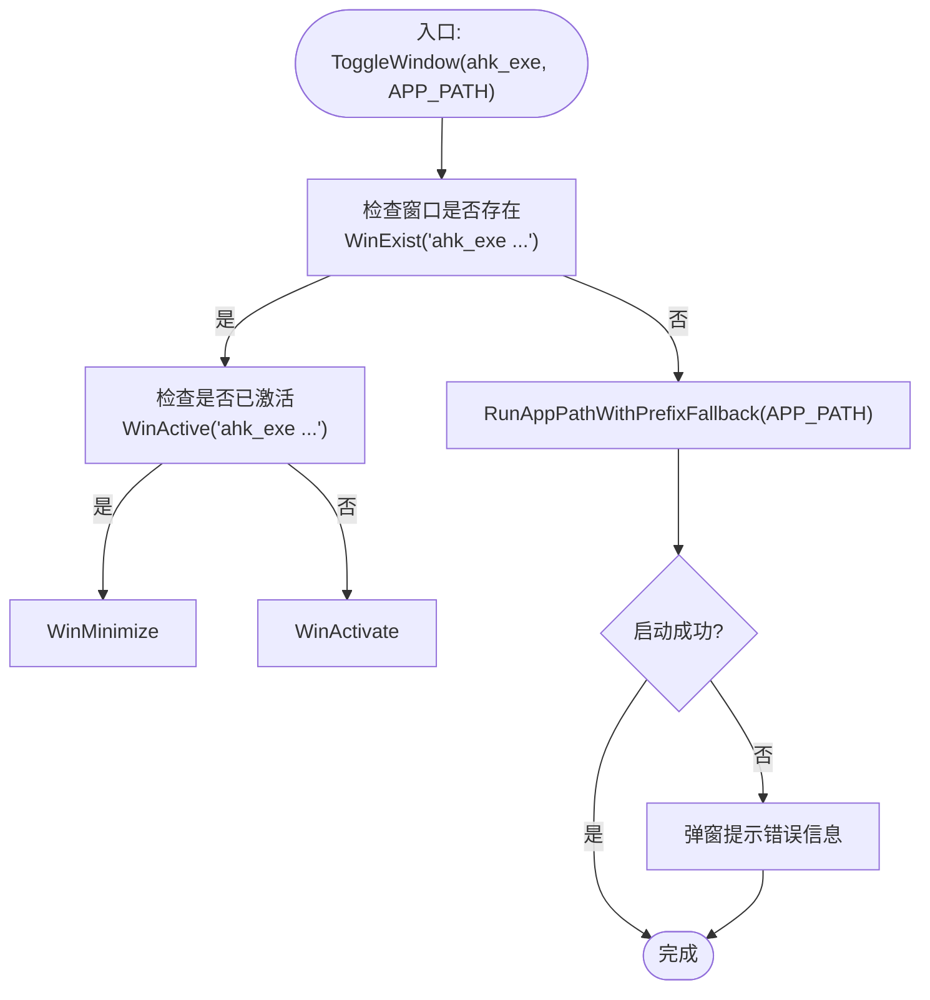
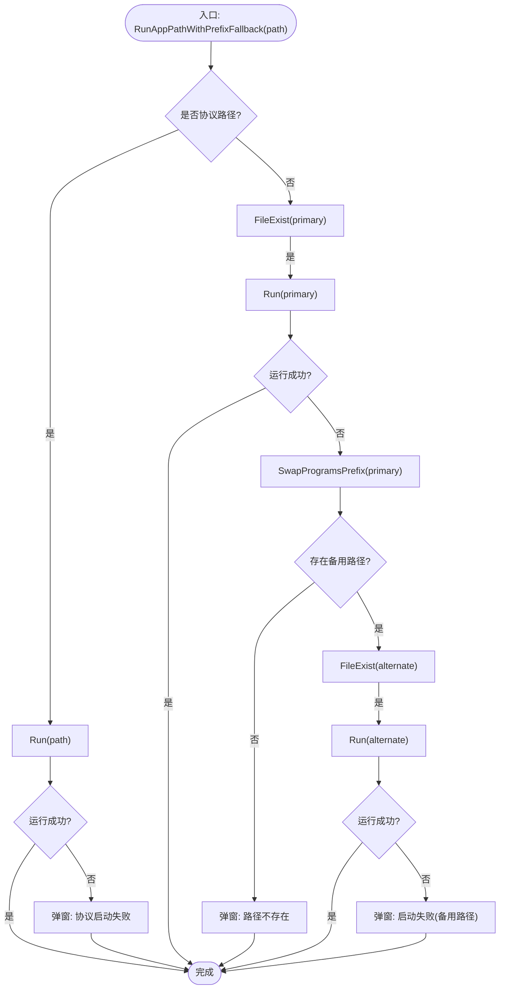
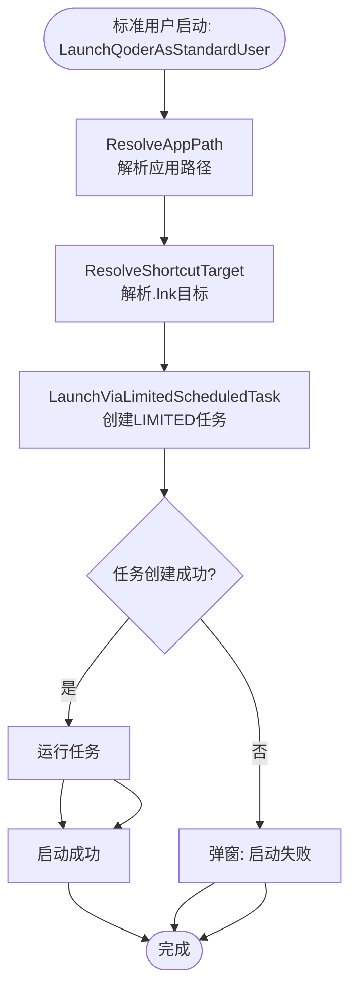
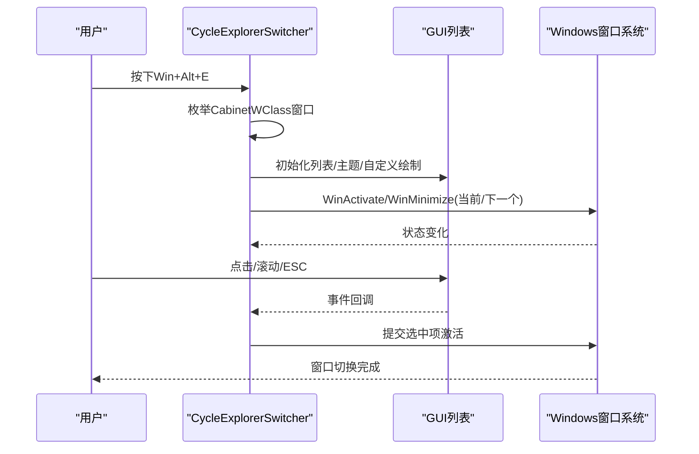
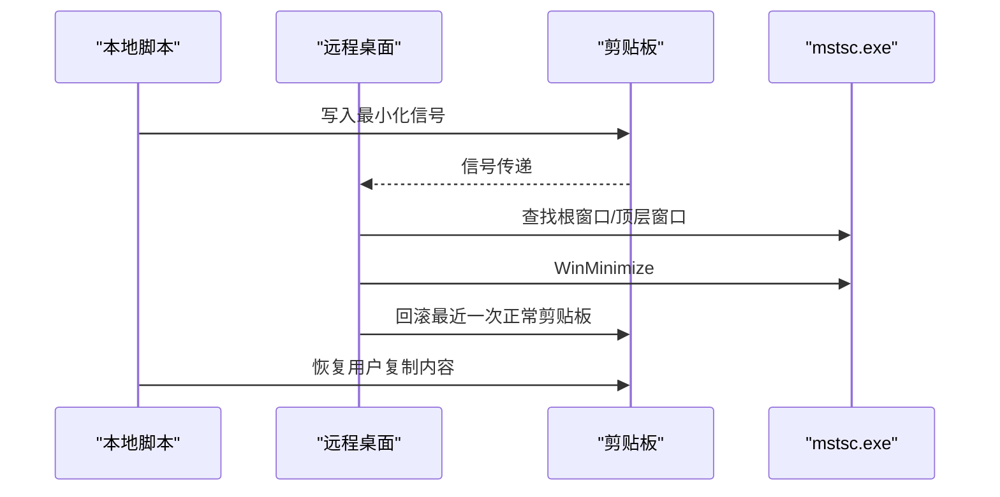
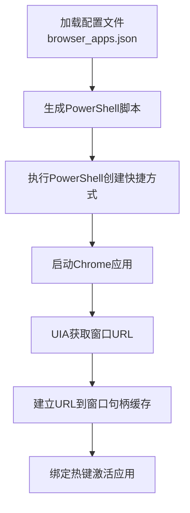
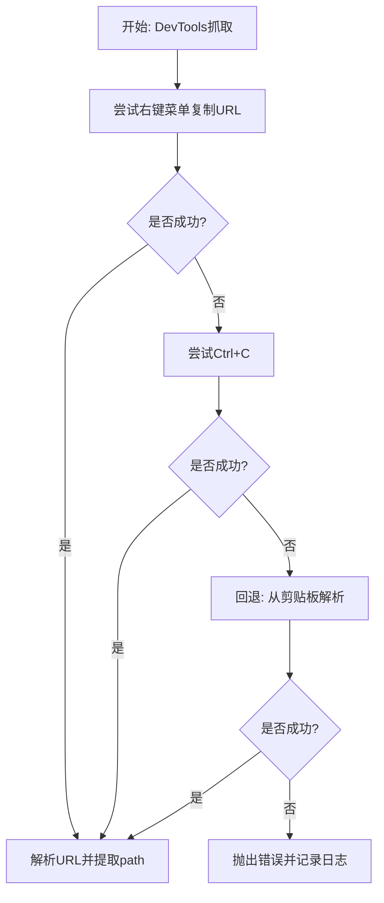
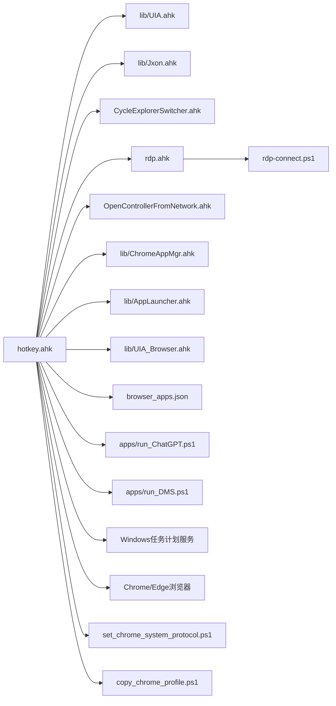

# 应用程序控制

<cite>
**本文引用的文件**
- [hotkey.ahk](file://hotkey.ahk)
- [hotkeys_public.ahk](file://hotkeys_public.ahk)
- [CycleExplorerSwitcher.ahk](file://CycleExplorerSwitcher.ahk)
- [rdp.ahk](file://rdp.ahk)
- [OpenControllerFromNetwork.ahk](file://OpenControllerFromNetwork.ahk)
- [browser_apps.json](file://browser_apps.json)
- [UIA.ahk](file://lib/UIA.ahk)
- [UIA_Browser.ahk](file://lib/UIA_Browser.ahk)
- [Jxon.ahk](file://lib/Jxon.ahk)
- [ChromeAppMgr.ahk](file://lib/ChromeAppMgr.ahk)
- [AppLauncher.ahk](file://lib/AppLauncher.ahk)
- [run_ChatGPT.ps1](file://apps/run_ChatGPT.ps1)
- [run_DMS.ps1](file://apps/run_DMS.ps1)
- [rdp-connect.ps1](file://rdp-connect.ps1)
- [set_chrome_system_protocol.ps1](file://set_chrome_system_protocol.ps1)
- [copy_chrome_profile.ps1](file://copy_chrome_profile.ps1)
</cite>

## 更新摘要
**变更内容**
- 新增WorkBuddy、ONLYOFFICE、DingTalk、Qoder等应用的热键支持
- 实现标准用户权限启动功能，支持以LIMITED权限启动应用程序
- 改进应用程序启动机制，通过任务计划服务实现权限分离
- 增强应用程序生命周期管理，支持复杂窗口特征的应用程序
- 新增浏览器应用管理系统，支持Chrome PWA应用的快捷方式生成与缓存
- 增强协议应用程序支持，新增ms-outlook协议处理
- **重大架构变更**：Chrome应用管理模块从hotkey.ahk拆分至独立的ChromeAppMgr.ahk文件
- **增强的窗口检测和激活机制**：改进UIA库对Chromium应用的元素检测能力

## 目录
1. [简介](#简介)
2. [项目结构](#项目结构)
3. [核心组件](#核心组件)
4. [架构总览](#架构总览)
5. [详细组件分析](#详细组件分析)
6. [依赖关系分析](#依赖关系分析)
7. [性能考量](#性能考量)
8. [故障排查指南](#故障排查指南)
9. [结论](#结论)
10. [附录](#附录)

## 简介
本文件面向hotkey项目的"应用程序控制系统"，系统性梳理窗口管理（ToggleWindow系列函数）、应用程序启动机制、路径前缀切换逻辑、协议应用程序支持、窗口激活/最小化算法、多实例应用程序处理策略、应用程序生命周期管理、窗口切换器GUI交互设计与用户体验优化，并提供具体使用示例与配置方法。文档同时覆盖应用程序路径解析、跨磁盘空间支持与错误处理机制，帮助读者在不同环境下稳定地使用与扩展该系统。

**更新** 本版本新增了对WorkBuddy、ONLYOFFICE、DingTalk、Qoder等应用的支持，以及标准用户权限启动功能，显著扩展了应用程序控制能力。同时新增了浏览器应用管理系统，支持Chrome PWA应用的快捷方式生成与缓存机制。**重大架构变更**：Chrome应用管理模块已从主入口脚本拆分至独立的ChromeAppMgr.ahk文件，提升了系统的模块化程度和可维护性。

## 项目结构
hotkey项目采用模块化组织，核心入口脚本负责权限自提升、任务计划注册、全局常量与通用工具函数，以及热键绑定；公共热键与工具脚本分别位于独立文件中；UI自动化能力通过lib目录下的UIA库提供；RDP连接与剪贴板桥接在rdp模块中实现；浏览器应用通过JSON配置与PowerShell脚本生成快捷方式。**新增** 标准用户权限启动功能通过AppLauncher模块实现，Chrome应用管理功能迁移到独立的ChromeAppMgr模块。

```mermaid
graph TB
A["hotkey.ahk<br/>入口与全局工具"] --> B["hotkeys_public.ahk<br/>公共热键"]
A --> C["CycleExplorerSwitcher.ahk<br/>文件资源管理器切换器"]
A --> D["rdp.ahk<br/>RDP连接与剪贴板桥接"]
A --> E["OpenControllerFromNetwork.ahk<br/>DevTools网络面板抓取"]
A --> F["lib/UIA.ahk<br/>UI自动化库"]
A --> G["lib/Jxon.ahk<br/>轻量JSON库"]
A --> H["browser_apps.json<br/>浏览器应用配置"]
A --> I["apps/run_ChatGPT.ps1<br/>生成Chrome应用快捷方式"]
A --> J["apps/run_DMS.ps1<br/>生成Chrome应用快捷方式"]
A --> K["rdp-connect.ps1<br/>RDP连接脚本"]
A --> L["set_chrome_system_protocol.ps1<br/>设置Chrome系统协议"]
A --> M["copy_chrome_profile.ps1<br/>复制Chrome配置文件"]
A --> N["lib/ChromeAppMgr.ahk<br/>Chrome应用管理模块"]
A --> O["lib/AppLauncher.ahk<br/>标准用户权限启动"]
A --> P["lib/UIA_Browser.ahk<br/>浏览器UI自动化"]
```

**图表来源**
- [hotkey.ahk](file://hotkey.ahk)
- [hotkeys_public.ahk](file://hotkeys_public.ahk)
- [CycleExplorerSwitcher.ahk](file://CycleExplorerSwitcher.ahk)
- [rdp.ahk](file://rdp.ahk)
- [OpenControllerFromNetwork.ahk](file://OpenControllerFromNetwork.ahk)
- [browser_apps.json](file://browser_apps.json)
- [UIA.ahk](file://lib/UIA.ahk)
- [Jxon.ahk](file://lib/Jxon.ahk)
- [ChromeAppMgr.ahk](file://lib/ChromeAppMgr.ahk)
- [AppLauncher.ahk](file://lib/AppLauncher.ahk)
- [UIA_Browser.ahk](file://lib/UIA_Browser.ahk)
- [run_ChatGPT.ps1](file://apps/run_ChatGPT.ps1)
- [run_DMS.ps1](file://apps/run_DMS.ps1)
- [rdp-connect.ps1](file://rdp-connect.ps1)
- [set_chrome_system_protocol.ps1](file://set_chrome_system_protocol.ps1)
- [copy_chrome_profile.ps1](file://copy_chrome_profile.ps1)

**章节来源**
- [hotkey.ahk:1-800](file://hotkey.ahk#L1-L800)

## 核心组件
- **窗口管理与切换**
  - ToggleWindow系列函数：根据进程名或窗口标题切换激活/最小化，或启动对应路径。
  - 文件资源管理器切换器：提供类似Alt+Tab的窗口切换体验，支持GUI列表与自定义绘制。
- **应用程序启动机制**
  - RunAppPathWithPrefixFallback：支持协议路径、文件存在性校验、主备路径切换与错误提示。
  - 浏览器应用：通过JSON配置与PowerShell脚本生成Chrome应用快捷方式，支持AUMID。
  - **标准用户权限启动**：LaunchQoderAsStandardUser/LaunchVSCodeAsStandardUser通过任务计划服务以LIMITED权限启动应用程序。
- **路径前缀切换逻辑**
  - SwapProgramsPrefix：在ProgramFiles与ProgramData之间互换路径前缀，支持跨磁盘空间。
- **协议应用程序支持**
  - 协议路径（如ms-phone:/obsidian://）直接运行，无需文件存在性检查。
  - 新增ms-outlook协议支持，用于启动Outlook应用程序。
- **RDP连接与剪贴板桥接**
  - RDPManager：统一RDP窗口切换与连接流程，支持安全/快速两种模式。
  - 剪贴板桥接：在远程桌面与本地之间通过剪贴板信号最小化本地mstsc。
- **UI自动化与开发者工具**
  - UIA库：提供元素定位、菜单项选择、点击/调用等能力。
  - DevTools抓取：从浏览器开发者工具Network面板复制选中请求URL并解析path。
- **浏览器应用管理系统**
  - JSON配置驱动的应用管理：支持Chrome和Edge浏览器的PWA应用配置。
  - 快捷方式生成：通过PowerShell脚本创建带AUMID的Chrome应用快捷方式。
  - 窗口缓存：通过UIA和JavaScript获取Chrome应用窗口的URL并建立缓存。
  - **新增** Chrome应用管理模块独立化，提供更强大的应用管理功能。
- **增强的窗口检测机制**
  - **新增** UIA_Browser库：专门针对浏览器应用的UI自动化支持。
  - **增强** ElementFromChromium函数：改进对Chromium应用内容区域的元素检测。

**章节来源**
- [hotkey.ahk:64-180](file://hotkey.ahk#L64-L180)
- [hotkey.ahk:180-250](file://hotkey.ahk#L180-L250)
- [CycleExplorerSwitcher.ahk:68-160](file://CycleExplorerSwitcher.ahk#L68-L160)
- [CycleExplorerSwitcher.ahk:169-289](file://CycleExplorerSwitcher.ahk#L169-L289)
- [rdp.ahk:70-146](file://rdp.ahk#L70-L146)
- [OpenControllerFromNetwork.ahk:34-96](file://OpenControllerFromNetwork.ahk#L34-L96)
- [UIA.ahk:51-152](file://lib/UIA.ahk#L51-L152)
- [UIA_Browser.ahk:891-927](file://lib/UIA_Browser.ahk#L891-L927)
- [browser_apps.json:1-48](file://browser_apps.json#L1-L48)
- [ChromeAppMgr.ahk:1-44](file://lib/ChromeAppMgr.ahk#L1-L44)

## 架构总览
hotkey系统围绕"入口脚本 + 模块化功能 + UI自动化 + RDP桥接"的架构展开。入口脚本负责权限与任务计划、全局常量与工具函数；各功能模块通过热键绑定或函数调用被激活；UIA库提供跨应用自动化能力；RDP模块负责远程桌面连接与本地最小化协调；新增的浏览器应用管理系统提供PWA应用的快捷方式生成与缓存机制。**重大变更**：Chrome应用管理功能已独立为ChromeAppMgr模块，标准用户权限启动功能集成到AppLauncher模块。

```mermaid
graph TB
subgraph "入口与工具"
H1["hotkey.ahk<br/>权限/任务计划/全局函数"]
H2["hotkeys_public.ahk<br/>公共热键"]
end
subgraph "窗口与应用控制"
W1["ToggleWindow系列<br/>窗口切换/启动"]
W2["SwapProgramsPrefix<br/>路径前缀切换"]
W3["RunAppPathWithPrefixFallback<br/>启动器"]
W4["CycleExplorerSwitcher<br/>文件资源管理器切换器"]
W5["标准用户权限启动<br/>LaunchQoderAsStandardUser"]
W6["浏览器应用管理系统<br/>PWA快捷方式生成"]
end
subgraph "RDP与剪贴板桥接"
R1["RDPManager<br/>连接/切换"]
R2["RDP剪贴板桥接<br/>信号最小化"]
end
subgraph "UI自动化与开发工具"
U1["UIA.ahk<br/>元素/菜单/点击"]
U2["UIA_Browser.ahk<br/>浏览器UI自动化"]
D1["OpenControllerFromNetwork<br/>DevTools抓取"]
end
subgraph "应用与配置"
B1["browser_apps.json<br/>应用配置"]
P1["run_ChatGPT.ps1<br/>Chrome应用快捷方式"]
P2["run_DMS.ps1<br/>Chrome应用快捷方式"]
P3["rdp-connect.ps1<br/>RDP连接脚本"]
P4["set_chrome_system_protocol.ps1<br/>设置Chrome协议"]
P5["copy_chrome_profile.ps1<br/>复制Chrome配置"]
A1["ChromeAppMgr.ahk<br/>Chrome应用管理"]
A2["AppLauncher.ahk<br/>标准用户权限启动"]
end
H1 --> W1
H1 --> W2
H1 --> W3
H1 --> W4
H1 --> W5
H1 --> W6
H1 --> R1
H1 --> R2
H1 --> U1
H1 --> U2
H1 --> D1
H1 --> B1
H1 --> P1
H1 --> P2
H1 --> P3
H1 --> P4
H1 --> P5
H1 --> A1
H1 --> A2
H2 -.-> W1
```

**图表来源**
- [hotkey.ahk](file://hotkey.ahk)
- [hotkeys_public.ahk](file://hotkeys_public.ahk)
- [CycleExplorerSwitcher.ahk](file://CycleExplorerSwitcher.ahk)
- [rdp.ahk](file://rdp.ahk)
- [OpenControllerFromNetwork.ahk](file://OpenControllerFromNetwork.ahk)
- [browser_apps.json](file://browser_apps.json)
- [UIA.ahk](file://lib/UIA.ahk)
- [UIA_Browser.ahk](file://lib/UIA_Browser.ahk)
- [ChromeAppMgr.ahk](file://lib/ChromeAppMgr.ahk)
- [AppLauncher.ahk](file://lib/AppLauncher.ahk)
- [run_ChatGPT.ps1](file://apps/run_ChatGPT.ps1)
- [run_DMS.ps1](file://apps/run_DMS.ps1)
- [rdp-connect.ps1](file://rdp-connect.ps1)
- [set_chrome_system_protocol.ps1](file://set_chrome_system_protocol.ps1)
- [copy_chrome_profile.ps1](file://copy_chrome_profile.ps1)

## 详细组件分析

### 窗口管理与切换（ToggleWindow系列）
- **功能概述**
  - 根据进程名或窗口标题判断窗口是否存在与是否激活，执行最小化或激活；若不存在则尝试启动对应路径。
  - 支持基于进程名、窗口标题与路径的多种变体函数，满足不同应用窗口特征。
  - **新增** 支持复杂窗口特征的应用程序，如通过主窗口识别和多实例处理。
- **关键流程**
  - 存在性检查：WinExist
  - 激活状态检查：WinActive
  - 最小化/激活：WinMinimize/WinActivate
  - 启动：RunAppPathWithPrefixFallback
- **多实例处理**
  - 通过WinGetList枚举匹配窗口，结合标题/类名筛选，必要时逐一激活或最小化。
  - **增强** 支持主窗口识别和精确匹配，提升复杂应用的窗口管理精度。
- **错误处理**
  - 启动失败时弹窗提示，包含原始路径与错误信息；路径不存在时给出明确提示。

```mermaid
flowchart TD
Start(["入口: ToggleWindow(ahk_exe, APP_PATH)"]) --> CheckExist["检查窗口是否存在<br/>WinExist('ahk_exe ...')"]
CheckExist --> |否| TryLaunch["RunAppPathWithPrefixFallback(APP_PATH)"]
CheckExist --> |是| CheckActive["检查是否已激活<br/>WinActive('ahk_exe ...')"]
CheckActive --> |是| Minimize["WinMinimize"]
CheckActive --> |否| Activate["WinActivate"]
TryLaunch --> LaunchResult{"启动成功?"}
LaunchResult --> |是| End(["完成"])
LaunchResult --> |否| ErrorTip["弹窗提示错误信息"] --> End
```

**图表来源**
- [hotkey.ahk:123-134](file://hotkey.ahk#L123-L134)
- [hotkey.ahk:135-146](file://hotkey.ahk#L135-L146)
- [hotkey.ahk:152-163](file://hotkey.ahk#L152-L163)

**章节来源**
- [hotkey.ahk:123-163](file://hotkey.ahk#L123-L163)

### 应用程序启动机制与路径前缀切换
- **RunAppPathWithPrefixFallback**
  - 协议路径：直接运行，不进行文件存在性检查。
  - 文件路径：优先尝试主路径，若不存在则使用SwapProgramsPrefix生成备用路径并再次尝试。
  - 错误处理：路径不存在时弹窗提示，包含主/备路径信息。
- **SwapProgramsPrefix**
  - 在ProgramFiles与ProgramData之间互换路径前缀，支持跨磁盘空间（如C:/D:）。
- **跨磁盘空间支持**
  - 通过正则替换实现路径前缀切换，便于在不同磁盘布局下保持可用性。
- **标准用户权限启动**
  - **新增** LaunchQoderAsStandardUser：通过任务计划服务以LIMITED权限启动Qoder。
  - **增强** LaunchVSCodeAsStandardUser：支持工作区参数和标准用户权限启动。
  - **核心机制** LaunchViaLimitedScheduledTask：创建LIMITED权限的任务并立即运行。

```mermaid
flowchart TD
S(["入口: RunAppPathWithPrefixFallback(path)"]) --> IsProtocol{"是否协议路径?"}
IsProtocol --> |是| RunProto["Run(path)"] --> ProtoOK{"运行成功?"}
ProtoOK --> |是| End(["完成"])
ProtoOK --> |否| ProtoErr["弹窗: 协议启动失败"] --> End
IsProtocol --> |否| CheckPrimary["FileExist(primary)"]
CheckPrimary --> |是| RunPrimary["Run(primary)"] --> PrimOK{"运行成功?"}
PrimOK --> |是| End
PrimOK --> |否| SwapAlt["SwapProgramsPrefix(primary)"]
SwapAlt --> HasAlt{"存在备用路径?"}
HasAlt --> |否| PathErr["弹窗: 路径不存在"] --> End
HasAlt --> |是| CheckAlt["FileExist(alternate)"]
CheckAlt --> |是| RunAlt["Run(alternate)"] --> AltOK{"运行成功?"}
AltOK --> |是| End
AltOK --> |否| AltErr["弹窗: 启动失败(备用路径)"] --> End
```

**图表来源**
- [hotkey.ahk:76-118](file://hotkey.ahk#L76-L118)
- [hotkey.ahk:64-74](file://hotkey.ahk#L64-L74)

**章节来源**
- [hotkey.ahk:64-118](file://hotkey.ahk#L64-L118)

### 标准用户权限启动机制
- **功能概述**
  - **新增** 支持以标准用户权限启动应用程序，避免UAC提示和权限风险。
  - 通过Windows任务计划服务创建LIMITED权限的任务，实现权限分离。
- **核心实现**
  - LaunchViaLimitedScheduledTask：创建LIMITED权限任务并运行。
  - ResolveShortcutTarget：解析.lnk快捷方式目标路径。
  - ShellExecuteAsStandardUser：通过Shell.Application以标准用户权限执行。
- **应用场景**
  - VS Code：支持工作区参数和标准用户权限启动。
  - Qoder：专门的Qoder标准用户启动函数。
  - 其他应用程序：通过通用函数实现标准用户权限启动。

```mermaid
flowchart TD
Start(["标准用户启动: LaunchQoderAsStandardUser"]) --> ResolvePath["ResolveAppPath<br/>解析应用路径"]
ResolvePath --> ResolveTarget["ResolveShortcutTarget<br/>解析.lnk目标"]
ResolveTarget --> CreateTask["LaunchViaLimitedScheduledTask<br/>创建LIMITED任务"]
CreateTask --> TaskCreated{"任务创建成功?"}
TaskCreated --> |是| RunTask["运行任务"] --> Success["启动成功"]
TaskCreated --> |否| Error["弹窗: 启动失败"] --> End
RunTask --> Success
Success --> End(["完成"])
Error --> End
```

**图表来源**
- [hotkey.ahk:1707-1751](file://hotkey.ahk#L1707-L1751)
- [hotkey.ahk:1767-1783](file://hotkey.ahk#L1767-L1783)

**章节来源**
- [hotkey.ahk:1707-1751](file://hotkey.ahk#L1707-L1751)
- [hotkey.ahk:1767-1783](file://hotkey.ahk#L1767-L1783)

### 协议应用程序支持
- **协议路径识别**：以[a-z][a-z0-9+.-]*:开头且非[a-z]:\格式的URI。
- **直接运行**：不进行文件存在性检查，适合ms-phone:/obsidian://等协议。
- **新增协议支持**：ms-outlook协议用于启动Outlook应用程序。
- **错误处理**：运行异常时弹窗提示，包含协议与错误信息。

**章节来源**
- [hotkey.ahk:77-86](file://hotkey.ahk#L77-L86)
- [hotkey.ahk:1012](file://hotkey.ahk#L1012)

### 文件资源管理器切换器（GUI交互与用户体验）
- **功能特性**
  - Win+Alt+E：轮询文件资源管理器窗口，支持最小化/激活与GUI列表展示。
  - GUI列表：使用系统主题风格，支持自定义绘制（字体/颜色），动态高亮当前选中项。
  - 键盘/鼠标交互：支持点击、Esc取消、Win键释放提交。
- **窗口激活算法**
  - 优先使用WinActivate，失败时重试并发送Alt键以降低焦点竞争失败概率。
  - 对最小化窗口先恢复再激活，提升成功率。
- **用户体验优化**
  - 自定义绘制字体与颜色，保证在不同系统主题下清晰可读。
  - 使用定时器延迟提示，避免干扰用户操作。

```mermaid
sequenceDiagram
participant U as "用户"
participant HS as "CycleExplorerSwitcher"
participant GUI as "GUI列表"
participant OS as "Windows窗口系统"
U->>HS : 按下Win+Alt+E
HS->>HS : 枚举CabinetWClass窗口
HS->>GUI : 初始化列表/主题/自定义绘制
HS->>OS : WinActivate/WinMinimize(当前/下一个)
OS-->>HS : 状态变化
U->>GUI : 点击/滚动/ESC
GUI-->>HS : 事件回调
HS->>OS : 提交选中项激活
OS-->>U : 窗口切换完成
```

**图表来源**
- [CycleExplorerSwitcher.ahk:68-160](file://CycleExplorerSwitcher.ahk#L68-L160)
- [CycleExplorerSwitcher.ahk:169-289](file://CycleExplorerSwitcher.ahk#L169-L289)
- [CycleExplorerSwitcher.ahk:431-453](file://CycleExplorerSwitcher.ahk#L431-L453)

**章节来源**
- [CycleExplorerSwitcher.ahk:68-160](file://CycleExplorerSwitcher.ahk#L68-L160)
- [CycleExplorerSwitcher.ahk:169-289](file://CycleExplorerSwitcher.ahk#L169-L289)
- [CycleExplorerSwitcher.ahk:431-453](file://CycleExplorerSwitcher.ahk#L431-L453)

### RDP连接与剪贴板桥接
- **RDPManager**
  - 统一RDP窗口切换与连接流程，支持安全/快速两种模式。
  - 安全模式：先探测端口3389，再启动mstsc。
  - 快速模式：直接解析主机名并启动mstsc。
- **剪贴板桥接**
  - 通过剪贴板信号在远程桌面与本地之间最小化本地mstsc。
  - 本地收到信号时最小化并回滚剪贴板，避免污染用户复制内容。
- **错误处理**
  - 启动失败/解析失败时记录日志并弹窗提示。

```mermaid
sequenceDiagram
participant L as "本地脚本"
participant R as "远程桌面"
participant CB as "剪贴板"
participant MSTSC as "mstsc.exe"
L->>CB : 写入最小化信号
CB-->>R : 信号传递
R->>MSTSC : 查找根窗口/顶层窗口
R->>MSTSC : WinMinimize
R->>CB : 回滚最近一次正常剪贴板
L->>CB : 恢复用户复制内容
```

**图表来源**
- [rdp.ahk:16-45](file://rdp.ahk#L16-L45)
- [rdp.ahk:223-270](file://rdp.ahk#L223-L270)
- [rdp.ahk:332-349](file://rdp.ahk#L332-L349)

**章节来源**
- [rdp.ahk:16-45](file://rdp.ahk#L16-L45)
- [rdp.ahk:223-270](file://rdp.ahk#L223-L270)
- [rdp.ahk:332-349](file://rdp.ahk#L332-L349)

### 浏览器应用管理系统
- **功能概述**
  - **新增** 完整的浏览器应用管理系统，支持Chrome和Edge浏览器的PWA应用。
  - 通过JSON配置文件定义浏览器路径、常用参数与应用清单。
  - 自动生成带AUMID的Chrome应用快捷方式，支持系统识别。
  - **重大变更**：Chrome应用管理功能已从hotkey.ahk拆分至独立的ChromeAppMgr.ahk模块。
- **核心组件**
  - 配置文件：browser_apps.json定义浏览器配置和应用清单。
  - 快捷方式生成：PowerShell脚本创建Chrome应用快捷方式并注入AUMID。
  - 窗口缓存：通过UIA和JavaScript获取Chrome应用窗口URL并建立缓存。
  - 热键绑定：自动为每个应用生成激活热键。
  - **新增** ChromeAppMgr模块：提供独立的Chrome应用管理功能。
  - **新增** UIA_Browser库：专门针对浏览器应用的UI自动化支持。
- **使用流程**
  - 读取JSON配置文件
  - 为每个应用生成PowerShell启动脚本
  - 执行PowerShell脚本创建.lnk快捷方式
  - 通过UIA获取Chrome应用窗口并建立URL缓存
  - 绑定热键实现快速激活

```mermaid
flowchart TD
A["加载配置文件<br/>browser_apps.json"] --> B["生成PowerShell脚本"]
B --> C["执行PowerShell创建快捷方式"]
C --> D["启动Chrome应用"]
D --> E["UIA获取窗口URL"]
E --> F["建立URL到窗口句柄缓存"]
F --> G["绑定热键激活应用"]
```

**图表来源**
- [hotkey.ahk:2253-2270](file://hotkey.ahk#L2253-L2270)
- [hotkey.ahk:2195-2232](file://hotkey.ahk#L2195-L2232)
- [hotkey.ahk:2281-2327](file://hotkey.ahk#L2281-L2327)
- [hotkey.ahk:2342-2385](file://hotkey.ahk#L2342-L2385)

**章节来源**
- [hotkey.ahk:2253-2270](file://hotkey.ahk#L2253-L2270)
- [hotkey.ahk:2195-2232](file://hotkey.ahk#L2195-L2232)
- [hotkey.ahk:2281-2327](file://hotkey.ahk#L2281-L2327)
- [hotkey.ahk:2342-2385](file://hotkey.ahk#L2342-L2385)
- [browser_apps.json:1-48](file://browser_apps.json#L1-L48)
- [ChromeAppMgr.ahk:1-44](file://lib/ChromeAppMgr.ahk#L1-L44)

### 增强的窗口检测和激活机制
- **功能概述**
  - **新增** UIA_Browser库：专门针对浏览器应用的UI自动化支持。
  - **增强** ElementFromChromium函数：改进对Chromium应用内容区域的元素检测。
  - **新增** 更精确的浏览器窗口识别能力。
- **核心实现**
  - ElementFromChromium：针对Chromium应用的特殊元素检测。
  - UIA_Browser类：提供浏览器特定的UI自动化功能。
  - 改进的窗口状态检测和激活算法。
- **应用场景**
  - Chrome应用窗口的精确识别和控制。
  - 浏览器标签页的自动化操作。
  - 复杂浏览器应用的状态管理。

**章节来源**
- [UIA_Browser.ahk:891-927](file://lib/UIA_Browser.ahk#L891-L927)
- [UIA.ahk:844-851](file://lib/UIA.ahk#L844-L851)

### UI自动化与开发者工具（DevTools抓取）
- **UIA库能力**
  - 元素定位、属性访问、点击/调用、菜单项查找与选择。
- **DevTools抓取流程**
  - 优先通过右键菜单复制URL，失败时回退到Ctrl+C或直接从剪贴板解析。
  - 支持快速/可靠两种路径，自动缓存菜单锚点以提升命中率。
- **性能与稳定性**
  - 多级重试与等待时间自适应，避免慢机器/渲染慢导致的失败。
  - 性能日志输出，便于问题定位。

```mermaid
flowchart TD
A["开始: DevTools抓取"] --> B["尝试右键菜单复制URL"]
B --> C{"是否成功?"}
C --> |是| D["解析URL并提取path"]
C --> |否| E["尝试Ctrl+C"]
E --> F{"是否成功?"}
F --> |是| D
F --> |否| G["回退: 从剪贴板解析"]
G --> H{"是否成功?"}
H --> |是| D
H --> |否| I["抛出错误并记录日志"]
```

**图表来源**
- [OpenControllerFromNetwork.ahk:34-96](file://OpenControllerFromNetwork.ahk#L34-L96)
- [OpenControllerFromNetwork.ahk:139-195](file://OpenControllerFromNetwork.ahk#L139-L195)
- [OpenControllerFromNetwork.ahk:471-496](file://OpenControllerFromNetwork.ahk#L471-L496)
- [UIA.ahk:51-152](file://lib/UIA.ahk#L51-L152)

**章节来源**
- [OpenControllerFromNetwork.ahk:34-96](file://OpenControllerFromNetwork.ahk#L34-L96)
- [OpenControllerFromNetwork.ahk:139-195](file://OpenControllerFromNetwork.ahk#L139-L195)
- [OpenControllerFromNetwork.ahk:471-496](file://OpenControllerFromNetwork.ahk#L471-L496)
- [UIA.ahk:51-152](file://lib/UIA.ahk#L51-L152)

## 依赖关系分析
- **模块耦合**
  - hotkey.ahk作为入口，依赖lib/UIA.ahk与lib/Jxon.ahk；同时包含多个功能模块（窗口管理、RDP、DevTools、浏览器应用管理）。
  - CycleExplorerSwitcher.ahk与rdp.ahk相对独立，通过热键或函数调用被入口脚本激活。
  - **新增** ChromeAppMgr.ahk作为独立模块，提供Chrome应用管理功能。
  - **新增** AppLauncher.ahk提供标准用户权限启动功能。
- **外部依赖**
  - Windows系统API：Win32窗口API、UIA、剪贴板、TCP探测等。
  - PowerShell：RDP连接与浏览器应用快捷方式生成。
  - **新增** Windows任务计划服务：用于标准用户权限启动。
  - **新增** Chrome/Edge浏览器：用于PWA应用的快捷方式生成与窗口管理。
  - **新增** UIA_Browser库：专门的浏览器UI自动化支持。
- **循环依赖**
  - 未发现循环依赖；模块间通过函数调用与热键绑定交互。

```mermaid
graph LR
HK["hotkey.ahk"] --> UIA["lib/UIA.ahk"]
HK --> JX["lib/Jxon.ahk"]
HK --> CES["CycleExplorerSwitcher.ahk"]
HK --> RDP["rdp.ahk"]
HK --> OCN["OpenControllerFromNetwork.ahk"]
HK --> CAM["lib/ChromeAppMgr.ahk"]
HK --> AL["lib/AppLauncher.ahk"]
HK --> UIB["lib/UIA_Browser.ahk"]
RDP --> PS["rdp-connect.ps1"]
HK --> BJSON["browser_apps.json"]
HK --> PCHAT["apps/run_ChatGPT.ps1"]
HK --> PDMS["apps/run_DMS.ps1"]
HK --> SCHTASKS["Windows任务计划服务"]
HK --> CHROME["Chrome/Edge浏览器"]
HK --> PROTOCOL["set_chrome_system_protocol.ps1"]
HK --> PROFILE["copy_chrome_profile.ps1"]
```

**图表来源**
- [hotkey.ahk](file://hotkey.ahk)
- [UIA.ahk](file://lib/UIA.ahk)
- [Jxon.ahk](file://lib/Jxon.ahk)
- [CycleExplorerSwitcher.ahk](file://CycleExplorerSwitcher.ahk)
- [rdp.ahk](file://rdp.ahk)
- [OpenControllerFromNetwork.ahk](file://OpenControllerFromNetwork.ahk)
- [ChromeAppMgr.ahk](file://lib/ChromeAppMgr.ahk)
- [AppLauncher.ahk](file://lib/AppLauncher.ahk)
- [UIA_Browser.ahk](file://lib/UIA_Browser.ahk)
- [browser_apps.json](file://browser_apps.json)
- [run_ChatGPT.ps1](file://apps/run_ChatGPT.ps1)
- [run_DMS.ps1](file://apps/run_DMS.ps1)
- [rdp-connect.ps1](file://rdp-connect.ps1)
- [set_chrome_system_protocol.ps1](file://set_chrome_system_protocol.ps1)
- [copy_chrome_profile.ps1](file://copy_chrome_profile.ps1)

**章节来源**
- [hotkey.ahk:1-20](file://hotkey.ahk#L1-L20)
- [CycleExplorerSwitcher.ahk:1-20](file://CycleExplorerSwitcher.ahk#L1-L20)
- [rdp.ahk:1-15](file://rdp.ahk#L1-L15)
- [OpenControllerFromNetwork.ahk:1-20](file://OpenControllerFromNetwork.ahk#L1-L20)

## 性能考量
- **窗口切换**
  - 使用WinActivate/WinMinimize时，若首次失败可重试并发送Alt键，降低焦点竞争失败概率。
  - 文件资源管理器切换器通过自定义绘制与定时器减少视觉干扰。
- **RDP连接**
  - 快速模式跳过端口探测，提升响应速度；安全模式增加探测步骤，提高成功率。
  - TCP快速探测与DNS解析多策略回退，兼顾速度与稳定性。
- **DevTools抓取**
  - 多级重试与等待时间自适应，避免慢机器/渲染慢导致的失败。
  - 菜单锚点缓存减少全桌面扫描次数，提升命中率。
- **标准用户权限启动**
  - **新增** 通过任务计划服务启动，避免直接权限提升的风险。
  - 任务创建和运行过程中的错误处理，确保启动失败时的用户体验。
- **浏览器应用管理**
  - **新增** Chrome应用窗口缓存机制，避免重复的UIA查询。
  - **新增** JSON配置文件缓存，减少频繁的文件读取操作。
  - **新增** PowerShell脚本执行优化，避免重复生成相同的快捷方式。
  - **新增** ChromeAppMgr模块独立化，提升系统响应速度。
- **增强的窗口检测**
  - **新增** UIA_Browser库优化了浏览器应用的检测性能。
  - **增强** ElementFromChromium函数减少了不必要的UIA查询。

## 故障排查指南
- **启动失败**
  - 检查路径是否存在，必要时使用SwapProgramsPrefix切换前缀。
  - 协议路径运行失败时查看协议格式与目标应用是否支持。
  - **新增** 标准用户权限启动失败时检查任务计划服务权限。
  - **新增** 浏览器应用启动失败时检查Chrome/Edge安装路径和权限。
- **窗口未激活/最小化**
  - 使用WinWaitActive重试，或发送Alt键后再激活。
  - 文件资源管理器切换器中，确认GUI列表是否正确高亮当前项。
  - **增强** 复杂应用窗口特征识别失败时，检查主窗口识别逻辑。
  - **新增** 浏览器应用窗口检测失败时，检查UIA_Browser库的初始化。
- **RDP连接问题**
  - 安全模式下端口3389不可达时，检查防火墙与网络连通性。
  - 本地最小化失败时，确认当前会话与mstsc窗口可见性。
- **DevTools抓取失败**
  - 检查开发者工具Network面板是否处于选中状态。
  - 查看性能日志文件，定位菜单项查找失败原因。
- **标准用户权限启动问题**
  - **新增** 检查Windows任务计划服务是否正常运行。
  - 确认LIMITED权限任务创建和运行的返回码。
- **浏览器应用管理问题**
  - **新增** 检查Chrome/Edge浏览器是否正确安装。
  - **新增** 确认PowerShell执行策略允许脚本运行。
  - **新增** 验证AUMID注入是否成功，检查.lnk文件的二进制数据。
  - **新增** ChromeAppMgr模块加载失败时，检查模块依赖关系。
- **增强的窗口检测问题**
  - **新增** UIA_Browser库初始化失败时，检查UIA服务状态。
  - **新增** ElementFromChromium函数调用失败时，检查Chromium应用状态。

**章节来源**
- [hotkey.ahk:76-118](file://hotkey.ahk#L76-L118)
- [CycleExplorerSwitcher.ahk:431-453](file://CycleExplorerSwitcher.ahk#L431-L453)
- [rdp.ahk:223-270](file://rdp.ahk#L223-L270)
- [OpenControllerFromNetwork.ahk:301-311](file://OpenControllerFromNetwork.ahk#L301-L311)

## 结论
hotkey项目的应用程序控制系统通过模块化设计实现了窗口管理、应用启动、路径前缀切换、协议应用支持、RDP桥接、UI自动化以及**新增的浏览器应用管理**等能力。其核心优势在于：
- 统一的窗口切换与启动接口，适配多实例与不同窗口特征。
- 跨磁盘空间的路径前缀切换，增强部署灵活性。
- GUI切换器提供直观的窗口切换体验，结合自定义绘制提升可用性。
- RDP桥接与连接脚本保障远程桌面场景下的稳定与便捷。
- UIA与DevTools抓取能力为开发者工具链提供自动化支撑。
- **新增** 标准用户权限启动机制，通过任务计划服务实现权限分离，提升安全性。
- **新增** 完整的浏览器应用管理系统，支持Chrome/Edge PWA应用的快捷方式生成与缓存，极大简化了Web应用的桌面化管理。
- **重大架构变更**：Chrome应用管理功能独立化，提升了系统的模块化程度和可维护性。

**更新** 本版本显著扩展了应用程序支持范围，新增WorkBuddy、ONLYOFFICE、DingTalk、Qoder等应用的热键支持，并实现了标准用户权限启动功能，为不同使用场景提供了更灵活的解决方案。同时新增的浏览器应用管理系统为Web应用的桌面化提供了完整的解决方案。**重大架构变更**：Chrome应用管理模块已从主入口脚本拆分至独立的ChromeAppMgr.ahk文件，提升了系统的模块化程度和可维护性。

建议在实际使用中结合自身环境调整路径、热键与超时参数，并利用日志与错误提示快速定位问题。

## 附录

### 窗口控制示例与配置方法
- **热键示例（来自入口脚本）**
  - Win+F2：打开腾讯会议
  - Win+F3：打开Clash Verge（带主窗口识别）
  - Win+F4/F5：打开小红书/微信读书
  - Win+F6：打开搜狗PDF阅读编辑器
  - Win+F9：打开LocalSend
  - Win+`：打开Obsidian
  - Win+Ctrl+R：打开PowerShell（Windows Terminal）
  - Win+9：打开PowerDesigner
  - Win+8：打开Navicat
  - Win+y：打开手机连接（协议ms-phone:）
  - Win+Ctrl+T：打开Telegram（指定D盘路径）
  - Win+f：打开Microsoft Edge
  - **新增** Win+b：打开WorkBuddy
  - **新增** Win+q：打开企业微信
  - **新增** Win+o：打开ONLYOFFICE
  - **新增** Ctrl+Win+d：打开钉钉
  - **新增** Win+c：打开Qoder（标准用户权限启动）
  - **新增** Win+Ctrl+q：打开千问
  - **新增** Win+Ctrl+o：打开Outlook（协议ms-outlook:）
- **浏览器应用热键**
  - Win+#g：打开ChatGPT（Chrome PWA）
  - Win+#d：打开DMS（Chrome PWA）
  - Win+0：重新构建浏览器应用缓存
- **配置要点**
  - 确保程序路径存在或启用SwapProgramsPrefix。
  - 协议应用需确保系统已注册对应协议处理器。
  - 多实例应用建议使用窗口标题或主窗口识别逻辑。
  - **新增** 标准用户权限启动的应用程序将通过任务计划服务以LIMITED权限运行。
  - **新增** 浏览器应用需要正确安装Chrome/Edge浏览器并具有相应权限。
  - **新增** ChromeAppMgr模块需要正确的依赖关系才能正常工作。

**章节来源**
- [hotkey.ahk:590-750](file://hotkey.ahk#L590-L750)
- [hotkey.ahk:2032-2062](file://hotkey.ahk#L2032-L2062)
- [hotkey.ahk:1934-1954](file://hotkey.ahk#L1934-L1954)
- [hotkey.ahk:2268-2270](file://hotkey.ahk#L2268-L2270)
- [hotkey.ahk:2342-2385](file://hotkey.ahk#L2342-L2385)

### 应用程序生命周期管理
- **启动**：RunAppPathWithPrefixFallback
- **切换**：ToggleWindow系列
- **最小化**：WinMinimize
- **激活**：WinActivate
- **退出**：OnExit钩子（入口脚本中定义）
- **标准用户权限启动**：**新增** LaunchQoderAsStandardUser/LaunchVSCodeAsStandardUser
- **路径解析**：ResolveAppPath/ResolveShortcutTarget
- **任务计划启动**：LaunchViaLimitedScheduledTask
- **浏览器应用管理**：**新增** 通过JSON配置管理Chrome/Edge PWA应用
- **窗口缓存**：**新增** 通过UIA获取Chrome应用窗口URL并建立缓存
- **增强的窗口检测**：**新增** UIA_Browser库提供专业的浏览器应用检测能力

**章节来源**
- [hotkey.ahk:751-800](file://hotkey.ahk#L751-L800)
- [hotkey.ahk:1707-1751](file://hotkey.ahk#L1707-L1751)
- [hotkey.ahk:1767-1783](file://hotkey.ahk#L1767-L1783)
- [hotkey.ahk:2281-2327](file://hotkey.ahk#L2281-L2327)

### 新增应用程序支持详情
- **WorkBuddy**
  - 热键：Win+b
  - 进程名：WorkBuddy.exe
  - 快捷方式路径：A_ProgramsCommon "\WorkBuddy.lnk"
- **ONLYOFFICE**
  - 热键：Win+o
  - 进程名：editors.exe
  - 快捷方式路径：A_ProgramsCommon "\ONLYOFFICE\ONLYOFFICE.lnk"
- **DingTalk**
  - 热键：Ctrl+Win+d
  - 进程名：DingTalk.exe
  - 快捷方式路径：A_ProgramsCommon "\Programs\钉钉\钉钉.lnk"
- **Qoder**
  - 热键：Win+c
  - 进程名：Qoder.exe
  - 快捷方式路径：A_ProgramsCommon "\Qoder\Qoder.lnk"
  - **特殊** 通过标准用户权限启动，避免UAC提示
- **千问**
  - 热键：Win+Ctrl+q
  - 进程名：qianwen.exe
  - 快捷方式路径：A_ProgramsCommon "\千问.lnk"
- **Outlook**
  - 热键：Win+Ctrl+o
  - 协议：ms-outlook:
  - 应用程序：Outlook.exe

**章节来源**
- [hotkey.ahk:2032-2062](file://hotkey.ahk#L2032-L2062)
- [hotkey.ahk:1934-1954](file://hotkey.ahk#L1934-L1954)
- [hotkey.ahk:1841-1861](file://hotkey.ahk#L1841-L1861)
- [hotkey.ahk:1954-1960](file://hotkey.ahk#L1954-L1960)
- [hotkey.ahk:1976-1983](file://hotkey.ahk#L1976-L1983)
- [hotkey.ahk:1012](file://hotkey.ahk#L1012)

### 浏览器应用管理系统配置
- **配置文件结构**
  - browsers：定义Chrome和Edge浏览器的安装路径和配置文件夹
  - commonArgs：所有浏览器应用共享的启动参数
  - apps：应用清单，包含名称、标题、URL、浏览器、热键、AUMID等
- **PowerShell脚本功能**
  - 生成Chrome应用快捷方式的CMD启动脚本
  - 创建带AUMID的.lnk快捷方式文件
  - 注入应用程序唯一标识符（AUMID）供系统识别
- **使用建议**
  - 将生成的.lnk放置在常用位置，配合热键快速启动。
  - 如需跨磁盘空间，结合路径前缀切换逻辑使用。
  - 通过Win+0热键重新构建浏览器应用缓存。
- **模块化架构**
  - **新增** ChromeAppMgr模块独立管理浏览器应用功能。
  - **新增** UIA_Browser库提供专业的浏览器UI自动化支持。
  - **新增** 模块化设计提升了系统的可维护性和扩展性。

**章节来源**
- [browser_apps.json:1-48](file://browser_apps.json#L1-L48)
- [hotkey.ahk:2157-2178](file://hotkey.ahk#L2157-L2178)
- [hotkey.ahk:2195-2232](file://hotkey.ahk#L2195-L2232)
- [hotkey.ahk:2276-2280](file://hotkey.ahk#L2276-L2280)
- [ChromeAppMgr.ahk:1-44](file://lib/ChromeAppMgr.ahk#L1-L44)

### 增强的窗口检测功能
- **UIA_Browser库特性**
  - 专门针对浏览器应用的UI自动化支持
  - 改进的Chromium应用元素检测能力
  - 更精确的浏览器窗口识别算法
- **ElementFromChromium函数**
  - 针对Chromium应用的特殊元素检测
  - 支持无障碍功能激活
  - 提供更稳定的元素定位能力
- **应用场景**
  - Chrome应用窗口的精确控制
  - 浏览器标签页的自动化操作
  - 复杂浏览器应用的状态管理

**章节来源**
- [UIA_Browser.ahk:891-927](file://lib/UIA_Browser.ahk#L891-L927)
- [UIA.ahk:844-851](file://lib/UIA.ahk#L844-L851)