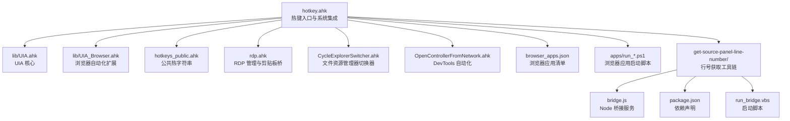
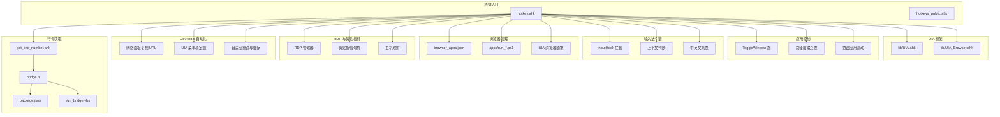
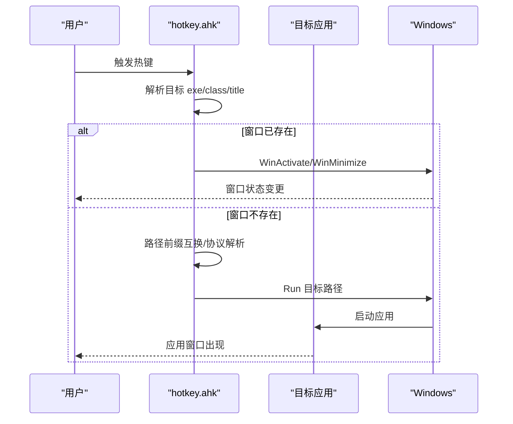
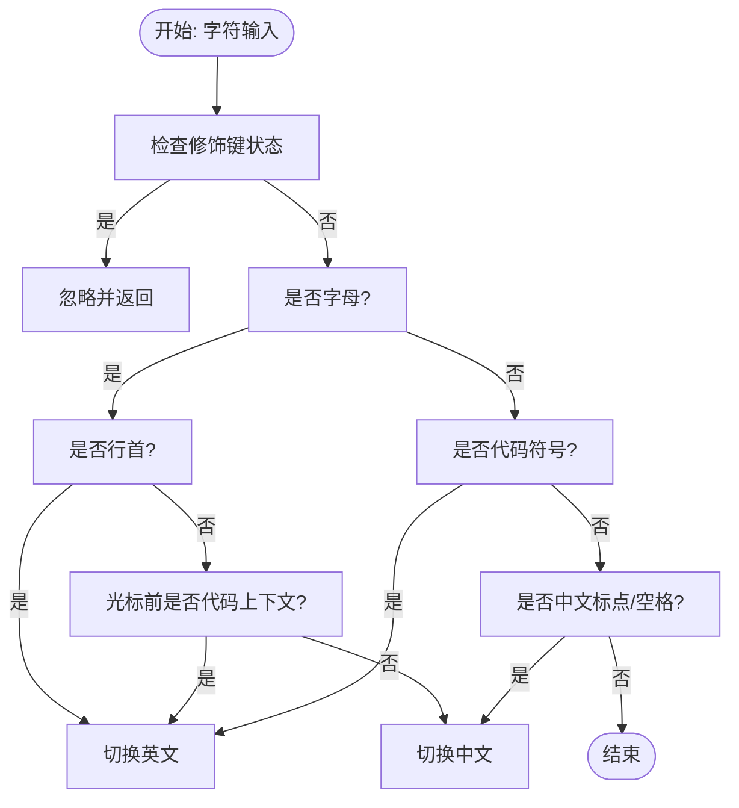
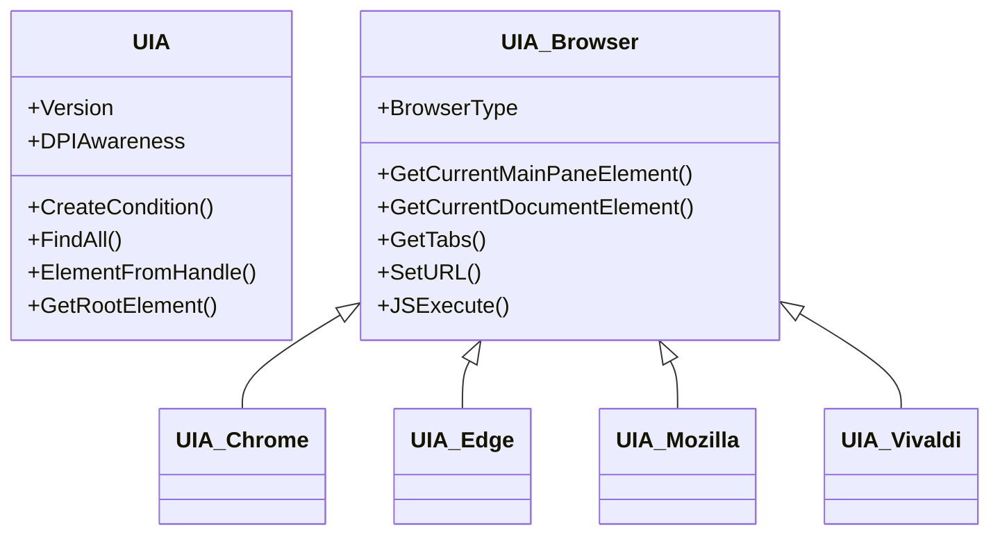
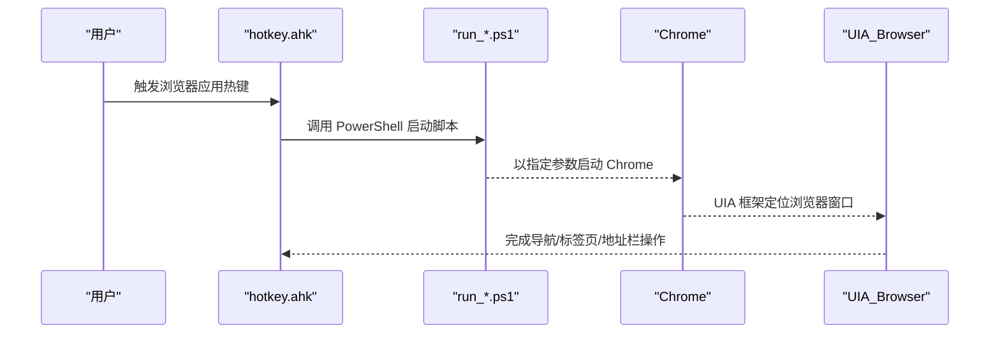
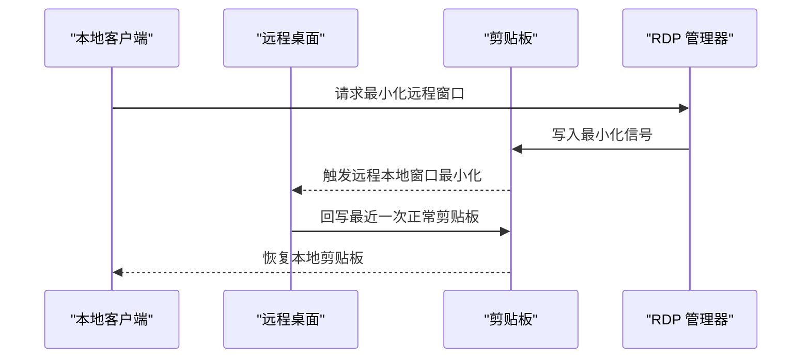
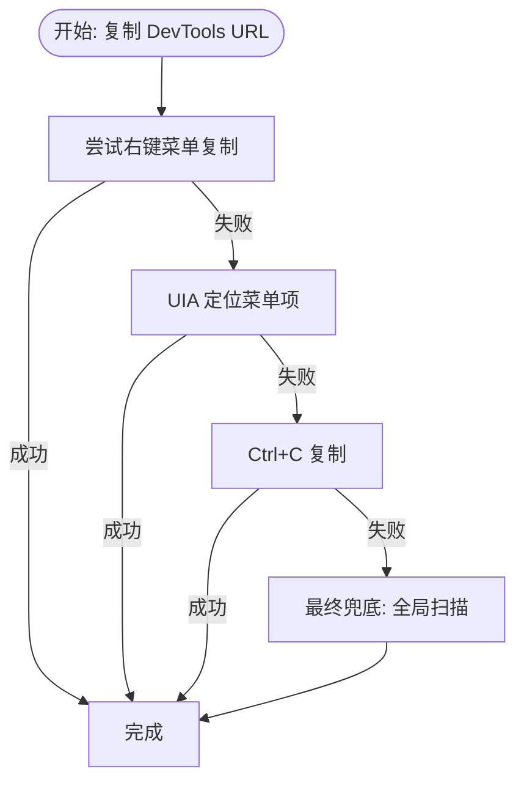
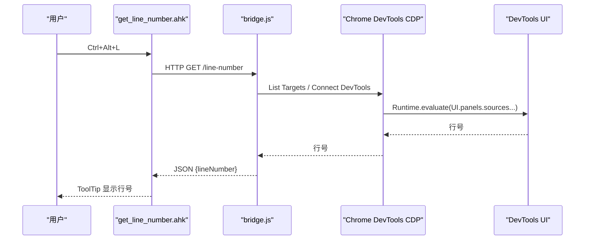
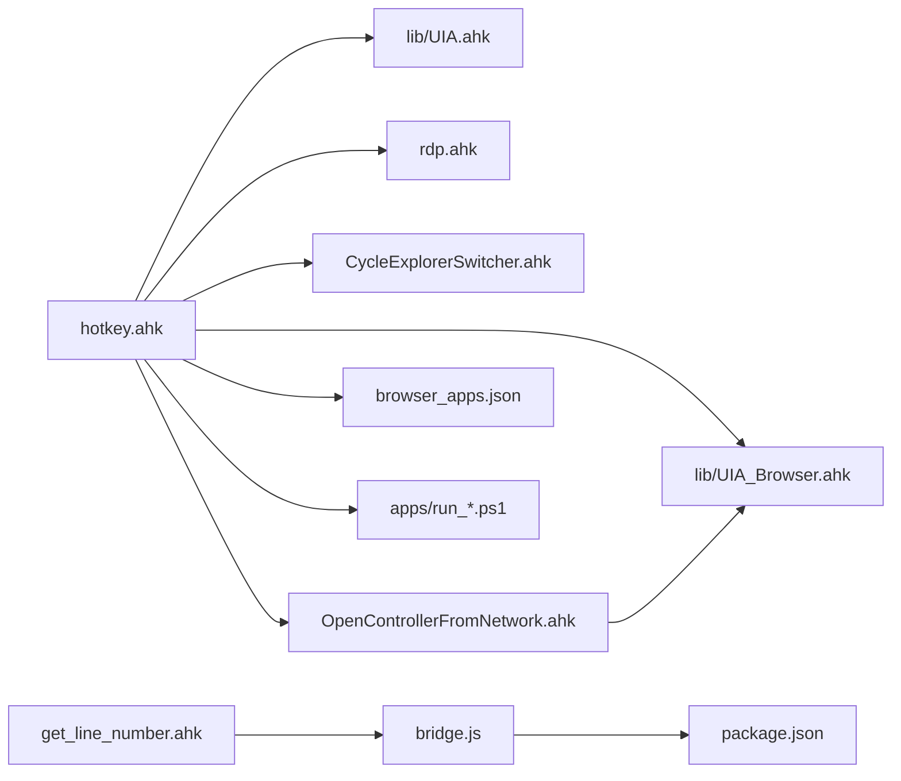

# 核心功能

<cite>
**本文引用的文件**
- [hotkey.ahk](file://hotkey.ahk)
- [hotkeys_public.ahk](file://hotkeys_public.ahk)
- [browser_apps.json](file://browser_apps.json)
- [lib/UIA.ahk](file://lib/UIA.ahk)
- [lib/UIA_Browser.ahk](file://lib/UIA_Browser.ahk)
- [rdp.ahk](file://rdp.ahk)
- [CycleExplorerSwitcher.ahk](file://CycleExplorerSwitcher.ahk)
- [OpenControllerFromNetwork.ahk](file://OpenControllerFromNetwork.ahk)
- [apps/run_ChatGPT.ps1](file://apps/run_ChatGPT.ps1)
- [apps/run_DMS.ps1](file://apps/run_DMS.ps1)
- [get-source-panel-line-number/get_line_number.ahk](file://get-source-panel-line-number/get_line_number.ahk)
- [get-source-panel-line-number/bridge.js](file://get-source-panel-line-number/bridge.js)
- [get-source-panel-line-number/package.json](file://get-source-panel-line-number/package.json)
- [get-source-panel-line-number/run_bridge.vbs](file://get-source-panel-line-number/run_bridge.vbs)
- [templates/README_SaveCredentials.md](file://templates/README_SaveCredentials.md)
- [README.md](file://README.md)
</cite>

## 目录
1. [简介](#简介)
2. [项目结构](#项目结构)
3. [核心组件](#核心组件)
4. [架构总览](#架构总览)
5. [详细组件分析](#详细组件分析)
6. [依赖分析](#依赖分析)
7. [性能考虑](#性能考虑)
8. [故障排查指南](#故障排查指南)
9. [结论](#结论)
10. [附录](#附录)

## 简介
本项目基于 AutoHotkey v2（AHK v2）构建，提供一套完整的“热键管理系统 + 应用程序控制 + 输入法智能切换 + UI 自动化框架 + 浏览器应用管理”的综合解决方案。其核心目标是通过热键快速打开/切换应用、在远程桌面环境下优化剪贴板与窗口交互、在浏览器中进行自动化操作、以及在开发调试场景中辅助定位源码行号。

## 项目结构
项目采用“模块化 + 热键入口”的组织方式：
- 热键入口与通用能力：hotkey.ahk
- 公共热字符串与快捷片段：hotkeys_public.ahk
- 浏览器应用清单与参数：browser_apps.json
- UI 自动化核心与浏览器专用扩展：lib/UIA.ahk、lib/UIA_Browser.ahk
- RDP 连接与剪贴板桥：rdp.ahk
- 文件资源管理器轮询切换器：CycleExplorerSwitcher.ahk
- DevTools 网络面板自动化：OpenControllerFromNetwork.ahk
- 浏览器应用启动脚本：apps/run_ChatGPT.ps1、apps/run_DMS.ps1
- 源码行号获取工具链：get-source-panel-line-number/*.ahk、*.js、*.json、*.vbs
- RDP 凭据保存模板说明：templates/README_SaveCredentials.md
- 项目说明：README.md

图示来源
- [hotkey.ahk:1-2413](file://hotkey.ahk#L1-L2413)
- [lib/UIA.ahk:1-800](file://lib/UIA.ahk#L1-L800)
- [lib/UIA_Browser.ahk:1-800](file://lib/UIA_Browser.ahk#L1-L800)
- [hotkeys_public.ahk:1-57](file://hotkeys_public.ahk#L1-L57)
- [rdp.ahk:1-417](file://rdp.ahk#L1-L417)
- [CycleExplorerSwitcher.ahk:1-478](file://CycleExplorerSwitcher.ahk#L1-L478)
- [OpenControllerFromNetwork.ahk:1-877](file://OpenControllerFromNetwork.ahk#L1-L877)
- [browser_apps.json:1-48](file://browser_apps.json#L1-L48)
- [apps/run_ChatGPT.ps1:1-18](file://apps/run_ChatGPT.ps1#L1-L18)
- [apps/run_DMS.ps1:1-18](file://apps/run_DMS.ps1#L1-L18)
- [get-source-panel-line-number/get_line_number.ahk:1-148](file://get-source-panel-line-number/get_line_number.ahk#L1-L148)
- [get-source-panel-line-number/bridge.js:1-51](file://get-source-panel-line-number/bridge.js#L1-L51)
- [get-source-panel-line-number/package.json:1-6](file://get-source-panel-line-number/package.json#L1-L6)
- [get-source-panel-line-number/run_bridge.vbs:1-2](file://get-source-panel-line-number/run_bridge.vbs#L1-L2)

章节来源
- [README.md:1-2](file://README.md#L1-L2)
- [hotkey.ahk:1-2413](file://hotkey.ahk#L1-L2413)

## 核心组件
- 热键管理系统：集中定义与加载公共热键、热字符串、系统任务注册、窗口开关与路径回退启动。
- 应用程序控制：统一的 ToggleWindow 族函数、路径前缀互换、进程名获取、协议应用启动。
- 输入法智能切换：基于 InputHook 的字符级拦截与上下文判断，自动在中英文输入法间切换。
- UI 自动化框架：封装 UIA 核心、条件构造、树遍历、元素定位、事件处理与 DPI 适配。
- 浏览器应用管理：浏览器应用清单、启动脚本、UIA 浏览器抽象、标签页与地址栏操作。
- RDP 管理与剪贴板桥：RDP 窗口最小化、剪贴板信号桥、主机映射与安全连接流程。
- DevTools 自动化：从网络面板复制选中请求 URL，UIA 定位菜单项，自适应重试与缓存锚点。
- 源码行号获取：Chrome 远程调试 + Node 桥接 + AHK 调用，实时读取 DevTools 源码面板行号。

章节来源
- [hotkey.ahk:1-2413](file://hotkey.ahk#L1-L2413)
- [hotkeys_public.ahk:1-57](file://hotkeys_public.ahk#L1-L57)
- [lib/UIA.ahk:1-800](file://lib/UIA.ahk#L1-L800)
- [lib/UIA_Browser.ahk:1-800](file://lib/UIA_Browser.ahk#L1-L800)
- [browser_apps.json:1-48](file://browser_apps.json#L1-L48)
- [rdp.ahk:1-417](file://rdp.ahk#L1-L417)
- [OpenControllerFromNetwork.ahk:1-877](file://OpenControllerFromNetwork.ahk#L1-L877)
- [get-source-panel-line-number/get_line_number.ahk:1-148](file://get-source-panel-line-number/get_line_number.ahk#L1-L148)

## 架构总览
整体架构围绕“热键入口”展开，通过模块化组件实现跨应用、跨系统的自动化控制。UIA 作为底层通用框架，向上支撑浏览器自动化与通用 UI 操作；RDP 模块负责远程会话下的窗口与剪贴板协同；DevTools 自动化与行号工具链服务于前端/调试场景。

图示来源
- [hotkey.ahk:1-2413](file://hotkey.ahk#L1-L2413)
- [lib/UIA.ahk:1-800](file://lib/UIA.ahk#L1-L800)
- [lib/UIA_Browser.ahk:1-800](file://lib/UIA_Browser.ahk#L1-L800)
- [browser_apps.json:1-48](file://browser_apps.json#L1-L48)
- [apps/run_ChatGPT.ps1:1-18](file://apps/run_ChatGPT.ps1#L1-L18)
- [apps/run_DMS.ps1:1-18](file://apps/run_DMS.ps1#L1-L18)
- [rdp.ahk:1-417](file://rdp.ahk#L1-L417)
- [OpenControllerFromNetwork.ahk:1-877](file://OpenControllerFromNetwork.ahk#L1-L877)
- [get-source-panel-line-number/get_line_number.ahk:1-148](file://get-source-panel-line-number/get_line_number.ahk#L1-L148)
- [get-source-panel-line-number/bridge.js:1-51](file://get-source-panel-line-number/bridge.js#L1-L51)
- [get-source-panel-line-number/package.json:1-6](file://get-source-panel-line-number/package.json#L1-L6)
- [get-source-panel-line-number/run_bridge.vbs:1-2](file://get-source-panel-line-number/run_bridge.vbs#L1-L2)

## 详细组件分析

### 热键管理系统与应用程序控制
- 系统任务注册与自启动：首次运行以管理员权限检查并创建计划任务，确保开机自启。
- 路径前缀互换与协议应用：针对 C/D 盘路径差异提供互换逻辑，支持协议应用（如 ms-phone）直接启动。
- 窗口开关与多窗口枚举：提供基于 exe/class/title 的窗口激活/最小化/切换，支持多实例窗口遍历与选择。
- 进程名获取与主窗口定位：通过 Win32 API 获取进程路径，结合窗口样式过滤主窗口。
- 热键入口与模块化加载：集中 include 公共热键、RDP、Explorer 切换器等模块，形成统一热键空间。

图示来源
- [hotkey.ahk:120-163](file://hotkey.ahk#L120-L163)
- [hotkey.ahk:76-118](file://hotkey.ahk#L76-L118)

章节来源
- [hotkey.ahk:24-52](file://hotkey.ahk#L24-L52)
- [hotkey.ahk:55-118](file://hotkey.ahk#L55-L118)
- [hotkey.ahk:120-163](file://hotkey.ahk#L120-L163)
- [hotkey.ahk:222-250](file://hotkey.ahk#L222-L250)

### 输入法智能切换引擎
- InputHook 拦截：在“普通文本输入”场景拦截字符，排除 Ctrl/Alt/Win 组合。
- 上下文判断：行首字母、光标前代码上下文、中文标点/空格等规则驱动切换。
- 切换策略：字母输入根据上下文切换；代码符号强制英文；中文标点保持中文。
- 标点与拼音转换：支持中英文标点映射与拼音转中文，配合 IME 组合态确保输入体验。

图示来源
- [hotkey.ahk:367-404](file://hotkey.ahk#L367-L404)
- [hotkey.ahk:330-355](file://hotkey.ahk#L330-L355)
- [hotkey.ahk:452-518](file://hotkey.ahk#L452-L518)

章节来源
- [hotkey.ahk:296-404](file://hotkey.ahk#L296-L404)
- [hotkey.ahk:409-451](file://hotkey.ahk#L409-L451)

### UI 自动化框架（UIA）
- 核心能力：条件构造、树遍历、元素定位、属性访问、事件处理、DPI 适配。
- 浏览器扩展：针对 Chrome/Edge/Mozilla/Vivaldi 的导航栏、地址栏、标签栏、文档元素的差异化封装。
- 性能与健壮性：提供缓存请求、超时等待、异常捕获与降级路径。

图示来源
- [lib/UIA.ahk:1-800](file://lib/UIA.ahk#L1-L800)
- [lib/UIA_Browser.ahk:1-800](file://lib/UIA_Browser.ahk#L1-L800)

章节来源
- [lib/UIA.ahk:1-800](file://lib/UIA.ahk#L1-L800)
- [lib/UIA_Browser.ahk:1-800](file://lib/UIA_Browser.ahk#L1-L800)

### 浏览器应用管理
- 应用清单：browser_apps.json 定义浏览器、通用参数与应用列表（名称、标题、URL、浏览器、热键、AUMID）。
- 启动脚本：apps/run_*.ps1 生成带参数的 Chrome 启动快捷方式，并写入 AUMID 以便系统识别。
- UIA 浏览器抽象：统一导航、标签页管理、地址栏操作、JS 注入与元素点击。

图示来源
- [browser_apps.json:1-48](file://browser_apps.json#L1-L48)
- [apps/run_ChatGPT.ps1:1-18](file://apps/run_ChatGPT.ps1#L1-L18)
- [apps/run_DMS.ps1:1-18](file://apps/run_DMS.ps1#L1-L18)
- [lib/UIA_Browser.ahk:458-800](file://lib/UIA_Browser.ahk#L458-L800)

章节来源
- [browser_apps.json:1-48](file://browser_apps.json#L1-L48)
- [apps/run_ChatGPT.ps1:1-18](file://apps/run_ChatGPT.ps1#L1-L18)
- [apps/run_DMS.ps1:1-18](file://apps/run_DMS.ps1#L1-L18)
- [lib/UIA_Browser.ahk:1-800](file://lib/UIA_Browser.ahk#L1-L800)

### RDP 管理与剪贴板桥
- RDP 管理器：统一连接、激活、最小化、日志记录与主机映射。
- 剪贴板桥：在本地与远程之间通过剪贴板信号实现最小化请求与回滚。
- 安全连接：支持快速直连与安全探测（DNS/端口探测）两种模式。

图示来源
- [rdp.ahk:16-45](file://rdp.ahk#L16-L45)
- [rdp.ahk:189-221](file://rdp.ahk#L189-L221)
- [rdp.ahk:244-270](file://rdp.ahk#L244-L270)

章节来源
- [rdp.ahk:1-417](file://rdp.ahk#L1-L417)

### DevTools 自动化（网络面板）
- 主流程：优先右键菜单复制 URL，失败时回退到 UIA 定位菜单项或 Ctrl+C。
- 自适应重试：多轮次重试、等待时间与缓存锚点，提升在慢设备上的稳定性。
- 菜单项评分：基于名称相似度与位置近似度，自动选择“复制 URL”或“复制”。

图示来源
- [OpenControllerFromNetwork.ahk:139-195](file://OpenControllerFromNetwork.ahk#L139-L195)
- [OpenControllerFromNetwork.ahk:471-581](file://OpenControllerFromNetwork.ahk#L471-L581)
- [OpenControllerFromNetwork.ahk:672-745](file://OpenControllerFromNetwork.ahk#L672-L745)

章节来源
- [OpenControllerFromNetwork.ahk:1-877](file://OpenControllerFromNetwork.ahk#L1-L877)

### 源码行号获取工具链
- 环境初始化：检测/启动 Chrome 调试端口（9222），启动 Node 桥接服务（3000）。
- 行号读取：通过 CDP 连接 DevTools 自身，执行 JS 读取源码面板当前行号。
- 热键绑定：F10 初始化、Ctrl+Alt+L 读取、Shift+F12 诊断链路状态。

图示来源
- [get-source-panel-line-number/get_line_number.ahk:108-112](file://get-source-panel-line-number/get_line_number.ahk#L108-L112)
- [get-source-panel-line-number/bridge.js:8-40](file://get-source-panel-line-number/bridge.js#L8-L40)

章节来源
- [get-source-panel-line-number/get_line_number.ahk:1-148](file://get-source-panel-line-number/get_line_number.ahk#L1-L148)
- [get-source-panel-line-number/bridge.js:1-51](file://get-source-panel-line-number/bridge.js#L1-L51)
- [get-source-panel-line-number/package.json:1-6](file://get-source-panel-line-number/package.json#L1-L6)
- [get-source-panel-line-number/run_bridge.vbs:1-2](file://get-source-panel-line-number/run_bridge.vbs#L1-L2)

### 文件资源管理器轮询切换器
- 热键绑定：Win+E 轮询切换，Esc 取消。
- 多实例支持：枚举所有 CabinetWClass 窗口，动态构建 ListView，支持自绘与键盘导航。
- 交互细节：自定义消息钩子、字体/颜色、选中高亮、激活重试与 Alt 激活兜底。

章节来源
- [CycleExplorerSwitcher.ahk:1-478](file://CycleExplorerSwitcher.ahk#L1-L478)

## 依赖分析
- 外部依赖
  - Node.js 与 chrome-remote-interface：用于 DevTools 行号读取。
  - PowerShell：用于浏览器应用启动脚本与 RDP 连接。
  - Windows 系统 API：UIA、Win32、剪贴板、计划任务等。
- 模块耦合
  - hotkey.ahk 作为中枢，耦合 lib/UIA.*、RDP、Explorer 切换器、DevTools 自动化。
  - 浏览器应用通过 JSON 清单与 PowerShell 脚本解耦，便于维护与扩展。
  - 行号工具链通过 HTTP 与 Node 服务解耦，AHK 仅负责调用与展示。

图示来源
- [hotkey.ahk:1-2413](file://hotkey.ahk#L1-L2413)
- [lib/UIA.ahk:1-800](file://lib/UIA.ahk#L1-L800)
- [lib/UIA_Browser.ahk:1-800](file://lib/UIA_Browser.ahk#L1-L800)
- [rdp.ahk:1-417](file://rdp.ahk#L1-L417)
- [CycleExplorerSwitcher.ahk:1-478](file://CycleExplorerSwitcher.ahk#L1-L478)
- [OpenControllerFromNetwork.ahk:1-877](file://OpenControllerFromNetwork.ahk#L1-L877)
- [browser_apps.json:1-48](file://browser_apps.json#L1-L48)
- [apps/run_ChatGPT.ps1:1-18](file://apps/run_ChatGPT.ps1#L1-L18)
- [apps/run_DMS.ps1:1-18](file://apps/run_DMS.ps1#L1-L18)
- [get-source-panel-line-number/get_line_number.ahk:1-148](file://get-source-panel-line-number/get_line_number.ahk#L1-L148)
- [get-source-panel-line-number/bridge.js:1-51](file://get-source-panel-line-number/bridge.js#L1-L51)
- [get-source-panel-line-number/package.json:1-6](file://get-source-panel-line-number/package.json#L1-L6)

章节来源
- [hotkey.ahk:1-2413](file://hotkey.ahk#L1-L2413)
- [OpenControllerFromNetwork.ahk:1-877](file://OpenControllerFromNetwork.ahk#L1-L877)
- [get-source-panel-line-number/get_line_number.ahk:1-148](file://get-source-panel-line-number/get_line_number.ahk#L1-L148)

## 性能考虑
- UIA 查询与缓存：优先局部扫描与缓存锚点，减少全局树遍历；合理设置等待与重试间隔。
- 输入法切换：最小化 IME 组合态切换次数，避免频繁触发拼音输入。
- RDP 交互：剪贴板桥采用信号与回滚策略，减少窗口状态竞争；最小化窗口时优先根窗口。
- DevTools 自动化：优先 UIA 定位菜单项，避免全桌面扫描；自适应重试与缓存提升稳定性。
- 浏览器应用：通过启动参数禁用扩展与同步，缩短启动时间；AUMID 写入提升系统识别效率。

## 故障排查指南
- 权限问题：首次运行需管理员权限创建计划任务；若失败，检查系统策略与账户权限。
- RDP 连接：确认 mstsc.exe 存在与 .rdp 文件路径正确；安全模式下先进行 DNS/端口探测。
- DevTools 自动化：若菜单项定位失败，检查 DevTools 版本与菜单项名称；启用自适应重试与缓存。
- 行号获取：确认 Chrome 9222 端口开放与 Node 桥接服务在线；使用诊断热键检查链路状态。
- 输入法切换：若切换异常，检查 InputHook 状态与修饰键冲突；验证上下文判断逻辑。

章节来源
- [hotkey.ahk:24-52](file://hotkey.ahk#L24-L52)
- [rdp.ahk:306-324](file://rdp.ahk#L306-L324)
- [OpenControllerFromNetwork.ahk:301-311](file://OpenControllerFromNetwork.ahk#L301-L311)
- [get-source-panel-line-number/get_line_number.ahk:120-148](file://get-source-panel-line-number/get_line_number.ahk#L120-L148)

## 结论
本项目通过热键入口整合多模块能力，形成从应用控制、输入法切换、UI 自动化到浏览器与调试工具的完整自动化体系。其模块化设计与外部依赖解耦，使得功能扩展与维护更为便捷；同时在性能与稳定性方面提供了多种优化策略与自适应机制，适合在日常办公与开发调试场景中高效使用。

## 附录
- RDP 凭据保存：参考模板说明，了解凭据保存流程与策略限制。
- 公共热字符串：提供常用 SQL/命令片段的热字符串，提升编码效率。
- 浏览器应用清单：统一管理应用名称、URL、浏览器与热键，便于批量维护。

章节来源
- [templates/README_SaveCredentials.md:1-27](file://templates/README_SaveCredentials.md#L1-L27)
- [hotkeys_public.ahk:1-57](file://hotkeys_public.ahk#L1-L57)
- [browser_apps.json:1-48](file://browser_apps.json#L1-L48)