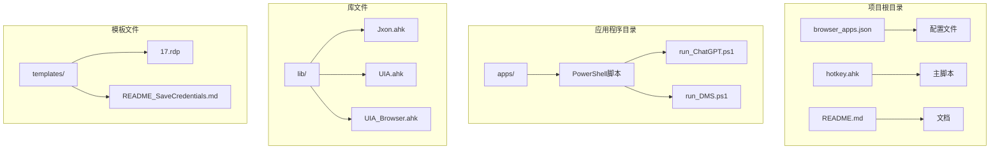
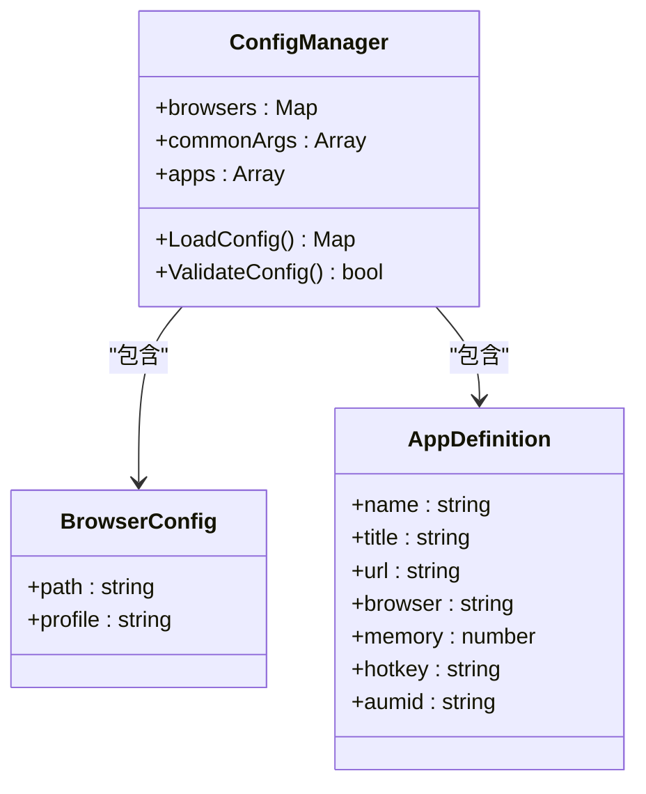
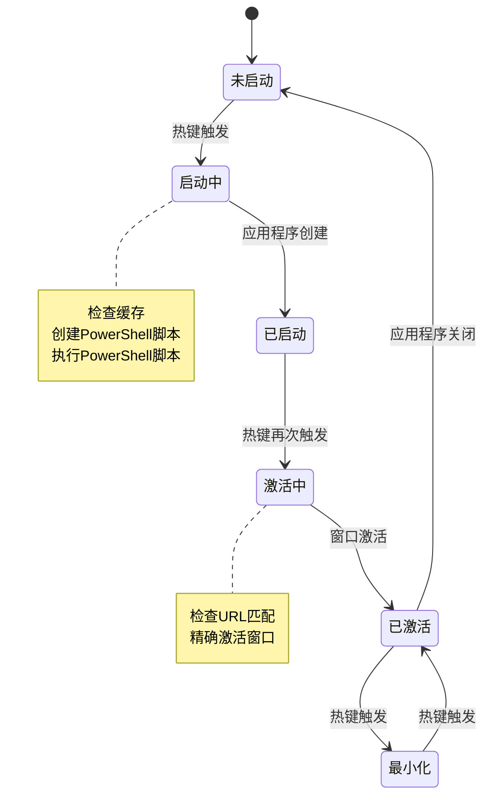
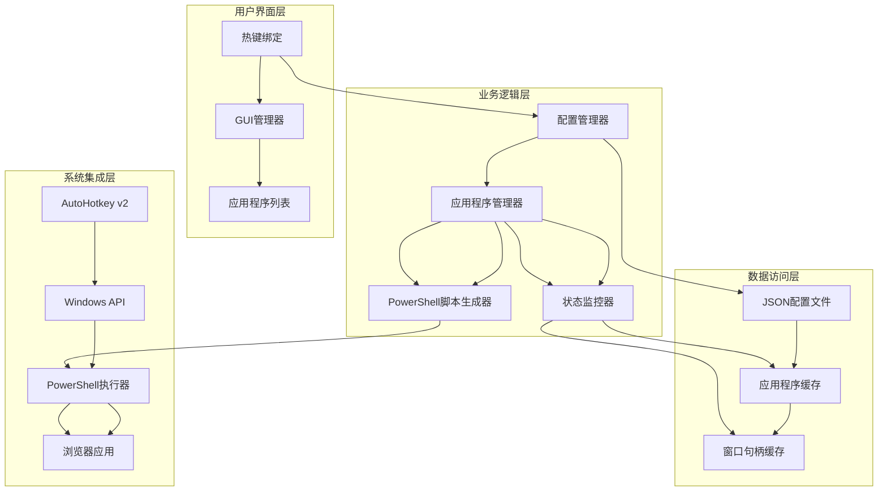
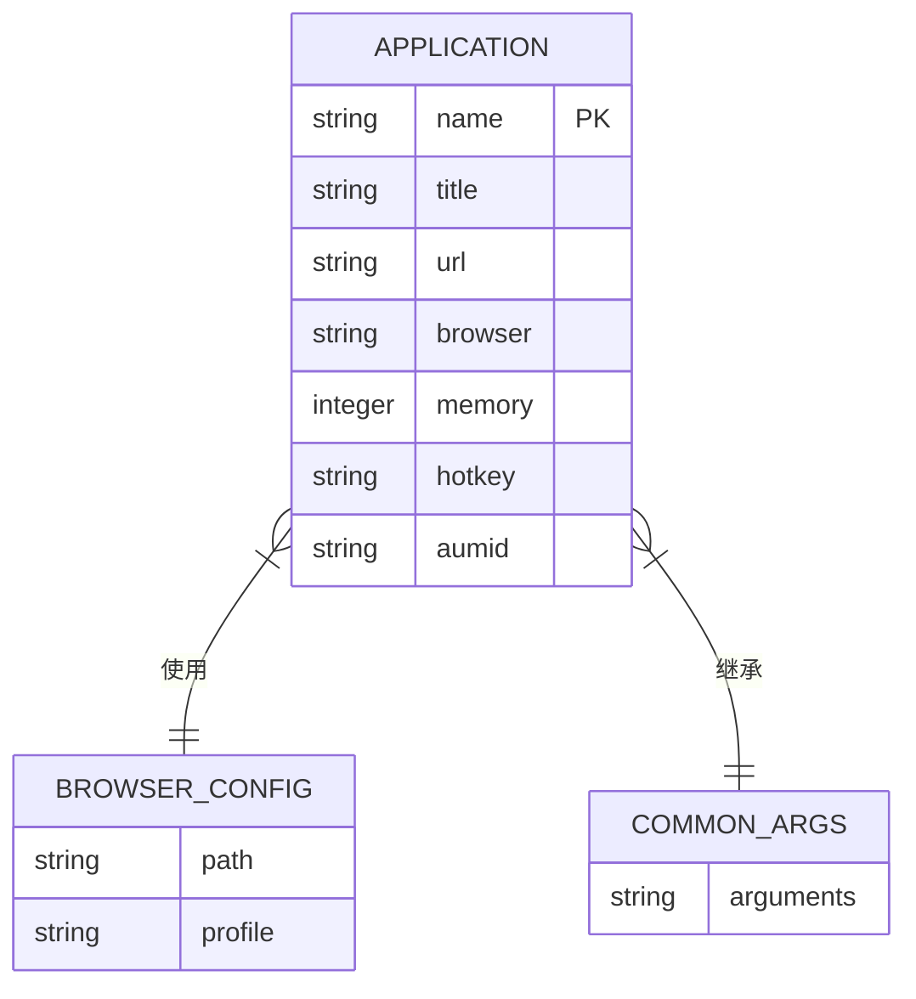
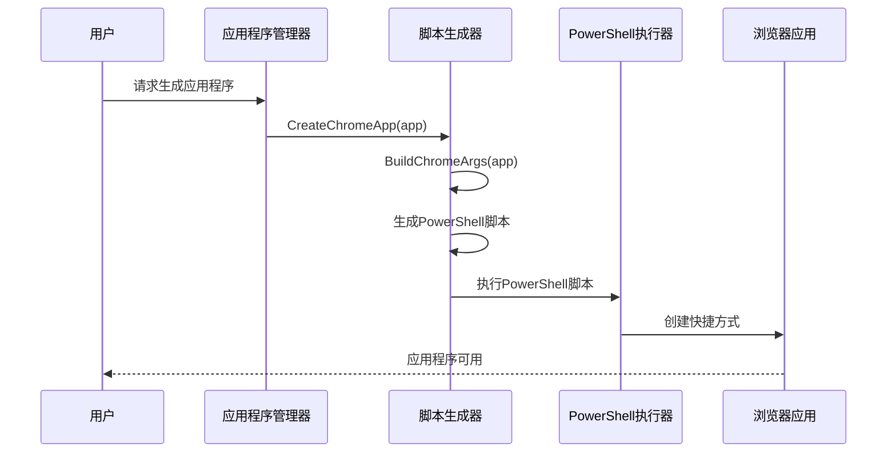
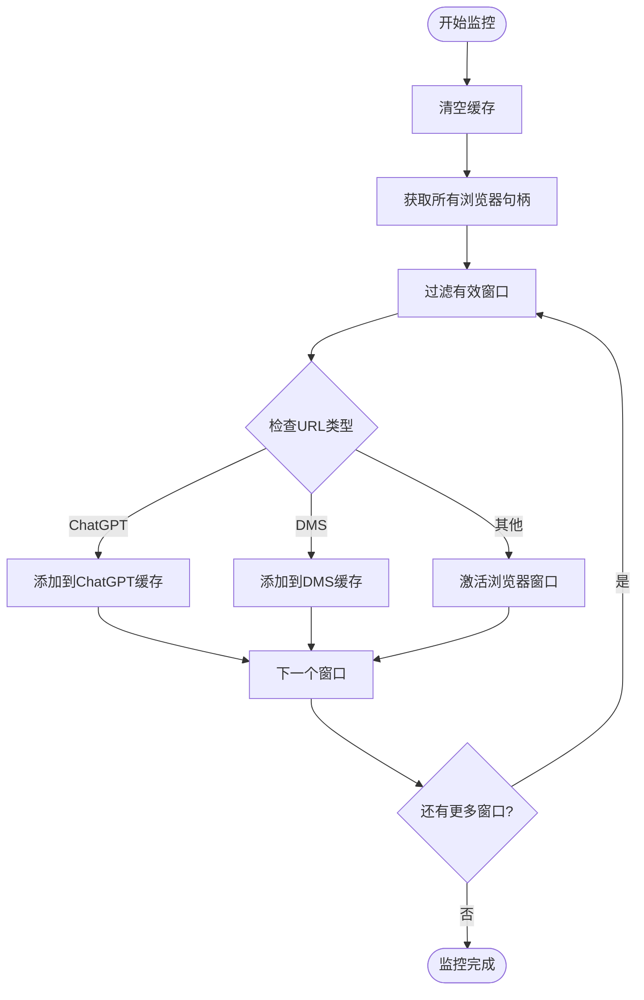
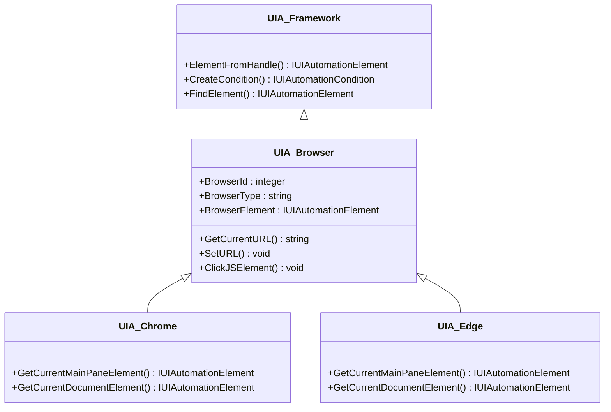
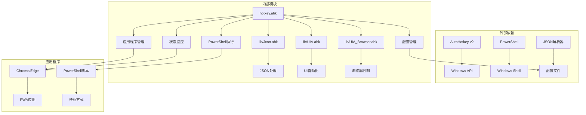

# 浏览器应用管理

<cite>
**本文档引用的文件**
- [browser_apps.json](file://browser_apps.json)
- [hotkey.ahk](file://hotkey.ahk)
- [apps/run_ChatGPT.ps1](file://apps/run_ChatGPT.ps1)
- [apps/run_DMS.ps1](file://apps/run_DMS.ps1)
- [lib/Jxon.ahk](file://lib/Jxon.ahk)
- [lib/UIA.ahk](file://lib/UIA.ahk)
- [lib/UIA_Browser.ahk](file://lib/UIA_Browser.ahk)
- [README.md](file://README.md)
</cite>

## 目录
1. [简介](#简介)
2. [项目结构](#项目结构)
3. [核心组件](#核心组件)
4. [架构概览](#架构概览)
5. [详细组件分析](#详细组件分析)
6. [依赖关系分析](#依赖关系分析)
7. [性能考虑](#性能考虑)
8. [故障排除指南](#故障排除指南)
9. [结论](#结论)

## 简介

hotkey项目是一个基于AutoHotkey v2的浏览器应用管理系统，专门用于管理和快速启动Chrome/Edge浏览器中的PWA（渐进式Web应用）。该项目提供了完整的应用程序配置化定义、PowerShell脚本生成和管理、应用程序生命周期管理以及快速启动机制。

该项目的核心功能包括：
- Chrome/Edge应用模式管理
- 应用程序配置化定义
- PowerShell脚本自动生成和维护
- 应用程序生命周期管理
- 快速启动机制
- 应用程序状态监控
- 错误处理和用户界面集成

## 项目结构

项目采用模块化设计，主要包含以下核心目录和文件：

**图表来源**
- [hotkey.ahk:1-50](file://hotkey.ahk#L1-L50)
- [browser_apps.json:1-48](file://browser_apps.json#L1-L48)

**章节来源**
- [hotkey.ahk:1-50](file://hotkey.ahk#L1-L50)
- [browser_apps.json:1-48](file://browser_apps.json#L1-L48)

## 核心组件

### 配置管理系统

配置系统基于JSON格式，支持浏览器配置、通用参数和应用程序定义：

**图表来源**
- [browser_apps.json:1-48](file://browser_apps.json#L1-L48)
- [hotkey.ahk:2132-2139](file://hotkey.ahk#L2132-L2139)

### 应用程序生命周期管理

应用程序生命周期管理包括启动、激活、最小化和状态监控：

**图表来源**
- [hotkey.ahk:2221-2245](file://hotkey.ahk#L2221-L2245)
- [hotkey.ahk:2160-2206](file://hotkey.ahk#L2160-L2206)

**章节来源**
- [browser_apps.json:1-48](file://browser_apps.json#L1-L48)
- [hotkey.ahk:2132-2139](file://hotkey.ahk#L2132-L2139)
- [hotkey.ahk:2221-2245](file://hotkey.ahk#L2221-L2245)

## 架构概览

系统采用分层架构设计，从上到下分为用户界面层、业务逻辑层、数据访问层和系统集成层：

**图表来源**
- [hotkey.ahk:1950-1951](file://hotkey.ahk#L1950-L1951)
- [hotkey.ahk:2146-2149](file://hotkey.ahk#L2146-L2149)
- [hotkey.ahk:2160-2206](file://hotkey.ahk#L2160-L2206)

## 详细组件分析

### 配置文件格式详解

browser_apps.json定义了完整的应用程序配置结构：

| 字段 | 类型 | 必需 | 描述 |
|------|------|------|------|
| browsers | Object | 是 | 浏览器配置对象 |
| browsers.chrome | Object | 否 | Chrome浏览器配置 |
| browsers.chrome.path | String | 否 | Chrome可执行文件路径 |
| browsers.chrome.profile | String | 否 | Chrome用户配置文件 |
| browsers.edge | Object | 否 | Edge浏览器配置 |
| browsers.edge.path | String | 否 | Edge可执行文件路径 |
| browsers.edge.profile | String | 否 | Edge用户配置文件 |
| commonArgs | Array | 是 | 通用启动参数数组 |
| apps | Array | 是 | 应用程序定义数组 |

**章节来源**
- [browser_apps.json:1-48](file://browser_apps.json#L1-L48)

### 应用程序定义规范

每个应用程序定义包含以下关键字段：

**图表来源**
- [browser_apps.json:25-46](file://browser_apps.json#L25-L46)

### PowerShell脚本生成机制

系统自动生成PowerShell脚本来创建浏览器快捷方式：

**图表来源**
- [hotkey.ahk:2074-2111](file://hotkey.ahk#L2074-L2111)
- [hotkey.ahk:2058-2072](file://hotkey.ahk#L2058-L2072)

**章节来源**
- [hotkey.ahk:2074-2111](file://hotkey.ahk#L2074-L2111)
- [hotkey.ahk:2058-2072](file://hotkey.ahk#L2058-L2072)

### 状态监控和缓存机制

系统实现了智能的状态监控和缓存机制来优化应用程序激活：

**图表来源**
- [hotkey.ahk:2160-2206](file://hotkey.ahk#L2160-L2206)

**章节来源**
- [hotkey.ahk:2160-2206](file://hotkey.ahk#L2160-L2206)

### UIA自动化框架集成

系统集成了UIA（用户界面自动化）框架来增强浏览器控制能力：

**图表来源**
- [lib/UIA.ahk:51-138](file://lib/UIA.ahk#L51-L138)
- [lib/UIA_Browser.ahk:458-488](file://lib/UIA_Browser.ahk#L458-L488)

**章节来源**
- [lib/UIA.ahk:51-138](file://lib/UIA.ahk#L51-L138)
- [lib/UIA_Browser.ahk:458-488](file://lib/UIA_Browser.ahk#L458-L488)

## 依赖关系分析

系统依赖关系呈现清晰的层次结构：

**图表来源**
- [hotkey.ahk:3-6](file://hotkey.ahk#L3-L6)
- [lib/Jxon.ahk:1-301](file://lib/Jxon.ahk#L1-L301)
- [lib/UIA.ahk:1-800](file://lib/UIA.ahk#L1-L800)

**章节来源**
- [hotkey.ahk:3-6](file://hotkey.ahk#L3-L6)
- [lib/Jxon.ahk:1-301](file://lib/Jxon.ahk#L1-L301)
- [lib/UIA.ahk:1-800](file://lib/UIA.ahk#L1-L800)

## 性能考虑

系统在设计时充分考虑了性能优化：

### 缓存策略
- **窗口句柄缓存**：避免重复扫描和查找浏览器窗口
- **URL匹配缓存**：快速定位特定应用窗口
- **配置文件缓存**：减少频繁的文件读取操作

### 异步处理
- **PowerShell脚本异步执行**：避免阻塞主脚本
- **UIA操作超时控制**：防止长时间等待
- **条件检查优化**：优先使用高效的方法

### 内存管理
- **资源及时释放**：COM对象使用后立即释放
- **缓存容量控制**：避免内存泄漏
- **垃圾回收优化**：合理管理对象生命周期

## 故障排除指南

### 常见问题及解决方案

| 问题类型 | 症状 | 可能原因 | 解决方案 |
|----------|------|----------|----------|
| 应用程序无法启动 | PowerShell执行失败 | 权限不足或路径错误 | 检查管理员权限和路径配置 |
| 热键无响应 | 热键绑定失败 | 配置文件格式错误 | 验证JSON格式和语法 |
| 窗口激活失败 | 应用程序无法聚焦 | URL匹配失败 | 检查URL配置和缓存状态 |
| PowerShell脚本生成失败 | .ps1文件创建失败 | 文件权限或磁盘空间不足 | 检查文件权限和磁盘空间 |

### 调试技巧

1. **启用调试模式**：使用`#Include`指令包含调试代码
2. **查看日志输出**：利用`TrayTip`显示状态信息
3. **验证配置**：使用`Jxon_Load`验证JSON配置有效性
4. **测试PowerShell**：单独执行生成的PowerShell脚本

**章节来源**
- [hotkey.ahk:2113-2126](file://hotkey.ahk#L2113-L2126)
- [hotkey.ahk:2018-2031](file://hotkey.ahk#L2018-L2031)

## 结论

hotkey项目的浏览器应用管理系统展现了优秀的软件工程实践，具有以下特点：

### 技术优势
- **模块化设计**：清晰的分层架构便于维护和扩展
- **配置驱动**：通过JSON配置实现灵活的应用程序定义
- **自动化程度高**：PowerShell脚本自动生成减少了手动配置工作
- **状态监控**：智能缓存机制提升了用户体验

### 应用价值
- **提高效率**：一键启动和快速激活浏览器应用
- **降低复杂度**：统一的配置管理简化了多应用场景
- **增强稳定性**：完善的错误处理和状态监控机制

### 发展方向
- **扩展支持**：增加更多浏览器和应用类型的支持
- **性能优化**：进一步优化缓存策略和资源管理
- **用户界面**：提供更丰富的图形化管理界面
- **云端同步**：支持配置文件的云端备份和同步

该系统为浏览器应用管理提供了一个完整、可靠且易于使用的解决方案，适合个人用户和开发团队在各种场景下使用。