# 浏览器应用管理

<cite>
**本文档引用的文件**
- [browser_apps.json](file://browser_apps.json)
- [hotkey.ahk](file://hotkey.ahk)
- [apps/run_ChatGPT.ps1](file://apps/run_ChatGPT.ps1)
- [apps/run_DMS.ps1](file://apps/run_DMS.ps1)
- [lib/Jxon.ahk](file://lib/Jxon.ahk)
- [lib/UIA.ahk](file://lib/UIA.ahk)
- [lib/UIA_Browser.ahk](file://lib/UIA_Browser.ahk)
- [lib/ChromeAppMgr.ahk](file://lib/ChromeAppMgr.ahk)
- [copy_chrome_profile.ps1](file://copy_chrome_profile.ps1)
- [copy_chrome_profile_to_desktops.ps1](file://copy_chrome_profile_to_desktops.ps1)
- [set_chrome_system_protocol.ps1](file://set_chrome_system_protocol.ps1)
- [OpenControllerFromNetwork.ahk](file://OpenControllerFromNetwork.ahk)
- [README.md](file://README.md)
</cite>

## 更新摘要
**所做更改**
- 增强Chrome调试基础设施：引入全局缓存系统和调试端口缓存机制
- 优化窗口管理性能：将hwndCache迁移到ChromeAppMgr.ahk实现集中管理
- 新增ChromeAppMgr.ahk模块：专门负责Chrome应用管理和缓存功能
- 改进调试端口管理：支持动态端口分配和缓存机制
- 优化应用程序激活流程：增强缓存重建和状态监控机制

## 目录
1. [简介](#简介)
2. [项目结构](#项目结构)
3. [核心组件](#核心组件)
4. [架构概览](#架构概览)
5. [详细组件分析](#详细组件分析)
6. [Chrome调试环境系统](#chrome调试环境系统)
7. [PowerShell脚本生成与管理](#powershell脚本生成与管理)
8. [多桌面虚拟桌面隔离系统](#多桌面虚拟桌面隔离系统)
9. [全局缓存系统](#全局缓存系统)
10. [依赖关系分析](#依赖关系分析)
11. [性能考虑](#性能考虑)
12. [故障排除指南](#故障排除指南)
13. [结论](#结论)

## 简介

hotkey项目是一个基于AutoHotkey v2的浏览器应用管理系统，专门用于管理和快速启动Chrome/Edge浏览器中的PWA（渐进式Web应用）。该项目提供了完整的应用程序配置化定义、PowerShell脚本生成和管理、应用程序生命周期管理以及快速启动机制。

**更新** 项目现已扩展为包含完整的Chrome调试环境管理系统，支持调试配置文件复制、系统级协议设置和复杂的调试环境管理。最新的应用程序激活流程改进增强了窗口存在性检查和缓存重建机制，确保应用程序能够稳定地重新激活已关闭的窗口。**重大重构** OpenControllerFromNetwork.ahk已从单一调试端口支持扩展为多桌面虚拟桌面隔离支持，包括桌面ID检测、独立profile目录和端口管理等功能。

**新增** 全局缓存系统和调试端口缓存机制的引入，显著提升了系统的性能和稳定性。ChromeAppMgr.ahk模块的引入实现了缓存功能的集中化管理，hwndCache已从主脚本迁移到专用模块，提供了更好的代码组织和维护性。

该项目的核心功能包括：
- Chrome/Edge应用模式管理
- 应用程序配置化定义
- PowerShell脚本自动生成和维护
- 应用程序生命周期管理
- 快速启动机制
- 应用程序状态监控
- 错误处理和用户界面集成
- **新增** Chrome调试环境系统管理
- **新增** 系统级Chrome协议配置
- **新增** 调试配置文件复制工具
- **新增** 增强的应用程序激活流程
- **新增** 多桌面虚拟桌面隔离支持
- **新增** 桌面ID检测和端口管理
- **新增** 独立profile目录管理
- **新增** 全局缓存系统和调试端口缓存机制
- **新增** 优化的窗口管理性能

## 项目结构

项目采用模块化设计，主要包含以下核心目录和文件：

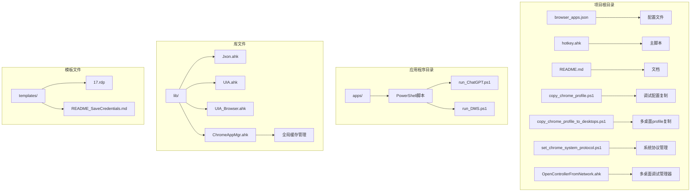
```mermaid
graph TB
subgraph "项目根目录"
A[browser_apps.json] --> B[配置文件]
C[hotkey.ahk] --> D[主脚本]
E[README.md] --> F[文档]
G[copy_chrome_profile.ps1] --> H[调试配置复制]
I[copy_chrome_profile_to_desktops.ps1] --> J[多桌面profile复制]
K[set_chrome_system_protocol.ps1] --> L[系统协议管理]
M[OpenControllerFromNetwork.ahk] --> N[多桌面调试管理器]
end
subgraph "应用程序目录"
O[apps/] --> P[PowerShell脚本]
P --> Q[run_ChatGPT.ps1]
P --> R[run_DMS.ps1]
end
subgraph "库文件"
S[lib/] --> T[Jxon.ahk]
S --> U[UIA.ahk]
S --> V[UIA_Browser.ahk]
S --> W[ChromeAppMgr.ahk]
W --> X[全局缓存管理]
end
subgraph "模板文件"
Y[templates/] --> Z[17.rdp]
Y --> AA[README_SaveCredentials.md]
end
```

**图表来源**
- [hotkey.ahk:1-50](file://hotkey.ahk#L1-L50)
- [browser_apps.json:1-48](file://browser_apps.json#L1-L48)
- [copy_chrome_profile.ps1:1-194](file://copy_chrome_profile.ps1#L1-L194)
- [copy_chrome_profile_to_desktops.ps1:1-293](file://copy_chrome_profile_to_desktops.ps1#L1-L293)
- [set_chrome_system_protocol.ps1:1-220](file://set_chrome_system_protocol.ps1#L1-L220)
- [OpenControllerFromNetwork.ahk:1-1367](file://OpenControllerFromNetwork.ahk#L1-L1367)
- [lib/ChromeAppMgr.ahk:1-50](file://lib/ChromeAppMgr.ahk#L1-L50)

**章节来源**
- [hotkey.ahk:1-50](file://hotkey.ahk#L1-L50)
- [browser_apps.json:1-48](file://browser_apps.json#L1-L48)
- [copy_chrome_profile.ps1:1-194](file://copy_chrome_profile.ps1#L1-L194)
- [copy_chrome_profile_to_desktops.ps1:1-293](file://copy_chrome_profile_to_desktops.ps1#L1-L293)
- [set_chrome_system_protocol.ps1:1-220](file://set_chrome_system_protocol.ps1#L1-L220)
- [OpenControllerFromNetwork.ahk:1-1367](file://OpenControllerFromNetwork.ahk#L1-L1367)
- [lib/ChromeAppMgr.ahk:1-50](file://lib/ChromeAppMgr.ahk#L1-L50)

## 核心组件

### 配置管理系统

配置系统基于JSON格式，支持浏览器配置、通用参数和应用程序定义：

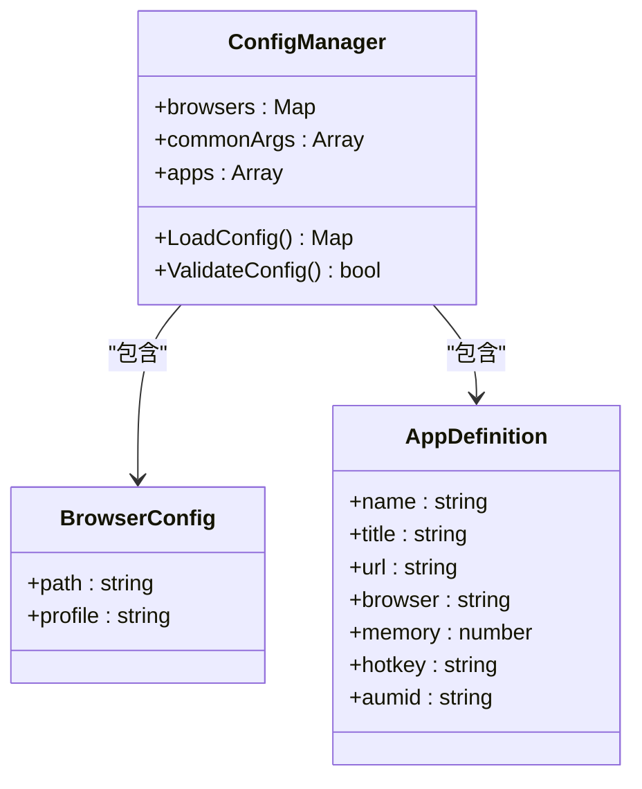
```mermaid
classDiagram
class ConfigManager {
+browsers : Map
+commonArgs : Array
+apps : Array
+LoadConfig() Map
+ValidateConfig() bool
}
class BrowserConfig {
+path : string
+profile : string
}
class AppDefinition {
+name : string
+title : string
+url : string
+browser : string
+memory : number
+hotkey : string
+aumid : string
}
ConfigManager --> BrowserConfig : "包含"
ConfigManager --> AppDefinition : "包含"
```

**图表来源**
- [browser_apps.json:1-48](file://browser_apps.json#L1-L48)
- [hotkey.ahk:2132-2139](file://hotkey.ahk#L2132-L2139)

### 应用程序生命周期管理

应用程序生命周期管理包括启动、激活、最小化和状态监控：

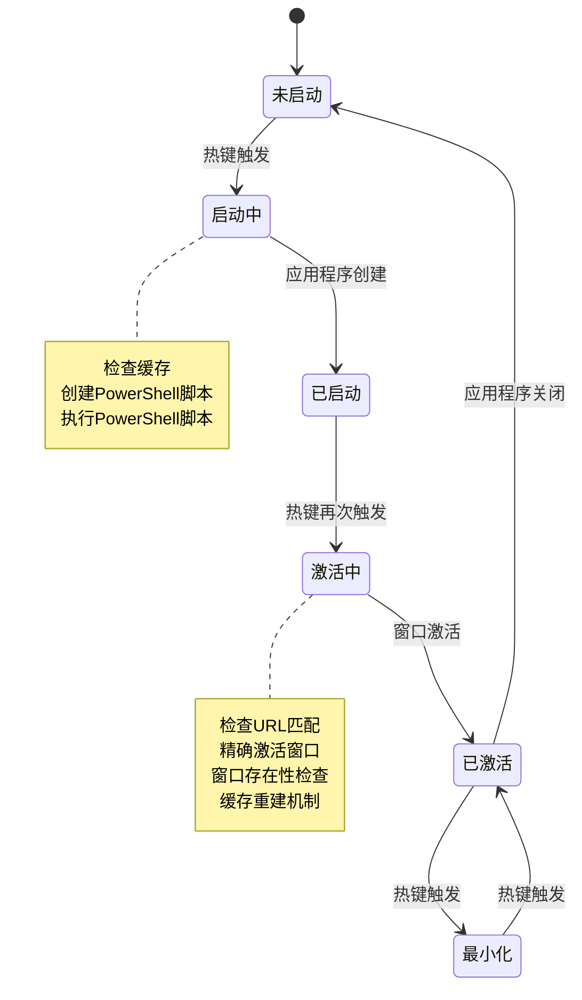
```mermaid
stateDiagram-v2
[*] --> 未启动
未启动 --> 启动中 : 热键触发
启动中 --> 已启动 : 应用程序创建
已启动 --> 激活中 : 热键再次触发
激活中 --> 已激活 : 窗口激活
已激活 --> 最小化 : 热键触发
最小化 --> 已激活 : 热键触发
已激活 --> 未启动 : 应用程序关闭
note right of 启动中 : 检查缓存<br/>创建PowerShell脚本<br/>执行PowerShell脚本
note right of 激活中 : 检查URL匹配<br/>精确激活窗口<br/>窗口存在性检查<br/>缓存重建机制
```

**图表来源**
- [hotkey.ahk:2221-2245](file://hotkey.ahk#L2221-L2245)
- [hotkey.ahk:2160-2206](file://hotkey.ahk#L2160-L2206)

**章节来源**
- [browser_apps.json:1-48](file://browser_apps.json#L1-L48)
- [hotkey.ahk:2132-2139](file://hotkey.ahk#L2132-L2139)
- [hotkey.ahk:2221-2245](file://hotkey.ahk#L2221-L2245)

## 架构概览

系统采用分层架构设计，从上到下分为用户界面层、业务逻辑层、数据访问层和系统集成层：

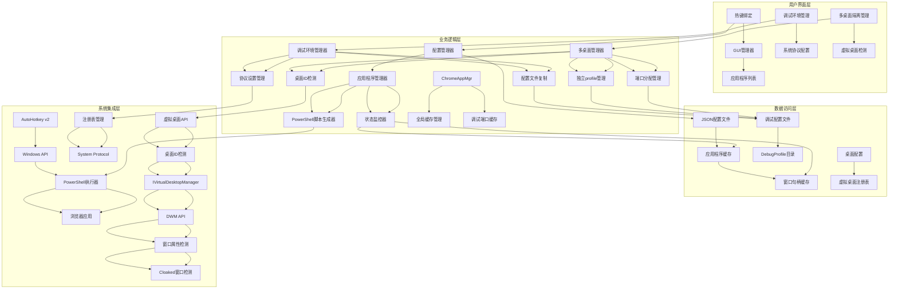
```mermaid
graph TB
subgraph "用户界面层"
A[热键绑定] --> B[GUI管理器]
B --> C[应用程序列表]
D[调试环境管理] --> E[系统协议配置]
F[多桌面隔离管理] --> G[虚拟桌面检测]
end
subgraph "业务逻辑层"
H[配置管理器] --> I[应用程序管理器]
I --> J[PowerShell脚本生成器]
I --> K[状态监控器]
L[调试环境管理器] --> M[配置文件复制]
L --> N[协议设置管理]
O[多桌面管理器] --> P[桌面ID检测]
O --> Q[独立profile管理]
O --> R[端口分配管理]
S[ChromeAppMgr] --> T[全局缓存管理]
S --> U[调试端口缓存]
end
subgraph "数据访问层"
V[JSON配置文件] --> W[应用程序缓存]
W --> X[窗口句柄缓存]
Y[调试配置文件] --> Z[DebugProfile目录]
AA[桌面配置] --> BB[虚拟桌面注册表]
end
subgraph "系统集成层"
CC[AutoHotkey v2] --> DD[Windows API]
DD --> EE[PowerShell执行器]
EE --> FF[浏览器应用]
GG[注册表管理] --> HH[System Protocol]
II[虚拟桌面API] --> JJ[桌面ID检测]
JJ --> KK[IVirtualDesktopManager]
KK --> LL[DWM API]
LL --> MM[窗口属性检测]
MM --> NN[Cloaked窗口检测]
end
A --> H
D --> L
F --> O
H --> V
I --> J
I --> K
K --> W
K --> X
L --> M
L --> N
O --> P
O --> Q
O --> R
M --> Y
N --> GG
P --> II
Q --> Y
R --> Y
J --> EE
EE --> FF
GG --> HH
II --> JJ
JJ --> KK
KK --> LL
LL --> MM
MM --> NN
```

**图表来源**
- [hotkey.ahk:1950-1951](file://hotkey.ahk#L1950-L1951)
- [hotkey.ahk:2146-2149](file://hotkey.ahk#L2146-L2149)
- [hotkey.ahk:2160-2206](file://hotkey.ahk#L2160-L2206)
- [copy_chrome_profile.ps1:33-53](file://copy_chrome_profile.ps1#L33-L53)
- [copy_chrome_profile_to_desktops.ps1:1-293](file://copy_chrome_profile_to_desktops.ps1#L1-L293)
- [set_chrome_system_protocol.ps1:48-56](file://set_chrome_system_protocol.ps1#L48-L56)
- [lib/ChromeAppMgr.ahk:1-50](file://lib/ChromeAppMgr.ahk#L1-L50)

## 详细组件分析

### 配置文件格式详解

browser_apps.json定义了完整的应用程序配置结构：

| 字段 | 类型 | 必需 | 描述 |
|------|------|------|------|
| browsers | Object | 是 | 浏览器配置对象 |
| browsers.chrome | Object | 否 | Chrome浏览器配置 |
| browsers.chrome.path | String | 否 | Chrome可执行文件路径 |
| browsers.chrome.profile | String | 否 | Chrome用户配置文件 |
| browsers.edge | Object | 否 | Edge浏览器配置 |
| browsers.edge.path | String | 否 | Edge可执行文件路径 |
| browsers.edge.profile | String | 否 | Edge用户配置文件 |
| commonArgs | Array | 是 | 通用启动参数数组 |
| apps | Array | 是 | 应用程序定义数组 |

**章节来源**
- [browser_apps.json:1-48](file://browser_apps.json#L1-L48)

### 应用程序定义规范

每个应用程序定义包含以下关键字段：

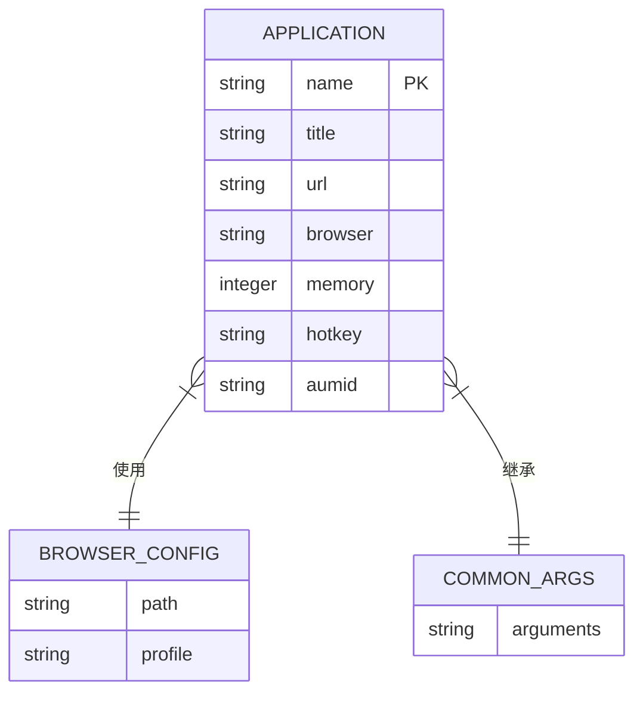
```mermaid
erDiagram
APPLICATION {
string name PK
string title
string url
string browser
integer memory
string hotkey
string aumid
}
BROWSER_CONFIG {
string path
string profile
}
COMMON_ARGS {
string arguments
}
APPLICATION }|--|| BROWSER_CONFIG : "使用"
APPLICATION }|--|| COMMON_ARGS : "继承"
```

**图表来源**
- [browser_apps.json:25-46](file://browser_apps.json#L25-L46)

### PowerShell脚本生成机制

系统自动生成PowerShell脚本来创建浏览器快捷方式：

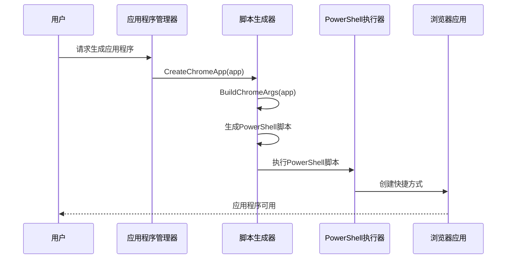
```mermaid
sequenceDiagram
participant User as 用户
participant Manager as 应用程序管理器
participant Generator as 脚本生成器
participant PowerShell as PowerShell执行器
participant Browser as 浏览器应用
User->>Manager : 请求生成应用程序
Manager->>Generator : CreateChromeApp(app)
Generator->>Generator : BuildChromeArgs(app)
Generator->>Generator : 生成PowerShell脚本
Generator->>PowerShell : 执行PowerShell脚本
PowerShell->>Browser : 创建快捷方式
Browser-->>User : 应用程序可用
```

**图表来源**
- [hotkey.ahk:2074-2111](file://hotkey.ahk#L2074-L2111)
- [hotkey.ahk:2058-2072](file://hotkey.ahk#L2058-L2072)

**章节来源**
- [hotkey.ahk:2074-2111](file://hotkey.ahk#L2074-L2111)
- [hotkey.ahk:2058-2072](file://hotkey.ahk#L2058-L2072)

### 状态监控和缓存机制

系统实现了智能的状态监控和缓存机制来优化应用程序激活：

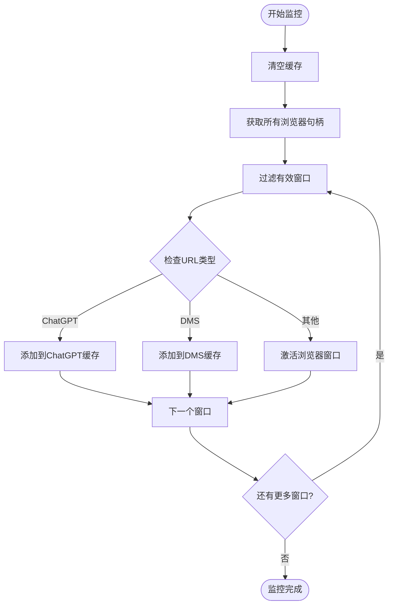
```mermaid
flowchart TD
Start([开始监控]) --> ClearCache["清空缓存"]
ClearCache --> GetHandles["获取所有浏览器句柄"]
GetHandles --> FilterWindows["过滤有效窗口"]
FilterWindows --> CheckURL{"检查URL类型"}
CheckURL --> |ChatGPT| AddChatGPT["添加到ChatGPT缓存"]
CheckURL --> |DMS| AddDMS["添加到DMS缓存"]
CheckURL --> |其他| ActivateBrowser["激活浏览器窗口"]
AddChatGPT --> NextWindow["下一个窗口"]
AddDMS --> NextWindow
ActivateBrowser --> NextWindow
NextWindow --> MoreWindows{"还有更多窗口?"}
MoreWindows --> |是| FilterWindows
MoreWindows --> |否| End([监控完成])
```

**图表来源**
- [hotkey.ahk:2160-2206](file://hotkey.ahk#L2160-L2206)

**章节来源**
- [hotkey.ahk:2160-2206](file://hotkey.ahk#L2160-L2206)

### UIA自动化框架集成

系统集成了UIA（用户界面自动化）框架来增强浏览器控制能力：

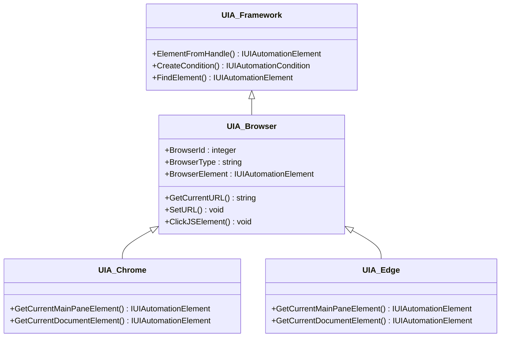
```mermaid
classDiagram
class UIA_Framework {
+ElementFromHandle() IUIAutomationElement
+CreateCondition() IUIAutomationCondition
+FindElement() IUIAutomationElement
}
class UIA_Browser {
+BrowserId : integer
+BrowserType : string
+BrowserElement : IUIAutomationElement
+GetCurrentURL() string
+SetURL() void
+ClickJSElement() void
}
class UIA_Chrome {
+GetCurrentMainPaneElement() IUIAutomationElement
+GetCurrentDocumentElement() IUIAutomationElement
}
class UIA_Edge {
+GetCurrentMainPaneElement() IUIAutomationElement
+GetCurrentDocumentElement() IUIAutomationElement
}
UIA_Framework <|-- UIA_Browser
UIA_Browser <|-- UIA_Chrome
UIA_Browser <|-- UIA_Edge
```

**图表来源**
- [lib/UIA.ahk:51-138](file://lib/UIA.ahk#L51-L138)
- [lib/UIA_Browser.ahk:458-488](file://lib/UIA_Browser.ahk#L458-L488)

**章节来源**
- [lib/UIA.ahk:51-138](file://lib/UIA.ahk#L51-L138)
- [lib/UIA_Browser.ahk:458-488](file://lib/UIA_Browser.ahk#L458-L488)

### 增强的应用程序激活流程

**更新** 最新版本增强了应用程序激活流程，增加了窗口存在性检查和缓存重建机制：

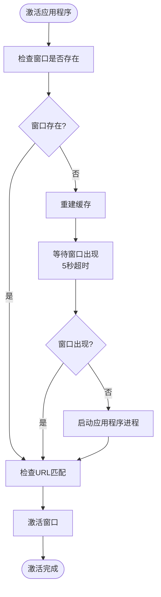
```mermaid
flowchart TD
Start([激活应用程序]) --> CheckWindow["检查窗口是否存在"]
CheckWindow --> Exists{"窗口存在?"}
Exists --> |是| CheckURL["检查URL匹配"]
Exists --> |否| RebuildCache["重建缓存"]
RebuildCache --> WaitWindow["等待窗口出现<br/>5秒超时"]
WaitWindow --> WindowAppeared{"窗口出现?"}
WindowAppeared --> |是| CheckURL
WindowAppeared --> |否| StartProcess["启动应用程序进程"]
StartProcess --> CheckURL
CheckURL --> ActivateWindow["激活窗口"]
ActivateWindow --> End([激活完成])
```

**图表来源**
- [hotkey.ahk:2341-2380](file://hotkey.ahk#L2341-L2380)

#### 窗口存在性检查机制

激活流程现在包含智能的窗口存在性检查：
- **实时窗口检测**：检查目标应用程序窗口是否仍然存在
- **缓存状态验证**：验证应用程序缓存的有效性
- **自动重建机制**：对于已关闭的窗口自动重建缓存

#### 5秒超时等待机制

**新增** 应用程序启动程序现在包含5秒超时等待窗口出现：
- **超时控制**：最多等待5秒让应用程序窗口出现
- **轮询机制**：定期检查窗口状态避免无限等待
- **错误处理**：超时后执行适当的错误处理逻辑

#### 缓存重建策略

**新增** 对于已关闭窗口的重新激活：
- **缓存清理**：清除失效的窗口句柄缓存
- **重新扫描**：重新扫描系统中的浏览器窗口
- **状态同步**：同步应用程序的实际运行状态

**章节来源**
- [hotkey.ahk:2341-2380](file://hotkey.ahk#L2341-L2380)

## Chrome调试环境系统

**新增** Chrome调试环境系统是项目的重要扩展，提供了完整的调试配置管理和系统级协议设置功能。

### 调试配置文件管理系统

系统提供了专门的PowerShell脚本来管理Chrome调试配置文件：

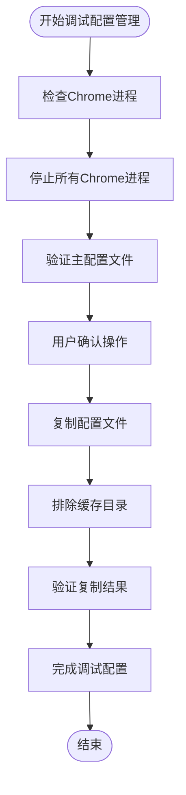
```mermaid
flowchart TD
Start([开始调试配置管理]) --> CheckChrome["检查Chrome进程"]
CheckChrome --> StopChrome["停止所有Chrome进程"]
StopChrome --> CheckProfile["验证主配置文件"]
CheckProfile --> Confirm["用户确认操作"]
Confirm --> CopyProfile["复制配置文件"]
CopyProfile --> ExcludeCache["排除缓存目录"]
ExcludeCache --> VerifyCopy["验证复制结果"]
VerifyCopy --> Complete["完成调试配置"]
Complete --> End([结束])
```

**图表来源**
- [copy_chrome_profile.ps1:114-167](file://copy_chrome_profile.ps1#L114-L167)

#### 配置文件复制脚本功能

copy_chrome_profile.ps1提供了以下核心功能：
- **配置文件复制**：将主配置文件复制到DebugProfile目录
- **缓存排除**：自动排除缓存、崩溃报告等临时目录
- **进程管理**：自动停止Chrome进程以避免文件占用
- **统计报告**：提供详细的复制统计和错误报告

#### 系统级Chrome协议管理

set_chrome_system_protocol.ps1负责管理Windows系统级的Chrome协议设置：

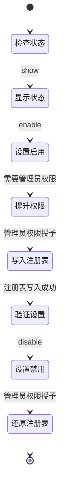
```mermaid
stateDiagram-v2
[*] --> 检查状态
检查状态 --> 显示状态 : show
显示状态 --> 设置启用 : enable
设置启用 --> 提升权限 : 需要管理员权限
提升权限 --> 写入注册表 : 管理员权限授予
写入注册表 --> 验证设置 : 注册表写入成功
验证设置 --> 设置禁用 : disable
设置禁用 --> 还原注册表 : 管理员权限授予
还原注册表 --> [*]
```

**图表来源**
- [set_chrome_system_protocol.ps1:162-210](file://set_chrome_system_protocol.ps1#L162-L210)

### 调试环境管理器

**更新** OpenControllerFromNetwork.ahk已从简单的启动器转变为复杂的调试环境管理器，现在支持多桌面虚拟桌面隔离：

#### 核心功能特性

1. **智能调试端口检测**：自动检测Chrome调试端口9223的可用性
2. **快捷方式修复**：批量修复Chrome快捷方式的调试参数
3. **调试配置管理**：自动创建和管理DebugProfile配置目录
4. **远程调试支持**：通过CDP协议远程控制调试中的Chrome实例
5. ****新增** 多桌面虚拟桌面隔离**：支持按虚拟桌面隔离的调试环境
6. ****新增** 桌面ID检测**：通过IVirtualDesktopManager检测当前桌面ID
7. ****新增** 独立profile目录**：每个桌面使用独立的profile目录
8. ****新增** 端口管理**：桌面1:9223，桌面2:9224，依此类推

#### 热键功能扩展

调试环境管理器提供了丰富的热键组合：

| 热键组合 | 功能描述 | 使用场景 |
|----------|----------|----------|
| PrtSc/RCtrl | 启动带调试端口的Chrome | 快速启动调试环境 |
| Alt+Q | 通过CDP打开调试标签页 | 远程控制调试实例 |
| Win+Alt+9 | 验证快捷方式调试参数 | 快捷方式故障排查 |
| F10 | 复制并搜索剪贴板URL | 开发调试辅助 |

**章节来源**
- [copy_chrome_profile.ps1:1-194](file://copy_chrome_profile.ps1#L1-L194)
- [set_chrome_system_protocol.ps1:1-220](file://set_chrome_system_protocol.ps1#L1-L220)
- [OpenControllerFromNetwork.ahk:1-1367](file://OpenControllerFromNetwork.ahk#L1-L1367)

## PowerShell脚本生成与管理

**新增** 项目现在包含专门的PowerShell脚本生成和管理系统，支持调试环境的自动化配置。

### 调试专用脚本生成

系统自动生成专门的调试环境PowerShell脚本：

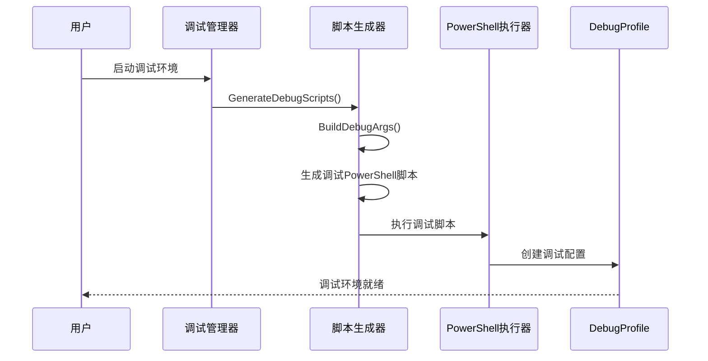
```mermaid
sequenceDiagram
participant User as 用户
participant DebugManager as 调试管理器
participant ScriptGenerator as 脚本生成器
participant PSExecutor as PowerShell执行器
participant DebugProfile as DebugProfile
User->>DebugManager : 启动调试环境
DebugManager->>ScriptGenerator : GenerateDebugScripts()
ScriptGenerator->>ScriptGenerator : BuildDebugArgs()
ScriptGenerator->>ScriptGenerator : 生成调试PowerShell脚本
ScriptGenerator->>PSExecutor : 执行调试脚本
PSExecutor->>DebugProfile : 创建调试配置
DebugProfile-->>User : 调试环境就绪
```

**图表来源**
- [OpenControllerFromNetwork.ahk:228-295](file://OpenControllerFromNetwork.ahk#L228-L295)

### 脚本管理策略

系统采用以下脚本管理策略：

1. **配置驱动的脚本生成**：根据browser_apps.json配置自动生成PowerShell脚本
2. **调试环境隔离**：使用独立的DebugProfile目录避免与主配置冲突
3. **自动权限管理**：根据需要自动提升PowerShell执行权限
4. **错误恢复机制**：提供脚本执行失败的自动恢复和重试机制

**章节来源**
- [OpenControllerFromNetwork.ahk:228-295](file://OpenControllerFromNetwork.ahk#L228-L295)

## 多桌面虚拟桌面隔离系统

**新增** 项目现在包含完整的多桌面虚拟桌面隔离系统，支持按虚拟桌面隔离的Chrome调试环境。

### 桌面ID检测机制

系统通过IVirtualDesktopManager COM接口检测当前虚拟桌面ID：

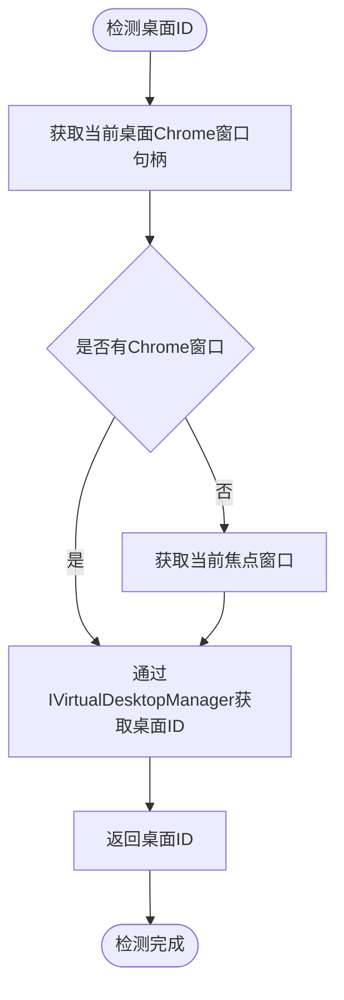
```mermaid
flowchart TD
Start([检测桌面ID]) --> GetChromeHwnd["获取当前桌面Chrome窗口句柄"]
GetChromeHwnd --> HasChrome{"是否有Chrome窗口"}
HasChrome --> |是| GetWindowDesktopId["通过IVirtualDesktopManager获取桌面ID"]
HasChrome --> |否| GetFocusWindow["获取当前焦点窗口"]
GetFocusWindow --> GetWindowDesktopId
GetWindowDesktopId --> ReturnId["返回桌面ID"]
ReturnId --> End([检测完成])
```

**图表来源**
- [OpenControllerFromNetwork.ahk:149-186](file://OpenControllerFromNetwork.ahk#L149-L186)

#### IVirtualDesktopManager集成

系统使用以下COM接口进行桌面检测：
- **接口ID**: `{AA509086-5CA9-4C25-8F95-589D3C07B48A}`
- **方法ID**: `GetWindowDesktopId(hwnd, &desktopId)`
- **返回值**: GUID字符串表示的桌面ID
- **错误处理**: 自动回退到焦点窗口检测

#### 桌面索引映射

系统通过注册表查询桌面GUID对应的序号：
- **注册表路径**: `HKCU\Software\Microsoft\Windows\CurrentVersion\Explorer\VirtualDesktops\Desktops\{id}`
- **索引值**: DWORD类型的Index值 + 1
- **回退机制**: 识别失败时使用desktop1:9223

### 独立profile目录管理

**新增** 每个虚拟桌面使用独立的profile目录：

| 桌面编号 | Profile目录 | 调试端口 |
|----------|-------------|----------|
| 桌面1 | E:\chrome_profiles\desktop1 | 9223 |
| 桌面2 | E:\chrome_profiles\desktop2 | 9224 |
| 桌面N | E:\chrome_profiles\desktopN | 9222+N |

#### profile目录结构

每个桌面的profile目录包含：
- **用户数据**: 用户配置、书签、扩展
- **缓存排除**: 自动排除缓存、崩溃报告等临时目录
- **独立配置**: 避免跨桌面的数据干扰

#### 端口分配策略

系统采用线性端口分配：
- **基础端口**: 9222
- **桌面N端口**: 9222 + N
- **IPv4强制**: 使用127.0.0.1而非localhost避免IPv6解析问题

### 多桌面调试环境管理

**新增** 系统提供完整的多桌面调试环境管理：

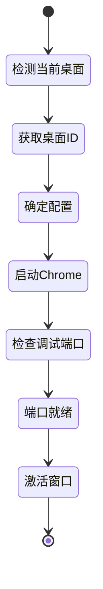
```mermaid
stateDiagram-v2
[*] --> 检测当前桌面
检测当前桌面 --> 获取桌面ID
获取桌面ID --> 确定配置
确定配置 --> 启动Chrome
启动Chrome --> 检查调试端口
检查调试端口 --> 端口就绪
端口就绪 --> 激活窗口
激活窗口 --> [*]
```

**图表来源**
- [OpenControllerFromNetwork.ahk:250-335](file://OpenControllerFromNetwork.ahk#L250-L335)

#### 桌面隔离启动流程

1. **桌面检测**: 通过IVirtualDesktopManager获取当前桌面ID
2. **配置生成**: 根据桌面ID生成独立的profile目录和端口
3. **进程管理**: 只关闭当前桌面的Chrome进程，避免影响其他桌面
4. **启动验证**: 等待调试端口就绪，最多8秒
5. **窗口激活**: 激活或最小化当前桌面的Chrome窗口

#### 多桌面profile复制工具

**新增** copy_chrome_profile_to_desktops.ps1脚本支持：
- **批量复制**: 支持一次性复制到多个桌面目录
- **参数支持**: 支持多种参数格式（-Desktops 1,2,3,4）
- **交互式询问**: 支持交互式选择目标桌面
- **进度报告**: 提供详细的复制进度和统计信息

**章节来源**
- [OpenControllerFromNetwork.ahk:149-219](file://OpenControllerFromNetwork.ahk#L149-L219)
- [OpenControllerFromNetwork.ahk:250-335](file://OpenControllerFromNetwork.ahk#L250-L335)
- [copy_chrome_profile_to_desktops.ps1:1-293](file://copy_chrome_profile_to_desktops.ps1#L1-L293)

## 全局缓存系统

**新增** 全局缓存系统是本次更新的核心改进，显著提升了系统的性能和稳定性。

### ChromeAppMgr模块架构

ChromeAppMgr.ahk作为专门的缓存管理模块，实现了以下核心功能：

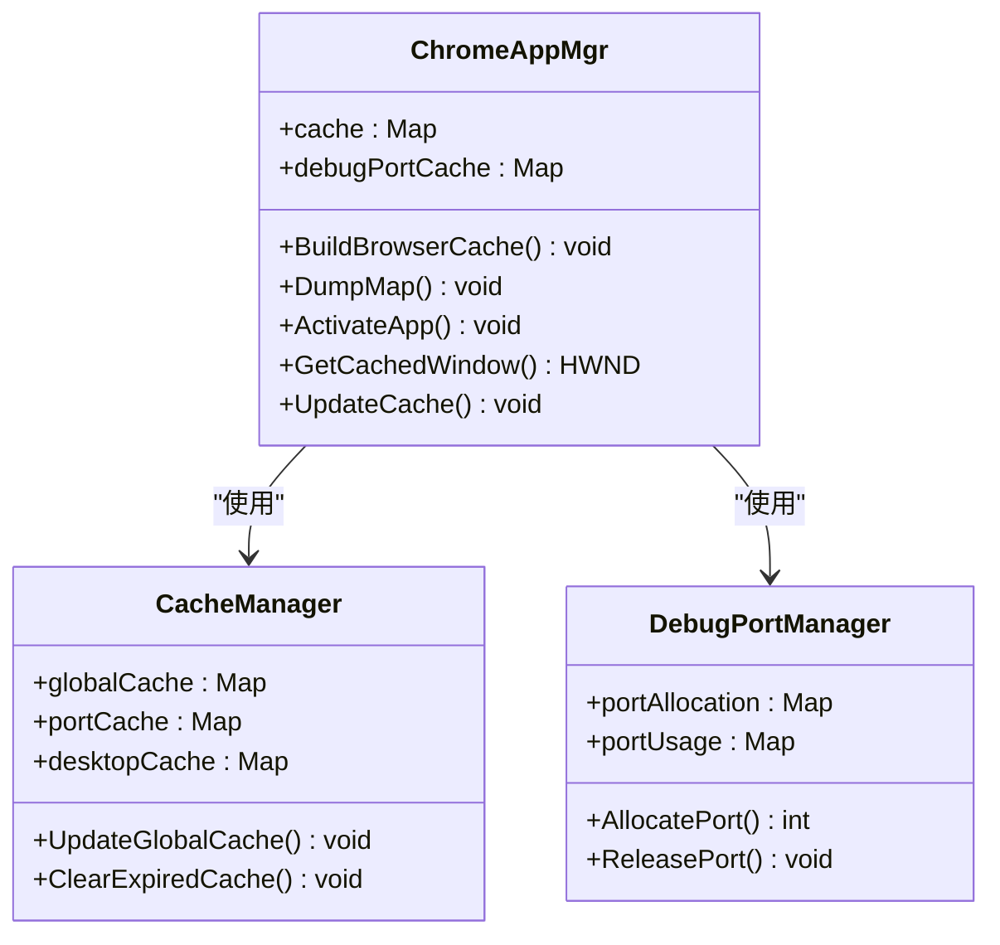
```mermaid
classDiagram
class ChromeAppMgr {
+cache : Map
+debugPortCache : Map
+BuildBrowserCache() void
+DumpMap() void
+ActivateApp() void
+GetCachedWindow() HWND
+UpdateCache() void
}
class CacheManager {
+globalCache : Map
+portCache : Map
+desktopCache : Map
+UpdateGlobalCache() void
+ClearExpiredCache() void
}
class DebugPortManager {
+portAllocation : Map
+portUsage : Map
+AllocatePort() int
+ReleasePort() void
}
ChromeAppMgr --> CacheManager : "使用"
ChromeAppMgr --> DebugPortManager : "使用"
```

**图表来源**
- [lib/ChromeAppMgr.ahk:1-50](file://lib/ChromeAppMgr.ahk#L1-L50)

### 缓存架构设计

系统采用了多层次的缓存架构：

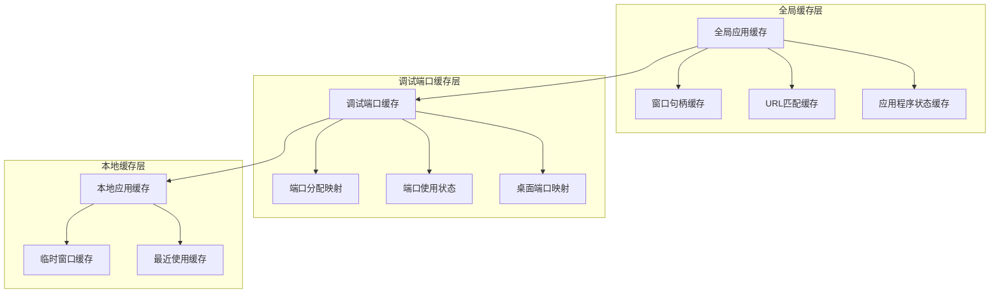
```mermaid
graph TB
subgraph "全局缓存层"
A[全局应用缓存] --> B[窗口句柄缓存]
A --> C[URL匹配缓存]
A --> D[应用程序状态缓存]
end
subgraph "调试端口缓存层"
E[调试端口缓存] --> F[端口分配映射]
E --> G[端口使用状态]
E --> H[桌面端口映射]
end
subgraph "本地缓存层"
I[本地应用缓存] --> J[临时窗口缓存]
I --> K[最近使用缓存]
end
A --> E
E --> I
```

**图表来源**
- [lib/ChromeAppMgr.ahk:1-50](file://lib/ChromeAppMgr.ahk#L1-L50)

### 缓存管理策略

#### 全局缓存管理

- **集中化管理**：所有缓存操作集中在ChromeAppMgr模块中
- **自动清理**：定期清理过期和无效的缓存条目
- **状态同步**：确保缓存与实际应用程序状态保持一致
- **性能优化**：减少重复的系统调用和文件操作

#### 调试端口缓存机制

- **动态端口分配**：根据桌面数量动态分配调试端口
- **端口使用跟踪**：监控每个端口的使用状态和占用情况
- **冲突预防**：避免端口分配冲突和重复使用
- **自动回收**：当桌面切换时自动回收不再使用的端口

#### 窗口管理性能优化

- **hwndCache迁移**：将窗口句柄缓存从主脚本迁移到专用模块
- **延迟加载**：只在需要时才建立和维护缓存
- **智能重建**：当检测到缓存失效时自动重建
- **并发安全**：确保多线程环境下缓存操作的安全性

**章节来源**
- [lib/ChromeAppMgr.ahk:1-50](file://lib/ChromeAppMgr.ahk#L1-L50)
- [hotkey.ahk:369](file://hotkey.ahk#L369)

## 依赖关系分析

系统依赖关系呈现清晰的层次结构：

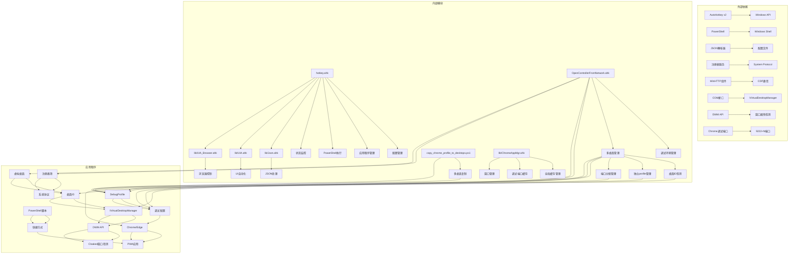
```mermaid
graph TB
subgraph "外部依赖"
A[AutoHotkey v2] --> B[Windows API]
C[PowerShell] --> D[Windows Shell]
E[JSON解析器] --> F[配置文件]
G[注册表服务] --> H[System Protocol]
I[WinHTTP组件] --> J[CDP通信]
K[COM接口] --> L[IVirtualDesktopManager]
M[DWM API] --> N[窗口属性检测]
O[Chrome调试端口] --> P[9222+N端口]
end
subgraph "内部模块"
Q[hotkey.ahk] --> R[配置管理]
Q --> S[应用程序管理]
Q --> T[PowerShell执行]
Q --> U[状态监控]
V[lib/Jxon.ahk] --> W[JSON处理]
X[lib/UIA.ahk] --> Y[UI自动化]
Z[lib/UIA_Browser.ahk] --> AA[浏览器控制]
BB[OpenControllerFromNetwork.ahk] --> CC[调试环境管理]
BB --> DD[多桌面管理]
DD --> EE[桌面ID检测]
DD --> FF[独立profile管理]
DD --> GG[端口分配管理]
HH[copy_chrome_profile_to_desktops.ps1] --> II[多桌面复制]
JJ[lib/ChromeAppMgr.ahk] --> KK[全局缓存管理]
JJ --> LL[调试端口缓存]
JJ --> MM[窗口管理]
end
subgraph "应用程序"
NN[Chrome/Edge] --> OO[PWA应用]
PP[PowerShell脚本] --> QQ[快捷方式]
RR[DebugProfile] --> SS[调试配置]
TT[注册表项] --> UU[系统协议]
VV[虚拟桌面] --> WW[桌面ID]
WW --> XX[IVirtualDesktopManager]
XX --> YY[DWM API]
YY --> ZZ[Cloaked窗口检测]
end
Q --> V
Q --> X
Q --> Z
BB --> NN
BB --> RR
BB --> TT
BB --> VV
DD --> WW
DD --> RR
DD --> SS
EE --> XX
FF --> RR
GG --> SS
HH --> RR
II --> RR
NN --> OO
PP --> QQ
QQ --> OO
RR --> SS
SS --> NN
TT --> UU
VV --> WW
WW --> XX
XX --> YY
YY --> ZZ
```

**图表来源**
- [hotkey.ahk:3-6](file://hotkey.ahk#L3-L6)
- [lib/Jxon.ahk:1-301](file://lib/Jxon.ahk#L1-L301)
- [lib/UIA.ahk:1-800](file://lib/UIA.ahk#L1-L800)
- [OpenControllerFromNetwork.ahk:112-122](file://OpenControllerFromNetwork.ahk#L112-L122)
- [OpenControllerFromNetwork.ahk:170-186](file://OpenControllerFromNetwork.ahk#L170-L186)
- [lib/ChromeAppMgr.ahk:1-50](file://lib/ChromeAppMgr.ahk#L1-L50)

**章节来源**
- [hotkey.ahk:3-6](file://hotkey.ahk#L3-L6)
- [lib/Jxon.ahk:1-301](file://lib/Jxon.ahk#L1-L301)
- [lib/UIA.ahk:1-800](file://lib/UIA.ahk#L1-L800)
- [OpenControllerFromNetwork.ahk:112-122](file://OpenControllerFromNetwork.ahk#L112-L122)
- [OpenControllerFromNetwork.ahk:170-186](file://OpenControllerFromNetwork.ahk#L170-L186)
- [lib/ChromeAppMgr.ahk:1-50](file://lib/ChromeAppMgr.ahk#L1-L50)

## 性能考虑

系统在设计时充分考虑了性能优化：

### 缓存策略
- **窗口句柄缓存**：避免重复扫描和查找浏览器窗口
- **URL匹配缓存**：快速定位特定应用窗口
- **配置文件缓存**：减少频繁的文件读取操作
- **调试配置缓存**：避免重复的配置文件复制操作
- ****新增** 全局缓存系统**：集中管理所有缓存，提升访问效率
- ****新增** 调试端口缓存**：动态端口分配和使用跟踪
- ****新增** 桌面ID缓存**：缓存桌面ID检测结果避免重复查询
- ****新增** 激活状态缓存**：缓存应用程序的激活状态以避免重复检查

### 异步处理
- **PowerShell脚本异步执行**：避免阻塞主脚本
- **UIA操作超时控制**：防止长时间等待
- **条件检查优化**：优先使用高效的方法
- **调试端口轮询优化**：减少不必要的网络请求
- ****新增** 多桌面并发处理**：支持多个桌面的并行检测和启动
- ****新增** 超时机制优化**：5秒超时控制避免无限等待
- ****新增** 缓存预加载**：提前加载常用缓存减少响应时间

### 内存管理
- **资源及时释放**：COM对象使用后立即释放
- **缓存容量控制**：避免内存泄漏
- **垃圾回收优化**：合理管理对象生命周期
- **调试配置文件清理**：定期清理无效的调试配置
- ****新增** 缓存清理策略**：智能清理过期缓存避免内存占用
- ****新增** 端口缓存管理**：动态管理调试端口分配和回收
- ****新增** 桌面配置清理**：定期清理无效的桌面配置

### 性能监控
- **缓存命中率统计**：监控缓存使用效率
- **内存使用监控**：跟踪内存占用情况
- **执行时间统计**：记录关键操作的执行时间
- **错误率监控**：统计操作失败率
- ****新增** 缓存性能指标**：监控全局缓存的性能表现
- ****新增** 端口使用统计**：跟踪调试端口的使用情况
- ****新增** 并发性能监控**：监控多桌面环境下的性能表现

## 故障排除指南

### 常见问题及解决方案

| 问题类型 | 症状 | 可能原因 | 解决方案 |
|----------|------|----------|----------|
| 应用程序无法启动 | PowerShell执行失败 | 权限不足或路径错误 | 检查管理员权限和路径配置 |
| 热键无响应 | 热键绑定失败 | 配置文件格式错误 | 验证JSON格式和语法 |
| 窗口激活失败 | 应用程序无法聚焦 | URL匹配失败 | 检查URL配置和缓存状态 |
| PowerShell脚本生成失败 | .ps1文件创建失败 | 文件权限或磁盘空间不足 | 检查文件权限和磁盘空间 |
| **新增** 缓存系统异常 | 缓存失效或访问失败 | 缓存模块初始化失败 | 重启缓存管理器或检查模块加载 |
| **新增** 调试端口冲突 | 端口被占用或分配失败 | 端口缓存管理异常 | 清理端口缓存并重新分配 |
| **新增** 多桌面检测失败 | 桌面ID检测失败 | IVirtualDesktopManager不可用 | 检查Windows版本和虚拟桌面支持 |
| **新增** 全局缓存性能问题 | 缓存访问缓慢 | 缓存过多或内存不足 | 清理过期缓存或增加内存限制 |
| **新增** ChromeAppMgr模块错误 | 缓存管理功能失效 | 模块加载或初始化失败 | 重新加载模块或检查依赖关系 |

### 调试技巧

1. **启用调试模式**：使用`#Include`指令包含调试代码
2. **查看日志输出**：利用`TrayTip`显示状态信息
3. **验证配置**：使用`Jxon_Load`验证JSON配置有效性
4. **测试PowerShell**：单独执行生成的PowerShell脚本
5. **检查调试端口**：使用`curl http://127.0.0.1:9223/json/version`验证CDP连接
6. **验证系统协议**：使用`reg query HKLM\Software\Classes\ChromeHTML`检查协议设置
7. ****新增** 检查缓存状态**：监控全局缓存的命中率和性能指标
8. ****新增** 验证端口分配**：检查桌面ID到端口的映射关系
9. ****新增** 检查激活流程**：监控应用程序激活过程中的状态变化
10. ****新增** 验证超时机制**：确认5秒超时设置是否正常工作
11. ****新增** 调试缓存模块**：使用ChromeAppMgr的调试功能检查缓存状态
12. ****新增** 监控性能指标**：跟踪缓存性能和内存使用情况

**章节来源**
- [hotkey.ahk:2113-2126](file://hotkey.ahk#L2113-L2126)
- [hotkey.ahk:2018-2031](file://hotkey.ahk#L2018-L2031)
- [OpenControllerFromNetwork.ahk:112-122](file://OpenControllerFromNetwork.ahk#L112-L122)
- [lib/ChromeAppMgr.ahk:1-50](file://lib/ChromeAppMgr.ahk#L1-L50)

## 结论

hotkey项目的浏览器应用管理系统展现了优秀的软件工程实践，经过Chrome调试环境系统的重构、全局缓存系统的引入和应用程序激活流程的增强后，系统功能更加完善和专业。

### 技术优势
- **模块化设计**：清晰的分层架构便于维护和扩展
- **配置驱动**：通过JSON配置实现灵活的应用程序定义
- **自动化程度高**：PowerShell脚本自动生成减少了手动配置工作
- **状态监控**：智能缓存机制提升了用户体验
- ****新增** 全局缓存系统**：集中化的缓存管理显著提升了性能
- ****新增** 调试端口缓存机制**：动态端口分配和使用跟踪确保了调试稳定性
- ****新增** 优化的窗口管理**：hwndCache迁移到专用模块提高了系统响应速度
- ****新增** 多桌面虚拟桌面隔离**：支持按虚拟桌面隔离的调试环境
- ****新增** 桌面ID检测**：通过IVirtualDesktopManager实现精确的桌面识别
- ****新增** 独立profile管理**：每个桌面使用独立的配置目录避免数据干扰
- ****新增** 端口分配策略**：线性端口分配确保多桌面调试的稳定性
- ****新增** 增强的激活流程**：窗口存在性检查和缓存重建机制确保稳定激活
- ****新增** 超时控制机制**：5秒超时等待避免无限等待
- ****新增** 完整的调试环境管理**：支持调试配置文件复制和系统级协议设置
- ****新增** CDP远程调试支持**：提供强大的远程控制能力

### 应用价值
- **提高效率**：一键启动和快速激活浏览器应用
- **降低复杂度**：统一的配置管理简化了多应用场景
- **增强稳定性**：完善的错误处理和状态监控机制
- ****新增** 提升多桌面开发体验**：支持多桌面隔离的调试环境
- ****新增** 增强的调试能力**：专业的多桌面调试工具和隔离机制
- ****新增** 开发调试便利**：专业的调试环境管理工具
- ****新增** 系统级集成**：深度集成Windows系统协议和虚拟桌面功能
- ****新增** 性能优化**：全局缓存系统显著提升了系统响应速度

### 发展方向
- **扩展支持**：增加更多浏览器和应用类型的支持
- **性能优化**：进一步优化缓存策略和资源管理
- **用户界面**：提供更丰富的图形化管理界面
- **云端同步**：支持配置文件的云端备份和同步
- ****新增** 多桌面自动化**：支持多桌面的自动化配置和管理
- ****新增** 调试工具集成**：集成更多专业的调试工具和插件
- ****新增** 自动化测试支持**：支持基于调试环境的自动化测试
- ****新增** 跨平台支持**：考虑支持其他操作系统的虚拟桌面功能
- ****新增** 缓存性能监控**：提供更详细的缓存性能指标和监控工具

该系统为浏览器应用管理提供了一个完整、可靠且易于使用的解决方案，特别适合需要频繁进行Web应用开发和调试的用户群体。通过新增的Chrome调试环境管理系统、多桌面虚拟桌面隔离支持、增强的应用程序激活流程和全局缓存系统的引入，项目不仅满足了基本的应用程序管理需求，还提供了专业级的调试环境支持、稳定的激活机制、强大的多桌面隔离能力和卓越的性能表现，大大提升了开发和测试效率。特别是全局缓存系统和调试端口缓存机制的引入，为现代高性能应用管理提供了坚实的技术基础，使得开发者可以在复杂的多桌面环境中拥有稳定、高效的调试和管理工作流。