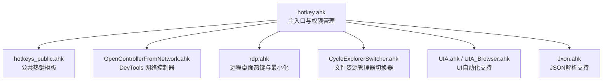
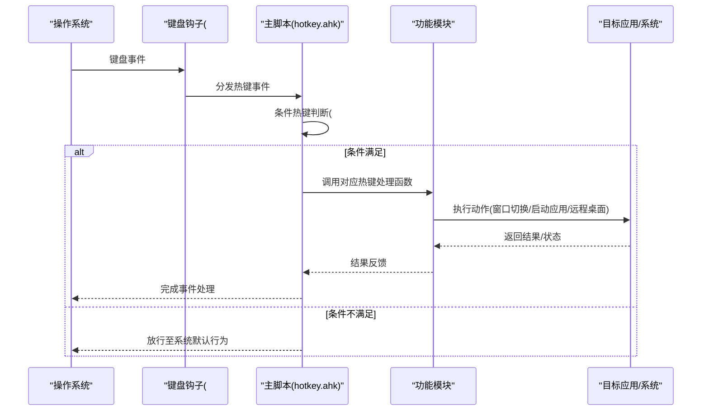
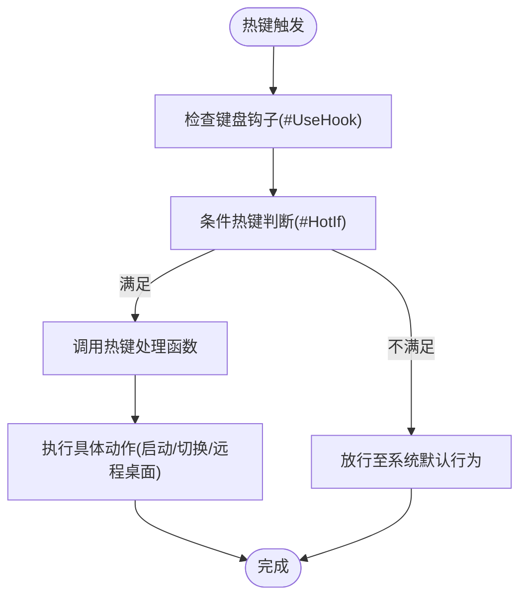
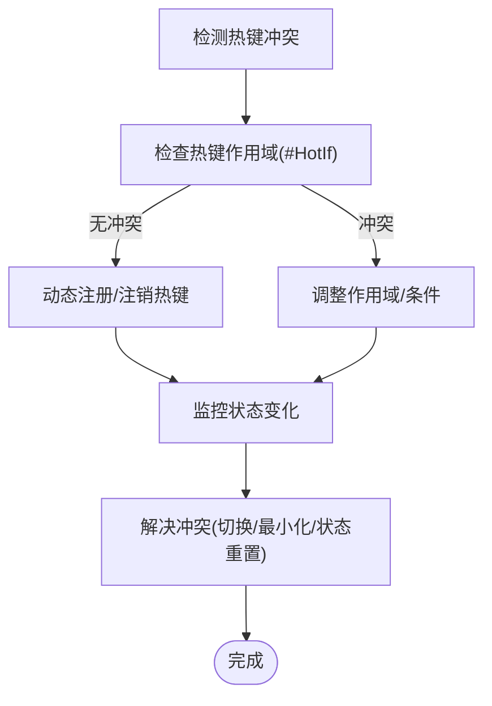
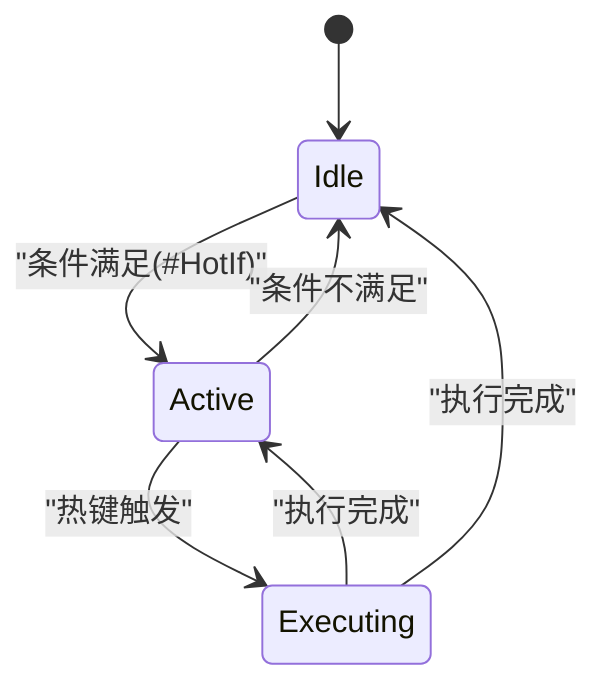
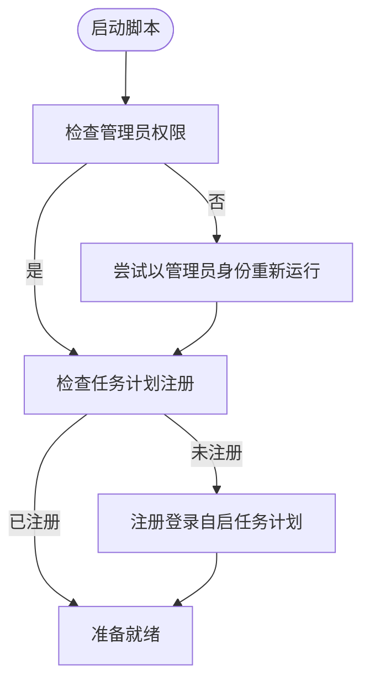
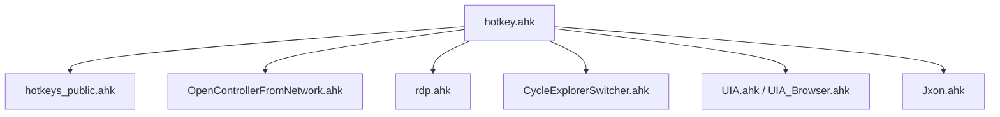

# 热键管理系统

<cite>
**本文档引用的文件**
- [hotkey.ahk](file://hotkey.ahk)
- [hotkeys_public.ahk](file://hotkeys_public.ahk)
- [rdp.ahk](file://rdp.ahk)
- [CycleExplorerSwitcher.ahk](file://CycleExplorerSwitcher.ahk)
- [OpenControllerFromNetwork.ahk](file://OpenControllerFromNetwork.ahk)
- [README.md](file://README.md)
</cite>

## 目录
1. [简介](#简介)
2. [项目结构](#项目结构)
3. [核心组件](#核心组件)
4. [架构总览](#架构总览)
5. [详细组件分析](#详细组件分析)
6. [依赖关系分析](#依赖关系分析)
7. [性能考量](#性能考量)
8. [故障排查指南](#故障排查指南)
9. [结论](#结论)
10. [附录](#附录)

## 简介
本项目基于 AutoHotkey v2 实现的热键管理系统，提供全局热键绑定、热键冲突检测与解决策略、热键状态管理以及管理员权限要求。系统通过模块化组织，将通用热键、RDP 热键、文件资源管理器切换器、网络控制器等功能拆分为独立模块，便于维护与扩展。同时，系统具备完善的权限自提升与任务计划注册能力，确保在登录时以管理员权限自动运行，满足系统级功能需求。

## 项目结构
项目采用模块化结构，主脚本负责权限校验、任务计划注册、全局热键加载与状态管理，各功能模块通过 #Include 引入，形成松耦合的热键体系。

图表来源
- [hotkey.ahk:14-21](file://hotkey.ahk#L14-L21)
- [hotkeys_public.ahk:1-57](file://hotkeys_public.ahk#L1-L57)
- [OpenControllerFromNetwork.ahk:28-30](file://OpenControllerFromNetwork.ahk#L28-L30)
- [rdp.ahk:16-16](file://rdp.ahk#L16-L16)
- [CycleExplorerSwitcher.ahk:4-9](file://CycleExplorerSwitcher.ahk#L4-L9)

章节来源
- [hotkey.ahk:14-21](file://hotkey.ahk#L14-L21)
- [README.md:1-2](file://README.md#L1-L2)

## 核心组件
- 权限自提升与任务注册：脚本启动时检测管理员权限，若无则尝试以管理员身份重新运行；首次运行时注册登录自启任务计划，确保下次开机以最高权限运行。
- 全局热键绑定：通过 #Include 加载各模块热键定义，支持 #F1-F12 系列、组合键（Win、Ctrl、Alt、Shift）以及动态热键绑定。
- 热键状态管理：通过 #HotIf 条件热键与全局状态变量控制热键生效范围，例如文件资源管理器切换器的激活状态。
- 热键冲突检测与解决：系统通过条件热键与热键作用域控制避免冲突；对于动态热键，采用集中注册与状态切换策略。
- 安全机制与权限提升：强制使用键盘钩子，确保热键响应稳定性；对系统级操作（任务计划注册）进行权限校验与错误提示。

章节来源
- [hotkey.ahk:24-52](file://hotkey.ahk#L24-L52)
- [hotkey.ahk:8-8](file://hotkey.ahk#L8-L8)
- [hotkey.ahk:18-19](file://hotkey.ahk#L18-L19)

## 架构总览
系统采用“主脚本 + 模块化热键”的架构，主脚本负责全局初始化与权限管理，模块化热键负责具体功能绑定。热键事件流从系统键盘钩子开始，经过条件判断与状态检查，最终调用相应功能函数。

图表来源
- [hotkey.ahk:8-8](file://hotkey.ahk#L8-L8)
- [hotkey.ahk:36-52](file://hotkey.ahk#L36-L52)
- [CycleExplorerSwitcher.ahk:36-38](file://CycleExplorerSwitcher.ahk#L36-L38)

## 详细组件分析

### 全局热键绑定机制
- 热键定义语法
  - #F1-#F12：全局功能键热键，用于快速启动应用或执行系统操作。
  - 组合键：#（Win）、^（Ctrl）、!（Alt）、+（Shift）组合，支持复杂热键定义。
  - 动态热键：通过 Hotkey 函数在运行时注册，适用于根据配置动态绑定的应用热键。
- 热键事件处理流程
  - 系统键盘钩子捕获按键事件。
  - 主脚本进行条件判断（#HotIf）与状态检查。
  - 调用对应处理函数（如窗口切换、应用启动、远程桌面操作）。
  - 执行完成后返回系统或继续等待下一个事件。

图表来源
- [hotkey.ahk:8-8](file://hotkey.ahk#L8-L8)
- [hotkey.ahk:888-911](file://hotkey.ahk#L888-L911)
- [CycleExplorerSwitcher.ahk:36-38](file://CycleExplorerSwitcher.ahk#L36-L38)

章节来源
- [hotkey.ahk:589-750](file://hotkey.ahk#L589-L750)
- [hotkey.ahk:1580-1929](file://hotkey.ahk#L1580-L1929)
- [hotkey.ahk:2147-2149](file://hotkey.ahk#L2147-L2149)

### 热键冲突检测与解决策略
- 条件热键（#HotIf）：通过设置热键生效条件，避免在特定场景下触发不期望的热键。例如文件资源管理器切换器仅在激活状态下生效。
- 作用域控制：将热键绑定在特定上下文中，减少与其他模块的冲突。
- 动态热键注册：集中注册与注销，避免重复绑定与状态混乱。
- 状态变量管理：通过全局状态变量跟踪热键当前状态，确保切换与最小化等操作的正确性。

图表来源
- [CycleExplorerSwitcher.ahk:36-38](file://CycleExplorerSwitcher.ahk#L36-L38)
- [hotkey.ahk:2147-2149](file://hotkey.ahk#L2147-L2149)

章节来源
- [CycleExplorerSwitcher.ahk:36-38](file://CycleExplorerSwitcher.ahk#L36-L38)
- [hotkey.ahk:2147-2149](file://hotkey.ahk#L2147-L2149)

### 热键状态管理
- 条件热键状态：通过 #HotIf 控制热键生效范围，例如文件资源管理器切换器的激活状态。
- 窗口状态：热键处理函数会检查目标窗口是否存在、是否激活，从而决定最小化或激活操作。
- 动态热键状态：集中注册与注销，配合状态变量实现热键的启用/禁用切换。

图表来源
- [CycleExplorerSwitcher.ahk:36-38](file://CycleExplorerSwitcher.ahk#L36-L38)
- [hotkey.ahk:1266-1274](file://hotkey.ahk#L1266-L1274)

章节来源
- [CycleExplorerSwitcher.ahk:36-38](file://CycleExplorerSwitcher.ahk#L36-L38)
- [hotkey.ahk:1266-1274](file://hotkey.ahk#L1266-L1274)

### 管理员权限要求与安全机制
- 权限自提升：启动时检测是否为管理员，若非管理员则尝试以管理员身份重新运行。
- 任务计划注册：首次运行时注册登录自启任务计划，确保下次开机以最高权限运行。
- 安全提示：权限不足时弹窗提示，防止系统级操作失败。
- 键盘钩子：强制使用键盘钩子，确保热键响应稳定性与安全性。

图表来源
- [hotkey.ahk:24-52](file://hotkey.ahk#L24-L52)
- [hotkey.ahk:8-8](file://hotkey.ahk#L8-L8)

章节来源
- [hotkey.ahk:24-52](file://hotkey.ahk#L24-L52)
- [hotkey.ahk:8-8](file://hotkey.ahk#L8-L8)

### 热键定义语法与组合规则
- #F1-#F12：全局功能键热键，用于快速启动应用或执行系统操作。
- 组合键规则：#（Win）、^（Ctrl）、!（Alt）、+（Shift）组合，支持复杂热键定义。
- 盲注修饰键：在某些场景下使用 {Blind} 前缀保留之前的修饰键组合。
- 动态热键：通过 Hotkey 函数在运行时注册，适用于根据配置动态绑定的应用热键。

章节来源
- [hotkey.ahk:589-750](file://hotkey.ahk#L589-L750)
- [hotkey.ahk:1580-1929](file://hotkey.ahk#L1580-L1929)
- [hotkey.ahk:2147-2149](file://hotkey.ahk#L2147-L2149)

### 热键事件处理流程
- 键盘钩子捕获：系统键盘钩子捕获按键事件。
- 条件判断：主脚本进行条件判断（#HotIf）与状态检查。
- 动作执行：调用对应处理函数（如窗口切换、应用启动、远程桌面操作）。
- 结果反馈：执行完成后返回系统或继续等待下一个事件。

章节来源
- [hotkey.ahk:8-8](file://hotkey.ahk#L8-L8)
- [hotkey.ahk:888-911](file://hotkey.ahk#L888-L911)

### 具体热键配置示例与最佳实践
- 应用启动热键：#F2/#F3/#F4/#F5/#F6/#F9 等，通过 ToggleWindow 系列函数实现窗口切换与启动。
- 远程桌面热键：#\、#^\、#] 等，结合 RDPManager 实现快速连接与最小化。
- 文件资源管理器切换器：#e、#^e 等，通过条件热键与 GUI 实现多窗口切换。
- DevTools 网络控制器：^!g、^!u 等，通过 UIA 与剪贴板交互实现 URL 提取与路径解析。
- 最佳实践：
  - 使用 #HotIf 控制热键生效范围，避免冲突。
  - 对系统级操作进行权限校验与错误提示。
  - 使用动态热键注册与状态管理，确保热键的启用/禁用切换。
  - 对复杂热键（如组合键）进行测试与验证，确保兼容性。

章节来源
- [hotkey.ahk:589-750](file://hotkey.ahk#L589-L750)
- [rdp.ahk:165-187](file://rdp.ahk#L165-L187)
- [CycleExplorerSwitcher.ahk:26-28](file://CycleExplorerSwitcher.ahk#L26-L28)
- [OpenControllerFromNetwork.ahk:28-30](file://OpenControllerFromNetwork.ahk#L28-L30)

## 依赖关系分析
系统通过 #Include 引入多个模块，形成松耦合的热键体系。主脚本负责全局初始化与权限管理，各模块负责具体功能绑定。

图表来源
- [hotkey.ahk:14-21](file://hotkey.ahk#L14-L21)
- [hotkeys_public.ahk:1-57](file://hotkeys_public.ahk#L1-L57)
- [OpenControllerFromNetwork.ahk:28-30](file://OpenControllerFromNetwork.ahk#L28-L30)
- [rdp.ahk:16-16](file://rdp.ahk#L16-L16)
- [CycleExplorerSwitcher.ahk:4-9](file://CycleExplorerSwitcher.ahk#L4-L9)

章节来源
- [hotkey.ahk:14-21](file://hotkey.ahk#L14-L21)

## 性能考量
- 键盘钩子：强制使用键盘钩子，确保热键响应稳定性与低延迟。
- 条件热键：通过 #HotIf 控制热键生效范围，减少不必要的处理开销。
- 动态热键：集中注册与注销，避免重复绑定与状态混乱。
- UIA 与剪贴板：合理使用 UIA 与剪贴板交互，避免频繁阻塞与等待。

## 故障排查指南
- 权限不足：若提示权限受限，请以管理员身份运行脚本或检查任务计划注册。
- 热键冲突：检查 #HotIf 条件与热键作用域，确保热键在正确场景下生效。
- 系统级操作失败：检查系统任务计划注册状态与权限，必要时手动注册。
- 热键无响应：确认键盘钩子状态与热键定义，检查条件热键与状态变量。

章节来源
- [hotkey.ahk:24-52](file://hotkey.ahk#L24-L52)
- [hotkey.ahk:888-911](file://hotkey.ahk#L888-L911)

## 结论
本热键管理系统通过模块化设计与严格的权限管理，实现了稳定的全局热键绑定与灵活的状态控制。系统支持多种热键定义语法与组合规则，具备完善的冲突检测与解决策略，并通过条件热键与状态变量确保热键在正确场景下生效。管理员权限要求与任务计划注册保障了系统级功能的可用性与持久性。

## 附录
- 热键定义语法参考：#F1-#F12、#（Win）、^（Ctrl）、!（Alt）、+（Shift）组合、{Blind} 盲注修饰键。
- 功能模块参考：公共热键模板、DevTools 网络控制器、远程桌面热键、文件资源管理器切换器。
- 最佳实践：使用 #HotIf 控制热键生效范围、对系统级操作进行权限校验、使用动态热键注册与状态管理。