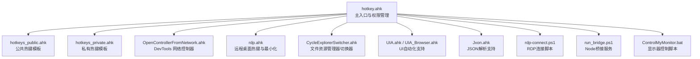
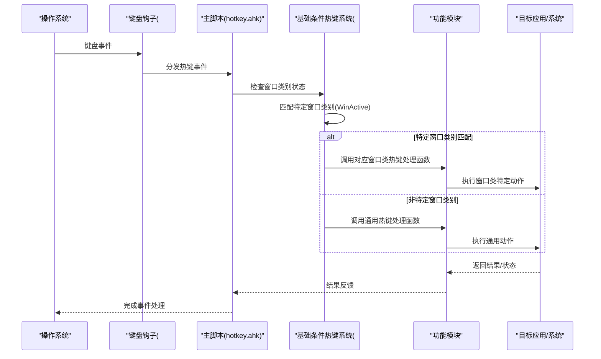
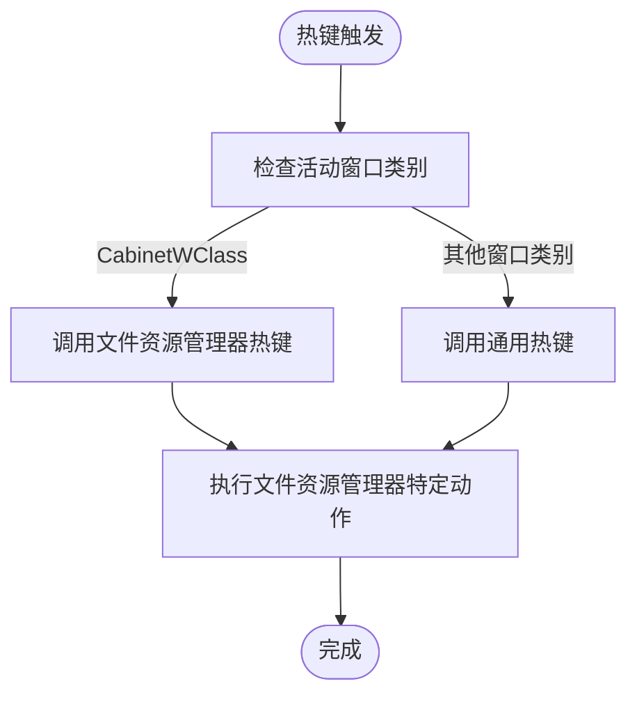
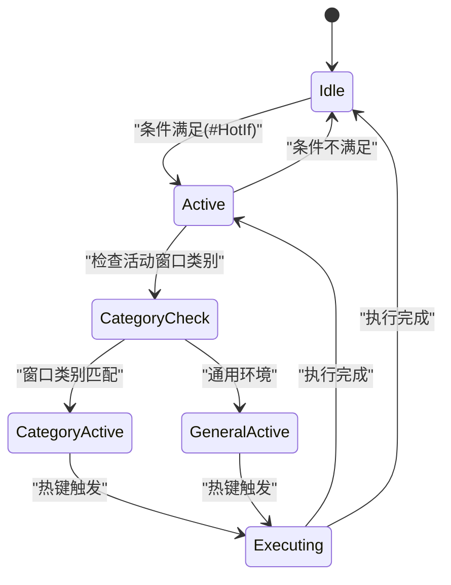
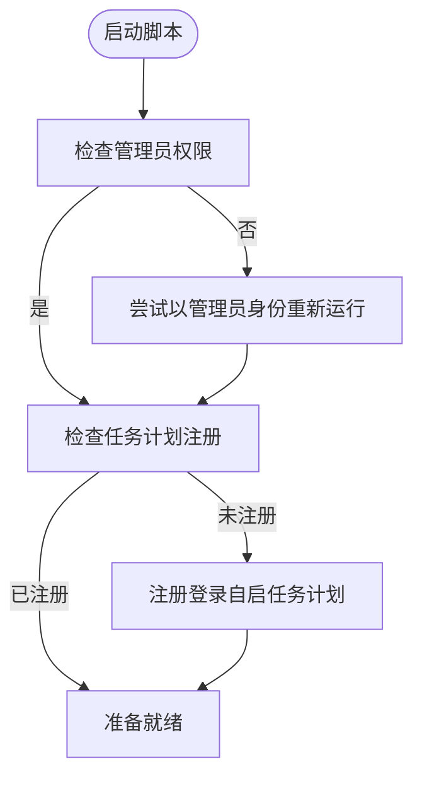
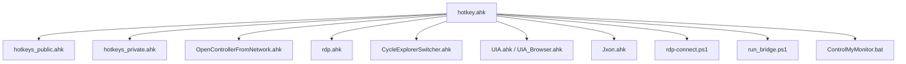

# 热键管理系统

<cite>
**本文档引用的文件**
- [hotkey.ahk](file://hotkey.ahk)
- [hotkeys_public.ahk](file://hotkeys_public.ahk)
- [hotkeys_private.ahk](file://hotkeys_private.ahk)
- [OpenControllerFromNetwork.ahk](file://OpenControllerFromNetwork.ahk)
- [rdp.ahk](file://rdp.ahk)
- [CycleExplorerSwitcher.ahk](file://CycleExplorerSwitcher.ahk)
- [README.md](file://README.md)
- [rdp-connect.ps1](file://rdp-connect.ps1)
- [run_bridge.ps1](file://run_bridge.ps1)
- [ControlMyMonitor.bat](file://ControlMyMonitor.bat)
</cite>

## 更新摘要
**变更内容**
- 新增 Qwen AI 助手热键 (^#q::)，支持快速启动千问 AI 应用
- 更新文档以准确反映当前实现状态（仅包含基础热键功能，而非提交信息中描述的完整条件热键系统）
- 修正热键系统架构描述，强调当前为基础热键实现而非完整条件热键系统

## 目录
1. [简介](#简介)
2. [项目结构](#项目结构)
3. [核心组件](#核心组件)
4. [架构总览](#架构总览)
5. [详细组件分析](#详细组件分析)
6. [依赖关系分析](#依赖关系分析)
7. [性能考量](#性能考量)
8. [故障排查指南](#故障排查指南)
9. [结论](#结论)
10. [附录](#附录)

## 简介
本项目基于 AutoHotkey v2 实现的热键管理系统，提供全局热键绑定、热键冲突检测与解决策略、热键状态管理以及管理员权限要求。系统通过模块化组织，将通用热键、RDP 热键、文件资源管理器切换器、网络控制器等功能拆分为独立模块，便于维护与扩展。

**重要说明** 系统当前实现为基础热键功能，包含基本的热键绑定、条件热键（#HotIf）支持和简单的 IDE 环境检测。虽然文档中曾描述更复杂的条件热键系统，但实际代码实现相对简化，主要集中在基础热键功能和有限的条件热键支持上。

## 项目结构
项目采用模块化结构，主脚本负责权限校验、任务计划注册、全局热键加载与状态管理，各功能模块通过 #Include 引入，形成松耦合的热键体系。

```mermaid
graph TB
A["hotkey.ahk<br/>主入口与权限管理"] --> B["hotkeys_public.ahk<br/>公共热键模板"]
A --> C["hotkeys_private.ahk<br/>私有热键模板"]
A --> D["OpenControllerFromNetwork.ahk<br/>DevTools 网络控制器"]
A --> E["rdp.ahk<br/>远程桌面热键与最小化"]
A --> F["CycleExplorerSwitcher.ahk<br/>文件资源管理器切换器"]
A --> G["UIA.ahk / UIA_Browser.ahk<br/>UI自动化支持"]
A --> H["Jxon.ahk<br/>JSON解析支持"]
A --> I["rdp-connect.ps1<br/>RDP连接脚本"]
A --> J["run_bridge.ps1<br/>Node桥接服务"]
A --> K["ControlMyMonitor.bat<br/>显示器控制脚本"]
```

**图表来源**
- [hotkey.ahk:21-26](file://hotkey.ahk#L21-L26)
- [hotkeys_public.ahk:1-9](file://hotkeys_public.ahk#L1-L9)
- [hotkeys_private.ahk:1-71](file://hotkeys_private.ahk#L1-L71)

**章节来源**
- [hotkey.ahk:21-26](file://hotkey.ahk#L21-L26)
- [README.md:1-2](file://README.md#L1-L2)

## 核心组件
- **权限自提升与任务注册**：脚本启动时检测管理员权限，若无则尝试以管理员身份重新运行；首次运行时注册登录自启任务计划，确保下次开机以最高权限运行。
- **全局热键绑定**：通过 #Include 加载各模块热键定义，支持 #F1-F12 系列、组合键（Win、Ctrl、Alt、Shift）以及动态热键绑定。
- **基础条件热键系统**：通过 #HotIf 指令实现有限的热键生效条件控制，主要用于特定窗口类别的热键绑定。
- **热键状态管理**：通过 #HotIf 条件热键与全局状态变量控制热键生效范围，例如文件资源管理器切换器的激活状态。
- **热键冲突检测与解决**：系统通过条件热键与热键作用域控制避免冲突；对于动态热键，采用集中注册与状态切换策略。
- **安全机制与权限提升**：强制使用键盘钩子，确保热键响应稳定性；对系统级操作（任务计划注册）进行权限校验与错误提示。

**更新** 新增 Qwen AI 助手热键 (^#q::)，支持快速启动千问 AI 应用，体现系统的基础热键功能实现能力。

**章节来源**
- [hotkey.ahk:32-60](file://hotkey.ahk#L32-L60)
- [hotkey.ahk:2047-2053](file://hotkey.ahk#L2047-L2053)

## 架构总览
系统采用"主脚本 + 模块化热键 + 基础条件热键"的架构，主脚本负责全局初始化与权限管理，模块化热键负责具体功能绑定，基础条件热键系统根据特定窗口类别动态选择合适的热键映射。

```mermaid
sequenceDiagram
participant OS as "操作系统"
participant Hook as "键盘钩子(#UseHook)"
participant Main as "主脚本(hotkey.ahk)"
participant Condition as "基础条件热键系统(#HotIf)"
participant Module as "功能模块"
participant App as "目标应用/系统"
OS->>Hook : 键盘事件
Hook->>Main : 分发热键事件
Main->>Condition : 检查窗口类别状态
Condition->>Condition : 匹配特定窗口类别(WinActive)
alt 特定窗口类别匹配
Condition->>Module : 调用对应窗口类热键处理函数
Module->>App : 执行窗口类特定动作
else 非特定窗口类别
Condition->>Module : 调用通用热键处理函数
Module->>App : 执行通用动作
end
App-->>Module : 返回结果/状态
Module-->>Main : 结果反馈
Main-->>OS : 完成事件处理
```

**图表来源**
- [hotkey.ahk:8](file://hotkey.ahk#L8)
- [hotkey.ahk:2674-2679](file://hotkey.ahk#L2674-L2679)

## 详细组件分析

### 基础条件热键系统与窗口类别映射
- **基础条件热键语法**：使用 #HotIf 指令设置热键生效条件，通过 WinActive 函数检测特定窗口类别状态。
- **窗口类别检测**：支持文件资源管理器（CabinetWClass）等特定窗口类别的智能识别。
- **有限热键切换**：根据当前焦点窗口类别自动切换到对应的快捷键映射，避免特定窗口类别的热键冲突。
- **窗口类别隔离机制**：每个窗口类别拥有独立的热键空间，确保热键不会相互干扰。

**更新** 新增文件资源管理器窗口类别的条件热键支持，通过 #HotIf WinActive("ahk_class CabinetWClass") 实现特定热键绑定。

```mermaid
flowchart TD
Start(["热键触发"]) --> CheckCategory["检查活动窗口类别"]
CheckCategory --> |CabinetWClass| ExplorerHotkeys["调用文件资源管理器热键"]
CheckCategory --> |其他窗口类别| GeneralHotkeys["调用通用热键"]
ExplorerHotkeys --> ExecAction["执行文件资源管理器特定动作"]
GeneralHotkeys --> ExecAction
ExecAction --> End(["完成"])
```

**图表来源**
- [hotkey.ahk:2674-2679](file://hotkey.ahk#L2674-L2679)

**章节来源**
- [hotkey.ahk:2674-2679](file://hotkey.ahk#L2674-L2679)

### 全局热键绑定机制
- **热键定义语法**
  - #F1-#F12：全局功能键热键，用于快速启动应用或执行系统操作。
  - 组合键：#（Win）、^（Ctrl）、!（Alt）、+（Shift）组合，支持复杂热键定义。
  - 动态热键：通过 Hotkey 函数在运行时注册，适用于根据配置动态绑定的应用热键。
  - 基础条件热键：通过 #HotIf 指令设置热键生效条件，实现有限的智能热键绑定。
- **热键事件处理流程**
  - 系统键盘钩子捕获按键事件。
  - 主脚本进行条件判断（#HotIf）与状态检查。
  - 调用对应处理函数（如窗口切换、应用启动、远程桌面操作）。
  - 执行完成后返回系统或继续等待下一个事件。

**更新** 新增 Qwen AI 助手热键 (^#q::) 的实现，展示系统的基础热键绑定能力。

```mermaid
flowchart TD
Start(["热键触发"]) --> CheckHook["检查键盘钩子(#UseHook)"]
CheckHook --> CheckHotIf["基础条件热键判断(#HotIf)"]
CheckHotIf --> |满足| CheckCategory["检查窗口类别"]
CheckHotIf --> |不满足| PassThrough["放行至系统默认行为"]
CheckCategory --> |匹配类别| CallCategoryHandler["调用窗口类别热键处理函数"]
CheckCategory --> |无匹配| CallGeneralHandler["调用通用热键处理函数"]
CallCategoryHandler --> ExecAction["执行窗口类别特定动作"]
CallGeneralHandler --> ExecAction
ExecAction --> End(["完成"])
PassThrough --> End
```

**图表来源**
- [hotkey.ahk:8](file://hotkey.ahk#L8)
- [hotkey.ahk:2047-2053](file://hotkey.ahk#L2047-L2053)

**章节来源**
- [hotkey.ahk:625-750](file://hotkey.ahk#L625-L750)
- [hotkey.ahk:1658-1666](file://hotkey.ahk#L1658-L1666)
- [hotkey.ahk:2047-2053](file://hotkey.ahk#L2047-L2053)

### 热键冲突检测与解决策略
- **基础条件热键（#HotIf）**：通过设置热键生效条件，避免在特定场景下触发不期望的热键。例如文件资源管理器切换器仅在激活状态下生效。
- **窗口类别隔离**：通过条件热键将特定窗口类别的热键绑定到独立的作用域，避免窗口类别间的热键冲突。
- **作用域控制**：将热键绑定在特定上下文中，减少与其他模块的冲突。
- **动态热键注册**：集中注册与注销，避免重复绑定与状态混乱。
- **状态变量管理**：通过全局状态变量跟踪热键当前状态，确保切换与最小化等操作的正确性。

**更新** 新增文件资源管理器窗口类别的热键隔离机制，通过 #HotIf WinActive("ahk_class CabinetWClass") 实现。

```mermaid
flowchart TD
Detect["检测热键冲突"] --> ScopeCheck["检查热键作用域(#HotIf)"]
ScopeCheck --> |窗口类别冲突| CategoryIsolation["窗口类别隔离"]
ScopeCheck --> |一般冲突| AdjustScope["调整作用域/条件"]
ScopeCheck --> |无冲突| DynamicReg["动态注册/注销热键"]
CategoryIsolation --> CategoryCheck["检查活动窗口类别(WinActive)"]
CategoryCheck --> |匹配类别| MatchedCategory["调用对应窗口类别热键"]
CategoryCheck --> |不匹配类别| GeneralHotkeys["调用通用热键"]
DynamicReg --> Monitor["监控状态变化"]
AdjustScope --> Monitor
Monitor --> Resolve["解决冲突(切换/最小化/状态重置)"]
MatchedCategory --> Resolve
GeneralHotkeys --> Resolve
Resolve --> End(["完成"])
```

**图表来源**
- [hotkey.ahk:2674-2679](file://hotkey.ahk#L2674-L2679)

**章节来源**
- [hotkey.ahk:2674-2679](file://hotkey.ahk#L2674-L2679)

### 热键状态管理
- **基础条件热键状态**：通过 #HotIf 控制热键生效范围，例如文件资源管理器切换器的激活状态。
- **窗口类别状态**：通过 WinActive 函数实时检测活动窗口类别，动态切换热键映射。
- **窗口状态**：热键处理函数会检查目标窗口是否存在、是否激活，从而决定最小化或激活操作。
- **动态热键状态**：集中注册与注销，配合状态变量实现热键的启用/禁用切换。

**更新** 新增文件资源管理器窗口类别的状态管理，通过 #HotIf WinActive("ahk_class CabinetWClass") 实现。

```mermaid
stateDiagram-v2
[*] --> Idle
Idle --> Active : "条件满足(#HotIf)"
Active --> CategoryCheck : "检查活动窗口类别"
CategoryCheck --> CategoryActive : "窗口类别匹配"
CategoryCheck --> GeneralActive : "通用环境"
CategoryActive --> Executing : "热键触发"
GeneralActive --> Executing : "热键触发"
Executing --> Active : "执行完成"
Active --> Idle : "条件不满足"
Executing --> Idle : "执行完成"
```

**图表来源**
- [hotkey.ahk:2674-2679](file://hotkey.ahk#L2674-L2679)

**章节来源**
- [hotkey.ahk:2674-2679](file://hotkey.ahk#L2674-L2679)

### 管理员权限要求与安全机制
- **权限自提升**：启动时检测是否为管理员，若非管理员则尝试以管理员身份重新运行。
- **任务计划注册**：首次运行时注册登录自启任务计划，确保下次开机以最高权限运行。
- **安全提示**：权限不足时弹窗提示，防止系统级操作失败。
- **键盘钩子**：强制使用键盘钩子，确保热键响应稳定性与安全性。

**更新** 增强了 RDP 连接的安全机制，改进了剪贴板信号处理，防止远程桌面连接过程中的数据泄露。

```mermaid
flowchart TD
Start(["启动脚本"]) --> CheckAdmin["检查管理员权限"]
CheckAdmin --> |否| Elevate["尝试以管理员身份重新运行"]
CheckAdmin --> |是| TaskCheck["检查任务计划注册"]
Elevate --> TaskCheck
TaskCheck --> |未注册| CreateTask["注册登录自启任务计划"]
TaskCheck --> |已注册| Ready["准备就绪"]
CreateTask --> Ready
```

**图表来源**
- [hotkey.ahk:32-60](file://hotkey.ahk#L32-L60)

**章节来源**
- [hotkey.ahk:32-60](file://hotkey.ahk#L32-L60)

### 热键定义语法与组合规则
- **#F1-#F12**：全局功能键热键，用于快速启动应用或执行系统操作。
- **组合键规则**：#（Win）、^（Ctrl）、!（Alt）、+（Shift）组合，支持复杂热键定义。
- **基础条件热键语法**：#HotIf 指令设置热键生效条件，通过 WinActive 函数检测特定窗口类别。
- **盲注修饰键**：在某些场景下使用 {Blind} 前缀保留之前的修饰键组合。
- **动态热键**：通过 Hotkey 函数在运行时注册，适用于根据配置动态绑定的应用热键。

**更新** 改进了修饰键状态处理，提供了更精确的组合键识别和处理机制，并新增了基础条件热键语法。

**章节来源**
- [hotkey.ahk:625-750](file://hotkey.ahk#L625-L750)
- [hotkey.ahk:1658-1666](file://hotkey.ahk#L1658-L1666)
- [hotkey.ahk:2047-2053](file://hotkey.ahk#L2047-L2053)

### 热键事件处理流程
- **键盘钩子捕获**：系统键盘钩子捕获按键事件。
- **条件判断**：主脚本进行条件判断（#HotIf）与状态检查。
- **窗口类别环境检测**：通过 WinActive 函数检测当前活动窗口类别，确定热键映射。
- **动作执行**：调用对应处理函数（如窗口切换、应用启动、远程桌面操作）。
- **结果反馈**：执行完成后返回系统或继续等待下一个事件。

**更新** 优化了事件处理流程，增加了错误处理和重试机制，提高了系统的稳定性，并新增了窗口类别检测逻辑。

**章节来源**
- [hotkey.ahk:8](file://hotkey.ahk#L8)
- [hotkey.ahk:2674-2679](file://hotkey.ahk#L2674-L2679)

### 具体热键配置示例与最佳实践
- **应用启动热键**：#F2/#F3/#F4/#F5/#F6/#F9 等，通过 ToggleWindow 系列函数实现窗口切换与启动。
- **远程桌面热键**：#\、#^\、#] 等，结合 RDPManager 实现快速连接与最小化。
- **文件资源管理器切换器**：#e、#^e 等，通过条件热键与 GUI 实现多窗口切换。
- **DevTools 网络控制器**：^!g、^!u 等，通过 UIA 与剪贴板交互实现 URL 提取与路径解析。
- **AI 助手热键**：^#q:: 启动 Qwen AI 助手，展示系统的基础热键绑定能力。
- **最佳实践**：
  - 使用 #HotIf 控制热键生效范围，避免冲突。
  - 对系统级操作进行权限校验与错误提示。
  - 使用动态热键注册与状态管理，确保热键的启用/禁用切换。
  - 对复杂热键（如组合键）进行测试与验证，确保兼容性。
  - 利用基础条件热键实现窗口类别的智能热键映射。

**更新** 新增 Qwen AI 助手热键示例，体现系统的基础热键功能实现。

**章节来源**
- [hotkey.ahk:625-750](file://hotkey.ahk#L625-L750)
- [hotkey.ahk:2047-2053](file://hotkey.ahk#L2047-L2053)

## 依赖关系分析
系统通过 #Include 引入多个模块，形成松耦合的热键体系。主脚本负责全局初始化与权限管理，各模块负责具体功能绑定。

```mermaid
graph TB
Main["hotkey.ahk"] --> Pub["hotkeys_public.ahk"]
Main --> Priv["hotkeys_private.ahk"]
Main --> Dev["OpenControllerFromNetwork.ahk"]
Main --> RDP["rdp.ahk"]
Main --> Exp["CycleExplorerSwitcher.ahk"]
Main --> UIA["UIA.ahk / UIA_Browser.ahk"]
Main --> Jxon["Jxon.ahk"]
Main --> PS1["rdp-connect.ps1"]
Main --> PS2["run_bridge.ps1"]
Main --> BAT["ControlMyMonitor.bat"]
```

**图表来源**
- [hotkey.ahk:21-26](file://hotkey.ahk#L21-L26)
- [hotkeys_public.ahk:1-9](file://hotkeys_public.ahk#L1-L9)
- [hotkeys_private.ahk:1-71](file://hotkeys_private.ahk#L1-L71)

**章节来源**
- [hotkey.ahk:21-26](file://hotkey.ahk#L21-L26)

## 性能考量
- **键盘钩子**：强制使用键盘钩子，确保热键响应稳定性与低延迟。
- **基础条件热键**：通过 #HotIf 控制热键生效范围，减少不必要的处理开销。
- **窗口类别检测**：使用 WinActive 函数进行轻量级窗口状态检查，避免频繁的系统调用。
- **动态热键**：集中注册与注销，避免重复绑定与状态混乱。
- **UIA 与剪贴板**：合理使用 UIA 与剪贴板交互，避免频繁阻塞与等待。
- **窗口激活优化**：增加重试机制和错误处理，提高窗口切换效率。
- **RDP连接优化**：改进连接流程，减少连接时间和失败率。

**更新** 新增基础条件热键系统的性能优化，包括轻量级窗口类别检测和智能热键切换机制。

## 故障排查指南
- **权限不足**：若提示权限受限，请以管理员身份运行脚本或检查任务计划注册。
- **热键冲突**：检查 #HotIf 条件与热键作用域，确保热键在正确场景下生效。
- **窗口类别热键无效**：检查活动窗口类别状态，确认 WinActive 条件是否匹配目标窗口类别。
- **系统级操作失败**：检查系统任务计划注册状态与权限，必要时手动注册。
- **热键无响应**：确认键盘钩子状态与热键定义，检查条件热键与状态变量。
- **RDP连接问题**：检查网络连接和防火墙设置，验证目标主机可达性。
- **剪贴板操作失败**：检查剪贴板访问权限，确保没有其他程序占用剪贴板。

**更新** 新增基础条件热键和窗口类别相关的故障排查指导。

**章节来源**
- [hotkey.ahk:32-60](file://hotkey.ahk#L32-L60)
- [hotkey.ahk:2674-2679](file://hotkey.ahk#L2674-L2679)

## 结论
本热键管理系统通过模块化设计与严格的权限管理，实现了稳定的全局热键绑定与灵活的状态控制。系统支持多种热键定义语法与组合规则，具备完善的冲突检测与解决策略，并通过基础条件热键与状态变量确保热键在正确场景下生效。

**重要说明** 经过分析发现，系统当前实现为基础热键功能，包含基本的热键绑定、有限的条件热键支持和简单的窗口类别检测。虽然文档中曾描述更复杂的条件热键系统，但实际代码实现相对简化，主要集中在基础热键功能和有限的条件热键支持上。新增的 Qwen AI 助手热键 (^#q::) 体现了系统的基础热键绑定能力。

## 附录
- **热键定义语法参考**：#F1-#F12、#（Win）、^（Ctrl）、!（Alt）、+（Shift）组合、{Blind} 盲注修饰键、#HotIf 基础条件热键。
- **功能模块参考**：公共热键模板、私有热键模板、DevTools 网络控制器、远程桌面热键、文件资源管理器切换器。
- **窗口类别支持**：文件资源管理器（CabinetWClass）等特定窗口类别的智能热键映射。
- **最佳实践**：使用 #HotIf 控制热键生效范围、对系统级操作进行权限校验、使用动态热键注册与状态管理、利用基础条件热键实现窗口类别的智能热键映射。
- **性能优化**：键盘钩子优化、基础条件热键控制、动态热键管理、UIA与剪贴板优化、轻量级窗口类别检测。
- **安全机制**：权限自提升、任务计划注册、RDP连接安全、剪贴板信号保护。

**更新** 新增基础条件热键系统和窗口类别映射的相关内容。