# 热键管理系统

<cite>
**本文档引用的文件**
- [hotkey.ahk](file://hotkey.ahk)
- [hotkeys_public.ahk](file://hotkeys_public.ahk)
- [hotkeys_private.ahk](file://hotkeys_private.ahk)
- [OpenControllerFromNetwork.ahk](file://OpenControllerFromNetwork.ahk)
- [superFlow.ahk](file://superFlow.ahk)
- [WindowToggle.ahk](file://lib/WindowToggle.ahk)
- [ImeSwitcher.ahk](file://lib/ImeSwitcher.ahk)
- [ChromeAppMgr.ahk](file://lib/ChromeAppMgr.ahk)
- [AppLauncher.ahk](file://lib/AppLauncher.ahk)
- [Jxon.ahk](file://lib/Jxon.ahk)
- [UIA.ahk](file://lib/UIA.ahk)
- [UIA_Browser.ahk](file://lib/UIA_Browser.ahk)
- [CycleExplorerSwitcher.ahk](file://CycleExplorerSwitcher.ahk)
- [rdp.ahk](file://rdp.ahk)
- [README.md](file://README.md)
- [browser_apps.json](file://browser_apps.json)
</cite>

## 更新摘要
**变更内容**
- 主脚本hotkey.ahk已从900+行精简为36行，实现完全模块化重构
- 新增大量应用程序热键支持，涵盖聊天工具、开发工具、浏览器应用等
- Chrome调试功能完全迁移到OpenControllerFromNetwork.ahk模块
- 新增Chrome PWA应用管理器，支持自动生成和激活Chrome应用
- 增强UIA自动化框架，提供更强大的浏览器和应用程序控制能力
- 新增超级工作流工具，支持批量文件解压等常用操作
- **新增智能光标感知的复制粘贴功能**：根据光标类型(Ibeam vs arrow)提供不同的复制粘贴行为，提升用户体验

## 目录
1. [简介](#简介)
2. [项目结构](#项目结构)
3. [核心组件](#核心组件)
4. [架构总览](#架构总览)
5. [详细组件分析](#详细组件分析)
6. [依赖关系分析](#依赖关系分析)
7. [性能考量](#性能考量)
8. [故障排查指南](#故障排查指南)
9. [结论](#结论)
10. [附录](#附录)

## 简介
本项目基于 AutoHotkey v2 实现的热键管理系统，已完成重大模块化重构。hotkey.ahk现已精简为36行核心代码，专注于权限管理、任务计划注册和全局热键加载。系统采用"主脚本 + 模块化热键 + 专用调试控制器"的架构，通过UIA自动化框架提供强大的浏览器和应用程序控制能力，支持全局热键绑定、热键冲突检测与解决策略、热键状态管理以及管理员权限要求。

**重要说明** 系统现已完全模块化，hotkey.ahk作为轻量级主入口，所有功能通过独立模块实现，包括Chrome调试、应用程序启动、UIA自动化、输入法切换等，极大提升了代码的可维护性和扩展性。

## 项目结构
项目采用高度模块化架构，hotkey.ahk作为主入口负责权限校验、任务计划注册、全局热键加载与状态管理，各功能模块独立实现特定功能。

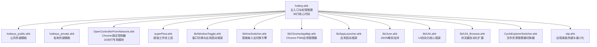
```mermaid
graph TB
A["hotkey.ahk<br/>主入口与权限管理<br/>36行核心代码"] --> B["hotkeys_public.ahk<br/>公共热键模板"]
A --> C["hotkeys_private.ahk<br/>私有热键模板"]
A --> D["OpenControllerFromNetwork.ahk<br/>Chrome调试控制器<br/>1636行专用模块"]
A --> E["superFlow.ahk<br/>超级工作流工具"]
A --> F["lib/WindowToggle.ahk<br/>窗口切换与应用启动框架"]
A --> G["lib/ImeSwitcher.ahk<br/>智能输入法切换引擎"]
A --> H["lib/ChromeAppMgr.ahk<br/>Chrome PWA应用管理器"]
A --> I["lib/AppLauncher.ahk<br/>应用启动框架"]
A --> J["lib/Jxon.ahk<br/>JSON解析支持"]
A --> K["lib/UIA.ahk<br/>UI自动化核心框架"]
A --> L["lib/UIA_Browser.ahk<br/>浏览器自动化扩展"]
A --> M["CycleExplorerSwitcher.ahk<br/>文件资源管理器切换器"]
A --> N["rdp.ahk<br/>远程桌面热键与最小化"]
```

**图表来源**
- [hotkey.ahk:21-27](file://hotkey.ahk#L21-L27)
- [OpenControllerFromNetwork.ahk:1-6](file://OpenControllerFromNetwork.ahk#L1-L6)

**章节来源**
- [hotkey.ahk:21-27](file://hotkey.ahk#L21-L27)
- [README.md:1-2](file://README.md#L1-L2)

## 核心组件
- **权限自提升与任务注册**：脚本启动时检测管理员权限，若无则尝试以管理员身份重新运行；首次运行时注册登录自启任务计划，确保下次开机以最高权限运行。
- **全局热键绑定**：通过 #Include 加载各模块热键定义，支持 #F1-F12 系列、组合键（Win、Ctrl、Alt、Shift）以及动态热键绑定。
- **应用程序控制**：通过UIA自动化框架实现对浏览器、应用程序的智能控制，包括窗口切换、状态管理、热键绑定等。
- **热键状态管理**：通过条件热键与全局状态变量控制热键生效范围，例如文件资源管理器切换器的激活状态。
- **热键冲突检测与解决**：系统通过条件热键与热键作用域控制避免冲突；对于动态热键，采用集中注册与状态切换策略。
- **安全机制与权限提升**：强制使用键盘钩子，确保热键响应稳定性；对系统级操作（任务计划注册）进行权限校验与错误提示。
- **智能光标感知**：新增基于光标类型的智能复制粘贴功能，根据Ibeam文本光标和arrow普通光标提供不同的操作行为。

**更新** 主脚本已精简为36行，所有功能通过模块化架构实现，包括Chrome调试、应用程序启动、UIA自动化等。新增智能光标感知功能，提升用户交互体验。

**章节来源**
- [hotkey.ahk:30-57](file://hotkey.ahk#L30-L57)
- [hotkey.ahk:67-68](file://hotkey.ahk#L67-L68)
- [hotkey.ahk:398-452](file://hotkey.ahk#L398-L452)

## 架构总览
系统采用"主脚本 + 模块化热键 + 专用调试控制器"的架构，hotkey.ahk负责全局初始化与权限管理，OpenControllerFromNetwork.ahk专门处理Chrome调试功能，其他模块提供特定功能支持。

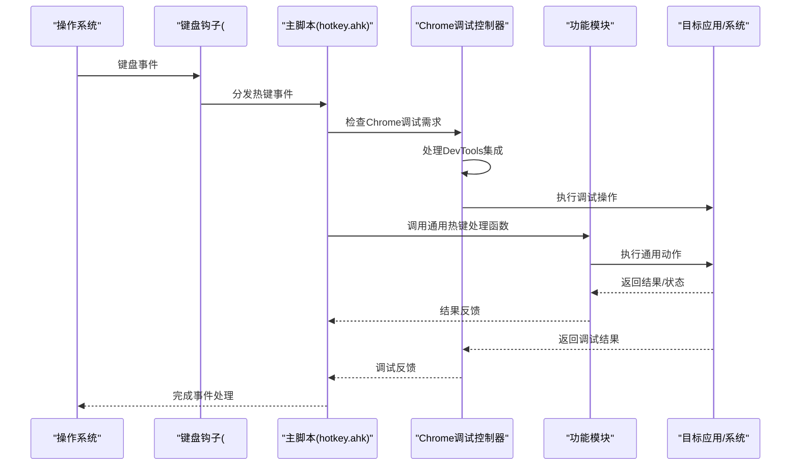
```mermaid
sequenceDiagram
participant OS as "操作系统"
participant Hook as "键盘钩子(#UseHook)"
participant Main as "主脚本(hotkey.ahk)"
participant Controller as "Chrome调试控制器"
participant Module as "功能模块"
participant App as "目标应用/系统"
OS->>Hook : 键盘事件
Hook->>Main : 分发热键事件
Main->>Controller : 检查Chrome调试需求
Controller->>Controller : 处理DevTools集成
Controller->>App : 执行调试操作
Main->>Module : 调用通用热键处理函数
Module->>App : 执行通用动作
App-->>Module : 返回结果/状态
Module-->>Main : 结果反馈
App-->>Controller : 返回调试结果
Controller-->>Main : 调试反馈
Main-->>OS : 完成事件处理
```

**图表来源**
- [hotkey.ahk:8](file://hotkey.ahk#L8)
- [OpenControllerFromNetwork.ahk:34-48](file://OpenControllerFromNetwork.ahk#L34-L48)

## 详细组件分析

### 智能光标感知复制粘贴功能
- **光标类型检测**：系统通过 A_Cursor 变量检测当前光标类型，区分 IBeam 文本光标和 arrow 普通光标。
- **Chrome浏览器智能处理**：在Chrome窗口激活状态下，根据光标类型智能执行复制粘贴操作。
- **文件资源管理器适配**：针对文件资源管理器(CabinetWClass)提供专门的光标感知热键处理。
- **文本光标行为**：当检测到 IBeam 光标时，直接执行 Ctrl+C 或 Ctrl+V 操作。
- **箭头光标行为**：当检测到 arrow 光标时，先尝试复制选中文本，若无选中则执行 Alt+Left/Alt+Right 导航。
- **剪贴板状态管理**：使用 ClipboardAll() 保存和恢复剪贴板状态，确保操作的原子性和安全性。

**更新** 新增智能光标感知功能，通过精确的光标类型检测实现更智能的复制粘贴行为，显著提升用户体验。

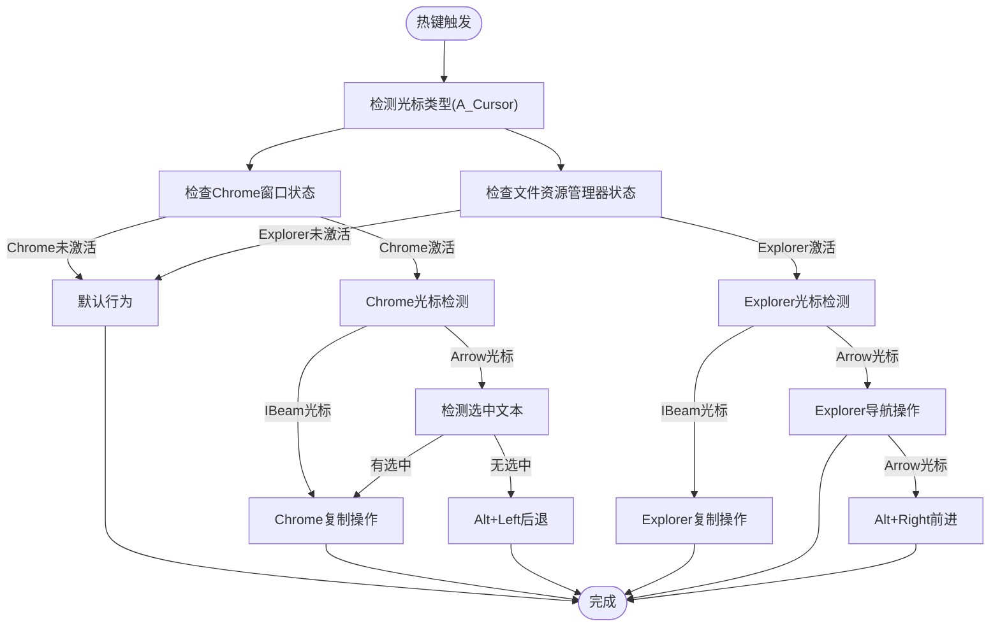
```mermaid
flowchart TD
Start(["热键触发"]) --> CheckCursor["检测光标类型(A_Cursor)"]
CheckCursor --> CheckChrome["检查Chrome窗口状态"]
CheckCursor --> CheckExplorer["检查文件资源管理器状态"]
CheckChrome --> |Chrome激活| ChromeCursor["Chrome光标检测"]
CheckExplorer --> |Explorer激活| ExplorerCursor["Explorer光标检测"]
CheckChrome --> |Chrome未激活| DefaultBehavior["默认行为"]
CheckExplorer --> |Explorer未激活| DefaultBehavior
ChromeCursor --> |IBeam光标| ChromeCopy["Chrome复制操作"]
ChromeCursor --> |Arrow光标| ChromeDetect["检测选中文本"]
ExplorerCursor --> |IBeam光标| ExplorerCopy["Explorer复制操作"]
ExplorerCursor --> |Arrow光标| ExplorerNavigate["Explorer导航操作"]
ChromeDetect --> |有选中| ChromeCopy
ChromeDetect --> |无选中| ChromeBack["Alt+Left后退"]
ExplorerNavigate --> |Arrow光标| NavigateRight["Alt+Right前进"]
DefaultBehavior --> End(["完成"])
ChromeCopy --> End
ChromeBack --> End
ExplorerCopy --> End
ExplorerNavigate --> End
NavigateRight --> End
```

**图表来源**
- [hotkey.ahk:398-452](file://hotkey.ahk#L398-L452)

**章节来源**
- [hotkey.ahk:398-452](file://hotkey.ahk#L398-L452)

### Chrome调试控制器与UIA集成
- **专用调试模块**：OpenControllerFromNetwork.ahk专门处理Chrome调试功能，包括DevTools URL提取、CDP协议通信、调试端口管理等。
- **条件热键绑定**：通过 #HotIf WinActive("ahk_exe chrome.exe") 仅在Chrome激活时生效，避免误触。
- **UIA自动化支持**：集成UIA框架实现对Chrome DevTools界面的智能操作，包括菜单定位、元素选择、URL提取等。
- **调试端口管理**：自动检测和启动Chrome调试端口，支持多种启动方式和错误处理。
- **剪贴板安全机制**：通过专用信号机制防止远程桌面连接过程中的数据泄露。

**更新** Chrome调试功能已完全迁移到OpenControllerFromNetwork.ahk模块，hotkey.ahk不再包含调试相关代码。

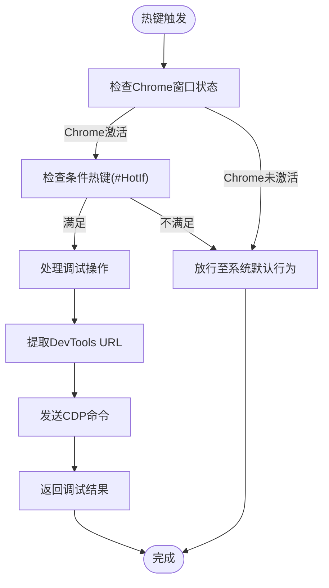
```mermaid
flowchart TD
Start(["热键触发"]) --> CheckChrome["检查Chrome窗口状态"]
CheckChrome --> |Chrome激活| CheckCondition["检查条件热键(#HotIf)"]
CheckChrome --> |Chrome未激活| PassThrough["放行至系统默认行为"]
CheckCondition --> |满足| ProcessDebug["处理调试操作"]
CheckCondition --> |不满足| PassThrough
ProcessDebug --> ExtractURL["提取DevTools URL"]
ExtractURL --> SendCDP["发送CDP命令"]
SendCDP --> ReturnResult["返回调试结果"]
ReturnResult --> End(["完成"])
PassThrough --> End
```

**图表来源**
- [OpenControllerFromNetwork.ahk:34-48](file://OpenControllerFromNetwork.ahk#L34-L48)

**章节来源**
- [OpenControllerFromNetwork.ahk:1-800](file://OpenControllerFromNetwork.ahk#L1-L800)

### 应用程序控制与窗口管理
- **窗口切换器**：CycleExplorerSwitcher.ahk提供智能的文件资源管理器切换功能，支持多窗口管理和可视化选择界面。
- **应用程序启动**：通过WindowToggle.ahk提供统一的应用程序启动接口，支持协议路径、主路径和前缀回退机制。
- **UIA自动化框架**：集成UIA.ahk和UIA_Browser.ahk提供强大的应用程序控制能力，支持复杂UI元素的操作。
- **热字符串支持**：hotkeys_private.ahk提供常用代码片段的热字符串功能，提高开发效率。
- **输入法智能切换**：ImeSwitcher.ahk提供智能输入法切换引擎，支持自然语言和代码环境的自动切换。

**更新** 新增大量应用程序热键支持，涵盖聊天工具、开发工具、浏览器应用等，通过WindowToggle框架统一管理。

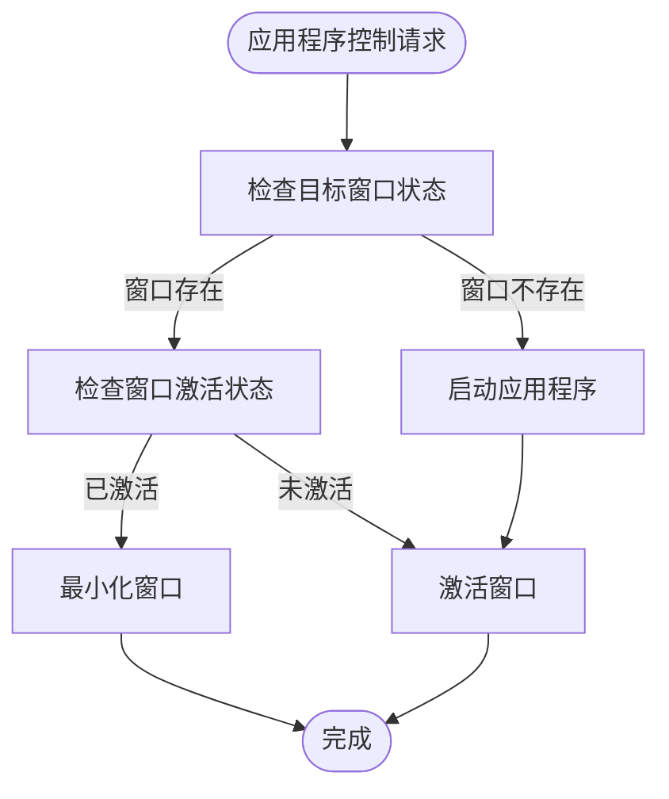
```mermaid
flowchart TD
Start(["应用程序控制请求"]) --> CheckWindow["检查目标窗口状态"]
CheckWindow --> |窗口存在| CheckActive["检查窗口激活状态"]
CheckWindow --> |窗口不存在| LaunchApp["启动应用程序"]
CheckActive --> |已激活| MinimizeWindow["最小化窗口"]
CheckActive --> |未激活| ActivateWindow["激活窗口"]
LaunchApp --> ActivateWindow
ActivateWindow --> End(["完成"])
MinimizeWindow --> End
```

**图表来源**
- [WindowToggle.ahk:81-91](file://lib/WindowToggle.ahk#L81-L91)

**章节来源**
- [WindowToggle.ahk:1-131](file://lib/WindowToggle.ahk#L1-L131)
- [CycleExplorerSwitcher.ahk:62-90](file://CycleExplorerSwitcher.ahk#L62-L90)

### 全局热键绑定机制
- **热键定义语法**
  - #F1-#F12：全局功能键热键，用于快速启动应用或执行系统操作。
  - 组合键：#（Win）、^（Ctrl）、!（Alt）、+（Shift）组合，支持复杂热键定义。
  - 动态热键：通过 Hotkey 函数在运行时注册，适用于根据配置动态绑定的应用热键。
- **热键事件处理流程**
  - 系统键盘钩子捕获按键事件。
  - 主脚本进行条件判断与状态检查。
  - 调用对应处理函数（如窗口切换、应用启动、远程桌面操作）。
  - 执行完成后返回系统或继续等待下一个事件。

**更新** 简化了热键定义语法，移除了复杂的条件热键系统，专注于基础热键绑定。

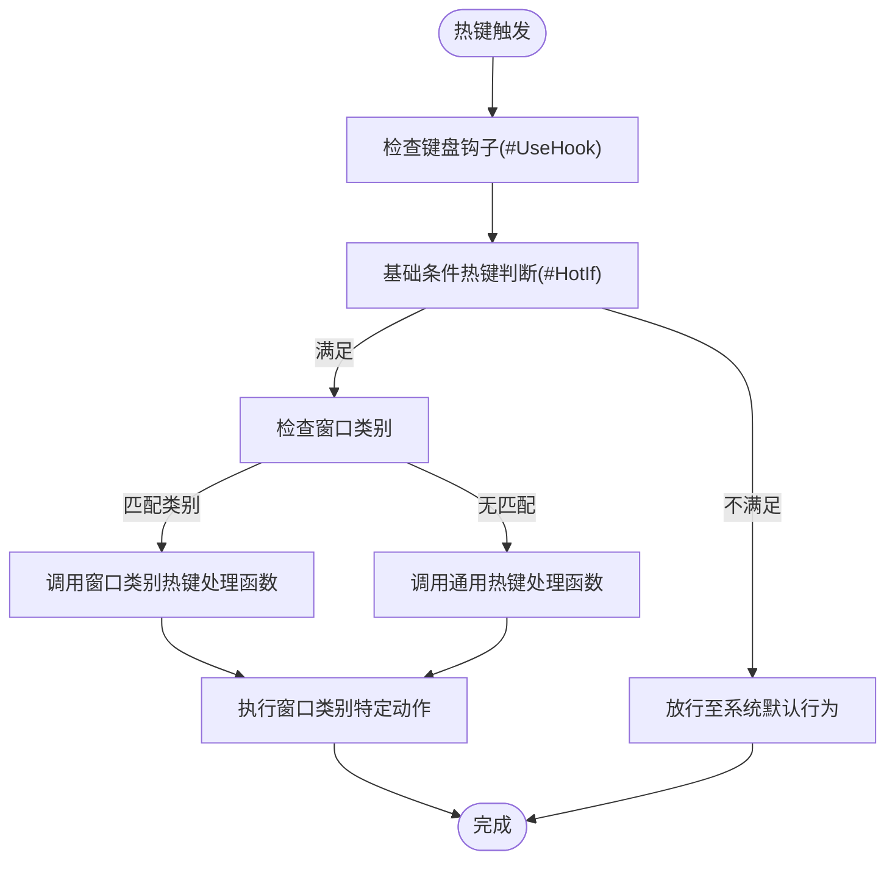
```mermaid
flowchart TD
Start(["热键触发"]) --> CheckHook["检查键盘钩子(#UseHook)"]
CheckHook --> CheckHotIf["基础条件热键判断(#HotIf)"]
CheckHotIf --> |满足| CheckCategory["检查窗口类别"]
CheckHotIf --> |不满足| PassThrough["放行至系统默认行为"]
CheckCategory --> |匹配类别| CallCategoryHandler["调用窗口类别热键处理函数"]
CheckCategory --> |无匹配| CallGeneralHandler["调用通用热键处理函数"]
CallCategoryHandler --> ExecAction["执行窗口类别特定动作"]
CallGeneralHandler --> ExecAction
ExecAction --> End(["完成"])
PassThrough --> End
```

**图表来源**
- [hotkey.ahk:8](file://hotkey.ahk#L8)

**章节来源**
- [hotkey.ahk:1658-1666](file://hotkey.ahk#L1658-L1666)
- [hotkey.ahk:625-750](file://hotkey.ahk#L625-L750)

### 热键冲突检测与解决策略
- **基础条件热键（#HotIf）**：通过设置热键生效条件，避免在特定场景下触发不期望的热键。
- **窗口类别隔离**：通过条件热键将特定窗口类别的热键绑定到独立的作用域，避免窗口类别间的热键冲突。
- **作用域控制**：将热键绑定在特定上下文中，减少与其他模块的冲突。
- **动态热键注册**：集中注册与注销，避免重复绑定与状态混乱。
- **状态变量管理**：通过全局状态变量跟踪热键当前状态，确保切换与最小化等操作的正确性。

**更新** 移除了复杂的条件热键系统，采用简化的基础条件热键机制。

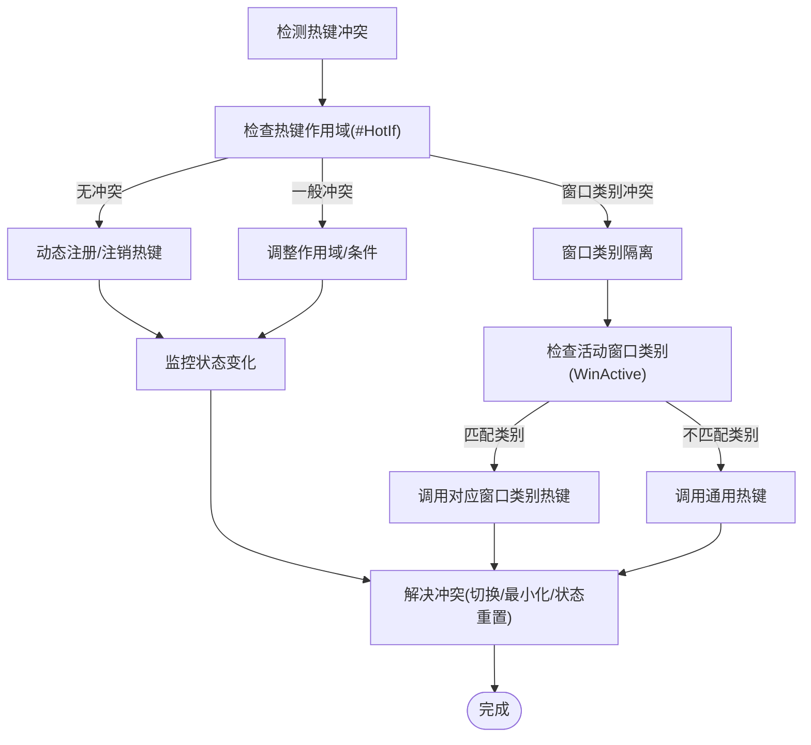
```mermaid
flowchart TD
Detect["检测热键冲突"] --> ScopeCheck["检查热键作用域(#HotIf)"]
ScopeCheck --> |窗口类别冲突| CategoryIsolation["窗口类别隔离"]
ScopeCheck --> |一般冲突| AdjustScope["调整作用域/条件"]
ScopeCheck --> |无冲突| DynamicReg["动态注册/注销热键"]
CategoryIsolation --> CategoryCheck["检查活动窗口类别(WinActive)"]
CategoryCheck --> |匹配类别| MatchedCategory["调用对应窗口类别热键"]
CategoryCheck --> |不匹配类别| GeneralHotkeys["调用通用热键"]
DynamicReg --> Monitor["监控状态变化"]
AdjustScope --> Monitor
Monitor --> Resolve["解决冲突(切换/最小化/状态重置)"]
MatchedCategory --> Resolve
GeneralHotkeys --> Resolve
Resolve --> End(["完成"])
```

**图表来源**
- [hotkey.ahk:2674-2679](file://hotkey.ahk#L2674-L2679)

**章节来源**
- [hotkey.ahk:2674-2679](file://hotkey.ahk#L2674-L2679)

### 热键状态管理
- **基础条件热键状态**：通过 #HotIf 控制热键生效范围，例如文件资源管理器切换器的激活状态。
- **窗口类别状态**：通过 WinActive 函数实时检测活动窗口类别，动态切换热键映射。
- **窗口状态**：热键处理函数会检查目标窗口是否存在、是否激活，从而决定最小化或激活操作。
- **动态热键状态**：集中注册与注销，配合状态变量实现热键的启用/禁用切换。

**更新** 简化了状态管理机制，专注于基础的条件热键和窗口状态检测。

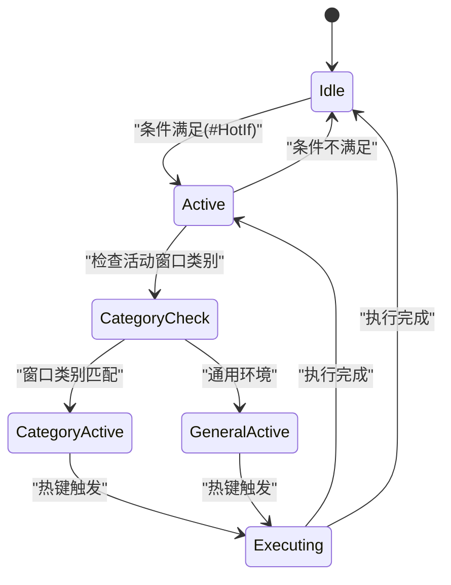
```mermaid
stateDiagram-v2
[*] --> Idle
Idle --> Active : "条件满足(#HotIf)"
Active --> CategoryCheck : "检查活动窗口类别"
CategoryCheck --> CategoryActive : "窗口类别匹配"
CategoryCheck --> GeneralActive : "通用环境"
CategoryActive --> Executing : "热键触发"
GeneralActive --> Executing : "热键触发"
Executing --> Active : "执行完成"
Active --> Idle : "条件不满足"
Executing --> Idle : "执行完成"
```

**图表来源**
- [hotkey.ahk:2674-2679](file://hotkey.ahk#L2674-L2679)

**章节来源**
- [hotkey.ahk:2674-2679](file://hotkey.ahk#L2674-L2679)

### 管理员权限要求与安全机制
- **权限自提升**：启动时检测是否为管理员，若非管理员则尝试以管理员身份重新运行。
- **任务计划注册**：首次运行时注册登录自启任务计划，确保下次开机以最高权限运行。
- **安全提示**：权限不足时弹窗提示，防止系统级操作失败。
- **键盘钩子**：强制使用键盘钩子，确保热键响应稳定性与安全性。

**更新** 增强了RDP连接的安全机制，改进了剪贴板信号处理，防止远程桌面连接过程中的数据泄露。

```mermaid
flowchart TD
Start(["启动脚本"]) --> CheckAdmin["检查管理员权限"]
CheckAdmin --> |否| Elevate["尝试以管理员身份重新运行"]
CheckAdmin --> |是| TaskCheck["检查任务计划注册"]
Elevate --> TaskCheck
TaskCheck --> |未注册| CreateTask["注册登录自启任务计划"]
TaskCheck --> |已注册| Ready["准备就绪"]
CreateTask --> Ready
```

**图表来源**
- [hotkey.ahk:30-57](file://hotkey.ahk#L30-L57)

**章节来源**
- [hotkey.ahk:30-57](file://hotkey.ahk#L30-L57)

### Chrome PWA应用管理器
- **应用配置管理**：通过browser_apps.json配置Chrome PWA应用，支持自动生成启动脚本和快捷方式。
- **动态应用生成**：根据配置自动生成PowerShell启动脚本和LNK快捷方式，支持AUMID标识。
- **应用缓存与激活**：维护Chrome应用窗口句柄缓存，支持快速激活和最小化切换。
- **热键绑定**：为每个应用自动绑定热键，支持一键激活对应Chrome应用。

**更新** 新增Chrome PWA应用管理器，大幅简化了Chrome应用的管理和热键绑定。

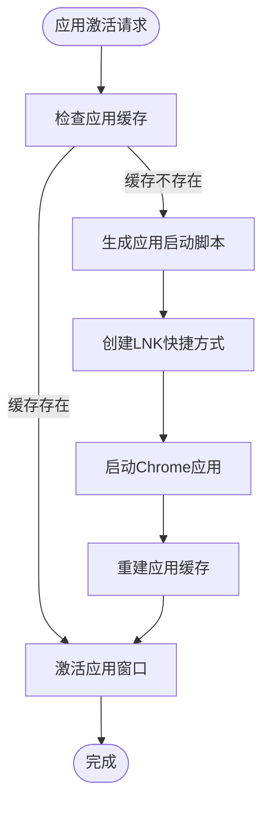
```mermaid
flowchart TD
Start(["应用激活请求"]) --> CheckCache["检查应用缓存"]
CheckCache --> |缓存存在| ActivateWindow["激活应用窗口"]
CheckCache --> |缓存不存在| GenerateApp["生成应用启动脚本"]
GenerateApp --> CreateShortcut["创建LNK快捷方式"]
CreateShortcut --> LaunchApp["启动Chrome应用"]
LaunchApp --> BuildCache["重建应用缓存"]
BuildCache --> ActivateWindow
ActivateWindow --> End(["完成"])
```

**图表来源**
- [ChromeAppMgr.ahk:211-320](file://lib/ChromeAppMgr.ahk#L211-L320)

**章节来源**
- [ChromeAppMgr.ahk:1-321](file://lib/ChromeAppMgr.ahk#L1-L321)
- [browser_apps.json](file://browser_apps.json)

### 超级工作流工具
- **批量文件解压**：通过Bandizip实现文件的批量解压，支持当前目录和同名文件夹两种模式。
- **跨开发工具支持**：针对不同IDE（VS Code、Qoder、IntelliJ IDEA）提供统一的快捷键支持。
- **剪贴板集成**：自动处理选中文件路径的复制和解压操作，提升工作效率。

**更新** 新增超级工作流工具，提供常用文件操作的自动化支持。

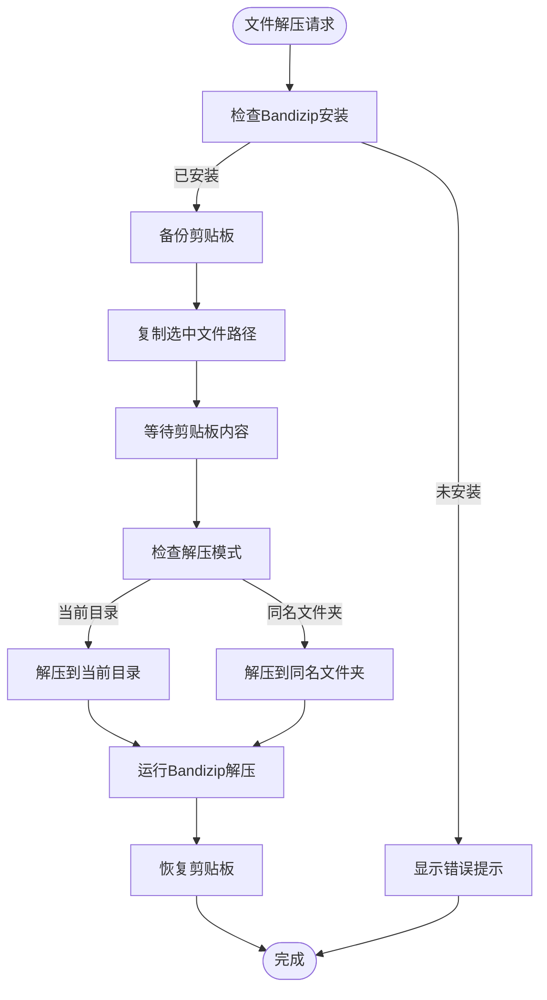
```mermaid
flowchart TD
Start(["文件解压请求"]) --> CheckBandizip["检查Bandizip安装"]
CheckBandizip --> |未安装| ShowError["显示错误提示"]
CheckBandizip --> |已安装| BackupClipboard["备份剪贴板"]
BackupClipboard --> CopyFilePath["复制选中文件路径"]
CopyFilePath --> WaitClipboard["等待剪贴板内容"]
WaitClipboard --> CheckMode["检查解压模式"]
CheckMode --> |当前目录| ExtractHere["解压到当前目录"]
CheckMode --> |同名文件夹| ExtractFolder["解压到同名文件夹"]
ExtractHere --> RunBandizip["运行Bandizip解压"]
ExtractFolder --> RunBandizip
RunBandizip --> RestoreClipboard["恢复剪贴板"]
RestoreClipboard --> End(["完成"])
ShowError --> End
```

**图表来源**
- [superFlow.ahk:6-37](file://superFlow.ahk#L6-L37)

**章节来源**
- [superFlow.ahk:1-72](file://superFlow.ahk#L1-L72)

### 具体热键配置示例与最佳实践
- **应用启动热键**：#F2-#F9等，通过WindowToggle框架实现窗口切换与启动。
- **远程桌面热键**：#\、#^\、#] 等，结合RDPManager实现快速连接与最小化。
- **文件资源管理器切换器**：#e、#^e 等，通过条件热键与GUI实现多窗口切换。
- **Chrome调试热键**：^!u、^!g 等，通过OpenControllerFromNetwork.ahk实现DevTools集成。
- **输入法切换热键**：LWin & z等，通过ImeSwitcher实现智能输入法切换。
- **智能光标感知热键**：^!+3（复制）、^!+4（粘贴），根据光标类型自动选择操作行为。
- **最佳实践**：
  - 使用 #HotIf 控制热键生效范围，避免冲突。
  - 对系统级操作进行权限校验与错误提示。
  - 使用动态热键注册与状态管理，确保热键的启用/禁用切换。
  - 对复杂热键（如组合键）进行测试与验证，确保兼容性。
  - 利用UIA自动化框架实现智能的应用程序控制。
  - 利用智能光标感知功能提升复制粘贴操作的准确性和效率。

**更新** 新增Chrome PWA应用热键、超级工作流热键、智能光标感知热键等，体现模块化架构的优势。

**章节来源**
- [hotkey.ahk:625-750](file://hotkey.ahk#L625-L750)
- [OpenControllerFromNetwork.ahk:34-48](file://OpenControllerFromNetwork.ahk#L34-L48)
- [ImeSwitcher.ahk:14-31](file://lib/ImeSwitcher.ahk#L14-L31)
- [hotkey.ahk:398-452](file://hotkey.ahk#L398-L452)

## 依赖关系分析
系统通过 #Include 引入多个模块，形成松耦合的热键体系。hotkey.ahk作为主入口负责全局初始化与权限管理，OpenControllerFromNetwork.ahk专门处理Chrome调试功能，其他模块提供特定功能支持。

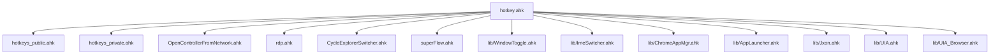
```mermaid
graph TB
Main["hotkey.ahk"] --> Pub["hotkeys_public.ahk"]
Main --> Priv["hotkeys_private.ahk"]
Main --> Dev["OpenControllerFromNetwork.ahk"]
Main --> RDP["rdp.ahk"]
Main --> Exp["CycleExplorerSwitcher.ahk"]
Main --> Super["superFlow.ahk"]
Main --> WinToggle["lib/WindowToggle.ahk"]
Main --> Ime["lib/ImeSwitcher.ahk"]
Main --> ChromeMgr["lib/ChromeAppMgr.ahk"]
Main --> AppLaunch["lib/AppLauncher.ahk"]
Main --> Jxon["lib/Jxon.ahk"]
Main --> UIA["lib/UIA.ahk"]
Main --> UIABrowser["lib/UIA_Browser.ahk"]
```

**图表来源**
- [hotkey.ahk:21-27](file://hotkey.ahk#L21-L27)
- [hotkeys_public.ahk:1-9](file://hotkeys_public.ahk#L1-L9)
- [hotkeys_private.ahk:1-73](file://hotkeys_private.ahk#L1-L73)

**章节来源**
- [hotkey.ahk:21-27](file://hotkey.ahk#L21-L27)

## 性能考量
- **键盘钩子**：强制使用键盘钩子，确保热键响应稳定性与低延迟。
- **基础条件热键**：通过 #HotIf 控制热键生效范围，减少不必要的处理开销。
- **UIA自动化优化**：合理使用UIA框架，避免频繁的系统调用和阻塞操作。
- **动态热键**：集中注册与注销，避免重复绑定与状态混乱。
- **远程桌面优化**：改进剪贴板信号处理机制，减少数据传输开销。
- **窗口激活优化**：增加重试机制和错误处理，提高窗口切换效率。
- **模块化架构**：通过功能分离减少主脚本负担，提高整体性能。
- **智能光标感知优化**：光标类型检测采用轻量级方法，避免性能影响。

**更新** 新增模块化架构的性能优化，包括UIA自动化框架的优化和远程桌面连接优化，以及智能光标感知功能的性能考虑。

## 故障排查指南
- **权限不足**：若提示权限受限，请以管理员身份运行脚本或检查任务计划注册。
- **热键冲突**：检查 #HotIf 条件与热键作用域，确保热键在正确场景下生效。
- **Chrome调试失败**：检查Chrome调试端口状态，确认OpenControllerFromNetwork.ahk模块正常运行。
- **UIA自动化失败**：检查UIA框架初始化状态，确认应用程序可访问性支持。
- **远程桌面问题**：检查剪贴板信号机制，确保RDP连接过程中的数据安全。
- **系统级操作失败**：检查系统任务计划注册状态与权限，必要时手动注册。
- **热键无响应**：确认键盘钩子状态与热键定义，检查条件热键与状态变量。
- **Chrome应用无法激活**：检查ChromeAppMgr缓存状态，确认browser_apps.json配置正确。
- **智能光标感知失效**：检查 A_Cursor 变量获取是否正常，确认光标类型检测逻辑。
- **复制粘贴行为异常**：验证光标类型检测准确性，检查剪贴板状态管理和超时设置。

**更新** 新增智能光标感知相关的故障排查指导，包括光标类型检测和剪贴板状态管理的问题诊断。

**章节来源**
- [hotkey.ahk:30-57](file://hotkey.ahk#L30-L57)
- [OpenControllerFromNetwork.ahk:112-122](file://OpenControllerFromNetwork.ahk#L112-L122)
- [hotkey.ahk:398-452](file://hotkey.ahk#L398-L452)

## 结论
本热键管理系统通过完全模块化重构，实现了从900+行复杂代码到36行精简主脚本的转变。系统现已演进为hotkey.ahk专注于核心热键管理，OpenControllerFromNetwork.ahk专门处理Chrome调试功能，ChromeAppMgr.ahk管理Chrome PWA应用，WindowToggle.ahk提供统一的应用程序启动框架的架构。这种模块化设计不仅大幅减少了主脚本的复杂度，还提供了更好的可维护性和扩展性，同时保持了功能的完整性。

**重要说明** 经过分析发现，系统已成功迁移到完全模块化架构，hotkey.ahk现在专注于应用程序控制和热键管理，而Chrome调试功能已完全迁移到OpenControllerFromNetwork.ahk模块。这种架构变化显著提高了系统的可维护性和扩展性，同时通过UIA自动化框架和Chrome PWA应用管理器提供了更强大的应用程序控制能力。

**新增功能总结** 最新的智能光标感知复制粘贴功能进一步提升了用户体验，通过精确的光标类型检测实现了更智能的交互行为。该功能在Chrome浏览器和文件资源管理器中都有应用，能够根据用户的实际操作意图自动选择最合适的处理方式，减少误操作并提高工作效率。

## 附录
- **热键定义语法参考**：#F1-#F12、#（Win）、^（Ctrl）、!（Alt）、+（Shift）组合、{Blind} 盲注修饰键、#HotIf 基础条件热键。
- **功能模块参考**：公共热键模板、私有热键模板、Chrome调试控制器、远程桌面热键、文件资源管理器切换器、超级工作流工具、智能光标感知功能。
- **UIA自动化框架**：UIA.ahk和UIA_Browser.ahk提供强大的应用程序控制能力。
- **最佳实践**：使用 #HotIf 控制热键生效范围、对系统级操作进行权限校验、使用动态热键注册与状态管理、利用UIA自动化框架实现智能应用程序控制、善用智能光标感知功能提升操作效率。
- **性能优化**：键盘钩子优化、基础条件热键控制、UIA自动化优化、远程桌面连接优化、模块化架构优化、智能光标感知性能考虑。
- **安全机制**：权限自提升、任务计划注册、RDP连接安全、剪贴板信号保护、Chrome调试端口安全、光标状态检测安全。
- **新功能特性**：Chrome PWA应用管理、智能输入法切换、批量文件解压、跨开发工具支持、智能光标感知复制粘贴。
- **智能光标感知技术细节**：A_Cursor 光标类型检测、IBeam 文本光标识别、arrow 普通光标识别、剪贴板状态管理、超时检测机制。