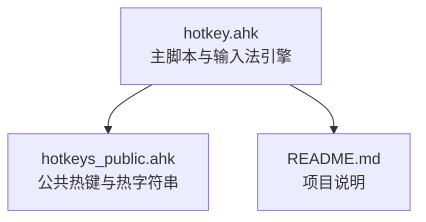
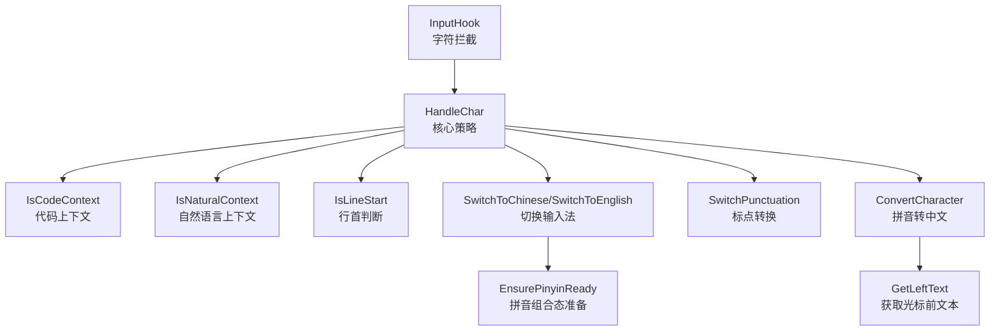
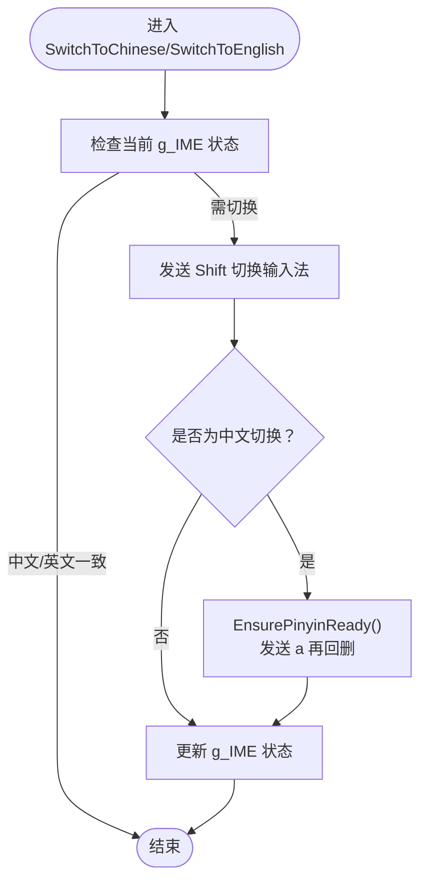
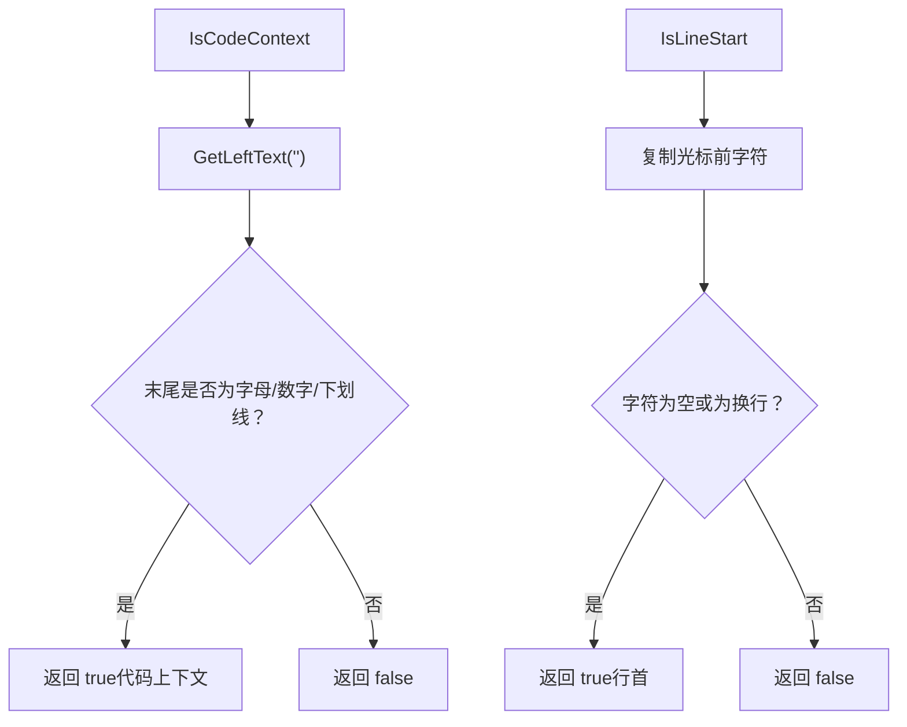
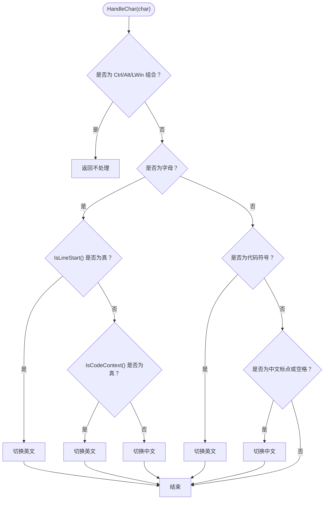
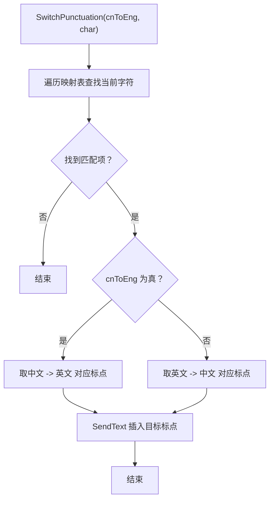
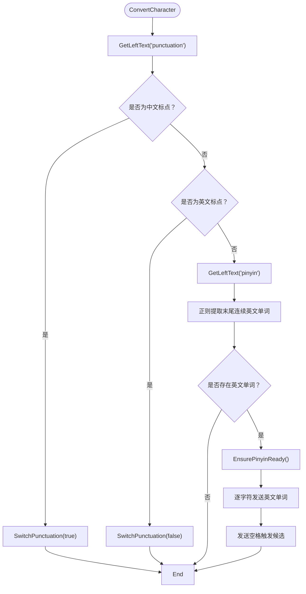
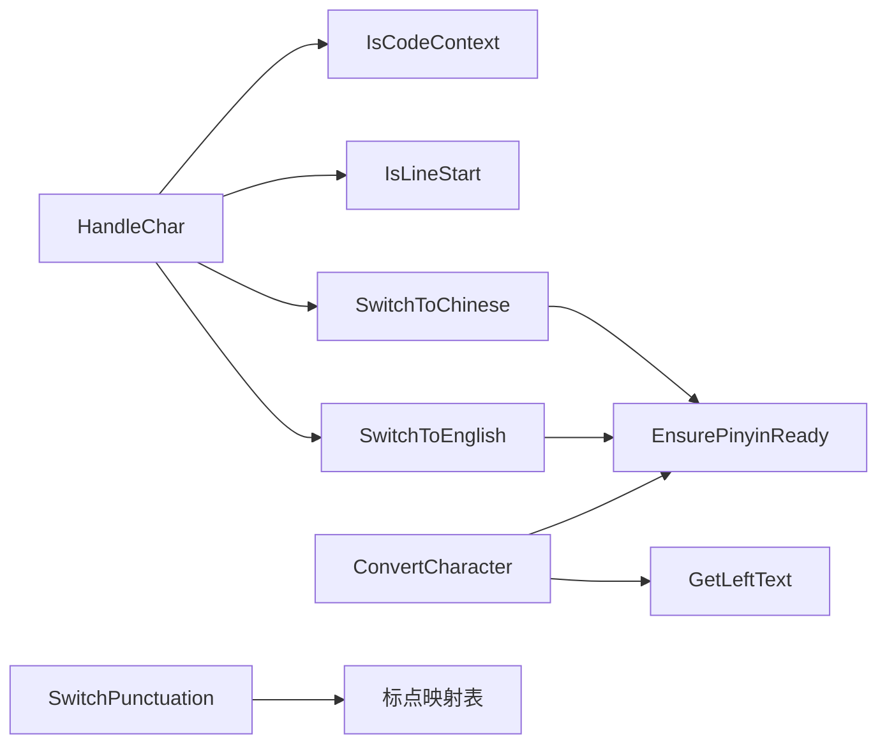

# 输入法智能切换

<cite>
**本文档引用的文件**
- [hotkey.ahk](file://hotkey.ahk)
- [hotkeys_public.ahk](file://hotkeys_public.ahk)
- [README.md](file://README.md)
</cite>

## 目录
1. [简介](#简介)
2. [项目结构](#项目结构)
3. [核心组件](#核心组件)
4. [架构总览](#架构总览)
5. [详细组件分析](#详细组件分析)
6. [依赖关系分析](#依赖关系分析)
7. [性能考量](#性能考量)
8. [故障排查指南](#故障排查指南)
9. [结论](#结论)
10. [附录](#附录)

## 简介
本文件面向 hotkey 项目中的“输入法智能切换引擎”，系统性阐述其上下文检测算法、输入拦截机制、智能切换策略与标点符号智能转换、拼音输入处理、输入法状态管理与 IME 组合态处理、字符转换机制，并提供性能优化建议与调试技巧。目标读者既包括需要快速上手的使用者，也包括希望深入理解实现细节的工程师。

## 项目结构
hotkey 项目以 AutoHotkey v2 脚本为核心，围绕“输入法智能切换引擎”组织功能模块。主要涉及以下文件：
- hotkey.ahk：主脚本，包含输入法切换引擎、上下文检测、标点转换、拼音处理、热键绑定等
- hotkeys_public.ahk：公共热字符串与常用快捷操作
- README.md：项目简述

图表来源
- [hotkey.ahk:1-50](file://hotkey.ahk#L1-L50)
- [hotkeys_public.ahk:1-57](file://hotkeys_public.ahk#L1-L57)
- [README.md:1-2](file://README.md#L1-L2)

章节来源
- [hotkey.ahk:1-50](file://hotkey.ahk#L1-L50)
- [hotkeys_public.ahk:1-57](file://hotkeys_public.ahk#L1-L57)
- [README.md:1-2](file://README.md#L1-L2)

## 核心组件
- 输入法状态管理：维护当前输入法状态（中文/英文），并通过按键切换
- 上下文检测：判断当前输入所处的语境（代码/自然语言/行首）
- 输入拦截：通过 InputHook 捕获字符事件，驱动切换策略
- 智能切换策略：基于上下文与字符类型自动切换输入法
- 标点符号智能转换：将中文标点转换为英文标点，或将英文标点转换为中文标点
- 拼音输入处理：将光标前英文单词转换为中文拼音候选并触发中文输入

章节来源
- [hotkey.ahk:308-404](file://hotkey.ahk#L308-L404)
- [hotkey.ahk:452-563](file://hotkey.ahk#L452-L563)

## 架构总览
输入法智能切换引擎由“状态管理 + 上下文检测 + 输入拦截 + 切换策略 + 字符转换”五部分组成，形成闭环：输入字符 → 拦截 → 分析上下文 → 切换输入法 → 标点/拼音转换 → 输出。

图表来源
- [hotkey.ahk:367-404](file://hotkey.ahk#L367-L404)
- [hotkey.ahk:330-355](file://hotkey.ahk#L330-L355)
- [hotkey.ahk:310-326](file://hotkey.ahk#L310-L326)
- [hotkey.ahk:443-450](file://hotkey.ahk#L443-L450)
- [hotkey.ahk:521-563](file://hotkey.ahk#L521-L563)
- [hotkey.ahk:453-518](file://hotkey.ahk#L453-L518)
- [hotkey.ahk:409-440](file://hotkey.ahk#L409-L440)

## 详细组件分析

### 输入法状态管理与切换
- 默认状态：中文（g_IME = zh）
- 切换逻辑：
  - 切中文：若当前非中文，发送 Shift 并确保拼音组合态就绪
  - 切英文：若当前非英文，发送 Shift
- 拼音组合态准备：通过发送 a 再回删的方式，确保 IME 进入拼音组合态，便于后续拼音输入

图表来源
- [hotkey.ahk:310-326](file://hotkey.ahk#L310-L326)
- [hotkey.ahk:443-450](file://hotkey.ahk#L443-L450)

章节来源
- [hotkey.ahk:308-326](file://hotkey.ahk#L308-L326)
- [hotkey.ahk:443-450](file://hotkey.ahk#L443-L450)

### 上下文检测算法
- IsCodeContext：判断光标前最后一个字符是否为字母/数字/下划线，若是则认为处于代码上下文
- IsNaturalContext：IsCodeContext 的取反
- IsLineStart：通过复制光标前字符判断是否为空或换行，从而判定是否处于行首

图表来源
- [hotkey.ahk:330-355](file://hotkey.ahk#L330-L355)
- [hotkey.ahk:409-440](file://hotkey.ahk#L409-L440)

章节来源
- [hotkey.ahk:330-355](file://hotkey.ahk#L330-L355)
- [hotkey.ahk:409-440](file://hotkey.ahk#L409-L440)

### 输入拦截机制（InputHook）
- 说明：代码中预留了 InputHook 的初始化与回调绑定注释，表明具备通过 OnChar 事件拦截字符的能力
- 实际使用建议：
  - 在脚本启动时创建 InputHook("V") 并绑定 OnChar
  - 在 OnChar 中调用 HandleChar(char) 进行策略处理
  - 注意：InputHook 的启用与生命周期管理需在主流程中显式初始化

章节来源
- [hotkey.ahk:357-362](file://hotkey.ahk#L357-L362)

### 核心策略逻辑（HandleChar）
- 组合键过滤：若检测到 Ctrl/Alt/LWin 按键按下，直接返回，不进行切换
- 字母输入：
  - 若处于行首：切换英文
  - 若处于代码上下文：切换英文
  - 否则：切换中文
- 代码符号输入：统一切换英文
- 中文标点或空格：切换中文

图表来源
- [hotkey.ahk:367-404](file://hotkey.ahk#L367-L404)

章节来源
- [hotkey.ahk:367-404](file://hotkey.ahk#L367-L404)

### 标点符号智能转换（SwitchPunctuation）
- 功能：根据目标标点类型（中文/英文）与当前光标前字符，从映射表中查找对应标点并直接插入
- 机制：使用 SendText 直接向当前输入上下文插入 Unicode 文本，绕过按键事件
- 特殊规则：
  - 中文顿号“、”转换为代码注释符号“// ”
  - 中文破折号“—”转换为英文下划线“_”
  - 中文“·”转换为反引号“`”

图表来源
- [hotkey.ahk:521-563](file://hotkey.ahk#L521-L563)

章节来源
- [hotkey.ahk:521-563](file://hotkey.ahk#L521-L563)

### 拼音输入处理（ConvertCharacter）
- 流程：
  1) 获取光标前字符，判断是否为中文标点或英文标点，分别调用 SwitchPunctuation
  2) 若为英文单词，强制 IME 进入拼音组合态（发送 a 再回删）
  3) 逐字符发送英文单词，等待 IME 处理
  4) 发送空格触发中文候选，等待 IME 自动完成
- 复杂度：O(n)，n 为英文单词长度；受 IME 响应时间影响
- 失败回退：当前实现未包含重试/回退逻辑，建议在调用方增加超时与重试策略

图表来源
- [hotkey.ahk:453-518](file://hotkey.ahk#L453-L518)
- [hotkey.ahk:443-450](file://hotkey.ahk#L443-L450)

章节来源
- [hotkey.ahk:453-518](file://hotkey.ahk#L453-L518)
- [hotkey.ahk:443-450](file://hotkey.ahk#L443-L450)

### IME 组合态处理与字符转换机制
- 组合态准备：EnsurePinyinReady 通过发送 a 再回删，确保 IME 进入拼音组合态，便于后续拼音输入
- 字符插入：SwitchPunctuation 使用 SendText 直接插入 Unicode 文本，不生成按键事件，避免二次拦截与重复切换
- 策略一致性：在 HandleChar 中，所有切换均通过 Send "{Shift}" 实现，保证与系统输入法切换一致

章节来源
- [hotkey.ahk:443-450](file://hotkey.ahk#L443-L450)
- [hotkey.ahk:521-563](file://hotkey.ahk#L521-L563)
- [hotkey.ahk:310-326](file://hotkey.ahk#L310-L326)

### 切换策略配置与示例
- 默认策略：
  - 行首输入字母 → 英文
  - 代码上下文 → 英文
  - 其他自然语言 → 中文
  - 代码符号 → 英文
  - 中文标点/空格 → 中文
- 配置入口：
  - 通过热键 LWin & z 触发 ConvertCharacter，实现光标前英文单词转中文
  - 通过热键 ^+w 控制特定窗口状态（演示热键绑定风格）

章节来源
- [hotkey.ahk:367-404](file://hotkey.ahk#L367-L404)
- [hotkey.ahk:565-571](file://hotkey.ahk#L565-L571)
- [hotkey.ahk:573-587](file://hotkey.ahk#L573-L587)

## 依赖关系分析
- 模块耦合：
  - HandleChar 依赖 IsCodeContext、IsLineStart、SwitchToChinese、SwitchToEnglish
  - SwitchPunctuation 依赖映射表与 SendText
  - ConvertCharacter 依赖 GetLeftText、EnsurePinyinReady、正则匹配
- 外部依赖：
  - AutoHotkey v2 的 InputHook、Send、SendText、RegExMatch、GetKeyState、WinActive 等 API
  - 系统输入法切换（通过 Shift 键）

图表来源
- [hotkey.ahk:367-404](file://hotkey.ahk#L367-L404)
- [hotkey.ahk:330-355](file://hotkey.ahk#L330-L355)
- [hotkey.ahk:310-326](file://hotkey.ahk#L310-L326)
- [hotkey.ahk:443-450](file://hotkey.ahk#L443-L450)
- [hotkey.ahk:453-518](file://hotkey.ahk#L453-L518)
- [hotkey.ahk:521-563](file://hotkey.ahk#L521-L563)

章节来源
- [hotkey.ahk:367-404](file://hotkey.ahk#L367-L404)
- [hotkey.ahk:453-518](file://hotkey.ahk#L453-L518)
- [hotkey.ahk:521-563](file://hotkey.ahk#L521-L563)

## 性能考量
- 时间复杂度：
  - 上下文检测：O(1)（依赖剪贴板与少量按键模拟）
  - 标点转换：O(k)（k 为映射表长度，常数级）
  - 拼音转换：O(n)（n 为英文单词长度）
- 延迟与稳定性：
  - EnsurePinyinReady 与拼音输入依赖 IME 响应，存在不确定性
  - 建议在关键路径增加超时与重试策略，避免阻塞
- 资源占用：
  - InputHook 启用后会持续拦截字符事件，需在主流程中合理管理生命周期
  - 剪贴板频繁读写可能带来额外开销，建议在必要时才备份/恢复

## 故障排查指南
- 输入法未切换：
  - 检查是否处于组合键状态（Ctrl/Alt/LWin），组合键会被过滤
  - 确认 g_IME 状态与期望一致
- 标点未正确转换：
  - 检查映射表中是否存在目标标点
  - 确认当前输入上下文是否为预期（中文/英文）
- 拼音未触发候选：
  - 确认 EnsurePinyinReady 已执行
  - 检查英文单词是否被正确提取
  - 建议增加超时与重试逻辑
- InputHook 未生效：
  - 确认已在主流程中创建 InputHook("V") 并绑定 OnChar
  - 检查脚本权限与运行环境

章节来源
- [hotkey.ahk:367-404](file://hotkey.ahk#L367-L404)
- [hotkey.ahk:521-563](file://hotkey.ahk#L521-L563)
- [hotkey.ahk:453-518](file://hotkey.ahk#L453-L518)
- [hotkey.ahk:357-362](file://hotkey.ahk#L357-L362)

## 结论
hotkey 项目中的输入法智能切换引擎以简洁高效的策略实现了“自然语言中文、代码英文”的智能切换，并提供了标点符号与拼音输入的辅助能力。通过上下文检测与输入拦截机制，引擎能够在不干扰组合键的前提下，自动适配不同输入场景。建议在生产环境中补充 InputHook 生命周期管理、超时与重试机制，以及更完善的日志与调试手段，以进一步提升稳定性与可观测性。

## 附录
- 相关热键示例（用于演示与参考）：
  - LWin & z：触发 ConvertCharacter，将光标前英文单词转中文
  - ^+w：控制特定窗口状态（演示热键绑定风格）
- 公共热字符串与快捷操作位于 hotkeys_public.ahk，可作为扩展输入法功能的参考

章节来源
- [hotkey.ahk:565-571](file://hotkey.ahk#L565-L571)
- [hotkey.ahk:573-587](file://hotkey.ahk#L573-L587)
- [hotkeys_public.ahk:1-57](file://hotkeys_public.ahk#L1-L57)