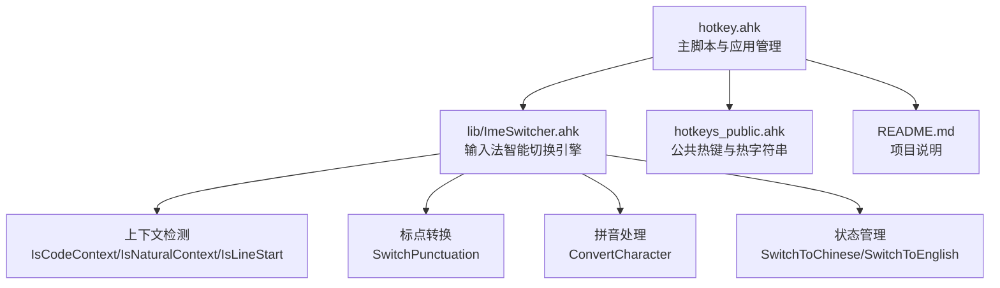
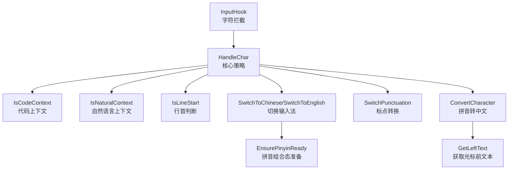
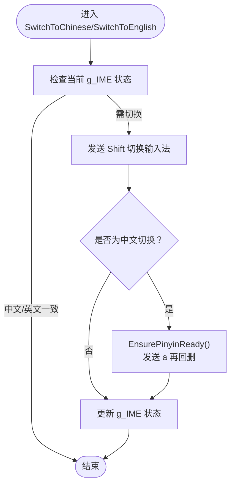
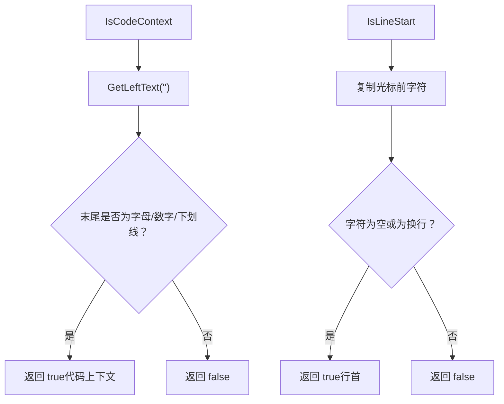
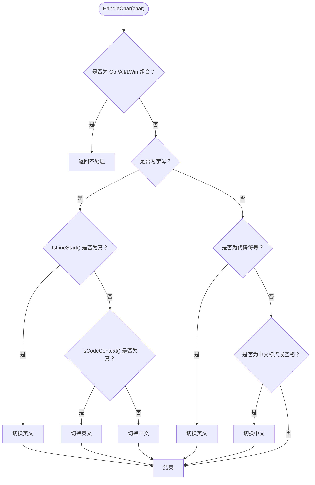
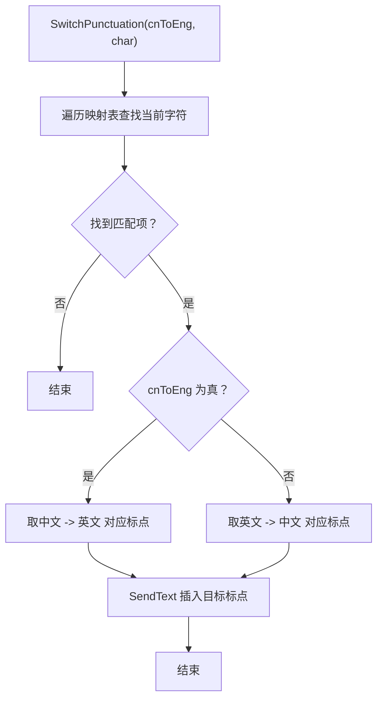
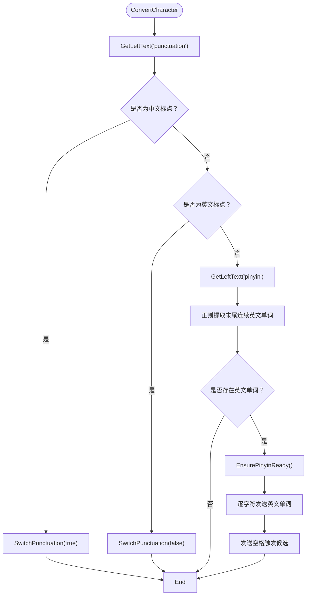
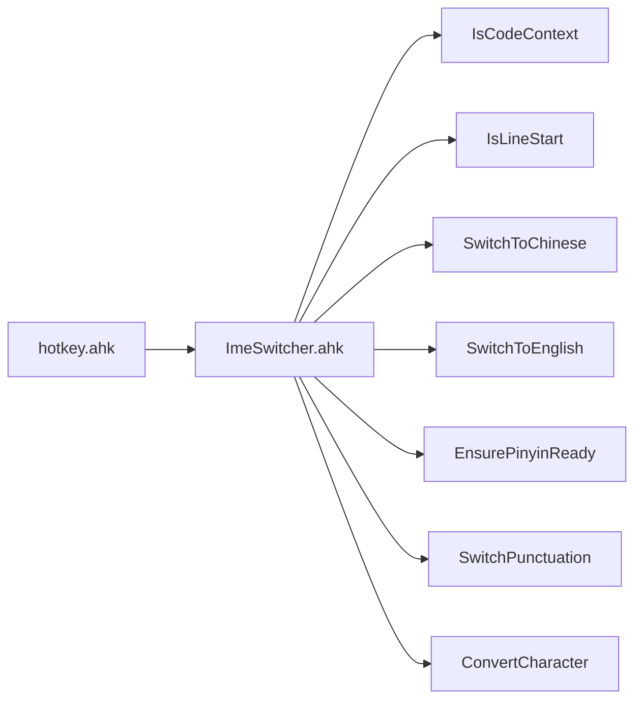

# 输入法智能切换

<cite>
**本文档引用的文件**
- [hotkey.ahk](file://hotkey.ahk)
- [ImeSwitcher.ahk](file://lib/ImeSwitcher.ahk)
- [hotkeys_public.ahk](file://hotkeys_public.ahk)
- [README.md](file://README.md)
</cite>

## 更新摘要
**变更内容**
- 输入法智能切换引擎从主脚本拆分为独立模块 `lib/ImeSwitcher.ahk`
- 新增完整的上下文检测算法实现
- 增强标点符号智能转换功能
- 改进拼音输入处理机制
- 新增 `LWin & z` 热键绑定用于触发拼音转换
- 优化 IME 组合态处理和字符转换机制

## 目录
1. [简介](#简介)
2. [项目结构](#项目结构)
3. [核心组件](#核心组件)
4. [架构总览](#架构总览)
5. [详细组件分析](#详细组件分析)
6. [依赖关系分析](#依赖关系分析)
7. [性能考量](#性能考量)
8. [故障排查指南](#故障排查指南)
9. [结论](#结论)
10. [附录](#附录)

## 简介
本文件面向 hotkey 项目中的"输入法智能切换引擎"，系统性阐述其上下文检测算法、输入拦截机制、智能切换策略与标点符号智能转换、拼音输入处理、输入法状态管理与 IME 组合态处理、字符转换机制，并提供性能优化建议与调试技巧。经过最新优化，引擎现已拆分为独立模块，提供更稳定和可维护的功能实现。

## 项目结构
hotkey 项目以 AutoHotkey v2 脚本为核心，围绕"输入法智能切换引擎"组织功能模块。主要涉及以下文件：
- hotkey.ahk：主脚本，包含应用启动、窗口管理、热键绑定等功能
- lib/ImeSwitcher.ahk：输入法智能切换引擎模块，包含完整的上下文检测、标点转换、拼音处理功能
- hotkeys_public.ahk：公共热字符串与常用快捷操作
- README.md：项目简述

```mermaid
graph TB
A["hotkey.ahk<br/>主脚本与应用管理"] --> B["lib/ImeSwitcher.ahk<br/>输入法智能切换引擎"]
A --> C["hotkeys_public.ahk<br/>公共热键与热字符串"]
A --> D["README.md<br/>项目说明"]
B --> E["上下文检测<br/>IsCodeContext/IsNaturalContext/IsLineStart"]
B --> F["标点转换<br/>SwitchPunctuation"]
B --> G["拼音处理<br/>ConvertCharacter"]
B --> H["状态管理<br/>SwitchToChinese/SwitchToEnglish"]
```

**图表来源**
- [hotkey.ahk:135-147](file://hotkey.ahk#L135-L147)
- [ImeSwitcher.ahk:1-243](file://lib/ImeSwitcher.ahk#L1-L243)

**章节来源**
- [hotkey.ahk:135-147](file://hotkey.ahk#L135-L147)
- [ImeSwitcher.ahk:1-243](file://lib/ImeSwitcher.ahk#L1-L243)
- [README.md:1-2](file://README.md#L1-L2)

## 核心组件
- **输入法状态管理**：维护当前输入法状态（中文/英文），并通过按键切换
- **上下文检测**：判断当前输入所处的语境（代码/自然语言/行首）
- **输入拦截**：通过 InputHook 捕获字符事件，驱动切换策略
- **智能切换策略**：基于上下文与字符类型自动切换输入法
- **标点符号智能转换**：将中文标点转换为英文标点，或将英文标点转换为中文标点
- **拼音输入处理**：将光标前英文单词转换为中文拼音候选并触发中文输入
- **模块化设计**：输入法引擎已拆分为独立模块，提高代码可维护性和复用性

**章节来源**
- [ImeSwitcher.ahk:19-40](file://lib/ImeSwitcher.ahk#L19-L40)
- [ImeSwitcher.ahk:42-67](file://lib/ImeSwitcher.ahk#L42-L67)
- [ImeSwitcher.ahk:77-110](file://lib/ImeSwitcher.ahk#L77-L110)
- [ImeSwitcher.ahk:206-242](file://lib/ImeSwitcher.ahk#L206-L242)
- [ImeSwitcher.ahk:154-204](file://lib/ImeSwitcher.ahk#L154-L204)

## 架构总览
输入法智能切换引擎由"状态管理 + 上下文检测 + 输入拦截 + 切换策略 + 字符转换"五部分组成，形成闭环：输入字符 → 拦截 → 分析上下文 → 切换输入法 → 标点/拼音转换 → 输出。引擎现已模块化，通过主脚本的热键绑定触发核心功能。

```mermaid
graph TB
IH["InputHook<br/>字符拦截"] --> HS["HandleChar<br/>核心策略"]
HS --> CT["IsCodeContext<br/>代码上下文"]
HS --> NL["IsNaturalContext<br/>自然语言上下文"]
HS --> LS["IsLineStart<br/>行首判断"]
HS --> ST["SwitchToChinese/SwitchToEnglish<br/>切换输入法"]
ST --> PR["EnsurePinyinReady<br/>拼音组合态准备"]
HS --> PC["SwitchPunctuation<br/>标点转换"]
HS --> CV["ConvertCharacter<br/>拼音转中文"]
CV --> GL["GetLeftText<br/>获取光标前文本"]
```

**图表来源**
- [ImeSwitcher.ahk:77-110](file://lib/ImeSwitcher.ahk#L77-L110)
- [ImeSwitcher.ahk:42-67](file://lib/ImeSwitcher.ahk#L42-L67)
- [ImeSwitcher.ahk:19-40](file://lib/ImeSwitcher.ahk#L19-L40)
- [ImeSwitcher.ahk:144-152](file://lib/ImeSwitcher.ahk#L144-L152)
- [ImeSwitcher.ahk:206-242](file://lib/ImeSwitcher.ahk#L206-L242)
- [ImeSwitcher.ahk:154-204](file://lib/ImeSwitcher.ahk#L154-L204)

## 详细组件分析

### 输入法状态管理与切换
- **默认状态**：中文（g_IME = "zh"）
- **切换逻辑**：
  - 切中文：若当前非中文，发送 Shift 并确保拼音组合态就绪
  - 切英文：若当前非英文，发送 Shift
- **拼音组合态准备**：通过发送 a 再回删的方式，确保 IME 进入拼音组合态，便于后续拼音输入

```mermaid
flowchart TD
Start(["进入 SwitchToChinese/SwitchToEnglish"]) --> CheckState["检查当前 g_IME 状态"]
CheckState --> |中文/英文一致| End(["结束"])
CheckState --> |需切换| SendShift["发送 Shift 切换输入法"]
SendShift --> EnsurePinyin{"是否为中文切换？"}
EnsurePinyin --> |是| PinyinReady["EnsurePinyinReady()<br/>发送 a 再回删"]
EnsurePinyin --> |否| UpdateState["更新 g_IME 状态"]
PinyinReady --> UpdateState
UpdateState --> End
```

**图表来源**
- [ImeSwitcher.ahk:22-40](file://lib/ImeSwitcher.ahk#L22-L40)
- [ImeSwitcher.ahk:144-152](file://lib/ImeSwitcher.ahk#L144-L152)

**章节来源**
- [ImeSwitcher.ahk:19-40](file://lib/ImeSwitcher.ahk#L19-L40)
- [ImeSwitcher.ahk:144-152](file://lib/ImeSwitcher.ahk#L144-L152)

### 上下文检测算法
- **IsCodeContext**：判断光标前最后一个字符是否为字母/数字/下划线，若是则认为处于代码上下文
- **IsNaturalContext**：IsCodeContext 的取反
- **IsLineStart**：通过复制光标前字符判断是否为空或换行，从而判定是否处于行首

```mermaid
flowchart TD
A["IsCodeContext"] --> B["GetLeftText('')"]
B --> C{"末尾是否为字母/数字/下划线？"}
C --> |是| D["返回 true代码上下文"]
C --> |否| E["返回 false"]
F["IsLineStart"] --> G["复制光标前字符"]
G --> H{"字符为空或为换行？"}
H --> |是| I["返回 true行首"]
H --> |否| J["返回 false"]
```

**图表来源**
- [ImeSwitcher.ahk:42-51](file://lib/ImeSwitcher.ahk#L42-L51)
- [ImeSwitcher.ahk:53-67](file://lib/ImeSwitcher.ahk#L53-L67)

**章节来源**
- [ImeSwitcher.ahk:42-51](file://lib/ImeSwitcher.ahk#L42-L51)
- [ImeSwitcher.ahk:53-67](file://lib/ImeSwitcher.ahk#L53-L67)

### 输入拦截机制（InputHook）
- **说明**：代码中预留了 InputHook 的初始化与回调绑定注释，表明具备通过 OnChar 事件拦截字符的能力
- **实际使用建议**：
  - 在脚本启动时创建 InputHook("V") 并绑定 OnChar
  - 在 OnChar 中调用 HandleChar(char) 进行策略处理
  - 注意：InputHook 的启用与生命周期管理需在主流程中显式初始化

**章节来源**
- [ImeSwitcher.ahk:69-75](file://lib/ImeSwitcher.ahk#L69-L75)

### 核心策略逻辑（HandleChar）
- **组合键过滤**：若检测到 Ctrl/Alt/LWin 按键按下，直接返回，不进行切换
- **字母输入**：
  - 若处于行首：切换英文
  - 若处于代码上下文：切换英文
  - 否则：切换中文
- **代码符号输入**：统一切换英文
- **中文标点或空格**：切换中文

```mermaid
flowchart TD
S(["HandleChar(char)"]) --> Combo{"是否为 Ctrl/Alt/LWin 组合？"}
Combo --> |是| R1["返回不处理"]
Combo --> |否| Letter{"是否为字母？"}
Letter --> |是| LineStart{"IsLineStart() 是否为真？"}
LineStart --> |是| Eng1["切换英文"] --> End
LineStart --> |否| CodeCtx{"IsCodeContext() 是否为真？"}
CodeCtx --> |是| Eng2["切换英文"] --> End
CodeCtx --> |否| Chn["切换中文"] --> End
Letter --> |否| Symbol{"是否为代码符号？"}
Symbol --> |是| Eng3["切换英文"] --> End
Symbol --> |否| Punct{"是否为中文标点或空格？"}
Punct --> |是| Chn2["切换中文"] --> End
Punct --> |否| End["结束"]
```

**图表来源**
- [ImeSwitcher.ahk:77-110](file://lib/ImeSwitcher.ahk#L77-L110)

**章节来源**
- [ImeSwitcher.ahk:77-110](file://lib/ImeSwitcher.ahk#L77-L110)

### 标点符号智能转换（SwitchPunctuation）
- **功能**：根据目标标点类型（中文/英文）与当前光标前字符，从映射表中查找对应标点并直接插入
- **机制**：使用 SendText 直接向当前输入上下文插入 Unicode 文本，绕过按键事件
- **特殊规则**：
  - 中文顿号"、"转换为代码注释符号"// "
  - 中文破折号"—"转换为英文下划线"_"
  - 中文"·"转换为反引号"`"

```mermaid
flowchart TD
A["SwitchPunctuation(cnToEng, char)"] --> B["遍历映射表查找当前字符"]
B --> C{"找到匹配项？"}
C --> |否| D["结束"]
C --> |是| E{"cnToEng 为真？"}
E --> |是| F["取中文 -> 英文 对应标点"]
E --> |否| G["取英文 -> 中文 对应标点"]
F --> H["SendText 插入目标标点"]
G --> H
H --> I["结束"]
```

**图表来源**
- [ImeSwitcher.ahk:206-242](file://lib/ImeSwitcher.ahk#L206-L242)

**章节来源**
- [ImeSwitcher.ahk:206-242](file://lib/ImeSwitcher.ahk#L206-L242)

### 拼音输入处理（ConvertCharacter）
- **流程**：
  1) 获取光标前字符，判断是否为中文标点或英文标点，分别调用 SwitchPunctuation
  2) 若为英文单词，强制 IME 进入拼音组合态（发送 a 再回删）
  3) 逐字符发送英文单词，等待 IME 处理
  4) 发送空格触发中文候选，等待 IME 自动完成
- **复杂度**：O(n)，n 为英文单词长度；受 IME 响应时间影响
- **失败回退**：当前实现未包含重试/回退逻辑，建议在调用方增加超时与重试策略

```mermaid
flowchart TD
S(["ConvertCharacter"]) --> P1["GetLeftText('punctuation')"]
P1 --> Judge1{"是否为中文标点？"}
Judge1 --> |是| SP1["SwitchPunctuation(true)"] --> End
Judge1 --> |否| Judge2{"是否为英文标点？"}
Judge2 --> |是| SP2["SwitchPunctuation(false)"] --> End
Judge2 --> |否| P2["GetLeftText('pinyin')"]
P2 --> Regex["正则提取末尾连续英文单词"]
Regex --> Word{"是否存在英文单词？"}
Word --> |否| End
Word --> |是| Prep["EnsurePinyinReady()"]
Prep --> SendWord["逐字符发送英文单词"]
SendWord --> Space["发送空格触发候选"]
Space --> End
```

**图表来源**
- [ImeSwitcher.ahk:154-204](file://lib/ImeSwitcher.ahk#L154-L204)
- [ImeSwitcher.ahk:144-152](file://lib/ImeSwitcher.ahk#L144-L152)

**章节来源**
- [ImeSwitcher.ahk:154-204](file://lib/ImeSwitcher.ahk#L154-L204)
- [ImeSwitcher.ahk:144-152](file://lib/ImeSwitcher.ahk#L144-L152)

### IME 组合态处理与字符转换机制
- **组合态准备**：EnsurePinyinReady 通过发送 a 再回删，确保 IME 进入拼音组合态，便于后续拼音输入
- **字符插入**：SwitchPunctuation 使用 SendText 直接插入 Unicode 文本，不生成按键事件，避免二次拦截与重复切换
- **策略一致性**：在 HandleChar 中，所有切换均通过 Send "{Shift}" 实现，保证与系统输入法切换一致

**章节来源**
- [ImeSwitcher.ahk:144-152](file://lib/ImeSwitcher.ahk#L144-L152)
- [ImeSwitcher.ahk:206-242](file://lib/ImeSwitcher.ahk#L206-L242)
- [ImeSwitcher.ahk:22-40](file://lib/ImeSwitcher.ahk#L22-L40)

### 切换策略配置与示例
- **默认策略**：
  - 行首输入字母 → 英文
  - 代码上下文 → 英文
  - 其他自然语言 → 中文
  - 代码符号 → 英文
  - 中文标点/空格 → 中文
- **配置入口**：
  - 通过热键 LWin & z 触发 ConvertCharacter，实现光标前英文单词转中文
  - 通过热键 ^+w 控制特定窗口状态（演示热键绑定风格）

**章节来源**
- [ImeSwitcher.ahk:77-110](file://lib/ImeSwitcher.ahk#L77-L110)
- [hotkey.ahk:143-147](file://hotkey.ahk#L143-L147)
- [hotkey.ahk:149-163](file://hotkey.ahk#L149-L163)

## 依赖关系分析
- **模块耦合**：
  - HandleChar 依赖 IsCodeContext、IsLineStart、SwitchToChinese、SwitchToEnglish
  - SwitchPunctuation 依赖映射表与 SendText
  - ConvertCharacter 依赖 GetLeftText、EnsurePinyinReady、正则匹配
- **外部依赖**：
  - AutoHotkey v2 的 InputHook、Send、SendText、RegExMatch、GetKeyState、WinActive 等 API
  - 系统输入法切换（通过 Shift 键）
- **模块化设计**：
  - 主脚本通过 #Include 指令引入 ImeSwitcher.ahk
  - 热键绑定在主脚本中定义，调用模块中的核心函数

```mermaid
graph LR
hotkey.ahk --> ImeSwitcher.ahk
ImeSwitcher.ahk --> IsCodeContext
ImeSwitcher.ahk --> IsLineStart
ImeSwitcher.ahk --> SwitchToChinese
ImeSwitcher.ahk --> SwitchToEnglish
ImeSwitcher.ahk --> EnsurePinyinReady
ImeSwitcher.ahk --> SwitchPunctuation
ImeSwitcher.ahk --> ConvertCharacter
```

**图表来源**
- [hotkey.ahk:135-147](file://hotkey.ahk#L135-L147)
- [ImeSwitcher.ahk:77-110](file://lib/ImeSwitcher.ahk#L77-L110)
- [ImeSwitcher.ahk:19-40](file://lib/ImeSwitcher.ahk#L19-L40)
- [ImeSwitcher.ahk:144-152](file://lib/ImeSwitcher.ahk#L144-L152)
- [ImeSwitcher.ahk:206-242](file://lib/ImeSwitcher.ahk#L206-L242)
- [ImeSwitcher.ahk:154-204](file://lib/ImeSwitcher.ahk#L154-L204)

**章节来源**
- [hotkey.ahk:135-147](file://hotkey.ahk#L135-L147)
- [ImeSwitcher.ahk:77-110](file://lib/ImeSwitcher.ahk#L77-L110)
- [ImeSwitcher.ahk:154-204](file://lib/ImeSwitcher.ahk#L154-L204)
- [ImeSwitcher.ahk:206-242](file://lib/ImeSwitcher.ahk#L206-L242)

## 性能考量
- **时间复杂度**：
  - 上下文检测：O(1)（依赖剪贴板与少量按键模拟）
  - 标点转换：O(k)（k 为映射表长度，常数级）
  - 拼音转换：O(n)（n 为英文单词长度）
- **延迟与稳定性**：
  - EnsurePinyinReady 与拼音输入依赖 IME 响应，存在不确定性
  - 建议在关键路径增加超时与重试策略，避免阻塞
- **资源占用**：
  - InputHook 启用后会持续拦截字符事件，需在主流程中合理管理生命周期
  - 剪贴板频繁读写可能带来额外开销，建议在必要时才备份/恢复
- **模块化优势**：
  - 独立模块化设计提高了代码复用性和维护性
  - 减少了主脚本的复杂度，便于功能扩展

## 故障排查指南
- **输入法未切换**：
  - 检查是否处于组合键状态（Ctrl/Alt/LWin），组合键会被过滤
  - 确认 g_IME 状态与期望一致
- **标点未正确转换**：
  - 检查映射表中是否存在目标标点
  - 确认当前输入上下文是否为预期（中文/英文）
- **拼音未触发候选**：
  - 确认 EnsurePinyinReady 已执行
  - 检查英文单词是否被正确提取
  - 建议增加超时与重试逻辑
- **InputHook 未生效**：
  - 确认已在主流程中创建 InputHook("V") 并绑定 OnChar
  - 检查脚本权限与运行环境
- **模块加载问题**：
  - 确认 lib/ImeSwitcher.ahk 文件存在且可访问
  - 检查 #Include 指令的路径是否正确

**章节来源**
- [ImeSwitcher.ahk:77-110](file://lib/ImeSwitcher.ahk#L77-L110)
- [ImeSwitcher.ahk:206-242](file://lib/ImeSwitcher.ahk#L206-L242)
- [ImeSwitcher.ahk:154-204](file://lib/ImeSwitcher.ahk#L154-L204)
- [ImeSwitcher.ahk:69-75](file://lib/ImeSwitcher.ahk#L69-L75)
- [hotkey.ahk:135-147](file://hotkey.ahk#L135-L147)

## 结论
hotkey 项目中的输入法智能切换引擎经过模块化重构，现已提供更稳定和可维护的功能实现。通过将引擎拆分为独立模块 `lib/ImeSwitcher.ahk`，项目实现了更好的代码组织和功能分离。引擎以简洁高效的策略实现了"自然语言中文、代码英文"的智能切换，并提供了标点符号与拼音输入的辅助能力。通过上下文检测与输入拦截机制，引擎能够在不干扰组合键的前提下，自动适配不同输入场景。建议在生产环境中补充 InputHook 生命周期管理、超时与重试机制，以及更完善的日志与调试手段，以进一步提升稳定性与可观测性。

## 附录
- **相关热键示例**（用于演示与参考）：
  - LWin & z：触发 ConvertCharacter，将光标前英文单词转中文
  - ^+w：控制特定窗口状态（演示热键绑定风格）
- **模块化特性**：
  - 输入法引擎已完全模块化，便于独立测试和维护
  - 通过 #Include 指令轻松集成到主脚本
- **公共热字符串与快捷操作**位于 hotkeys_public.ahk，可作为扩展输入法功能的参考

**章节来源**
- [hotkey.ahk:143-147](file://hotkey.ahk#L143-L147)
- [hotkey.ahk:149-163](file://hotkey.ahk#L149-L163)
- [hotkeys_public.ahk:1-9](file://hotkeys_public.ahk#L1-L9)
- [ImeSwitcher.ahk:1-243](file://lib/ImeSwitcher.ahk#L1-L243)