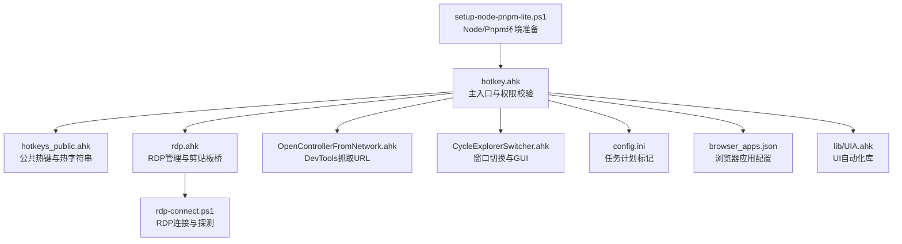
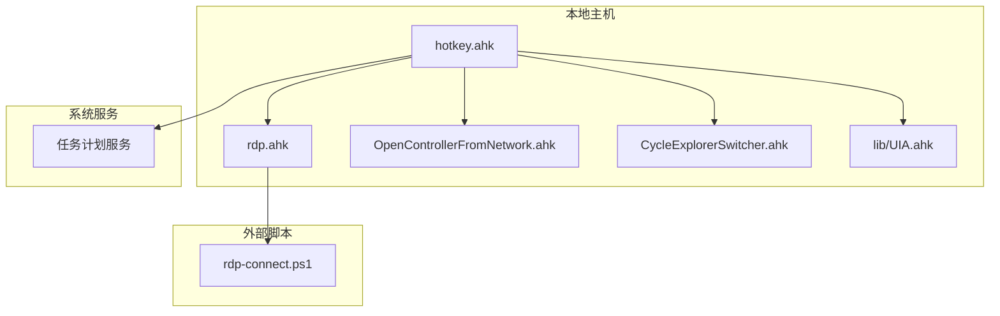
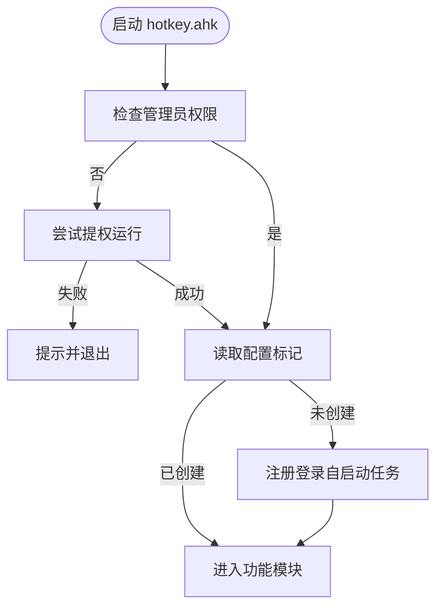
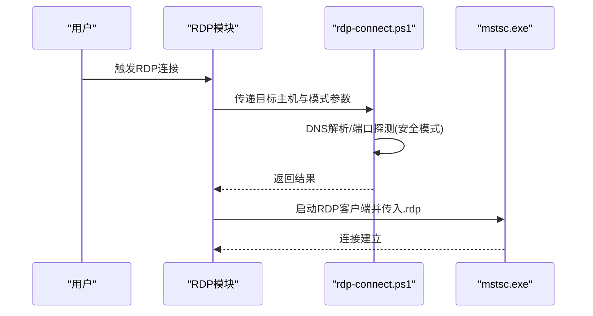
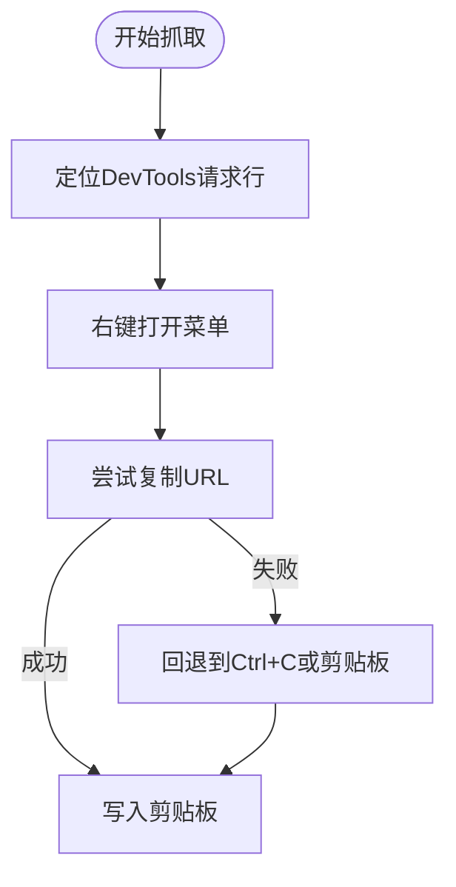
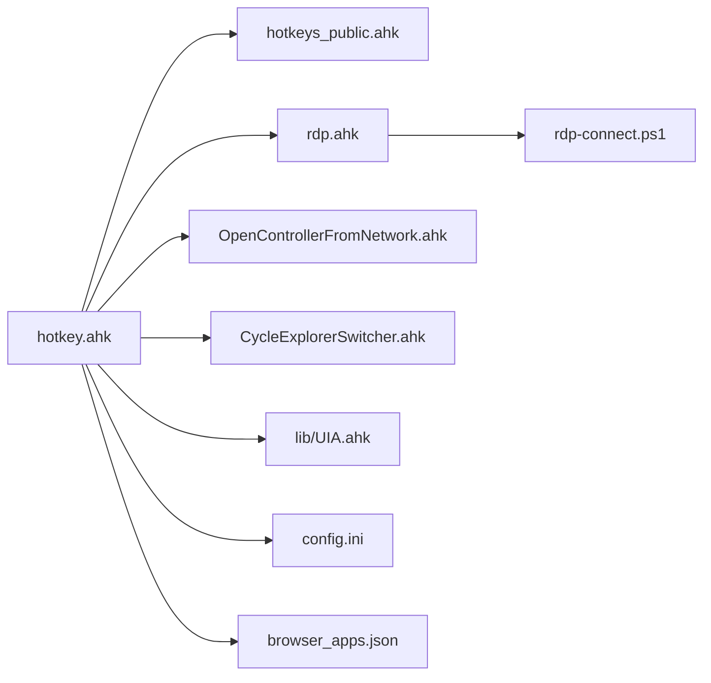

# 安全配置

<cite>
**本文引用的文件**
- [hotkey.ahk](file://hotkey.ahk)
- [hotkeys_public.ahk](file://hotkeys_public.ahk)
- [rdp.ahk](file://rdp.ahk)
- [OpenControllerFromNetwork.ahk](file://OpenControllerFromNetwork.ahk)
- [CycleExplorerSwitcher.ahk](file://CycleExplorerSwitcher.ahk)
- [rdp-connect.ps1](file://rdp-connect.ps1)
- [setup-node-pnpm-lite.ps1](file://setup-node-pnpm-lite.ps1)
- [config.ini](file://config.ini)
- [browser_apps.json](file://browser_apps.json)
- [lib/UIA.ahk](file://lib/UIA.ahk)
</cite>

## 目录
1. [简介](#简介)
2. [项目结构](#项目结构)
3. [核心组件](#核心组件)
4. [架构总览](#架构总览)
5. [详细组件分析](#详细组件分析)
6. [依赖关系分析](#依赖关系分析)
7. [性能与安全考量](#性能与安全考量)
8. [故障排查指南](#故障排查指南)
9. [结论](#结论)
10. [附录](#附录)

## 简介
本指南面向hotkey项目的使用者与维护者，围绕权限管理、脚本安全、访问控制、日志审计与安全监控等方面，提供可操作的最佳实践与检查清单。重点涵盖：
- 管理员权限使用原则与最小权限原则
- 权限审计与任务计划服务的安全部署
- 脚本签名验证与来源可信策略
- 访问控制策略与自动化流程安全
- 安全监控与日志审计
- 潜在风险与防护措施（恶意软件、权限滥用、数据泄露）
- 合规性要求与安全事件响应流程

## 项目结构
hotkey项目采用模块化组织，主脚本集中加载公共热键、RDP管理、开发者工具集成与窗口切换等功能模块，并通过外部PowerShell脚本完成网络探测与RDP连接。

**图示来源**
- [hotkey.ahk](file://hotkey.ahk)
- [hotkeys_public.ahk](file://hotkeys_public.ahk)
- [rdp.ahk](file://rdp.ahk)
- [OpenControllerFromNetwork.ahk](file://OpenControllerFromNetwork.ahk)
- [CycleExplorerSwitcher.ahk](file://CycleExplorerSwitcher.ahk)
- [rdp-connect.ps1](file://rdp-connect.ps1)
- [config.ini](file://config.ini)
- [browser_apps.json](file://browser_apps.json)
- [lib/UIA.ahk](file://lib/UIA.ahk)
- [setup-node-pnpm-lite.ps1](file://setup-node-pnpm-lite.ps1)

**章节来源**
- [hotkey.ahk](file://hotkey.ahk)
- [rdp.ahk](file://rdp.ahk)
- [OpenControllerFromNetwork.ahk](file://OpenControllerFromNetwork.ahk)
- [CycleExplorerSwitcher.ahk](file://CycleExplorerSwitcher.ahk)
- [rdp-connect.ps1](file://rdp-connect.ps1)
- [config.ini](file://config.ini)
- [browser_apps.json](file://browser_apps.json)
- [lib/UIA.ahk](file://lib/UIA.ahk)
- [setup-node-pnpm-lite.ps1](file://setup-node-pnpm-lite.ps1)

## 核心组件
- 主入口与权限控制：强制管理员权限运行，必要时提权并注册登录自启动任务计划，确保长期可用性与一致性。
- RDP管理：封装RDP连接、最小化控制、剪贴板桥接与日志记录，支持安全探测与快速直连两种模式。
- 开发者工具集成：从浏览器DevTools中提取请求URL并解析路径，辅助开发与排障。
- 窗口切换器：对文件资源管理器窗口进行轮询切换与可视化高亮，优化多任务场景下的窗口管理。
- 浏览器应用配置：集中管理常用Web应用的浏览器、参数与快捷键，便于统一管控与审计。
- UI自动化库：提供UI元素定位与交互能力，需配合权限与UIAccess策略使用。

**章节来源**
- [hotkey.ahk](file://hotkey.ahk)
- [rdp.ahk](file://rdp.ahk)
- [OpenControllerFromNetwork.ahk](file://OpenControllerFromNetwork.ahk)
- [CycleExplorerSwitcher.ahk](file://CycleExplorerSwitcher.ahk)
- [browser_apps.json](file://browser_apps.json)
- [lib/UIA.ahk](file://lib/UIA.ahk)

## 架构总览
hotkey通过主脚本集中加载各功能模块，RDP模块进一步委派给PowerShell脚本执行网络探测与连接，形成“主脚本+模块+外部脚本”的分层架构。权限与任务计划在主脚本中集中处理，确保一致的安全部署。

**图示来源**
- [hotkey.ahk](file://hotkey.ahk)
- [rdp.ahk](file://rdp.ahk)
- [OpenControllerFromNetwork.ahk](file://OpenControllerFromNetwork.ahk)
- [CycleExplorerSwitcher.ahk](file://CycleExplorerSwitcher.ahk)
- [lib/UIA.ahk](file://lib/UIA.ahk)
- [rdp-connect.ps1](file://rdp-connect.ps1)

## 详细组件分析

### 权限管理与任务计划
- 管理员权限要求：主脚本在启动时检查管理员权限，若无则尝试提权运行；失败则提示并退出，避免降级功能。
- 任务计划注册：首次运行时创建登录自启动任务，以最高权限运行，确保脚本随系统启动可用。
- 配置标记：通过配置文件标记任务是否已创建，避免重复注册。

**图示来源**
- [hotkey.ahk](file://hotkey.ahk)
- [config.ini](file://config.ini)

**章节来源**
- [hotkey.ahk](file://hotkey.ahk)
- [config.ini](file://config.ini)

### RDP管理与安全连接
- RDP连接模式：提供“快速直连”和“安全探测”两种模式。安全模式在连接前进行DNS解析与端口探测，降低误连与网络异常风险。
- 剪贴板桥接：在远程会话中通过剪贴板信号最小化本地mstsc窗口，避免跨会话直接操作的风险。
- 日志记录：连接过程与错误均写入日志文件，便于审计与问题追踪。

**图示来源**
- [rdp.ahk](file://rdp.ahk)
- [rdp-connect.ps1](file://rdp-connect.ps1)

**章节来源**
- [rdp.ahk](file://rdp.ahk)
- [rdp-connect.ps1](file://rdp-connect.ps1)

### 开发者工具集成（DevTools抓取）
- URL提取：优先通过右键菜单复制URL，其次回退到剪贴板与Ctrl+C方式，最后通过UI自动化定位菜单项。
- 性能日志：开启性能日志记录，便于分析与优化。
- 安全注意：仅在受信任的浏览器环境中使用，避免在敏感站点执行高权限操作。

**图示来源**
- [OpenControllerFromNetwork.ahk](file://OpenControllerFromNetwork.ahk)

**章节来源**
- [OpenControllerFromNetwork.ahk](file://OpenControllerFromNetwork.ahk)

### 窗口切换器
- 多窗口轮询：对文件资源管理器窗口进行索引与高亮，支持Esc取消与Win键释放提交。
- GUI定制：使用系统主题与自绘实现更佳的视觉反馈，减少误操作。
- 安全注意：仅作用于受信任的窗口类，避免对系统关键窗口产生意外影响。

**章节来源**
- [CycleExplorerSwitcher.ahk](file://CycleExplorerSwitcher.ahk)

### 浏览器应用配置
- 统一管理：集中定义浏览器路径、参数与应用列表，便于审计与变更控制。
- 参数加固：禁用同步、后台网络、组件更新等特性，降低攻击面与资源消耗。
- 快捷键绑定：通过JSON配置热键，避免硬编码带来的维护风险。

**章节来源**
- [browser_apps.json](file://browser_apps.json)

### UI自动化库（UIA）
- 权限要求：当被检查窗口具有提升权限时，UIA查看器需以管理员或UIAccess模式运行，否则无法定位。
- 安全建议：在受控环境下使用UIA功能，避免对系统关键UI进行越权操作。

**章节来源**
- [lib/UIA.ahk](file://lib/UIA.ahk)

## 依赖关系分析
- 主脚本依赖：公共热键、RDP模块、开发者工具模块、窗口切换模块、UIA库。
- 外部脚本：RDP模块依赖PowerShell脚本进行网络探测与连接。
- 系统服务：任务计划服务用于自启动与权限维持。
- 配置文件：INI与JSON分别用于任务标记与应用配置。

**图示来源**
- [hotkey.ahk](file://hotkey.ahk)
- [hotkeys_public.ahk](file://hotkeys_public.ahk)
- [rdp.ahk](file://rdp.ahk)
- [OpenControllerFromNetwork.ahk](file://OpenControllerFromNetwork.ahk)
- [CycleExplorerSwitcher.ahk](file://CycleExplorerSwitcher.ahk)
- [lib/UIA.ahk](file://lib/UIA.ahk)
- [rdp-connect.ps1](file://rdp-connect.ps1)
- [config.ini](file://config.ini)
- [browser_apps.json](file://browser_apps.json)

**章节来源**
- [hotkey.ahk](file://hotkey.ahk)
- [rdp.ahk](file://rdp.ahk)
- [OpenControllerFromNetwork.ahk](file://OpenControllerFromNetwork.ahk)
- [CycleExplorerSwitcher.ahk](file://CycleExplorerSwitcher.ahk)
- [lib/UIA.ahk](file://lib/UIA.ahk)
- [rdp-connect.ps1](file://rdp-connect.ps1)
- [config.ini](file://config.ini)
- [browser_apps.json](file://browser_apps.json)

## 性能与安全考量
- 性能
  - UIA菜单定位采用局部扫描与缓存锚点，减少全屏扫描频率，提升稳定性与速度。
  - RDP连接支持快速直连与安全探测，按需选择模式以平衡速度与可靠性。
- 安全
  - 管理员权限仅在必要时启用，且通过任务计划维持，避免长期以最高权限运行。
  - RDP连接前进行端口探测，降低误连与网络异常风险。
  - 浏览器参数禁用同步与组件更新，减少攻击面。
  - 日志记录与错误上报，便于审计与问题追踪。

[本节为通用指导，无需列出具体文件来源]

## 故障排查指南
- 权限相关
  - 现象：启动即提示权限受限并退出
  - 排查：确认脚本以管理员身份运行；检查任务计划是否已创建
  - 参考
    - [hotkey.ahk](file://hotkey.ahk)
    - [config.ini](file://config.ini)
- RDP连接失败
  - 现象：连接超时或端口不可达
  - 排查：使用安全模式进行DNS解析与端口探测；检查目标主机可达性与防火墙策略
  - 参考
    - [rdp.ahk](file://rdp.ahk)
    - [rdp-connect.ps1](file://rdp-connect.ps1)
- DevTools抓取失败
  - 现象：无法复制URL或菜单项定位失败
  - 排查：确认浏览器版本与DevTools界面；检查UIA权限与UIAccess策略
  - 参考
    - [OpenControllerFromNetwork.ahk](file://OpenControllerFromNetwork.ahk)
    - [lib/UIA.ahk](file://lib/UIA.ahk)
- 日志与审计
  - 建议：定期检查RDP日志与性能日志，关注异常连接与失败记录
  - 参考
    - [rdp.ahk](file://rdp.ahk)
    - [OpenControllerFromNetwork.ahk](file://OpenControllerFromNetwork.ahk)

**章节来源**
- [hotkey.ahk](file://hotkey.ahk)
- [config.ini](file://config.ini)
- [rdp.ahk](file://rdp.ahk)
- [rdp-connect.ps1](file://rdp-connect.ps1)
- [OpenControllerFromNetwork.ahk](file://OpenControllerFromNetwork.ahk)
- [lib/UIA.ahk](file://lib/UIA.ahk)

## 结论
hotkey项目在权限管理、RDP连接与自动化工具集成方面具备清晰的模块划分与安全策略。通过管理员权限的最小化使用、任务计划的规范化部署、RDP连接的双重模式与日志审计，以及浏览器参数的加固与UIA权限约束，整体安全基线较为稳健。建议持续遵循最小权限原则、定期审计日志与配置，并在变更发布前进行安全评估与测试。

[本节为总结性内容，无需列出具体文件来源]

## 附录

### 安全配置建议
- 脚本签名验证
  - 对于可执行脚本与PowerShell脚本，建议启用执行策略与签名验证，确保来源可信
  - 参考
    - [setup-node-pnpm-lite.ps1](file://setup-node-pnpm-lite.ps1)
- 访问控制策略
  - 限制管理员权限的使用范围，仅在必要模块启用
  - 通过任务计划与用户组策略控制脚本的运行环境
  - 参考
    - [hotkey.ahk](file://hotkey.ahk)
    - [config.ini](file://config.ini)
- 安全监控设置
  - 启用RDP与性能日志记录，定期巡检异常连接与失败
  - 参考
    - [rdp.ahk](file://rdp.ahk)
    - [OpenControllerFromNetwork.ahk](file://OpenControllerFromNetwork.ahk)

**章节来源**
- [setup-node-pnpm-lite.ps1](file://setup-node-pnpm-lite.ps1)
- [hotkey.ahk](file://hotkey.ahk)
- [config.ini](file://config.ini)
- [rdp.ahk](file://rdp.ahk)
- [OpenControllerFromNetwork.ahk](file://OpenControllerFromNetwork.ahk)

### 潜在安全风险与防护措施
- 恶意软件防护
  - 仅从可信来源下载与安装浏览器扩展与应用
  - 禁用不必要的同步与组件更新，降低被利用风险
  - 参考
    - [browser_apps.json](file://browser_apps.json)
- 权限滥用防范
  - 严格限制管理员权限的使用范围与时间
  - 通过任务计划与最小权限原则降低持久化风险
  - 参考
    - [hotkey.ahk](file://hotkey.ahk)
    - [config.ini](file://config.ini)
- 数据保护策略
  - 对剪贴板与日志进行最小化采集与加密存储
  - 定期清理日志并限制访问权限
  - 参考
    - [rdp.ahk](file://rdp.ahk)
    - [OpenControllerFromNetwork.ahk](file://OpenControllerFromNetwork.ahk)

**章节来源**
- [browser_apps.json](file://browser_apps.json)
- [hotkey.ahk](file://hotkey.ahk)
- [config.ini](file://config.ini)
- [rdp.ahk](file://rdp.ahk)
- [OpenControllerFromNetwork.ahk](file://OpenControllerFromNetwork.ahk)

### 安全检查清单
- [ ] 确认脚本以管理员权限运行
- [ ] 确认任务计划已正确注册并启用
- [ ] 确认RDP连接使用安全模式进行探测
- [ ] 确认浏览器参数已禁用同步与组件更新
- [ ] 确认日志记录与审计已启用并定期巡检
- [ ] 确认UIA功能在受控环境下使用并满足权限要求

**章节来源**
- [hotkey.ahk](file://hotkey.ahk)
- [config.ini](file://config.ini)
- [rdp.ahk](file://rdp.ahk)
- [browser_apps.json](file://browser_apps.json)
- [OpenControllerFromNetwork.ahk](file://OpenControllerFromNetwork.ahk)
- [lib/UIA.ahk](file://lib/UIA.ahk)

### 合规性要求
- 管理员权限使用需符合组织最小权限原则与审批流程
- 脚本与配置的变更需纳入变更管理与审计
- 日志与数据的采集与存储需满足隐私与数据保护法规

[本节为通用指导，无需列出具体文件来源]

### 安全事件响应流程
- 事件发现：通过日志与告警发现异常连接或失败
- 事件分类：区分权限滥用、网络异常与脚本错误
- 应急处置：暂停相关功能、回滚变更、修复漏洞
- 事后复盘：分析原因、完善策略、更新检查清单

[本节为通用指导，无需列出具体文件来源]