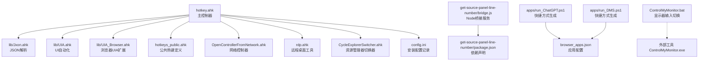
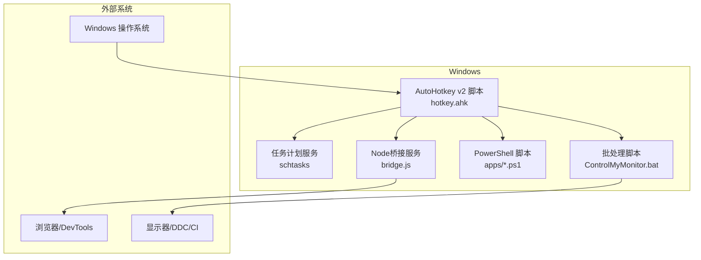
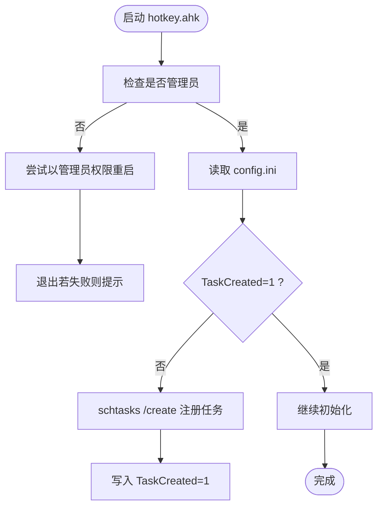
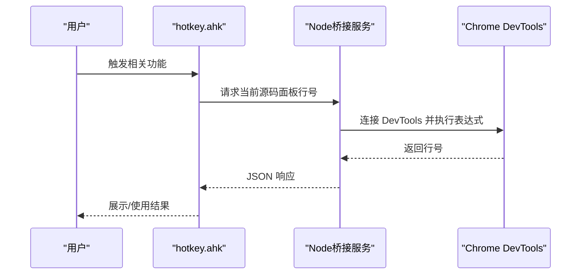
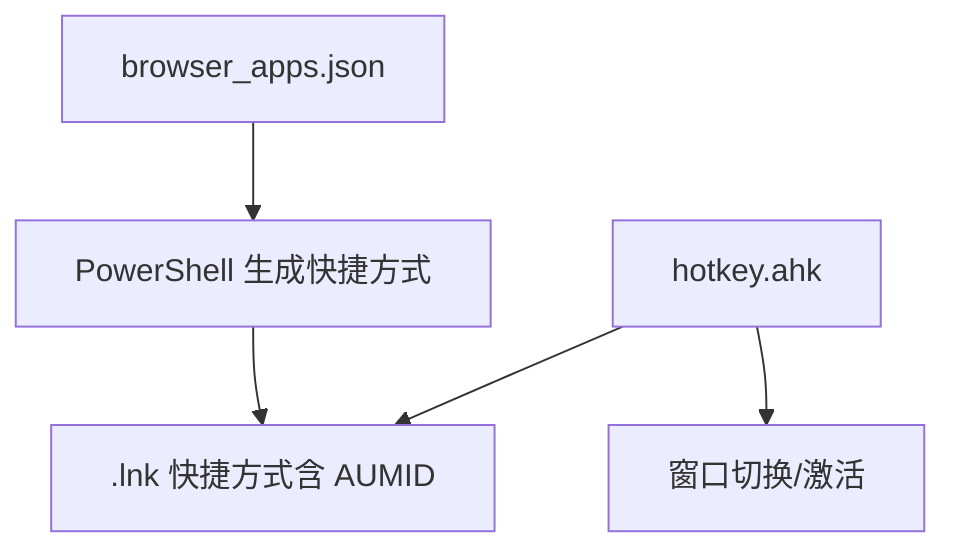
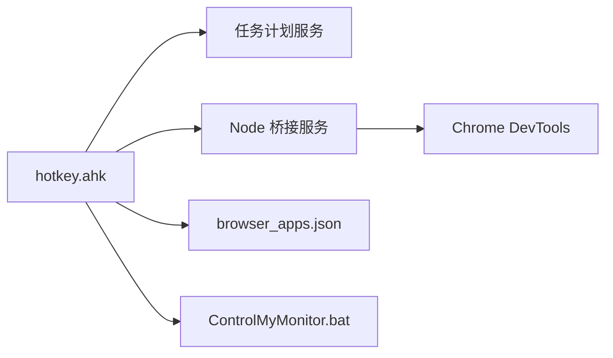

# 安装部署

<cite>
**本文引用的文件**
- [README.md](file://README.md)
- [hotkey.ahk](file://hotkey.ahk)
- [nvm-node-pnpm-setup-guide.md](file://nvm-node-pnpm-setup-guide.md)
- [setup-node-pnpm-lite.ps1](file://setup-node-pnpm-lite.ps1)
- [get-source-panel-line-number/bridge.js](file://get-source-panel-line-number/bridge.js)
- [get-source-panel-line-number/package.json](file://get-source-panel-line-number/package.json)
- [get-source-panel-line-number/run_bridge.vbs](file://get-source-panel-line-number/run_bridge.vbs)
- [browser_apps.json](file://browser_apps.json)
- [apps/run_ChatGPT.ps1](file://apps/run_ChatGPT.ps1)
- [apps/run_DMS.ps1](file://apps/run_DMS.ps1)
- [ControlMyMonitor.bat](file://ControlMyMonitor.bat)
</cite>

## 目录
1. [简介](#简介)
2. [项目结构](#项目结构)
3. [核心组件](#核心组件)
4. [架构总览](#架构总览)
5. [详细组件分析](#详细组件分析)
6. [依赖关系分析](#依赖关系分析)
7. [性能考虑](#性能考虑)
8. [故障排查指南](#故障排查指南)
9. [结论](#结论)
10. [附录](#附录)

## 简介
本指南面向首次安装与部署 hotkey 项目的用户，覆盖系统要求检查、Windows 版本兼容性、AutoHotkey v2 与 Node.js 环境配置、权限与任务计划服务注册、初始配置、安装验证流程，以及开发/生产/便携式三种部署场景的实践建议。项目基于 AutoHotkey v2 实现热键与窗口管理，并通过 Node.js 桥接能力支持部分高级功能。

## 项目结构
hotkey 仓库采用按功能分层的组织方式：
- 根目录脚本与主入口：hotkey.ahk 为主控制器，包含权限自提升、任务计划服务注册、窗口切换与热键绑定等核心逻辑。
- 应用与工具脚本：apps/ 下包含浏览器快捷方式生成脚本；ControlMyMonitor.bat 提供显示器输入切换。
- 辅助库与模块：lib/ 包含 UIA 与 JSON 解析等通用库；get-source-panel-line-number/ 提供 Chrome DevTools 行号桥接能力。
- 配置文件：browser_apps.json 描述浏览器、常用应用与热键映射；README.md 提供项目简述。

图表来源
- [hotkey.ahk](file://hotkey.ahk)
- [lib/Jxon.ahk](file://lib/Jxon.ahk)
- [lib/UIA.ahk](file://lib/UIA.ahk)
- [lib/UIA_Browser.ahk](file://lib/UIA_Browser.ahk)
- [get-source-panel-line-number/bridge.js](file://get-source-panel-line-number/bridge.js)
- [get-source-panel-line-number/package.json](file://get-source-panel-line-number/package.json)
- [apps/run_ChatGPT.ps1](file://apps/run_ChatGPT.ps1)
- [apps/run_DMS.ps1](file://apps/run_DMS.ps1)
- [browser_apps.json](file://browser_apps.json)
- [ControlMyMonitor.bat](file://ControlMyMonitor.bat)

章节来源
- [README.md](file://README.md)
- [hotkey.ahk](file://hotkey.ahk)

## 核心组件
- 主控制器 hotkey.ahk
  - 权限自提升与任务注册：若非管理员，尝试以管理员权限重启；成功后注册“登录时运行”的任务计划，确保开机自启。
  - 热键与窗口管理：包含大量应用热键绑定与窗口切换逻辑，支持路径前缀互换（C:/D:）以适配便携式部署。
  - 配置持久化：通过 config.ini 记录任务注册状态，避免重复注册。
- Node.js 桥接模块
  - bridge.js：通过 CDP 连接 DevTools，暴露 HTTP 接口返回当前源码面板行号。
  - package.json：声明 chrome-remote-interface 依赖。
  - run_bridge.vbs：以无窗口方式启动 Node 桥接服务。
- 浏览器应用配置
  - browser_apps.json：统一描述浏览器、常用应用、URL、热键与 AUMID 等。
  - apps/*.ps1：根据配置生成带 AUMID 的快捷方式，便于窗口识别与切换。
- 辅助工具
  - ControlMyMonitor.bat：自动检测并切换显示器输入（HDMI），适用于特定品牌显示器。

章节来源
- [hotkey.ahk](file://hotkey.ahk)
- [get-source-panel-line-number/bridge.js](file://get-source-panel-line-number/bridge.js)
- [get-source-panel-line-number/package.json](file://get-source-panel-line-number/package.json)
- [get-source-panel-line-number/run_bridge.vbs](file://get-source-panel-line-number/run_bridge.vbs)
- [browser_apps.json](file://browser_apps.json)
- [apps/run_ChatGPT.ps1](file://apps/run_ChatGPT.ps1)
- [apps/run_DMS.ps1](file://apps/run_DMS.ps1)
- [ControlMyMonitor.bat](file://ControlMyMonitor.bat)

## 架构总览
hotkey 的运行时由 AutoHotkey v2 负责热键监听与窗口控制，Node.js 桥接用于与浏览器 DevTools 交互。任务计划服务负责开机自启与权限维持。

图表来源
- [hotkey.ahk](file://hotkey.ahk)
- [get-source-panel-line-number/bridge.js](file://get-source-panel-line-number/bridge.js)
- [apps/run_ChatGPT.ps1](file://apps/run_ChatGPT.ps1)
- [apps/run_DMS.ps1](file://apps/run_DMS.ps1)
- [ControlMyMonitor.bat](file://ControlMyMonitor.bat)

## 详细组件分析

### 安装与系统要求检查
- Windows 版本兼容性
  - 项目明确要求 AutoHotkey v2，需在 Windows 上运行。具体 Windows 版本未在仓库中显式限定，建议在较新的 Windows 10/11 上使用以获得最佳兼容性。
- AutoHotkey v2
  - 主脚本顶部声明 #Requires AutoHotkey v2.0，确保使用 v2 运行时。
- Node.js 与包管理器
  - Node 桥接模块依赖 chrome-remote-interface，需安装 Node.js 并启用 pnpm/corepack。
  - 提供 nvm-node-pnpm-setup-guide.md 与 setup-node-pnpm-lite.ps1，帮助修复镜像、安装指定版本 Node、迁移 npm/pnpm 存储位置并配置 PATH。

章节来源
- [hotkey.ahk](file://hotkey.ahk)
- [nvm-node-pnpm-setup-guide.md](file://nvm-node-pnpm-setup-guide.md)
- [setup-node-pnpm-lite.ps1](file://setup-node-pnpm-lite.ps1)

### 权限配置与任务计划服务注册
- 权限自提升
  - 非管理员时尝试以管理员权限重启当前脚本；失败则弹窗提示并退出。
- 任务计划服务注册
  - 首次运行成功后，写入 config.ini 标记 TaskCreated=1，避免重复注册。
  - 注册名为 AutoRunHotkeyTask，触发条件为“登录时”，以最高权限运行。

图表来源
- [hotkey.ahk](file://hotkey.ahk)

章节来源
- [hotkey.ahk](file://hotkey.ahk)

### Node.js 环境配置与桥接服务
- 环境准备
  - 使用 setup-node-pnpm-lite.ps1 自动修复 nvm 镜像、安装/启用目标 Node 版本、迁移 npm/pnpm 存储至 D 盘、设置 PNPM_HOME 并更新 PATH。
  - 参考 nvm-node-pnpm-setup-guide.md 的命令清单进行手动验证与回滚。
- 桥接服务
  - bridge.js 通过 CDP 连接 DevTools，提供 /line-number 接口；run_bridge.vbs 以无窗口方式启动 Node 服务。
  - package.json 声明 chrome-remote-interface 依赖，需在 Node 环境中安装。

图表来源
- [get-source-panel-line-number/bridge.js](file://get-source-panel-line-number/bridge.js)
- [get-source-panel-line-number/run_bridge.vbs](file://get-source-panel-line-number/run_bridge.vbs)
- [get-source-panel-line-number/package.json](file://get-source-panel-line-number/package.json)

章节来源
- [setup-node-pnpm-lite.ps1](file://setup-node-pnpm-lite.ps1)
- [nvm-node-pnpm-setup-guide.md](file://nvm-node-pnpm-setup-guide.md)
- [get-source-panel-line-number/bridge.js](file://get-source-panel-line-number/bridge.js)
- [get-source-panel-line-number/package.json](file://get-source-panel-line-number/package.json)
- [get-source-panel-line-number/run_bridge.vbs](file://get-source-panel-line-number/run_bridge.vbs)

### 浏览器应用与快捷方式管理
- 配置驱动
  - browser_apps.json 统一描述浏览器、应用、URL、热键与 AUMID。
- 快捷方式生成
  - apps/run_ChatGPT.ps1 与 apps/run_DMS.ps1 根据配置生成快捷方式，并写入 AUMID 以便窗口识别与切换。

图表来源
- [browser_apps.json](file://browser_apps.json)
- [apps/run_ChatGPT.ps1](file://apps/run_ChatGPT.ps1)
- [apps/run_DMS.ps1](file://apps/run_DMS.ps1)
- [hotkey.ahk](file://hotkey.ahk)

章节来源
- [browser_apps.json](file://browser_apps.json)
- [apps/run_ChatGPT.ps1](file://apps/run_ChatGPT.ps1)
- [apps/run_DMS.ps1](file://apps/run_DMS.ps1)
- [hotkey.ahk](file://hotkey.ahk)

### 辅助工具：显示器输入切换
- ControlMyMonitor.bat
  - 通过 ControlMyMonitor.exe 读取/设置显示器 VCP 值，自动检测当前输入并切换到 HDMI，支持标准 VCP 与厂商特定 VCP 备选方案。

章节来源
- [ControlMyMonitor.bat](file://ControlMyMonitor.bat)

## 依赖关系分析
- AutoHotkey v2：主运行时与热键/窗口控制。
- Node.js + pnpm/corepack：提供桥接服务与依赖管理。
- Windows 任务计划服务：负责开机自启与权限维持。
- 浏览器与 DevTools：用于行号获取等高级功能。
- 外部工具：ControlMyMonitor.exe 用于显示器输入切换。

图表来源
- [hotkey.ahk](file://hotkey.ahk)
- [get-source-panel-line-number/bridge.js](file://get-source-panel-line-number/bridge.js)
- [browser_apps.json](file://browser_apps.json)
- [ControlMyMonitor.bat](file://ControlMyMonitor.bat)

章节来源
- [hotkey.ahk](file://hotkey.ahk)
- [get-source-panel-line-number/bridge.js](file://get-source-panel-line-number/bridge.js)
- [browser_apps.json](file://browser_apps.json)
- [ControlMyMonitor.bat](file://ControlMyMonitor.bat)

## 性能考虑
- 热键响应：优先使用键盘钩子与精确窗口匹配，减少误触与延迟。
- 路径前缀互换：在 D 盘运行时自动将 C: 替换为 D:，避免路径失效导致的启动失败。
- 桥接服务：Node 服务按需启动，避免常驻占用；HTTP 服务仅在请求时处理。
- 任务计划服务：以最高权限运行，确保脚本在登录时即可生效。

## 故障排查指南
- 权限不足
  - 现象：无法注册任务计划或以管理员权限重启失败。
  - 处理：以管理员身份运行安装脚本；确认 UAC 设置允许提升。
- Node 环境异常
  - 现象：pnpm/node/npm 不可用或版本不匹配。
  - 处理：使用 setup-node-pnpm-lite.ps1 或参考 nvm-node-pnpm-setup-guide.md 的命令修复镜像、安装目标版本并迁移存储。
- 桥接服务无法启动
  - 现象：/line-number 接口不可用。
  - 处理：确认 Node 已安装并执行 run_bridge.vbs；检查 package.json 依赖已安装；验证浏览器 DevTools 已打开。
- 快捷方式与窗口识别
  - 现象：热键无法正确切换目标应用。
  - 处理：确认 browser_apps.json 中 AUMID 与快捷方式一致；检查 apps/*.ps1 是否成功生成并保存。
- 显示器输入切换失败
  - 现象：VCP 60 或 E2 设置无效。
  - 处理：检查显示器 DDC/CI 支持与信号连接；必要时更换备用方案。

章节来源
- [hotkey.ahk](file://hotkey.ahk)
- [setup-node-pnpm-lite.ps1](file://setup-node-pnpm-lite.ps1)
- [nvm-node-pnpm-setup-guide.md](file://nvm-node-pnpm-setup-guide.md)
- [get-source-panel-line-number/bridge.js](file://get-source-panel-line-number/bridge.js)
- [get-source-panel-line-number/package.json](file://get-source-panel-line-number/package.json)
- [browser_apps.json](file://browser_apps.json)
- [apps/run_ChatGPT.ps1](file://apps/run_ChatGPT.ps1)
- [apps/run_DMS.ps1](file://apps/run_DMS.ps1)
- [ControlMyMonitor.bat](file://ControlMyMonitor.bat)

## 结论
hotkey 项目通过 AutoHotkey v2 与 Node.js 桥接实现了强大的热键与窗口管理能力。按照本指南完成系统要求检查、权限与任务计划服务配置、Node.js 环境准备与初始配置后，即可完成安装部署。针对不同场景（开发/生产/便携式），建议结合仓库中的脚本与配置文件进行定制化调整。

## 附录

### 安装步骤（完整版）
- 系统要求检查
  - 确认 Windows 支持 AutoHotkey v2；建议使用较新版本 Windows。
- AutoHotkey v2
  - 安装 AutoHotkey v2 并确保可从命令行运行。
- Node.js 环境配置
  - 使用 setup-node-pnpm-lite.ps1 完成 nvm 镜像修复、安装/启用目标 Node 版本、迁移 npm/pnpm 存储至 D 盘、设置 PNPM_HOME 并更新 PATH。
  - 或参考 nvm-node-pnpm-setup-guide.md 的命令清单进行手动配置与验证。
- 权限与任务计划服务
  - 以管理员身份运行 hotkey.ahk，自动尝试以管理员权限重启并注册登录时运行的任务。
  - 首次成功后会在 config.ini 中标记 TaskCreated=1。
- 初始配置
  - 如需使用浏览器应用功能，准备 browser_apps.json 并运行 apps/*.ps1 生成快捷方式。
  - 如需使用行号桥接功能，启动 run_bridge.vbs 并确认 Node 依赖已安装。
- 验证安装
  - 权限检查：确认任务计划服务中存在 AutoRunHotkeyTask，且以最高权限运行。
  - 功能测试：触发热键，验证窗口切换、应用启动、快捷方式识别与行号桥接等。
  - 常见问题：参考故障排查章节逐项排除。

章节来源
- [hotkey.ahk](file://hotkey.ahk)
- [setup-node-pnpm-lite.ps1](file://setup-node-pnpm-lite.ps1)
- [nvm-node-pnpm-setup-guide.md](file://nvm-node-pnpm-setup-guide.md)
- [browser_apps.json](file://browser_apps.json)
- [apps/run_ChatGPT.ps1](file://apps/run_ChatGPT.ps1)
- [apps/run_DMS.ps1](file://apps/run_DMS.ps1)
- [get-source-panel-line-number/run_bridge.vbs](file://get-source-panel-line-number/run_bridge.vbs)
- [get-source-panel-line-number/package.json](file://get-source-panel-line-number/package.json)

### 部署场景建议
- 开发环境
  - 使用 setup-node-pnpm-lite.ps1 完成 Node 环境准备；在 D 盘存放 npm/pnpm 存储，便于团队共享。
  - 保持 config.ini 中 TaskCreated=1，确保每次登录自动运行。
- 生产环境
  - 将 Node 依赖与桥接服务打包为便携式目录；通过组策略或登录脚本注册任务计划服务。
  - 固定 browser_apps.json 与快捷方式，避免频繁变更。
- 便携式部署
  - 将项目与 Node 依赖置于 D 盘；利用路径前缀互换逻辑（C:/D:）保证跨设备可用。
  - 通过 apps/*.ps1 生成本地快捷方式，避免硬编码系统路径。

章节来源
- [setup-node-pnpm-lite.ps1](file://setup-node-pnpm-lite.ps1)
- [hotkey.ahk](file://hotkey.ahk)
- [browser_apps.json](file://browser_apps.json)
- [apps/run_ChatGPT.ps1](file://apps/run_ChatGPT.ps1)
- [apps/run_DMS.ps1](file://apps/run_DMS.ps1)