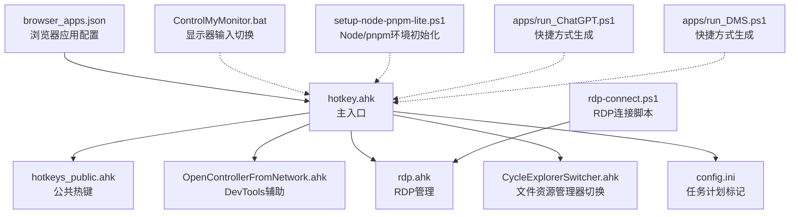
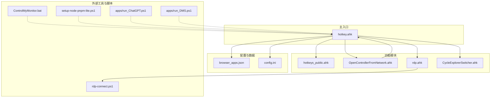
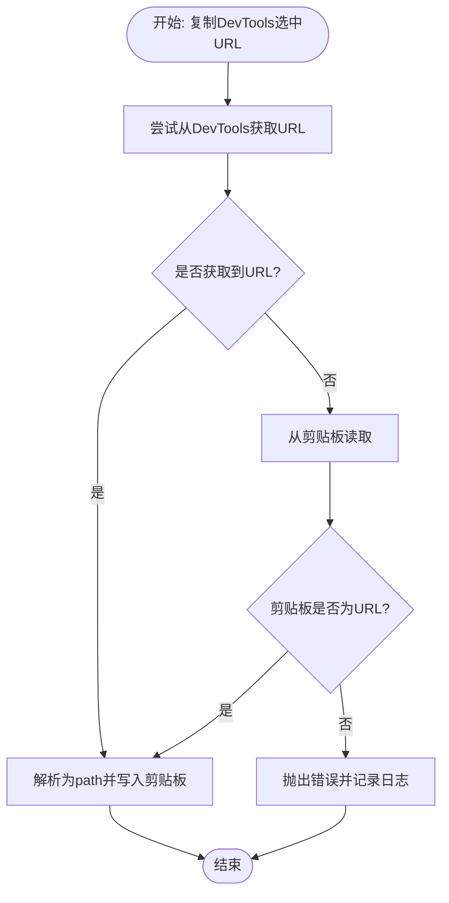
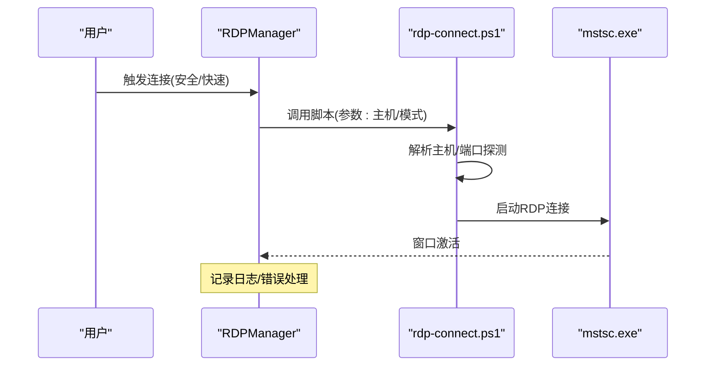
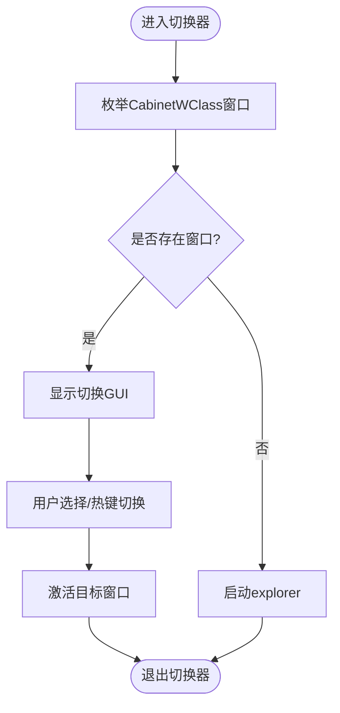
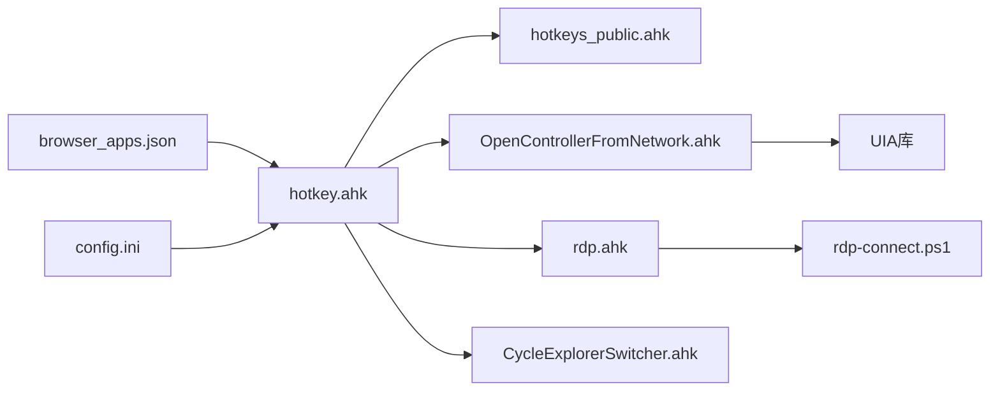

# 日常维护

<cite>
**本文引用的文件**   
- [README.md](file://README.md)
- [hotkey.ahk](file://hotkey.ahk)
- [hotkeys_public.ahk](file://hotkeys_public.ahk)
- [OpenControllerFromNetwork.ahk](file://OpenControllerFromNetwork.ahk)
- [rdp.ahk](file://rdp.ahk)
- [CycleExplorerSwitcher.ahk](file://CycleExplorerSwitcher.ahk)
- [browser_apps.json](file://browser_apps.json)
- [config.ini](file://config.ini)
- [ControlMyMonitor.bat](file://ControlMyMonitor.bat)
- [setup-node-pnpm-lite.ps1](file://setup-node-pnpm-lite.ps1)
- [apps/run_ChatGPT.ps1](file://apps/run_ChatGPT.ps1)
- [apps/run_DMS.ps1](file://apps/run_DMS.ps1)
- [rdp-connect.ps1](file://rdp-connect.ps1)
</cite>

## 目录
1. [简介](#简介)
2. [项目结构](#项目结构)
3. [核心组件](#核心组件)
4. [架构总览](#架构总览)
5. [详细组件分析](#详细组件分析)
6. [依赖关系分析](#依赖关系分析)
7. [性能考虑](#性能考虑)
8. [故障排查指南](#故障排查指南)
9. [结论](#结论)
10. [附录](#附录)

## 简介
本指南面向hotkey项目的日常运维与维护，围绕以下目标展开：
- 性能监控：内存使用、CPU占用、响应时间测量
- 错误日志分析：日志位置、关键错误信号、故障排除流程
- 定期维护：缓存清理、配置优化、依赖项更新
- 备份与恢复：配置文件、日志与脚本备份、系统快照
- 维护检查清单与预防性维护建议

hotkey基于AutoHotkey v2，提供热键启动应用、窗口切换、RDP连接、开发者工具辅助等功能。项目采用模块化组织，主入口脚本集中加载公共热键与功能模块。

## 项目结构
项目采用“主脚本 + 功能模块 + 辅助脚本”的组织方式：
- 主入口：hotkey.ahk
- 功能模块：hotkeys_public.ahk、OpenControllerFromNetwork.ahk、rdp.ahk、CycleExplorerSwitcher.ahk
- 配置与数据：browser_apps.json、config.ini
- 工具与脚本：ControlMyMonitor.bat、setup-node-pnpm-lite.ps1、apps/*.ps1、rdp-connect.ps1
- 文档与说明：README.md

图表来源
- [hotkey.ahk:1-50](file://hotkey.ahk#L1-L50)
- [hotkeys_public.ahk:1-20](file://hotkeys_public.ahk#L1-L20)
- [OpenControllerFromNetwork.ahk:25-55](file://OpenControllerFromNetwork.ahk#L25-L55)
- [rdp.ahk:47-146](file://rdp.ahk#L47-L146)
- [CycleExplorerSwitcher.ahk:4-35](file://CycleExplorerSwitcher.ahk#L4-L35)
- [browser_apps.json:1-48](file://browser_apps.json#L1-L48)
- [config.ini:1-3](file://config.ini#L1-L3)
- [ControlMyMonitor.bat:1-74](file://ControlMyMonitor.bat#L1-L74)
- [setup-node-pnpm-lite.ps1:1-121](file://setup-node-pnpm-lite.ps1#L1-L121)
- [apps/run_ChatGPT.ps1:1-18](file://apps/run_ChatGPT.ps1#L1-L18)
- [apps/run_DMS.ps1:1-18](file://apps/run_DMS.ps1#L1-L18)
- [rdp-connect.ps1:1-242](file://rdp-connect.ps1#L1-L242)

章节来源
- [README.md:1-2](file://README.md#L1-L2)
- [hotkey.ahk:1-50](file://hotkey.ahk#L1-L50)

## 核心组件
- 主入口与生命周期
  - 权限自提升与任务计划注册
  - 包含公共模块与功能模块
  - 环境变量与路径处理
- 公共热键模块
  - 热字符串与常用SQL模板
  - 时间戳与系统命令片段
- DevTools辅助模块
  - 性能日志与调试输出
  - UIA定位与菜单复制
- RDP管理模块
  - 剪贴板信号桥接
  - 安全/快速连接流程
- 文件资源管理器切换器
  - 窗口枚举与高亮切换
  - 自绘与交互细节
- 浏览器应用配置
  - Chrome/Edge路径、参数、应用清单
- 系统工具与脚本
  - 显示器输入切换批处理
  - Node/pnpm环境初始化
  - ChatGPT/DMS快捷方式生成
  - RDP连接脚本

章节来源
- [hotkey.ahk:14-52](file://hotkey.ahk#L14-L52)
- [hotkeys_public.ahk:1-57](file://hotkeys_public.ahk#L1-L57)
- [OpenControllerFromNetwork.ahk:301-311](file://OpenControllerFromNetwork.ahk#L301-L311)
- [rdp.ahk:16-45](file://rdp.ahk#L16-L45)
- [CycleExplorerSwitcher.ahk:68-96](file://CycleExplorerSwitcher.ahk#L68-L96)
- [browser_apps.json:1-48](file://browser_apps.json#L1-L48)
- [ControlMyMonitor.bat:1-74](file://ControlMyMonitor.bat#L1-L74)
- [setup-node-pnpm-lite.ps1:1-121](file://setup-node-pnpm-lite.ps1#L1-L121)
- [apps/run_ChatGPT.ps1:1-18](file://apps/run_ChatGPT.ps1#L1-L18)
- [apps/run_DMS.ps1:1-18](file://apps/run_DMS.ps1#L1-L18)
- [rdp-connect.ps1:190-242](file://rdp-connect.ps1#L190-L242)

## 架构总览
hotkey通过主入口集中加载各功能模块，形成“热键 -> 功能模块 -> 系统/外部工具”的调用链。RDP模块同时具备本地与远程会话识别能力，DevTools模块通过UIA与剪贴板协作完成自动化复制。

图表来源
- [hotkey.ahk:14-52](file://hotkey.ahk#L14-L52)
- [OpenControllerFromNetwork.ahk:34-55](file://OpenControllerFromNetwork.ahk#L34-L55)
- [rdp.ahk:332-408](file://rdp.ahk#L332-L408)
- [browser_apps.json:1-48](file://browser_apps.json#L1-L48)
- [config.ini:1-3](file://config.ini#L1-L3)
- [ControlMyMonitor.bat:1-74](file://ControlMyMonitor.bat#L1-L74)
- [setup-node-pnpm-lite.ps1:1-121](file://setup-node-pnpm-lite.ps1#L1-L121)
- [apps/run_ChatGPT.ps1:1-18](file://apps/run_ChatGPT.ps1#L1-L18)
- [apps/run_DMS.ps1:1-18](file://apps/run_DMS.ps1#L1-L18)
- [rdp-connect.ps1:1-242](file://rdp-connect.ps1#L1-L242)

## 详细组件分析

### DevTools辅助模块（性能监控与日志）
- 性能日志
  - 使用输出调试与文件追加记录关键步骤耗时
  - 日志文件位于脚本目录下的性能日志文件
- 复制流程
  - 优先右键菜单复制，失败回退至Ctrl+C与剪贴板解析
  - UIA定位菜单项，支持缓存锚点与容错扫描
- 关键流程图

图表来源
- [OpenControllerFromNetwork.ahk:57-96](file://OpenControllerFromNetwork.ahk#L57-L96)
- [OpenControllerFromNetwork.ahk:101-137](file://OpenControllerFromNetwork.ahk#L101-L137)
- [OpenControllerFromNetwork.ahk:301-311](file://OpenControllerFromNetwork.ahk#L301-L311)

章节来源
- [OpenControllerFromNetwork.ahk:34-96](file://OpenControllerFromNetwork.ahk#L34-L96)
- [OpenControllerFromNetwork.ahk:301-311](file://OpenControllerFromNetwork.ahk#L301-L311)

### RDP管理模块（连接与剪贴板桥接）
- 剪贴板桥接
  - 本地监听剪贴板变化，识别最小化信号并回滚剪贴板
- 连接流程
  - 安全模式：解析主机名/MAC -> TCP端口探测 -> 启动mstsc
  - 快速模式：解析主机名后直接启动
- 关键序列图

图表来源
- [rdp.ahk:332-408](file://rdp.ahk#L332-L408)
- [rdp-connect.ps1:190-242](file://rdp-connect.ps1#L190-L242)

章节来源
- [rdp.ahk:16-45](file://rdp.ahk#L16-L45)
- [rdp.ahk:332-408](file://rdp.ahk#L332-L408)
- [rdp-connect.ps1:14-18](file://rdp-connect.ps1#L14-L18)

### 文件资源管理器切换器（窗口切换与高亮）
- 窗口枚举与高亮
  - 使用GUI ListView展示多实例文件资源管理器
  - 自绘选中项与普通项，修正焦点与激活顺序
- 关键流程图

图表来源
- [CycleExplorerSwitcher.ahk:68-96](file://CycleExplorerSwitcher.ahk#L68-L96)
- [CycleExplorerSwitcher.ahk:117-153](file://CycleExplorerSwitcher.ahk#L117-L153)
- [CycleExplorerSwitcher.ahk:338-364](file://CycleExplorerSwitcher.ahk#L338-L364)

章节来源
- [CycleExplorerSwitcher.ahk:68-96](file://CycleExplorerSwitcher.ahk#L68-L96)
- [CycleExplorerSwitcher.ahk:117-153](file://CycleExplorerSwitcher.ahk#L117-L153)

### 浏览器应用配置（ChatGPT/DMS）
- 配置结构
  - 浏览器路径与通用参数
  - 应用清单：名称、标题、URL、热键、AUMID
- 快捷方式生成
  - PowerShell脚本生成Chrome快捷方式并注入AUMID

章节来源
- [browser_apps.json:1-48](file://browser_apps.json#L1-L48)
- [apps/run_ChatGPT.ps1:1-18](file://apps/run_ChatGPT.ps1#L1-L18)
- [apps/run_DMS.ps1:1-18](file://apps/run_DMS.ps1#L1-L18)

## 依赖关系分析
- 内部依赖
  - 主入口包含多个功能模块与公共热键
  - DevTools模块依赖UIA库与剪贴板
  - RDP模块依赖PowerShell脚本与系统窗口句柄
- 外部依赖
  - AutoHotkey v2、Windows系统API、浏览器与第三方应用
  - Node.js生态（nvm/pnpm/corepack）用于开发工具链

图表来源
- [hotkey.ahk:3-6](file://hotkey.ahk#L3-L6)
- [OpenControllerFromNetwork.ahk:19-25](file://OpenControllerFromNetwork.ahk#L19-L25)
- [rdp.ahk:332-408](file://rdp.ahk#L332-L408)
- [browser_apps.json:1-48](file://browser_apps.json#L1-L48)
- [config.ini:1-3](file://config.ini#L1-L3)

章节来源
- [hotkey.ahk:3-6](file://hotkey.ahk#L3-L6)
- [OpenControllerFromNetwork.ahk:19-25](file://OpenControllerFromNetwork.ahk#L19-L25)
- [rdp.ahk:332-408](file://rdp.ahk#L332-L408)

## 性能考虑
- 内存使用监控
  - 使用任务管理器或Windows性能监视器查看脚本进程的常驻内存
  - 关注长时间运行后内存增长趋势，必要时重启脚本
- CPU占用分析
  - 使用性能监视器观察脚本进程CPU占用峰值
  - 关注高频热键触发与窗口枚举操作的耗时
- 响应时间测量
  - DevTools复制流程：通过性能日志文件记录关键步骤耗时
  - RDP连接：脚本日志记录解析与连接耗时
- 优化建议
  - 减少不必要的UIA全屏扫描，优先使用缓存锚点
  - 合理设置重试次数与等待时间，避免过度轮询
  - 对热点路径增加早返回与失败快速降级

章节来源
- [OpenControllerFromNetwork.ahk:301-311](file://OpenControllerFromNetwork.ahk#L301-L311)
- [rdp.ahk:404-408](file://rdp.ahk#L404-L408)

## 故障排查指南
- 日志位置
  - DevTools性能日志：脚本目录下的性能日志文件
  - RDP日志：脚本目录下的RDP日志文件
- 关键错误信号
  - 权限不足：主入口要求管理员权限，未满足时弹窗提示
  - 任务计划注册失败：schtasks命令执行异常
  - DevTools无选中URL：复制流程抛出错误并记录日志
  - RDP连接失败：解析失败、端口不可达、mstsc启动异常
- 故障排除流程
  - 权限问题：以管理员身份运行脚本，检查任务计划是否创建成功
  - DevTools复制：检查DevTools窗口焦点、菜单项名称匹配、剪贴板等待超时
  - RDP连接：验证主机名/短主机名映射、MAC地址解析、端口探测结果
  - 剪贴板桥接：确认信号内容一致、本地会话判断正确

章节来源
- [hotkey.ahk:24-52](file://hotkey.ahk#L24-L52)
- [OpenControllerFromNetwork.ahk:51-55](file://OpenControllerFromNetwork.ahk#L51-L55)
- [rdp.ahk:106-110](file://rdp.ahk#L106-L110)
- [rdp-connect.ps1:225-242](file://rdp-connect.ps1#L225-L242)

## 结论
本指南提供了hotkey项目的日常维护方法与最佳实践，涵盖性能监控、日志分析、定期维护与备份恢复策略。通过规范化的检查与预防性维护，可显著提升脚本稳定性与用户体验。

## 附录

### 维护检查清单
- 权限与任务计划
  - 确认以管理员权限运行
  - 检查任务计划创建标记与注册状态
- DevTools辅助
  - 验证性能日志文件存在与写入
  - 检查UIA可用性与菜单项匹配
- RDP连接
  - 验证主机名/短主机名映射
  - 端口探测与mstsc启动
- 浏览器应用
  - 检查浏览器路径与通用参数
  - 验证快捷方式生成与AUMID注入
- 系统工具
  - 显示器输入切换脚本可用性
  - Node/pnpm环境初始化脚本执行

章节来源
- [config.ini:1-3](file://config.ini#L1-L3)
- [OpenControllerFromNetwork.ahk:301-311](file://OpenControllerFromNetwork.ahk#L301-L311)
- [rdp.ahk:332-408](file://rdp.ahk#L332-L408)
- [browser_apps.json:1-48](file://browser_apps.json#L1-L48)
- [ControlMyMonitor.bat:1-74](file://ControlMyMonitor.bat#L1-L74)
- [setup-node-pnpm-lite.ps1:1-121](file://setup-node-pnpm-lite.ps1#L1-L121)