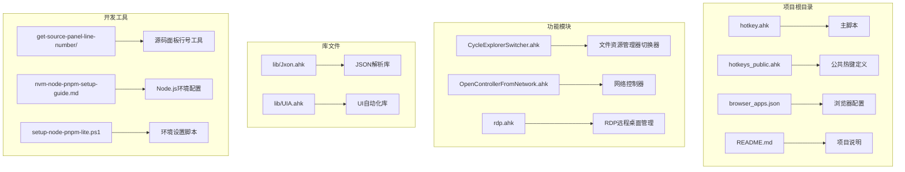
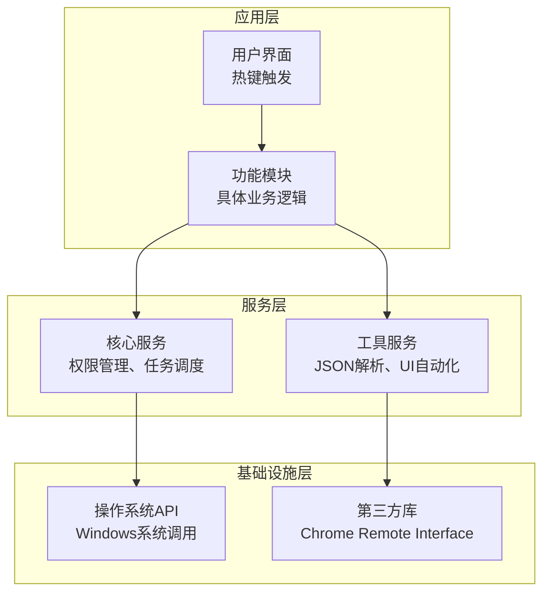
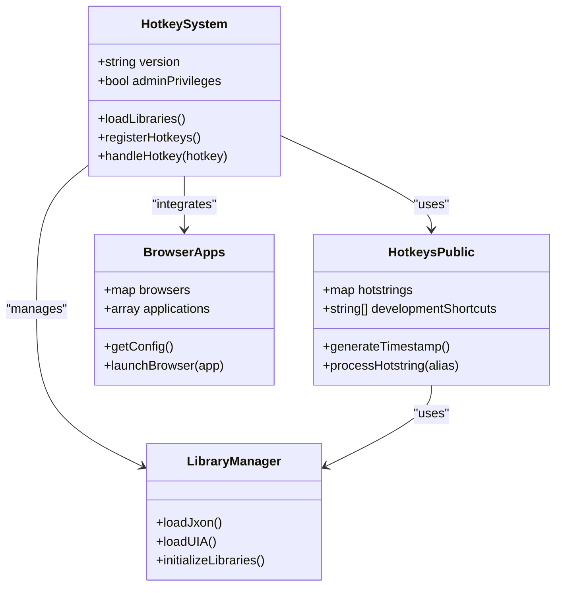
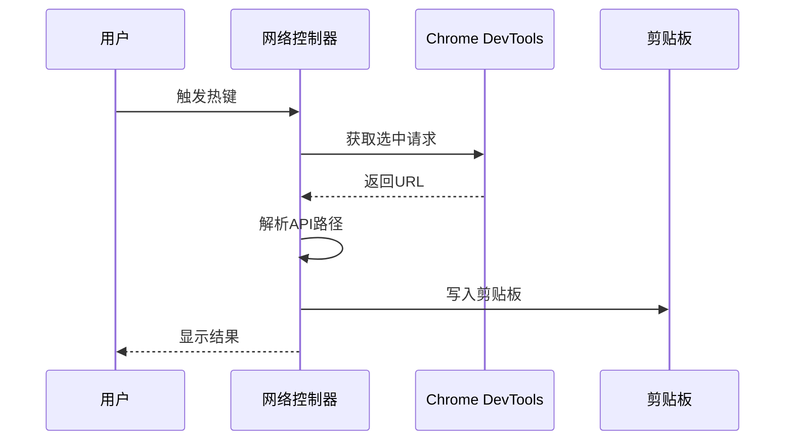
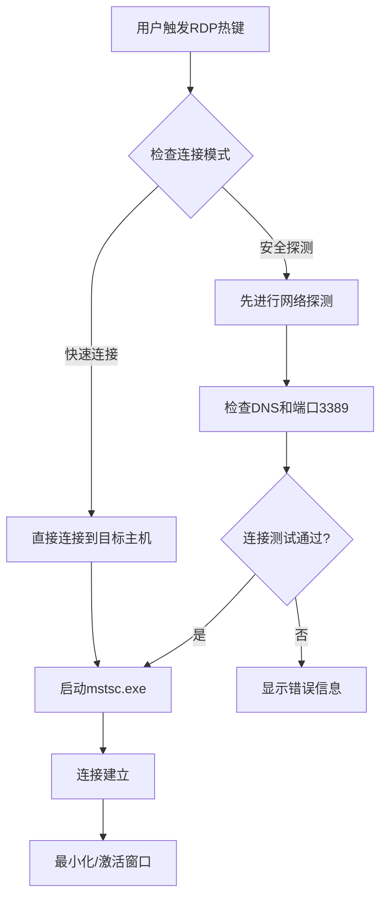
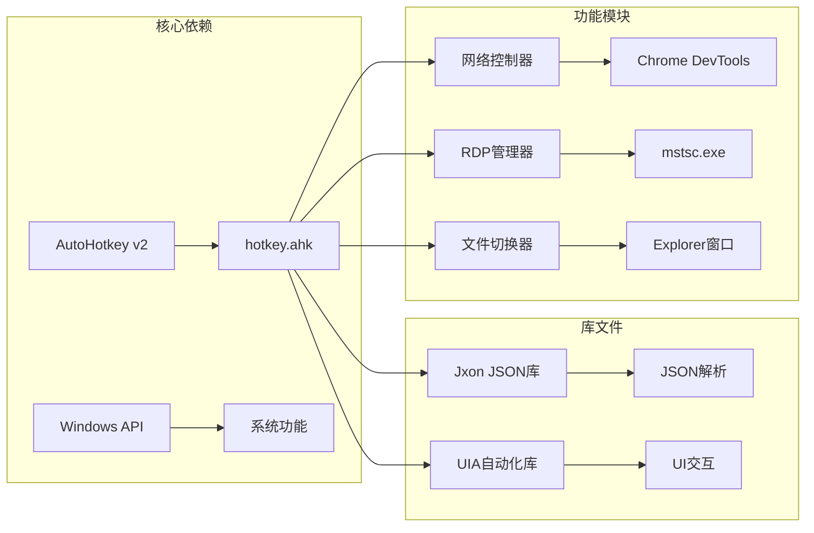

# 更新升级

<cite>
**本文档引用的文件**
- [README.md](file://README.md)
- [hotkey.ahk](file://hotkey.ahk)
- [hotkeys_public.ahk](file://hotkeys_public.ahk)
- [browser_apps.json](file://browser_apps.json)
- [nvm-node-pnpm-setup-guide.md](file://nvm-node-pnpm-setup-guide.md)
- [setup-node-pnpm-lite.ps1](file://setup-node-pnpm-lite.ps1)
- [lib/Jxon.ahk](file://lib/Jxon.ahk)
- [lib/UIA.ahk](file://lib/UIA.ahk)
- [OpenControllerFromNetwork.ahk](file://OpenControllerFromNetwork.ahk)
- [rdp.ahk](file://rdp.ahk)
- [CycleExplorerSwitcher.ahk](file://CycleExplorerSwitcher.ahk)
- [get-source-panel-line-number/package.json](file://get-source-panel-line-number/package.json)
</cite>

## 目录
1. [简介](#简介)
2. [项目结构](#项目结构)
3. [核心组件](#核心组件)
4. [架构概览](#架构概览)
5. [详细组件分析](#详细组件分析)
6. [依赖关系分析](#依赖关系分析)
7. [性能考虑](#性能考虑)
8. [故障排除指南](#故障排除指南)
9. [结论](#结论)

## 简介

hotkey 是一个基于 AutoHotkey v2 的脚本项目，旨在为用户提供自定义热键功能来启动程序或使用各种工具。该项目提供了丰富的功能集，包括应用程序启动、热字符串、浏览器集成、远程桌面管理和开发者工具支持等。

项目采用模块化设计，通过主脚本 hotkey.ahk 作为入口点，包含多个功能模块和库文件。所有代码都遵循 AutoHotkey v2 的语法规范，确保了跨平台兼容性和现代化的功能特性。

## 项目结构

项目采用清晰的文件组织结构，将不同类型的文件分类存放：

**图表来源**
- [hotkey.ahk:1-50](file://hotkey.ahk#L1-L50)
- [README.md:1-2](file://README.md#L1-L2)

**章节来源**
- [hotkey.ahk:1-2413](file://hotkey.ahk#L1-L2413)
- [README.md:1-2](file://README.md#L1-L2)

## 核心组件

### 主脚本系统

主脚本 hotkey.ahk 是整个系统的入口点，负责初始化环境、加载依赖库和设置全局配置。其核心功能包括：

- **版本要求检查**：明确要求 AutoHotkey v2.0 或更高版本
- **权限管理**：自动提升管理员权限以确保系统任务注册功能正常工作
- **库文件加载**：动态包含必要的库文件（Jxon JSON解析库、UIA UI自动化库）
- **模块集成**：包含各个功能模块（网络控制器、RDP管理器、文件资源管理器切换器）

### 热键系统

hotkeys_public.ahk 提供了通用的热键定义，包括：
- **热字符串**：快速输入常用代码片段和SQL语句
- **开发工具快捷键**：数据库操作、网络监控等开发相关功能
- **系统工具**：时间戳生成、编码转换等实用功能

### 浏览器集成

browser_apps.json 定义了浏览器应用程序的配置：
- **多浏览器支持**：Chrome、Edge等主流浏览器
- **配置参数**：启动参数、配置文件路径等
- **应用程序映射**：预定义的应用程序快捷方式

**章节来源**
- [hotkey.ahk:1-200](file://hotkey.ahk#L1-L200)
- [hotkeys_public.ahk:1-57](file://hotkeys_public.ahk#L1-L57)
- [browser_apps.json:1-48](file://browser_apps.json#L1-L48)

## 架构概览

项目采用分层架构设计，确保功能模块的独立性和可维护性：

**图表来源**
- [hotkey.ahk:1-100](file://hotkey.ahk#L1-L100)
- [lib/Jxon.ahk:1-50](file://lib/Jxon.ahk#L1-L50)
- [lib/UIA.ahk:1-50](file://lib/UIA.ahk#L1-L50)

### 版本兼容性

项目严格遵循以下版本要求：

- **AutoHotkey版本**：v2.0 或更高版本
- **操作系统**：Windows 系统（利用 Windows API 和系统功能）
- **依赖库**：AutoHotkey v2 内置库和第三方库

**章节来源**
- [hotkey.ahk:1](file://hotkey.ahk#L1)
- [README.md:1](file://README.md#L1)

## 详细组件分析

### 热键系统架构

**图表来源**
- [hotkey.ahk:14-22](file://hotkey.ahk#L14-L22)
- [hotkeys_public.ahk:1-57](file://hotkeys_public.ahk#L1-L57)
- [browser_apps.json:1-48](file://browser_apps.json#L1-L48)

### 网络控制器模块

OpenControllerFromNetwork.ahk 提供了强大的网络请求分析功能：

**图表来源**
- [OpenControllerFromNetwork.ahk:28-55](file://OpenControllerFromNetwork.ahk#L28-L55)
- [OpenControllerFromNetwork.ahk:139-195](file://OpenControllerFromNetwork.ahk#L139-L195)

### RDP远程桌面管理

RDP模块提供了完整的远程桌面连接管理功能：

**图表来源**
- [rdp.ahk:165-182](file://rdp.ahk#L165-L182)
- [rdp.ahk:364-402](file://rdp.ahk#L364-L402)

**章节来源**
- [OpenControllerFromNetwork.ahk:1-877](file://OpenControllerFromNetwork.ahk#L1-L877)
- [rdp.ahk:1-417](file://rdp.ahk#L1-L417)
- [CycleExplorerSwitcher.ahk:1-478](file://CycleExplorerSwitcher.ahk#L1-L478)

## 依赖关系分析

项目依赖关系图展示了各组件之间的相互依赖：

**图表来源**
- [hotkey.ahk:3-6](file://hotkey.ahk#L3-L6)
- [lib/Jxon.ahk:1-301](file://lib/Jxon.ahk#L1-L301)
- [lib/UIA.ahk:1-800](file://lib/UIA.ahk#L1-L800)

### 第三方依赖

项目使用以下第三方依赖：

- **Chrome Remote Interface**：用于与Chrome DevTools通信
- **Node.js生态系统**：通过nvm管理Node.js版本
- **pnpm包管理器**：替代npm的高性能包管理器

**章节来源**
- [get-source-panel-line-number/package.json:1-6](file://get-source-panel-line-number/package.json#L1-L6)
- [nvm-node-pnpm-setup-guide.md:1-160](file://nvm-node-pnpm-setup-guide.md#L1-L160)

## 性能考虑

### 内存管理

项目在内存使用方面采用了多项优化策略：

- **延迟加载**：库文件仅在需要时加载
- **资源清理**：及时释放GUI资源和系统句柄
- **缓存机制**：UIA元素和菜单锚点的智能缓存

### 执行效率

- **异步操作**：网络请求和文件操作采用异步处理
- **条件检查**：避免不必要的系统调用
- **错误处理**：优雅的异常处理减少性能损耗

## 故障排除指南

### 常见问题及解决方案

#### 权限问题
**症状**：脚本无法注册系统任务
**解决方案**：确保以管理员身份运行脚本

#### AutoHotkey版本不兼容
**症状**：脚本报错或功能异常
**解决方案**：升级到 AutoHotkey v2.0 或更高版本

#### 热键冲突
**症状**：某些热键无法正常工作
**解决方案**：检查系统热键设置，调整自定义热键配置

#### 网络控制器失效
**症状**：无法从Chrome DevTools获取URL
**解决方案**：检查Chrome版本兼容性和DevTools权限

### 调试工具

项目提供了多种调试和诊断工具：

- **性能日志**：记录网络控制器的性能数据
- **RDP日志**：记录远程桌面连接过程
- **调试信息**：显示当前窗口和进程信息

**章节来源**
- [OpenControllerFromNetwork.ahk:301-311](file://OpenControllerFromNetwork.ahk#L301-L311)
- [rdp.ahk:141-146](file://rdp.ahk#L141-L146)
- [rdp.ahk:272-297](file://rdp.ahk#L272-L297)

## 结论

hotkey 项目展现了现代AutoHotkey应用的最佳实践，通过模块化设计、完善的错误处理和丰富的功能集，为用户提供了强大而易用的自动化工具。项目的设计充分考虑了可维护性和扩展性，为未来的功能增强奠定了坚实基础。

随着AutoHotkey生态系统的不断发展，该项目将继续演进，为用户提供更加丰富和高效的自动化体验。建议用户定期关注项目更新，及时应用新的功能和改进。