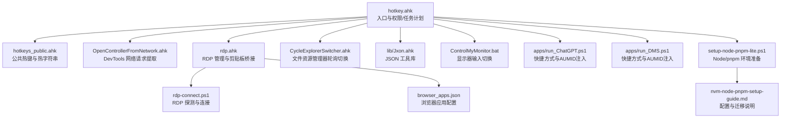
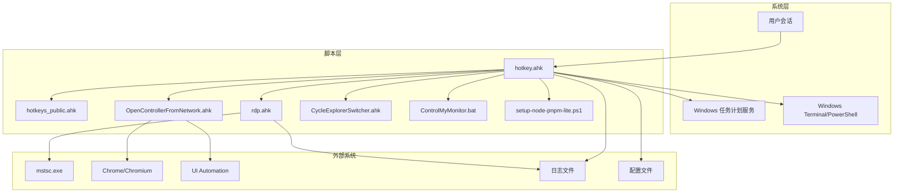
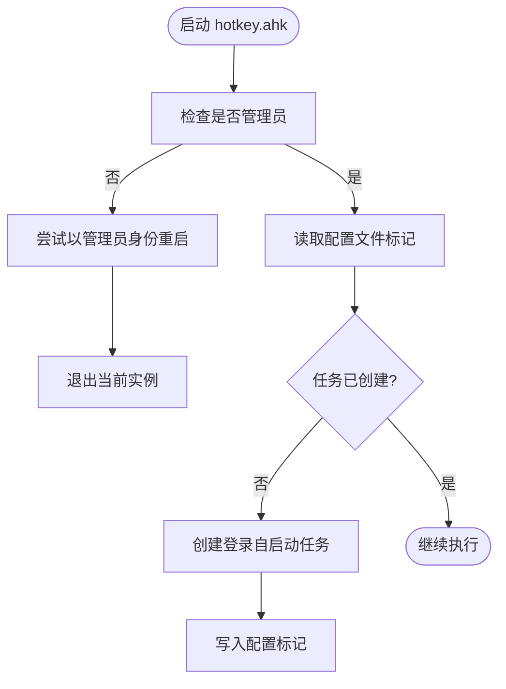
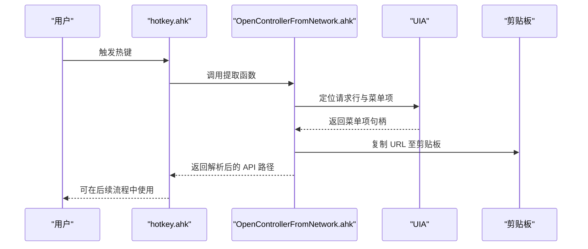
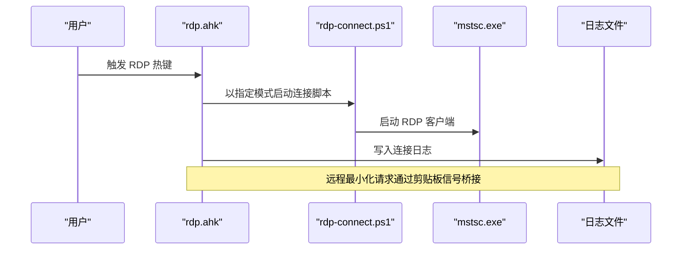
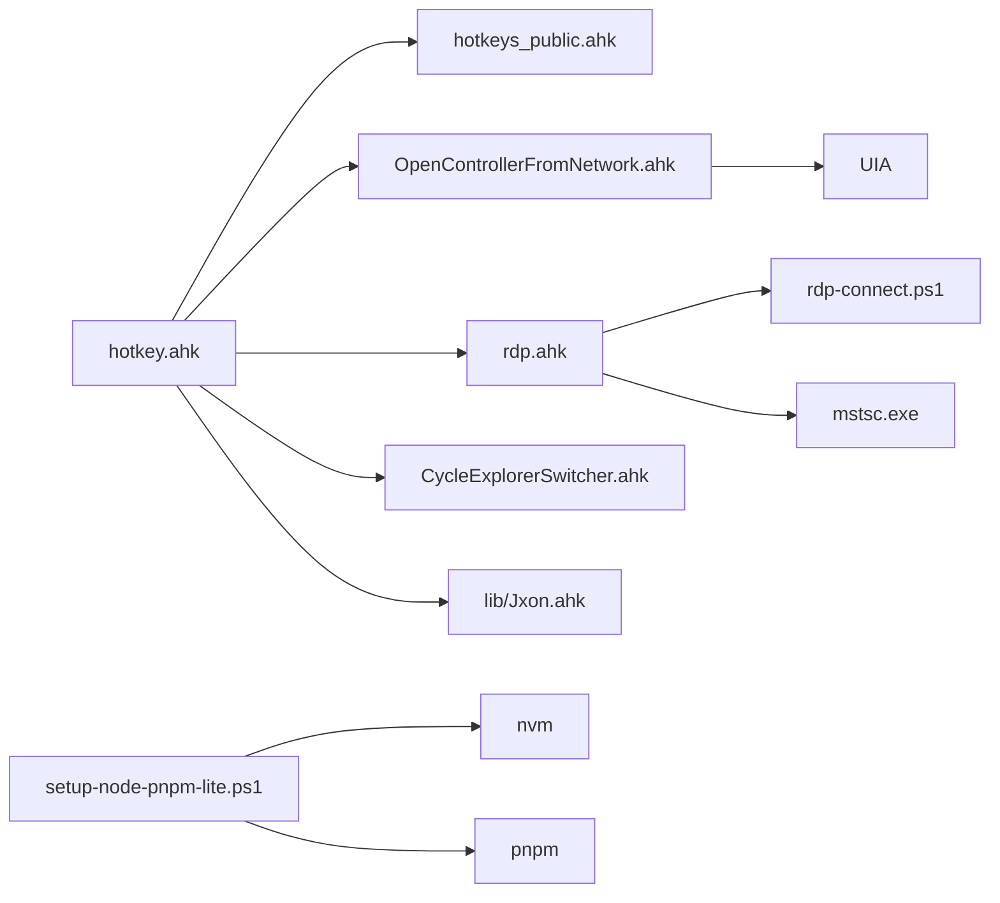

# 部署与维护

<cite>
**本文引用的文件**
- [README.md](file://README.md)
- [hotkey.ahk](file://hotkey.ahk)
- [hotkeys_public.ahk](file://hotkeys_public.ahk)
- [OpenControllerFromNetwork.ahk](file://OpenControllerFromNetwork.ahk)
- [rdp.ahk](file://rdp.ahk)
- [CycleExplorerSwitcher.ahk](file://CycleExplorerSwitcher.ahk)
- [ControlMyMonitor.bat](file://ControlMyMonitor.bat)
- [browser_apps.json](file://browser_apps.json)
- [setup-node-pnpm-lite.ps1](file://setup-node-pnpm-lite.ps1)
- [nvm-node-pnpm-setup-guide.md](file://nvm-node-pnpm-setup-guide.md)
- [apps/run_ChatGPT.ps1](file://apps/run_ChatGPT.ps1)
- [apps/run_DMS.ps1](file://apps/run_DMS.ps1)
- [rdp-connect.ps1](file://rdp-connect.ps1)
</cite>

## 目录
1. [简介](#简介)
2. [项目结构](#项目结构)
3. [核心组件](#核心组件)
4. [架构总览](#架构总览)
5. [详细组件分析](#详细组件分析)
6. [依赖关系分析](#依赖关系分析)
7. [性能考虑](#性能考虑)
8. [故障排查指南](#故障排查指南)
9. [结论](#结论)
10. [附录](#附录)

## 简介
本项目基于 AutoHotkey v2 实现，提供一键热键启动程序、窗口切换、RDP 连接与剪贴板桥接、开发者工具链辅助等功能。本文档面向运维与维护人员，覆盖安装部署、权限与任务计划服务注册、更新升级、日常维护、性能监控、日志分析、备份恢复与灾难恢复、以及安全配置与权限管理最佳实践。

## 项目结构
项目采用功能模块化组织，核心入口脚本负责权限自提升、任务计划服务注册、公共热键与功能模块的聚合；各功能模块独立封装，便于维护与扩展。

**图示来源**
- [hotkey.ahk](file://hotkey.ahk)
- [hotkeys_public.ahk](file://hotkeys_public.ahk)
- [OpenControllerFromNetwork.ahk](file://OpenControllerFromNetwork.ahk)
- [rdp.ahk](file://rdp.ahk)
- [CycleExplorerSwitcher.ahk](file://CycleExplorerSwitcher.ahk)
- [ControlMyMonitor.bat](file://ControlMyMonitor.bat)
- [browser_apps.json](file://browser_apps.json)
- [setup-node-pnpm-lite.ps1](file://setup-node-pnpm-lite.ps1)
- [nvm-node-pnpm-setup-guide.md](file://nvm-node-pnpm-setup-guide.md)
- [apps/run_ChatGPT.ps1](file://apps/run_ChatGPT.ps1)
- [apps/run_DMS.ps1](file://apps/run_DMS.ps1)
- [rdp-connect.ps1](file://rdp-connect.ps1)

**章节来源**
- [README.md](file://README.md)
- [hotkey.ahk](file://hotkey.ahk)

## 核心组件
- 权限自提升与任务计划服务注册：脚本启动即检查管理员权限，必要时提权并注册登录自启动任务，确保开机自动以管理员权限运行。
- 公共热键与热字符串：提供常用开发与办公快捷指令，如 SQL 片段、时间戳、IP 查询等。
- DevTools 网络请求提取：通过 UIA 与鼠标交互，从浏览器开发者工具中提取选中请求的 URL 并解析为 API 路径。
- RDP 管理与剪贴板桥接：提供 RDP 快速连接、安全探测连接、远程最小化请求、剪贴板信号桥接与日志记录。
- 文件资源管理器轮询切换：在多个文件资源管理器窗口间通过可视化列表轮询切换，支持自定义热键。
- JSON 工具库：轻量 JSON 解析与序列化，供配置与日志使用。
- 浏览器应用配置：集中管理 Chrome 应用的启动参数与快捷方式 AUMID 注入。
- 显示器输入切换：自动检测并切换显示器输入源（HDMI）。
- Node/pnpm 环境准备：一键安装 Node、启用 pnpm、迁移缓存与全局目录至 D 盘。

**章节来源**
- [hotkey.ahk](file://hotkey.ahk)
- [hotkeys_public.ahk](file://hotkeys_public.ahk)
- [OpenControllerFromNetwork.ahk](file://OpenControllerFromNetwork.ahk)
- [rdp.ahk](file://rdp.ahk)
- [CycleExplorerSwitcher.ahk](file://CycleExplorerSwitcher.ahk)
- [lib/Jxon.ahk](file://lib/Jxon.ahk)
- [browser_apps.json](file://browser_apps.json)
- [ControlMyMonitor.bat](file://ControlMyMonitor.bat)
- [apps/run_ChatGPT.ps1](file://apps/run_ChatGPT.ps1)
- [apps/run_DMS.ps1](file://apps/run_DMS.ps1)
- [setup-node-pnpm-lite.ps1](file://setup-node-pnpm-lite.ps1)

## 架构总览
整体架构围绕“入口脚本 + 功能模块”的模式构建，入口脚本负责系统级能力（权限、任务计划），功能模块负责具体业务（RDP、DevTools、窗口切换、浏览器应用等）。日志与配置贯穿各模块，便于统一维护与排障。

**图示来源**
- [hotkey.ahk](file://hotkey.ahk)
- [hotkeys_public.ahk](file://hotkeys_public.ahk)
- [OpenControllerFromNetwork.ahk](file://OpenControllerFromNetwork.ahk)
- [rdp.ahk](file://rdp.ahk)
- [CycleExplorerSwitcher.ahk](file://CycleExplorerSwitcher.ahk)
- [ControlMyMonitor.bat](file://ControlMyMonitor.bat)
- [setup-node-pnpm-lite.ps1](file://setup-node-pnpm-lite.ps1)

## 详细组件分析

### 权限自提升与任务计划服务注册
- 权限检查：若非管理员，尝试以“以管理员身份运行”方式重启当前脚本。
- 任务计划注册：首次运行时创建登录自启动任务，使用最高权限运行，避免受电源策略影响。
- 配置持久化：通过配置文件记录任务创建状态，避免重复注册。

**图示来源**
- [hotkey.ahk](file://hotkey.ahk)

**章节来源**
- [hotkey.ahk](file://hotkey.ahk)

### 公共热键与热字符串
- 提供多种开发与办公常用片段的热字符串，如 SQL 事务模板、常用命令、时间戳等。
- 通过公共脚本集中维护，便于统一更新与迁移。

**章节来源**
- [hotkeys_public.ahk](file://hotkeys_public.ahk)

### DevTools 网络请求提取
- 优先通过右键菜单与 UIA 定位“复制 URL”项，其次回退到 Ctrl+C 与剪贴板解析。
- 支持自适应重试、菜单缓存与坐标漂移控制，提升稳定性。
- 性能日志输出到文件，便于分析与优化。

**图示来源**
- [OpenControllerFromNetwork.ahk](file://OpenControllerFromNetwork.ahk)

**章节来源**
- [OpenControllerFromNetwork.ahk](file://OpenControllerFromNetwork.ahk)

### RDP 管理与剪贴板桥接
- RDP 快速直连与安全探测连接：根据模式选择直连或先探测再连接。
- 剪贴板桥接：在远程会话与本地之间通过剪贴板信号实现最小化请求与回滚。
- 日志记录：统一写入日志文件，便于问题定位。

**图示来源**
- [rdp.ahk](file://rdp.ahk)
- [rdp-connect.ps1](file://rdp-connect.ps1)

**章节来源**
- [rdp.ahk](file://rdp.ahk)
- [rdp-connect.ps1](file://rdp-connect.ps1)

### 文件资源管理器轮询切换
- 通过 GUI 列表展示当前所有文件资源管理器窗口，支持键盘与鼠标选择。
- 修正焦点竞争问题，增强激活成功率。

**章节来源**
- [CycleExplorerSwitcher.ahk](file://CycleExplorerSwitcher.ahk)

### 浏览器应用配置与快捷方式
- 通过 JSON 配置浏览器应用的启动参数与窗口标题。
- PowerShell 脚本生成快捷方式并注入 AUMID，便于系统识别与窗口管理。

**章节来源**
- [browser_apps.json](file://browser_apps.json)
- [apps/run_ChatGPT.ps1](file://apps/run_ChatGPT.ps1)
- [apps/run_DMS.ps1](file://apps/run_DMS.ps1)

### 显示器输入切换
- 自动检测当前显示器输入源，尝试标准 VCP 60 与厂商特定 VCP E2，失败时给出提示。

**章节来源**
- [ControlMyMonitor.bat](file://ControlMyMonitor.bat)

### Node/pnpm 环境准备
- 自动修复 nvm 镜像、安装指定 Node 版本、启用 pnpm、迁移 npm/pnpm 缓存与全局目录至 D 盘。
- 提供验证与回滚命令，确保环境一致性与可恢复性。

**章节来源**
- [setup-node-pnpm-lite.ps1](file://setup-node-pnpm-lite.ps1)
- [nvm-node-pnpm-setup-guide.md](file://nvm-node-pnpm-setup-guide.md)

## 依赖关系分析
- 入口脚本依赖公共库与功能模块，功能模块之间相对独立，通过入口脚本聚合。
- RDP 模块依赖 PowerShell 连接脚本与 mstsc.exe。
- DevTools 模块依赖 UIA 与浏览器进程。
- Node/pnpm 模块依赖 nvm、npm、pnpm 与系统环境变量。

**图示来源**
- [hotkey.ahk](file://hotkey.ahk)
- [hotkeys_public.ahk](file://hotkeys_public.ahk)
- [OpenControllerFromNetwork.ahk](file://OpenControllerFromNetwork.ahk)
- [rdp.ahk](file://rdp.ahk)
- [CycleExplorerSwitcher.ahk](file://CycleExplorerSwitcher.ahk)
- [lib/Jxon.ahk](file://lib/Jxon.ahk)
- [setup-node-pnpm-lite.ps1](file://setup-node-pnpm-lite.ps1)
- [rdp-connect.ps1](file://rdp-connect.ps1)

**章节来源**
- [hotkey.ahk](file://hotkey.ahk)
- [OpenControllerFromNetwork.ahk](file://OpenControllerFromNetwork.ahk)
- [rdp.ahk](file://rdp.ahk)
- [setup-node-pnpm-lite.ps1](file://setup-node-pnpm-lite.ps1)

## 性能考虑
- DevTools 提取流程包含多级回退与 UIA 定位，建议在低延迟网络与稳定 UI 环境下使用；可通过性能日志定位瓶颈。
- RDP 连接前的探测（TCP/ARP/DNS）可能带来额外延迟，建议在局域网内优先使用快速直连模式。
- 文件资源管理器轮询切换使用 GUI 列表，窗口较多时建议减少窗口数量或关闭不必要的标签页。
- Node/pnpm 环境迁移至 D 盘可减少 C 盘 IO 压力，建议定期清理缓存与全局包。

[本节为通用建议，无需特定文件引用]

## 故障排查指南
- 权限与任务计划
  - 现象：脚本无法以管理员权限运行或任务未注册。
  - 排查：确认以管理员身份运行；检查任务计划服务状态；查看配置文件标记。
  - 参考：[hotkey.ahk](file://hotkey.ahk)
- DevTools 提取失败
  - 现象：无法定位菜单项或复制 URL 失败。
  - 排查：检查浏览器版本与开发者工具界面；查看性能日志；调整重试参数。
  - 参考：[OpenControllerFromNetwork.ahk](file://OpenControllerFromNetwork.ahk)
- RDP 连接异常
  - 现象：连接超时或无法最小化远程窗口。
  - 排查：确认 mstsc.exe 存在；检查网络连通性；查看 RDP 日志；使用安全探测模式。
  - 参考：[rdp.ahk](file://rdp.ahk)，[rdp-connect.ps1](file://rdp-connect.ps1)
- Node/pnpm 环境问题
  - 现象：nvm 安装失败或 pnpm 不可用。
  - 排查：修复镜像源；确认版本安装与激活；检查环境变量；参考回滚命令。
  - 参考：[setup-node-pnpm-lite.ps1](file://setup-node-pnpm-lite.ps1)，[nvm-node-pnpm-setup-guide.md](file://nvm-node-pnpm-setup-guide.md)

**章节来源**
- [hotkey.ahk](file://hotkey.ahk)
- [OpenControllerFromNetwork.ahk](file://OpenControllerFromNetwork.ahk)
- [rdp.ahk](file://rdp.ahk)
- [rdp-connect.ps1](file://rdp-connect.ps1)
- [setup-node-pnpm-lite.ps1](file://setup-node-pnpm-lite.ps1)
- [nvm-node-pnpm-setup-guide.md](file://nvm-node-pnpm-setup-guide.md)

## 结论
本项目通过模块化设计与系统级能力（权限、任务计划）实现了高效稳定的自动化热键体验。遵循本文档的部署与维护流程，可确保脚本在多环境下稳定运行，并具备良好的可维护性与可扩展性。

[本节为总结，无需特定文件引用]

## 附录

### 安装部署流程
- 系统要求检查
  - AutoHotkey v2 已安装。
  - Windows 任务计划服务可用。
  - PowerShell 具备执行策略允许（脚本启动 RDP 与 Node 环境准备）。
- 权限配置
  - 以管理员身份运行入口脚本，完成权限自提升与任务计划注册。
- 任务计划服务注册
  - 首次运行自动创建登录自启动任务，使用最高权限运行。
- Node/pnpm 环境准备
  - 运行环境准备脚本，自动修复镜像、安装 Node、启用 pnpm 并迁移缓存与全局目录至 D 盘。
- 浏览器应用配置
  - 使用 JSON 配置浏览器应用；运行 PowerShell 脚本生成快捷方式并注入 AUMID。
- 显示器输入切换
  - 运行批处理脚本，自动检测并切换显示器输入源。

**章节来源**
- [hotkey.ahk](file://hotkey.ahk)
- [setup-node-pnpm-lite.ps1](file://setup-node-pnpm-lite.ps1)
- [browser_apps.json](file://browser_apps.json)
- [apps/run_ChatGPT.ps1](file://apps/run_ChatGPT.ps1)
- [apps/run_DMS.ps1](file://apps/run_DMS.ps1)
- [ControlMyMonitor.bat](file://ControlMyMonitor.bat)

### 更新与升级指导
- 版本兼容性检查
  - 确认 AutoHotkey v2 环境；如升级 AHK，需验证热键语法与 API 变更。
- 配置迁移方法
  - 公共热键与 DevTools 参数通过各自脚本维护；RDP 配置与日志路径保持在脚本目录；浏览器应用配置通过 JSON 管理。
- 节点环境迁移
  - 使用环境准备脚本与回滚命令，确保缓存与全局目录迁移与恢复。

**章节来源**
- [hotkey.ahk](file://hotkey.ahk)
- [OpenControllerFromNetwork.ahk](file://OpenControllerFromNetwork.ahk)
- [rdp.ahk](file://rdp.ahk)
- [browser_apps.json](file://browser_apps.json)
- [setup-node-pnpm-lite.ps1](file://setup-node-pnpm-lite.ps1)
- [nvm-node-pnpm-setup-guide.md](file://nvm-node-pnpm-setup-guide.md)

### 日常维护任务
- 清理缓存与日志
  - 定期清理 Node 缓存与 pnpm store；归档 RDP 与 DevTools 性能日志。
- 热键与功能验证
  - 每月验证常用热键与功能模块（RDP、DevTools、窗口切换）。
- 环境健康检查
  - 检查 nvm 镜像源、Node 版本与 pnpm 可用性。

**章节来源**
- [setup-node-pnpm-lite.ps1](file://setup-node-pnpm-lite.ps1)
- [rdp.ahk](file://rdp.ahk)
- [OpenControllerFromNetwork.ahk](file://OpenControllerFromNetwork.ahk)

### 性能监控与错误日志分析
- 性能监控
  - DevTools 性能日志输出到文件，定期分析关键路径耗时。
- 错误日志分析
  - RDP 日志统一写入脚本目录；权限与任务计划错误通过消息框提示；结合系统事件查看器定位底层错误。

**章节来源**
- [OpenControllerFromNetwork.ahk](file://OpenControllerFromNetwork.ahk)
- [rdp.ahk](file://rdp.ahk)

### 备份恢复策略与灾难恢复
- 备份内容
  - 脚本文件、配置文件（含 browser_apps.json）、日志文件、Node 环境配置。
- 恢复步骤
  - 恢复脚本与配置；重建任务计划服务；重新安装/启用 Node/pnpm；验证热键与功能。
- 灾难恢复
  - 使用回滚命令恢复 nvm/pnpm 配置；重装 AutoHotkey v2 与依赖组件；重新注册任务计划。

**章节来源**
- [nvm-node-pnpm-setup-guide.md](file://nvm-node-pnpm-setup-guide.md)
- [hotkey.ahk](file://hotkey.ahk)
- [browser_apps.json](file://browser_apps.json)

### 安全配置与权限管理最佳实践
- 权限最小化
  - 仅在必要时以管理员身份运行；任务计划服务使用最高权限但限定脚本范围。
- 环境隔离
  - Node/pnpm 缓存与全局目录迁移至 D 盘，避免 C 盘权限与空间问题。
- 配置审计
  - 对浏览器应用配置与快捷方式变更进行审计；严格控制 AUMID 注入。
- 网络安全
  - RDP 连接优先使用安全探测模式；在可信网络内使用快速直连。

**章节来源**
- [hotkey.ahk](file://hotkey.ahk)
- [setup-node-pnpm-lite.ps1](file://setup-node-pnpm-lite.ps1)
- [browser_apps.json](file://browser_apps.json)
- [rdp-connect.ps1](file://rdp-connect.ps1)