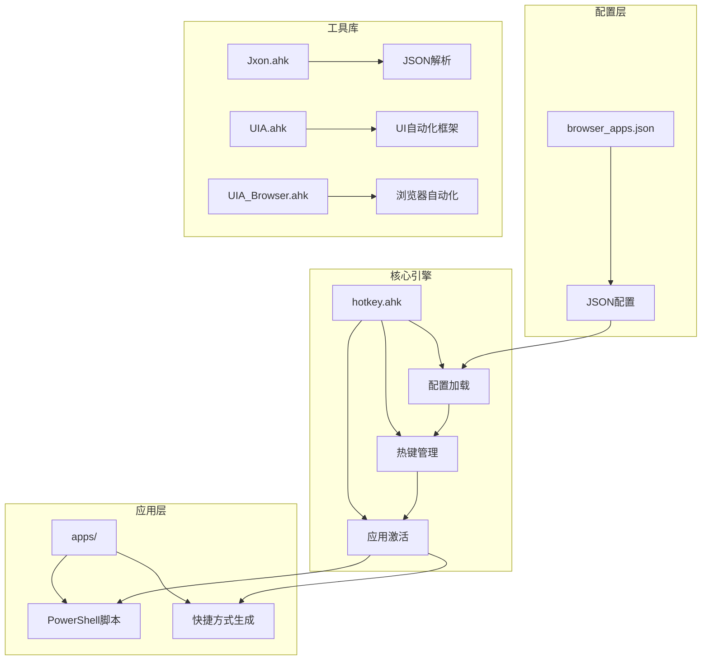
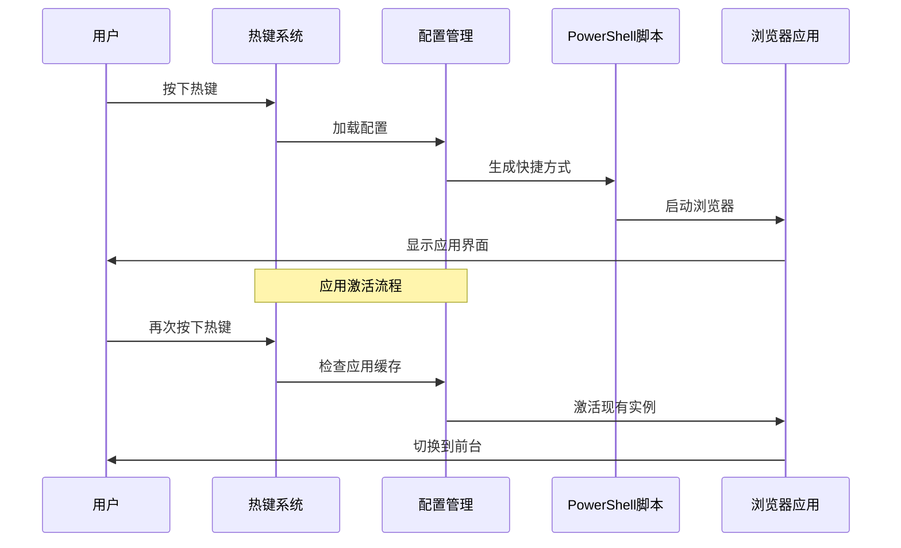
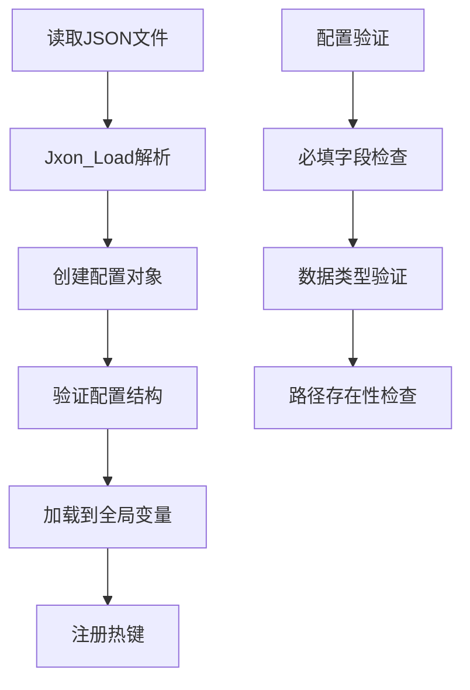
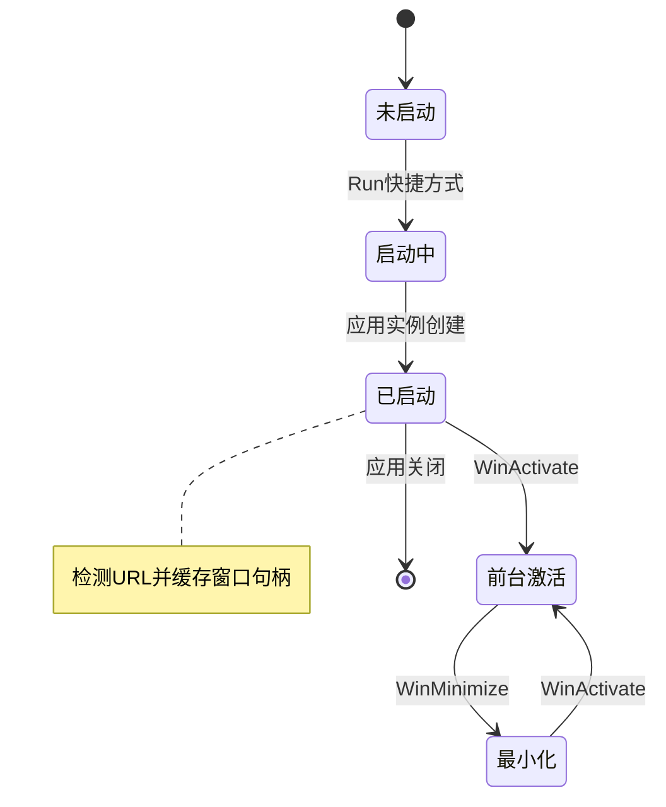
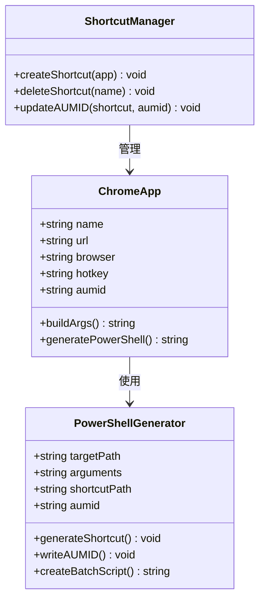
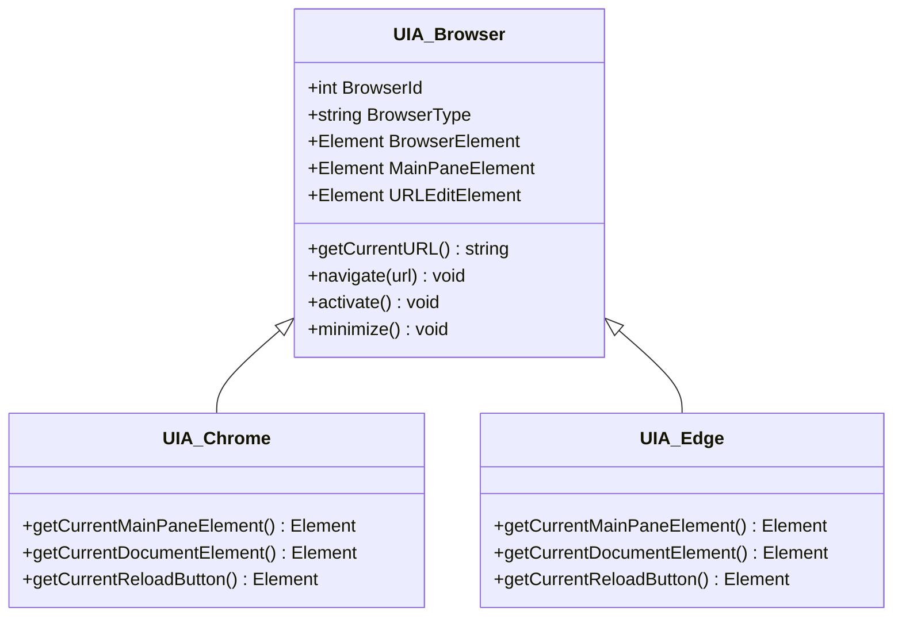
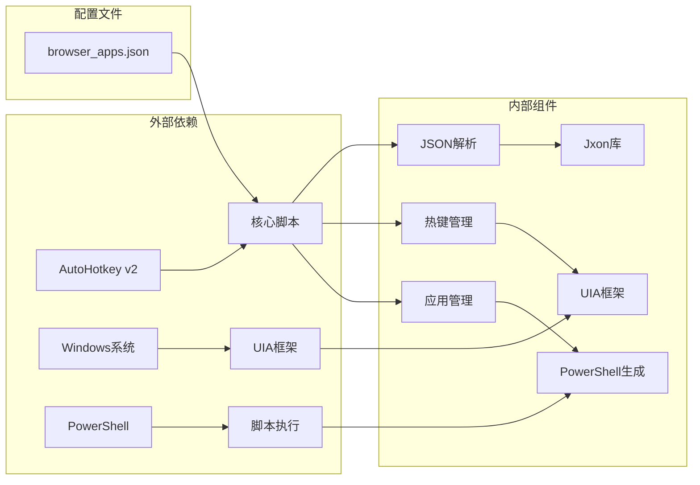

# 浏览器应用配置

<cite>
**本文档引用的文件**
- [browser_apps.json](file://browser_apps.json)
- [hotkey.ahk](file://hotkey.ahk)
- [Jxon.ahk](file://lib/Jxon.ahk)
- [UIA.ahk](file://lib/UIA.ahk)
- [UIA_Browser.ahk](file://lib/UIA_Browser.ahk)
- [run_ChatGPT.ps1](file://apps/run_ChatGPT.ps1)
- [run_DMS.ps1](file://apps/run_DMS.ps1)
- [README.md](file://README.md)
</cite>

## 目录
1. [简介](#简介)
2. [项目结构](#项目结构)
3. [核心组件](#核心组件)
4. [架构概览](#架构概览)
5. [详细组件分析](#详细组件分析)
6. [依赖关系分析](#依赖关系分析)
7. [性能考虑](#性能考虑)
8. [故障排除指南](#故障排除指南)
9. [结论](#结论)

## 简介

这是一个基于AutoHotkey v2的浏览器应用配置管理系统。该项目通过JSON配置文件定义浏览器应用，使用PowerShell脚本生成桌面快捷方式，并通过热键快速启动和管理浏览器应用。系统支持Chrome和Edge浏览器，提供PWA应用的智能识别和管理功能。

## 项目结构

项目采用模块化设计，主要包含以下核心组件：

**图表来源**
- [browser_apps.json:1-48](file://browser_apps.json#L1-L48)
- [hotkey.ahk:1-800](file://hotkey.ahk#L1-L800)

**章节来源**
- [README.md:1-2](file://README.md#L1-L2)
- [browser_apps.json:1-48](file://browser_apps.json#L1-L48)

## 核心组件

### 配置文件结构

browser_apps.json是整个系统的配置中心，包含三个主要部分：

#### 浏览器定义 (browsers对象)
定义可用的浏览器及其配置信息：
- **path**: 浏览器可执行文件的完整路径
- **profile**: 使用的用户配置文件

#### 公共参数 (commonArgs数组)
定义所有浏览器应用共享的启动参数：
- 禁用扩展插件
- 禁用同步功能
- 禁用后台网络活动
- 禁用默认应用
- 禁用组件更新
- 禁用特定功能特性
- 禁用挂起监控
- 禁用首次运行向导
- 禁用默认浏览器检查

#### 应用定义 (apps数组)
定义具体的浏览器应用实例：
- **name**: 应用名称
- **title**: 窗口标题
- **url**: 目标URL地址
- **browser**: 关联的浏览器类型
- **memory**: 内存占用级别
- **hotkey**: 快速启动热键
- **aumid**: 应用用户模型ID

**章节来源**
- [browser_apps.json:1-48](file://browser_apps.json#L1-L48)

## 架构概览

系统采用分层架构设计，从上到下分别为配置层、核心引擎层、工具库层和应用层：

**图表来源**
- [hotkey.ahk:2147-2245](file://hotkey.ahk#L2147-L2245)
- [hotkey.ahk:2221-2245](file://hotkey.ahk#L2221-L2245)

## 详细组件分析

### 配置加载与解析

系统使用自定义的JSON解析库Jxon.ahk来处理配置文件：

**图表来源**
- [Jxon.ahk:10-48](file://lib/Jxon.ahk#L10-L48)
- [hotkey.ahk:2132-2139](file://hotkey.ahk#L2132-L2139)

### 应用生命周期管理

系统实现了完整的应用生命周期管理，包括启动、激活、最小化等功能：

**图表来源**
- [hotkey.ahk:2221-2245](file://hotkey.ahk#L2221-L2245)
- [hotkey.ahk:2160-2206](file://hotkey.ahk#L2160-L2206)

### PowerShell脚本生成机制

系统通过PowerShell脚本动态生成桌面快捷方式，实现应用的快速启动：

**图表来源**
- [hotkey.ahk:1935-1972](file://hotkey.ahk#L1935-L1972)
- [hotkey.ahk:2036-2111](file://hotkey.ahk#L2036-L2111)

### AUMID作用与实现

AUMID（应用用户模型ID）是Windows 8引入的概念，用于标识应用实例：

| AUMID类型 | 用途 | 实现方式 |
|-----------|------|----------|
| 应用标识 | 区分不同应用实例 | 通过PowerShell脚本写入.lnk文件 |
| 窗口管理 | 系统级应用窗口识别 | Windows任务栏和开始菜单识别 |
| 快速启动 | 通过热键激活应用 | AutoHotkey通过ahk_exe匹配 |

**章节来源**
- [run_ChatGPT.ps1:14-18](file://apps/run_ChatGPT.ps1#L14-L18)
- [run_DMS.ps1:14-18](file://apps/run_DMS.ps1#L14-L18)

### 浏览器自动化框架

系统集成了UIA（通用界面自动化）框架，提供强大的浏览器自动化能力：

**图表来源**
- [UIA_Browser.ahk:458-488](file://lib/UIA_Browser.ahk#L458-L488)
- [UIA_Browser.ahk:217-261](file://lib/UIA_Browser.ahk#L217-L261)

**章节来源**
- [UIA_Browser.ahk:1-945](file://lib/UIA_Browser.ahk#L1-L945)

## 依赖关系分析

系统各组件之间的依赖关系如下：

**图表来源**
- [hotkey.ahk:1-20](file://hotkey.ahk#L1-L20)
- [Jxon.ahk:1-301](file://lib/Jxon.ahk#L1-L301)

**章节来源**
- [hotkey.ahk:1-800](file://hotkey.ahk#L1-L800)

## 性能考虑

### 内存优化策略
- 使用缓存机制避免重复扫描浏览器实例
- 智能URL匹配减少不必要的UIA调用
- 批量操作减少系统调用次数

### 启动性能优化
- 延迟加载非必要组件
- 异步处理PowerShell脚本生成
- 智能路径检测避免无效IO操作

### 系统资源管理
- 合理使用COM对象生命周期
- 及时释放UIA资源
- 控制PowerShell进程数量

## 故障排除指南

### 常见问题及解决方案

#### 配置文件加载失败
**症状**: 系统无法启动或热键无效
**原因**: JSON格式错误或文件损坏
**解决**: 检查browser_apps.json语法，使用在线JSON验证工具

#### 浏览器路径错误
**症状**: 应用无法启动或启动后立即崩溃
**原因**: 浏览器路径配置不正确
**解决**: 更新browsers对象中的path字段为正确的安装路径

#### PowerShell脚本生成失败
**症状**: 生成的快捷方式无法正常工作
**原因**: 权限不足或PowerShell执行策略限制
**解决**: 以管理员身份运行，调整执行策略

#### AUMID识别失败
**症状**: 热键无法激活特定应用
**原因**: AUMID写入失败或应用实例不匹配
**解决**: 重新生成快捷方式，检查AUMID配置

**章节来源**
- [hotkey.ahk:2113-2126](file://hotkey.ahk#L2113-L2126)
- [hotkey.ahk:2018-2031](file://hotkey.ahk#L2018-L2031)

## 结论

该浏览器应用配置系统提供了完整的浏览器应用管理解决方案。通过JSON配置文件、PowerShell脚本生成和AutoHotkey热键管理，实现了高度可定制的浏览器应用启动和管理功能。

系统的主要优势包括：
- **高度可配置**: 通过JSON文件轻松定义和修改应用配置
- **智能管理**: 自动识别和管理PWA应用实例
- **快速启动**: 通过热键实现一键启动和激活
- **跨浏览器支持**: 同时支持Chrome和Edge浏览器
- **扩展性强**: 易于添加新的浏览器应用类型

建议的最佳实践：
- 定期备份browser_apps.json配置文件
- 使用相对路径而非绝对路径提高可移植性
- 合理设置memory参数以平衡性能和资源占用
- 定期更新浏览器路径以适配新版本安装位置