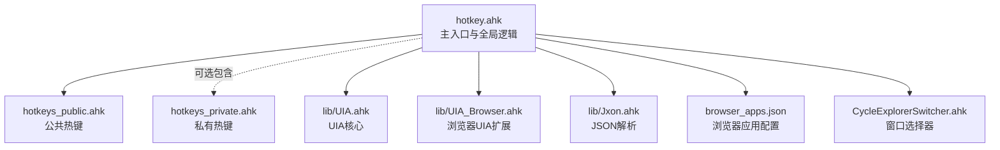
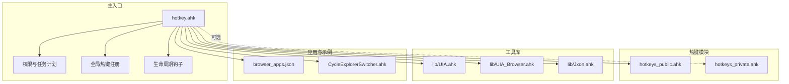
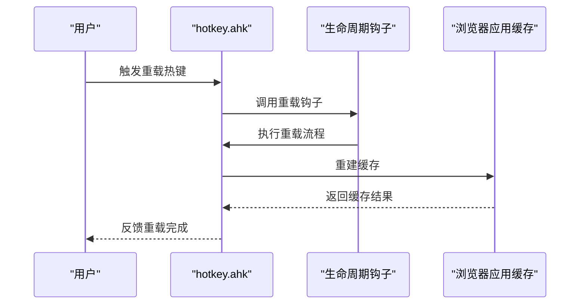
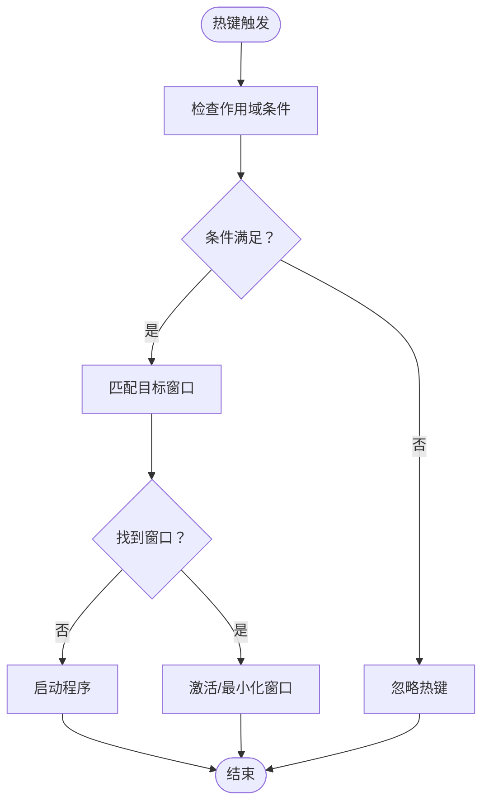
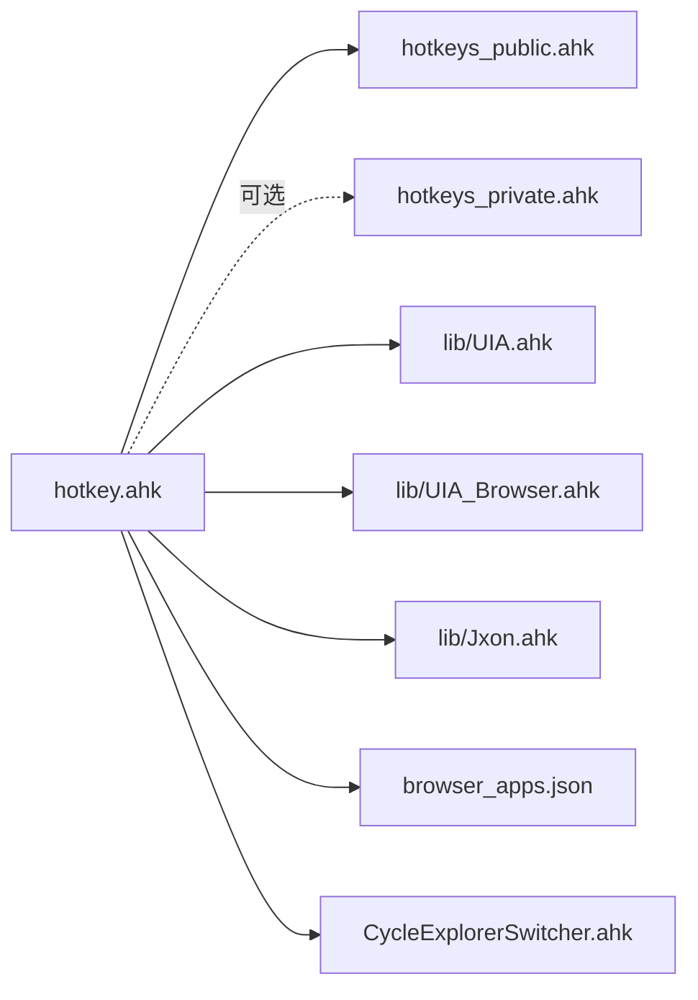

# 热键配置

<cite>
**本文引用的文件**
- [hotkey.ahk](file://hotkey.ahk)
- [hotkeys_public.ahk](file://hotkeys_public.ahk)
- [hotkeys_private.ahk](file://hotkeys_private.ahk)
- [README.md](file://README.md)
- [CycleExplorerSwitcher.ahk](file://CycleExplorerSwitcher.ahk)
- [UIA.ahk](file://lib/UIA.ahk)
- [UIA_Browser.ahk](file://lib/UIA_Browser.ahk)
- [Jxon.ahk](file://lib/Jxon.ahk)
- [browser_apps.json](file://browser_apps.json)
</cite>

## 目录
1. [简介](#简介)
2. [项目结构](#项目结构)
3. [核心组件](#核心组件)
4. [架构总览](#架构总览)
5. [详细组件分析](#详细组件分析)
6. [依赖关系分析](#依赖关系分析)
7. [性能考量](#性能考量)
8. [故障排查指南](#故障排查指南)
9. [结论](#结论)
10. [附录](#附录)

## 简介
本项目基于 AutoHotkey v2 实现一套热键配置系统，提供以下能力：
- 定义公共与私有热键，支持 Windows 标准修饰键组合（Win、Ctrl、Alt、Shift）。
- 热键冲突检测与解决机制，结合热键状态管理与可视化指示器。
- 热键注册、注销与动态更新，支持运行时重载与热字符串扩展。
- 面向应用与功能的热键示例，涵盖程序开关、代理切换、窗口选择器、浏览器 PWA 缓存与激活等。

## 项目结构
- 主入口脚本负责初始化、权限提升、任务计划注册、全局热键与工具函数。
- 热键定义分为公共与私有两部分：公共热键集中于公共模块，私有热键可选包含。
- 辅助库与工具模块用于 UIA、JSON 解析、窗口切换与热字符串扩展。
- 示例与模板文件用于浏览器应用管理与快捷方式生成。

图表来源
- [hotkey.ahk](file://hotkey.ahk)
- [hotkeys_public.ahk](file://hotkeys_public.ahk)
- [hotkeys_private.ahk](file://hotkeys_private.ahk)
- [UIA.ahk](file://lib/UIA.ahk)
- [UIA_Browser.ahk](file://lib/UIA_Browser.ahk)
- [Jxon.ahk](file://lib/Jxon.ahk)
- [browser_apps.json](file://browser_apps.json)
- [CycleExplorerSwitcher.ahk](file://CycleExplorerSwitcher.ahk)

章节来源
- [hotkey.ahk](file://hotkey.ahk)
- [hotkeys_public.ahk](file://hotkeys_public.ahk)
- [hotkeys_private.ahk](file://hotkeys_private.ahk)
- [README.md](file://README.md)

## 核心组件
- 热键定义与语法
  - 修饰键前缀：Win=#、Ctrl=^、Alt=!、Shift=+。
  - 特殊修饰：~（不阻止默认按键）、$（阻断重复触发）、*（通配修饰键）。
  - 热键格式：修饰键组合 + 键位，如 Win+F2、Ctrl+Alt+R、Win+^r。
- 热键注册与动态更新
  - 使用内置热键注册接口进行注册、注销与重载。
  - 支持运行时重载脚本生命周期钩子。
- 热键冲突检测与解决
  - 通过热键作用域（如 #HotIf 条件）与窗口匹配策略避免误触。
  - 提供热键状态指示器（工具提示）反馈当前状态。
- 热键状态管理与指示器
  - 代理开关、CapsLock 状态切换、窗口选择器可见性等均通过状态变量与工具提示反馈。

章节来源
- [hotkey.ahk](file://hotkey.ahk)
- [hotkeys_public.ahk](file://hotkeys_public.ahk)
- [hotkeys_private.ahk](file://hotkeys_private.ahk)

## 架构总览
系统采用“主入口 + 模块化热键 + 工具库”的分层设计。主入口负责全局初始化与生命周期管理，公共/私有热键模块分别承载通用与个人定制热键，工具库提供 UIA、JSON、窗口切换等支撑能力。

图表来源
- [hotkey.ahk](file://hotkey.ahk)
- [hotkeys_public.ahk](file://hotkeys_public.ahk)
- [hotkeys_private.ahk](file://hotkeys_private.ahk)
- [UIA.ahk](file://lib/UIA.ahk)
- [UIA_Browser.ahk](file://lib/UIA_Browser.ahk)
- [Jxon.ahk](file://lib/Jxon.ahk)
- [browser_apps.json](file://browser_apps.json)
- [CycleExplorerSwitcher.ahk](file://CycleExplorerSwitcher.ahk)

## 详细组件分析

### 热键定义语法与规则
- 修饰键前缀
  - Win=#、Ctrl=^、Alt=!、Shift=+。
  - ~：保留原按键功能，仅附加动作。
  - $：阻断重复触发，适合需要精确单次响应的场景。
  - *：通配修饰键，常用于匹配任意修饰键组合。
- 热键示例（节选）
  - Win+F2 打开腾讯会议
  - Win+F3 打开 Clash Verge
  - Win+F4 打开小红书
  - Win+F5 打开微信读书
  - Win+F6 打开搜狗 PDF 阅读编辑器
  - Win+F7 打开 AdminRadiator（预留）
  - Win+F8 打开手机连接（预留）
  - Win+F9 打开 LocalSend
  - Win+F10 打开 Microsoft Store
  - Win+F11 休眠（两种实现）
  - Win+F12 打开底部任务栏（预留）
  - Win+^r 打开 PowerShell
  - Win+^t 打开 Telegram
  - Win+f 打开 Edge
  - Win+` 打开 Obsidian
  - Win+1..9 打开对应程序
  - Win+0 触发浏览器应用缓存重建
  - Win+w 切换窗口置顶
  - Win+q 打开企业微信
  - Win+s 打开 Everything
  - Win+c 打开 Xshell
  - Win+space 打开 Yuanbao（元宝）
  - Win+space 打开 Chrome（另一种实现）
  - Ctrl+Space 打开 VS Code
  - Ctrl+Alt+R 重载脚本
  - Ctrl+Alt+V 切换系统代理
  - Ctrl+Alt+P 打开 Clash 代理
  - LCtrl+CapsLock 粘贴（终端/普通环境差异化）
  - MButton 智能粘贴（非终端环境）
  - CapsLock 双击粘贴（可选实现）
  - Win+Alt+G 打开 Git Bash
  - PrintScreen 或 RCtrl Up 发送 Win+2（Chrome）
  - Win+Shift+Space 发送 Win+1（微信）
- 热字符串（公共）
  - 以 :o: 或 :*: 前缀定义热字符串，支持发送预设文本或执行多行文本插入。
  - 示例：IP 查询、常用 SQL 片段、数据库事务模板、时间戳等。

章节来源
- [hotkey.ahk](file://hotkey.ahk)
- [hotkeys_public.ahk](file://hotkeys_public.ahk)
- [hotkeys_private.ahk](file://hotkeys_private.ahk)

### Windows 标准热键组合使用方法
- Win 键组合
  - Win+F2..F12：打开常用应用与工具。
  - Win+^r：打开 PowerShell。
  - Win+^t：打开 Telegram。
  - Win+f：打开 Edge。
  - Win+`：打开 Obsidian。
  - Win+1..9：打开对应程序。
  - Win+0：重建浏览器应用缓存。
  - Win+w：切换当前窗口置顶。
  - Win+q：打开企业微信。
  - Win+s：打开 Everything。
  - Win+c：打开 Xshell。
  - Win+space：打开 Yuanbao（元宝）。
  - Win+Alt+G：打开 Git Bash。
- Ctrl 键组合
  - Ctrl+Space：打开 VS Code。
  - Ctrl+Alt+R：重载脚本。
  - Ctrl+Alt+V：切换系统代理。
  - Ctrl+Alt+P：打开 Clash 代理。
- Alt 键组合
  - Alt+Tab：窗口切换（系统默认）。
  - Alt+Shift+X：打开 XMind。
- Shift 键组合
  - Shift+Space：打开 Chrome（微信场景）。
- 组合技巧
  - 使用 ~ 保留原按键功能，叠加自定义动作。
  - 使用 $ 阻断重复触发，避免连按导致的多次执行。
  - 使用 * 通配修饰键，简化多修饰键场景。

章节来源
- [hotkey.ahk](file://hotkey.ahk)

### 热键冲突检测与解决机制
- 热键作用域条件
  - 使用 #HotIf 条件限定热键生效范围，避免在 RDP 或特定窗口中误触发。
  - 示例：在非 RDP 场景下允许 PrintScreen 或 RCtrl Up 触发 Win+2。
- 窗口匹配与激活
  - 通过 ahk_exe、ahk_class、WinTitle 等条件精准定位目标窗口，避免误激活。
  - 示例：Clash Verge、微信读书、小红书、企业微信等窗口切换。
- 状态与指示器
  - 代理开关通过工具提示反馈当前状态。
  - 窗口选择器通过 GUI 与滑入/滑出动画提供交互与状态反馈。
- 冲突规避建议
  - 优先使用更具体的修饰键组合（如 Win+^）降低冲突概率。
  - 对高频按键使用 ~ 保留原功能，避免破坏系统默认行为。
  - 对需要精确控制的按键使用 $ 阻断重复触发。

章节来源
- [hotkey.ahk](file://hotkey.ahk)

### 热键状态管理与指示器功能
- 代理状态
  - isProxy 全局变量记录代理状态，切换时通过工具提示反馈。
- CapsLock 状态
  - 支持 CapsLock 状态切换与双击粘贴（可选实现）。
- 窗口选择器
  - 通过 GUI 展示窗口列表，支持滑入/滑出动画与鼠标悬停控制。
  - 点击或数字键激活对应窗口，支持最小化与恢复。
- 生命周期与重载
  - 提供脚本重载钩子，支持运行时重载与缓存重建（如浏览器应用缓存）。

章节来源
- [hotkey.ahk](file://hotkey.ahk)

### 公共热键与私有热键的定义方法
- 公共热键（hotkeys_public.ahk）
  - 定义通用热键与热字符串，适合团队共享。
  - 包含 IP 查询、常用 SQL 片段、数据库事务模板、时间戳等。
- 私有热键（hotkeys_private.ahk）
  - 定义个人定制热键与热字符串，可选包含于主脚本。
  - 包含邮箱、姓名、电话、身份证、统一社会信用代码、公司信息等。
- 加载顺序与优先级
  - 主脚本固定包含公共热键模块。
  - 私有热键模块使用可选包含（*i），避免缺失时报错。
  - 由于公共模块先加载，私有模块可覆盖同名热键（遵循 AutoHotkey 的后加载覆盖规则）。

章节来源
- [hotkey.ahk](file://hotkey.ahk)
- [hotkeys_public.ahk](file://hotkeys_public.ahk)
- [hotkeys_private.ahk](file://hotkeys_private.ahk)

### 热键注册、注销与动态更新的实现机制
- 注册
  - 使用内置热键注册接口对热键进行注册，支持条件热键与热字符串。
- 注销
  - 通过 GUI 关闭时注销数字键热键，释放占用。
- 动态更新
  - 提供脚本重载钩子，支持运行时重载与缓存重建。
  - 浏览器应用缓存通过重建函数刷新，支持 ChatGPT 与 DMS 等 PWA 的快速激活。

图表来源
- [hotkey.ahk](file://hotkey.ahk)

章节来源
- [hotkey.ahk](file://hotkey.ahk)

### 窗口选择器与热键优先级
- 窗口选择器
  - 通过 GUI 展示符合条件的窗口列表，支持滑入/滑出动画与鼠标悬停控制。
  - 点击或数字键激活对应窗口，支持最小化与恢复。
- 热键优先级
  - 公共模块先加载，私有模块后加载，后者可覆盖前者同名热键。
  - 热键注册顺序即优先级顺序，后注册者优先匹配。

图表来源
- [hotkey.ahk](file://hotkey.ahk)

章节来源
- [hotkey.ahk](file://hotkey.ahk)
- [CycleExplorerSwitcher.ahk](file://CycleExplorerSwitcher.ahk)

### 浏览器应用管理与热键
- 配置文件
  - 使用 JSON 配置浏览器应用列表，包含名称、热键、浏览器路径、AUMID 等。
- 动态生成
  - 通过 PowerShell 脚本生成快捷方式与 AUMID，支持图标与参数注入。
- 热键绑定
  - 遍历配置列表，为每个应用绑定热键，支持快速激活与最小化。
- 缓存与识别
  - 通过 UIA 与 JavaScript 获取应用 URL，建立缓存映射，支持 ChatGPT 与 DMS 的精准激活。

章节来源
- [hotkey.ahk](file://hotkey.ahk)
- [browser_apps.json](file://browser_apps.json)
- [UIA.ahk](file://lib/UIA.ahk)
- [UIA_Browser.ahk](file://lib/UIA_Browser.ahk)

## 依赖关系分析
- 主入口依赖
  - 热键模块：公共与私有热键。
  - 工具库：UIA、UIA_Browser、Jxon。
  - 应用与示例：浏览器应用配置与窗口选择器。
- 模块耦合
  - 主入口与热键模块松耦合，通过 #Include 引入。
  - 窗口选择器与主入口通过全局对象与函数交互。
  - 浏览器应用管理与 UIA 库紧密耦合，依赖 UIA_Browser 扩展。

图表来源
- [hotkey.ahk](file://hotkey.ahk)
- [hotkeys_public.ahk](file://hotkeys_public.ahk)
- [hotkeys_private.ahk](file://hotkeys_private.ahk)
- [UIA.ahk](file://lib/UIA.ahk)
- [UIA_Browser.ahk](file://lib/UIA_Browser.ahk)
- [Jxon.ahk](file://lib/Jxon.ahk)
- [browser_apps.json](file://browser_apps.json)
- [CycleExplorerSwitcher.ahk](file://CycleExplorerSwitcher.ahk)

章节来源
- [hotkey.ahk](file://hotkey.ahk)

## 性能考量
- 热键注册与注销
  - 避免频繁注册/注销，建议在脚本重载时统一重建。
- UIA 操作
  - UIA 操作可能较慢，建议缓存窗口句柄与 URL，减少重复扫描。
- 工具提示与 GUI
  - 工具提示与 GUI 的显示/隐藏应配合定时器与状态变量，避免频繁创建销毁。
- 热字符串
  - 热字符串应避免过长文本，必要时拆分为多个短热字符串以提高响应速度。

## 故障排查指南
- 热键不生效
  - 检查修饰键组合是否与其他系统热键冲突。
  - 使用 #HotIf 条件限定作用域，避免在 RDP 或特定窗口中误触发。
  - 确认目标窗口是否存在，使用 ahk_exe、ahk_class、WinTitle 精确匹配。
- 代理切换异常
  - 检查 isProxy 状态变量与工具提示是否同步。
  - 确认代理程序窗口是否正确激活后再发送快捷键。
- 窗口选择器无响应
  - 检查 GUI 是否已初始化，滑入/滑出动画是否被中断。
  - 确认鼠标位置与边界触发阈值设置是否合理。
- 脚本重载失败
  - 检查权限与任务计划注册状态。
  - 确认热键注册接口返回值与错误信息，必要时回滚到上一个稳定版本。

章节来源
- [hotkey.ahk](file://hotkey.ahk)

## 结论
本热键配置系统通过模块化设计与工具库支撑，提供了灵活、可维护的热键定义与管理能力。公共与私有热键分离、热键作用域条件、状态指示器与动态更新机制共同构成了完整的热键生态。建议在团队协作中统一公共热键规范，在个人使用中利用私有热键提升效率。

## 附录
- 常用热键速查
  - Win+F2..F12：常用应用与工具
  - Win+^r：PowerShell
  - Win+^t：Telegram
  - Win+f：Edge
  - Win+`：Obsidian
  - Win+1..9：对应程序
  - Win+0：重建浏览器应用缓存
  - Win+w：切换窗口置顶
  - Win+q：企业微信
  - Win+s：Everything
  - Win+c：Xshell
  - Win+space：Yuanbao（元宝）
  - Ctrl+Space：VS Code
  - Ctrl+Alt+R：重载脚本
  - Ctrl+Alt+V：切换系统代理
  - Ctrl+Alt+P：打开 Clash 代理
  - LCtrl+CapsLock：粘贴（终端/普通环境差异化）
  - MButton：智能粘贴（非终端环境）
  - Win+Alt+G：Git Bash
  - PrintScreen 或 RCtrl Up：Win+2（Chrome）
  - Win+Shift+Space：Win+1（微信）