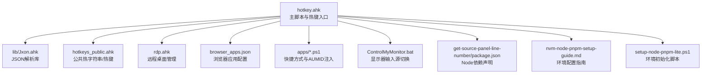
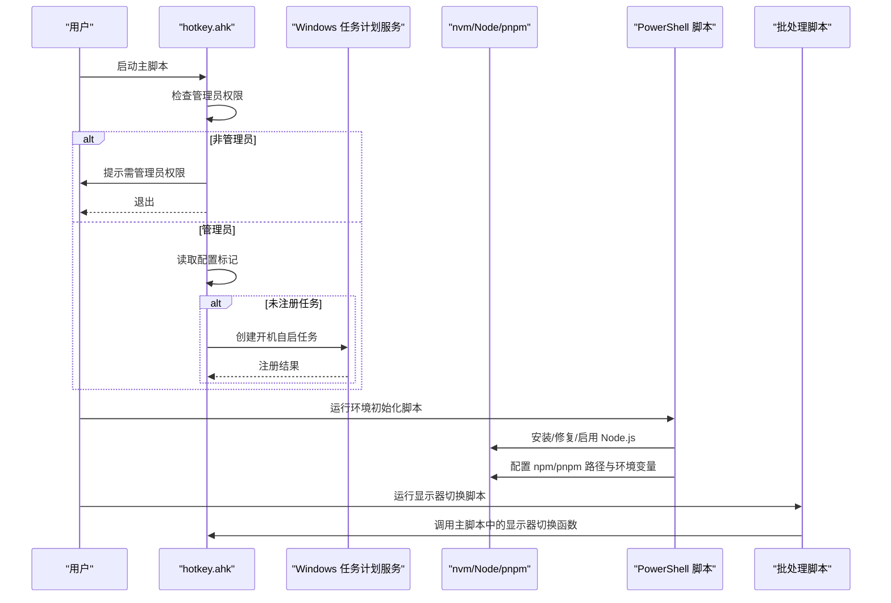
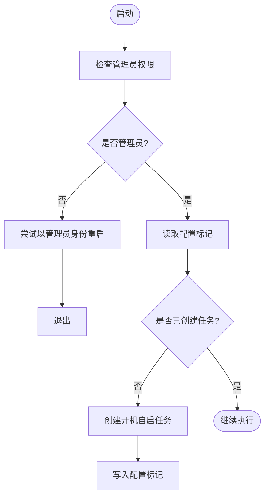
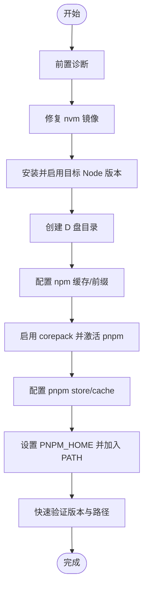
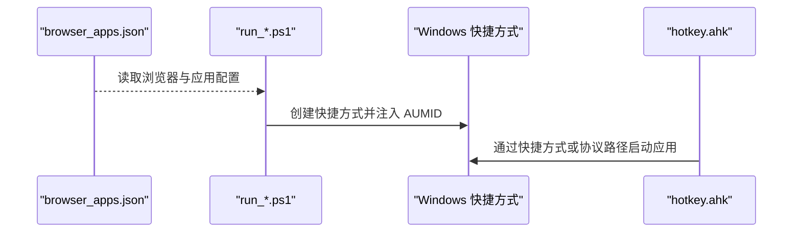
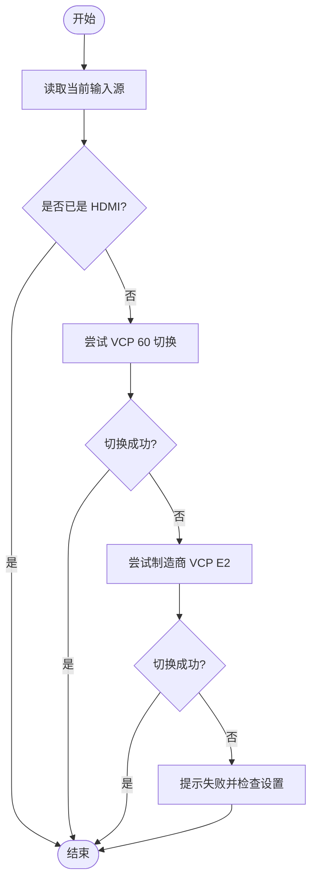
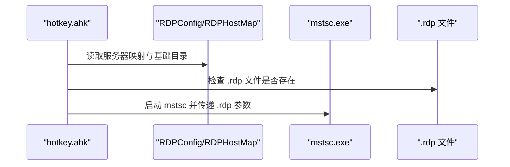
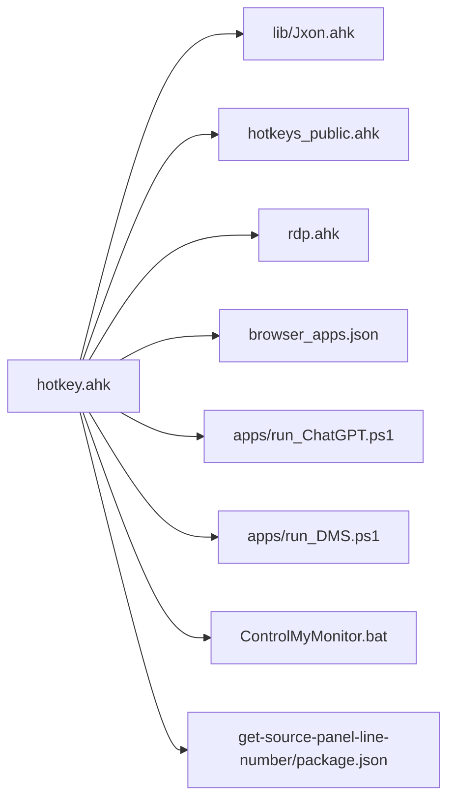

# 系统配置

<cite>
**本文引用的文件**
- [README.md](file://README.md)
- [hotkey.ahk](file://hotkey.ahk)
- [hotkeys_public.ahk](file://hotkeys_public.ahk)
- [nvm-node-pnpm-setup-guide.md](file://nvm-node-pnpm-setup-guide.md)
- [setup-node-pnpm-lite.ps1](file://setup-node-pnpm-lite.ps1)
- [browser_apps.json](file://browser_apps.json)
- [ControlMyMonitor.bat](file://ControlMyMonitor.bat)
- [apps/run_ChatGPT.ps1](file://apps/run_ChatGPT.ps1)
- [apps/run_DMS.ps1](file://apps/run_DMS.ps1)
- [get-source-panel-line-number/package.json](file://get-source-panel-line-number/package.json)
- [lib/Jxon.ahk](file://lib/Jxon.ahk)
- [rdp.ahk](file://rdp.ahk)
</cite>

## 目录
1. [简介](#简介)
2. [项目结构](#项目结构)
3. [核心组件](#核心组件)
4. [架构总览](#架构总览)
5. [详细组件分析](#详细组件分析)
6. [依赖关系分析](#依赖关系分析)
7. [性能考虑](#性能考虑)
8. [故障排查指南](#故障排查指南)
9. [结论](#结论)
10. [附录](#附录)

## 简介
本文件面向系统管理员与高级用户，系统性梳理 hotkey 项目的系统配置与环境要求，覆盖以下主题：
- 管理员权限检查与提升机制，以及 Windows 任务计划服务的注册与管理
- Node.js、pnpm 与 nvm 的安装、配置与环境变量设置
- 系统兼容性检查与依赖验证方法
- 配置迁移指南与版本间迁移策略
- 配置备份与恢复最佳实践及回滚策略
- 系统集成配置，如 Windows 任务计划、PowerShell 执行策略等

## 项目结构
hotkey 项目以 AutoHotkey v2 脚本为核心，结合若干 PowerShell 脚本、批处理脚本与 JSON 配置文件，形成“热键定义 + 应用启动 + 系统集成”的整体能力。

图表来源
- [hotkey.ahk](file://hotkey.ahk)
- [lib/Jxon.ahk](file://lib/Jxon.ahk)
- [hotkeys_public.ahk](file://hotkeys_public.ahk)
- [rdp.ahk](file://rdp.ahk)
- [browser_apps.json](file://browser_apps.json)
- [apps/run_ChatGPT.ps1](file://apps/run_ChatGPT.ps1)
- [apps/run_DMS.ps1](file://apps/run_DMS.ps1)
- [ControlMyMonitor.bat](file://ControlMyMonitor.bat)
- [get-source-panel-line-number/package.json](file://get-source-panel-line-number/package.json)
- [nvm-node-pnpm-setup-guide.md](file://nvm-node-pnpm-setup-guide.md)
- [setup-node-pnpm-lite.ps1](file://setup-node-pnpm-lite.ps1)

章节来源
- [README.md](file://README.md)
- [hotkey.ahk](file://hotkey.ahk)

## 核心组件
- 管理员权限与任务计划
  - 主脚本在启动时检测管理员权限，若非管理员则尝试以管理员身份重启；随后检查配置文件标记，若未注册系统任务，则通过任务计划服务创建开机自启任务。
- Node.js / pnpm / nvm 环境
  - 提供完整安装、镜像修复、缓存与全局目录迁移、环境变量注入与校验的流程与脚本。
- 浏览器应用与快捷方式
  - 通过 JSON 配置浏览器与常用应用，PowerShell 脚本生成带 AUMID 的快捷方式，便于系统识别与窗口管理。
- 显示器输入源切换
  - 批处理脚本与主脚本中的函数共同实现基于 ControlMyMonitor 的输入源切换。
- RDP 连接管理
  - 基于 .rdp 文件与主机映射的集中式连接管理。

章节来源
- [hotkey.ahk](file://hotkey.ahk)
- [nvm-node-pnpm-setup-guide.md](file://nvm-node-pnpm-setup-guide.md)
- [setup-node-pnpm-lite.ps1](file://setup-node-pnpm-lite.ps1)
- [browser_apps.json](file://browser_apps.json)
- [apps/run_ChatGPT.ps1](file://apps/run_ChatGPT.ps1)
- [apps/run_DMS.ps1](file://apps/run_DMS.ps1)
- [ControlMyMonitor.bat](file://ControlMyMonitor.bat)
- [rdp.ahk](file://rdp.ahk)

## 架构总览
hotkey 的系统配置围绕“主脚本 + 环境脚本 + 应用配置 + 系统集成”展开，形成如下交互：

图表来源
- [hotkey.ahk](file://hotkey.ahk)
- [setup-node-pnpm-lite.ps1](file://setup-node-pnpm-lite.ps1)
- [ControlMyMonitor.bat](file://ControlMyMonitor.bat)

## 详细组件分析

### 管理员权限检查与任务计划服务
- 权限检查与提升
  - 主脚本在启动时判断是否为管理员；若非管理员，尝试以管理员身份运行当前脚本；若失败则弹窗提示并退出。
- 任务计划注册与管理
  - 若配置文件中标记未创建任务，则构造任务创建命令，以“登录时运行、最高权限、不受电源限制”为目标创建任务，并写入标记；若创建失败则弹窗提示错误信息。
- 配置文件
  - 使用脚本目录下的配置文件记录任务创建状态，避免重复注册。

图表来源
- [hotkey.ahk](file://hotkey.ahk)

章节来源
- [hotkey.ahk](file://hotkey.ahk)

### Node.js、pnpm 与 nvm 的配置与安装
- 环境前置诊断
  - 检查 nvm 版本、可用版本列表、nvm 根目录与设置文件内容，辅助定位镜像问题。
- 修复 nvm 镜像
  - 将镜像源修正为官方源，解决 LTS 安装失败问题。
- 安装与启用指定版本
  - 安装并切换到目标 Node.js 版本，验证 node/npm 版本与路径。
- 迁移缓存与全局目录至 D 盘
  - 创建 npm 缓存与全局目录、pnpm store 与 home 目录，分别配置 npm/pnpm 的缓存与存储路径。
- 启用 pnpm（通过 corepack）
  - 启用 corepack 并激活最新 pnpm，随后配置 pnpm 的 store 与缓存目录。
- 设置 PNPM_HOME 并加入 PATH
  - 将 pnpm home 目录写入用户环境变量与 PATH，同时在当前会话生效。
- 验证与建议
  - 通过全局安装工具链与路径查询验证配置；建议重开终端或 IDE 以使环境变量生效；若 nvm use 后 node 不可用，检查 where 与 settings.txt 中的 path。

图表来源
- [nvm-node-pnpm-setup-guide.md](file://nvm-node-pnpm-setup-guide.md)
- [setup-node-pnpm-lite.ps1](file://setup-node-pnpm-lite.ps1)

章节来源
- [nvm-node-pnpm-setup-guide.md](file://nvm-node-pnpm-setup-guide.md)
- [setup-node-pnpm-lite.ps1](file://setup-node-pnpm-lite.ps1)

### 浏览器应用与快捷方式配置
- 浏览器应用配置
  - JSON 文件定义浏览器路径、默认配置参数与常用应用（如 ChatGPT、DMS）的名称、URL、热键与 AUMID。
- 快捷方式生成与 AUMID 注入
  - PowerShell 脚本生成 Chrome 应用快捷方式，注入 AUMID，以便系统识别与窗口管理。
- 主脚本中的应用启动
  - 主脚本提供通用的应用启动与路径回退逻辑，支持协议路径与本地路径切换。

图表来源
- [browser_apps.json](file://browser_apps.json)
- [apps/run_ChatGPT.ps1](file://apps/run_ChatGPT.ps1)
- [apps/run_DMS.ps1](file://apps/run_DMS.ps1)
- [hotkey.ahk](file://hotkey.ahk)

章节来源
- [browser_apps.json](file://browser_apps.json)
- [apps/run_ChatGPT.ps1](file://apps/run_ChatGPT.ps1)
- [apps/run_DMS.ps1](file://apps/run_DMS.ps1)
- [hotkey.ahk](file://hotkey.ahk)

### 显示器输入源切换
- 批处理脚本
  - 自动检测当前输入源，优先使用标准 VCP 60，失败时回退到制造商特定 VCP E2，最终确认切换结果。
- 主脚本函数
  - 提供输入源切换函数与主机名到输入源的映射，确保不同主机使用正确的输入源编号。

图表来源
- [ControlMyMonitor.bat](file://ControlMyMonitor.bat)
- [hotkey.ahk](file://hotkey.ahk)

章节来源
- [ControlMyMonitor.bat](file://ControlMyMonitor.bat)
- [hotkey.ahk](file://hotkey.ahk)

### RDP 连接管理
- 配置与映射
  - 基于 .rdp 文件目录与服务器映射，实现“当前主机 -> 目标主机”的短名映射。
- 连接流程
  - 校验 mstsc 存在与 .rdp 文件存在，随后启动连接。

图表来源
- [rdp.ahk](file://rdp.ahk)

章节来源
- [rdp.ahk](file://rdp.ahk)

## 依赖关系分析
- 主脚本依赖
  - 主脚本包含 JSON 解析库、UIA 扩展、公共热键定义与多个功能模块；同时依赖 Windows 任务计划服务与系统路径。
- Node 生态依赖
  - get-source-panel-line-number 目录声明 chrome-remote-interface 依赖，用于调试面板行号获取。
- 配置与脚本耦合
  - 浏览器应用配置与 PowerShell 快捷方式脚本紧密耦合；显示器切换脚本与主脚本函数相互配合。

图表来源
- [hotkey.ahk](file://hotkey.ahk)
- [lib/Jxon.ahk](file://lib/Jxon.ahk)
- [hotkeys_public.ahk](file://hotkeys_public.ahk)
- [rdp.ahk](file://rdp.ahk)
- [browser_apps.json](file://browser_apps.json)
- [apps/run_ChatGPT.ps1](file://apps/run_ChatGPT.ps1)
- [apps/run_DMS.ps1](file://apps/run_DMS.ps1)
- [ControlMyMonitor.bat](file://ControlMyMonitor.bat)
- [get-source-panel-line-number/package.json](file://get-source-panel-line-number/package.json)

章节来源
- [hotkey.ahk](file://hotkey.ahk)
- [get-source-panel-line-number/package.json](file://get-source-panel-line-number/package.json)

## 性能考虑
- 任务计划服务
  - 使用“登录时运行 + 最高权限”可确保开机即具备所需权限，减少后续权限检查成本。
- 路径与文件存在性检查
  - 主脚本在启动应用前进行路径存在性检查与回退，避免无效调用带来的延迟。
- 环境初始化
  - 通过一次性脚本完成环境变量与路径注入，避免每次启动重复校验。

## 故障排查指南
- 管理员权限与任务计划
  - 若提示权限受限：确认以管理员身份运行；若任务注册失败：检查系统任务计划服务状态与命令返回信息。
- Node.js / pnpm / nvm
  - 若 nvm 安装 LTS 失败：按指南修复镜像源；若 nvm use 后 node 不可用：检查 where 与 settings.txt 中的 path；若环境变量未生效：重开终端或 IDE。
- 浏览器应用快捷方式
  - 若应用无法识别：检查快捷方式 AUMID 注入是否正确；确认浏览器路径与参数配置。
- 显示器输入源
  - 若切换失败：检查硬件 DDC/CI 设置与 ControlMyMonitor 路径；必要时回退到制造商特定 VCP。
- RDP 连接
  - 若连接失败：确认 mstsc 存在与 .rdp 文件路径正确；检查服务器映射与主机名大小写。

章节来源
- [hotkey.ahk](file://hotkey.ahk)
- [nvm-node-pnpm-setup-guide.md](file://nvm-node-pnpm-setup-guide.md)
- [setup-node-pnpm-lite.ps1](file://setup-node-pnpm-lite.ps1)
- [apps/run_ChatGPT.ps1](file://apps/run_ChatGPT.ps1)
- [apps/run_DMS.ps1](file://apps/run_DMS.ps1)
- [ControlMyMonitor.bat](file://ControlMyMonitor.bat)
- [rdp.ahk](file://rdp.ahk)

## 结论
hotkey 项目通过主脚本统一入口、环境脚本标准化安装、配置文件集中管理与系统服务集成，构建了可维护、可迁移、可扩展的系统配置体系。遵循本文档的配置与迁移策略，可在多版本与多环境中稳定运行。

## 附录

### 系统兼容性检查与依赖验证
- Windows 任务计划服务
  - 确认服务状态正常，具备创建与运行任务的权限。
- PowerShell 执行策略
  - 根据需要调整执行策略以允许运行脚本；建议在受信环境中使用。
- Node.js 生态
  - 核对 Node.js、npm、pnpm 版本与路径；验证缓存与存储目录权限。

章节来源
- [hotkey.ahk](file://hotkey.ahk)
- [nvm-node-pnpm-setup-guide.md](file://nvm-node-pnpm-setup-guide.md)
- [setup-node-pnpm-lite.ps1](file://setup-node-pnpm-lite.ps1)

### 配置迁移指南（版本间迁移）
- 环境迁移
  - 保留 nvm 本体在 C 盘，仅迁移 npm/pnpm 的缓存与全局目录到 D 盘；通过脚本或指南逐步迁移。
- 配置文件迁移
  - 备份 browser_apps.json 与主脚本中的配置标记；在新版本中核对字段与默认值差异。
- 回滚策略
  - 提供 npm/pnpm 配置删除与 PNPM_HOME 环境变量清理命令，确保可完全回滚。

章节来源
- [nvm-node-pnpm-setup-guide.md](file://nvm-node-pnpm-setup-guide.md)
- [setup-node-pnpm-lite.ps1](file://setup-node-pnpm-lite.ps1)
- [browser_apps.json](file://browser_apps.json)
- [hotkey.ahk](file://hotkey.ahk)

### 配置备份与恢复最佳实践
- 备份范围
  - 主脚本、公共热键、浏览器应用配置、任务计划标记、Node 环境配置与存储目录。
- 版本管理
  - 使用版本控制管理配置文件；对重大变更打标签或分支。
- 回滚策略
  - 依据回滚命令逐项恢复 npm/pnpm 配置与环境变量；必要时删除任务计划任务并重建。

章节来源
- [nvm-node-pnpm-setup-guide.md](file://nvm-node-pnpm-setup-guide.md)
- [setup-node-pnpm-lite.ps1](file://setup-node-pnpm-lite.ps1)
- [hotkey.ahk](file://hotkey.ahk)