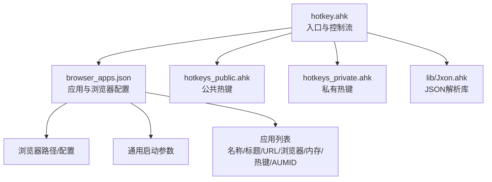
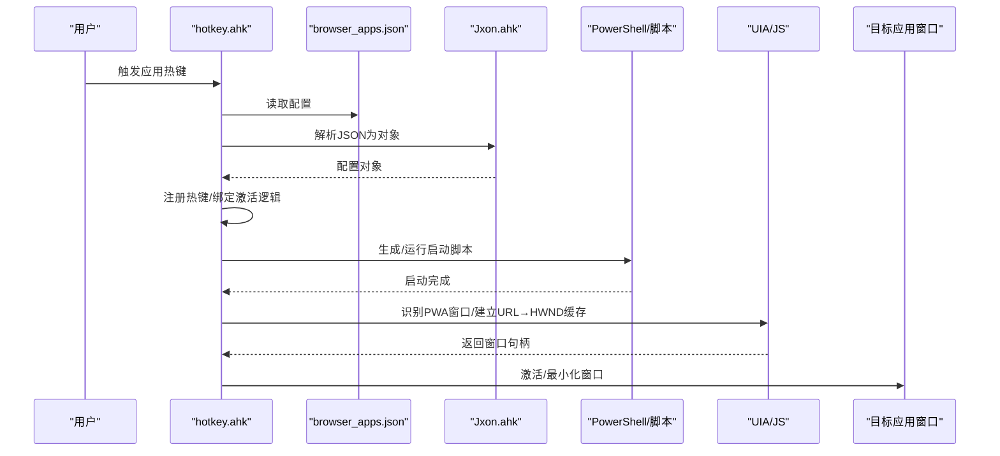
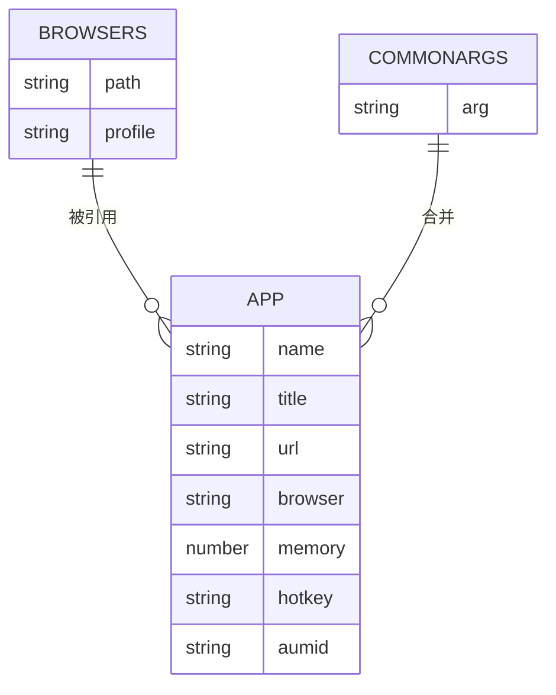
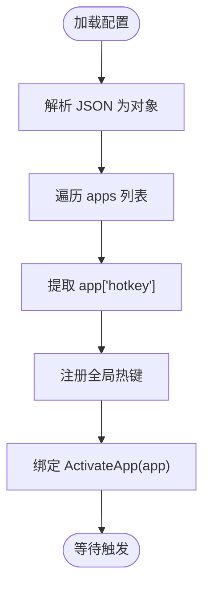
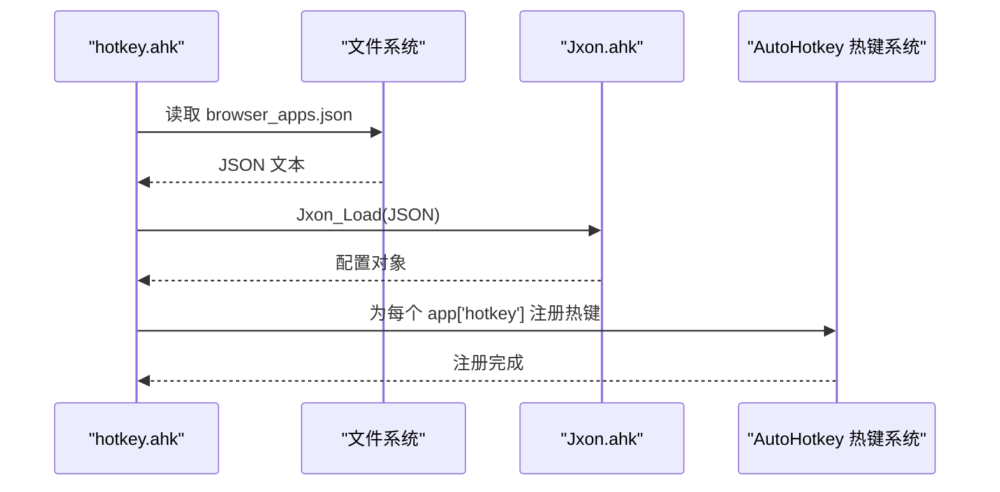
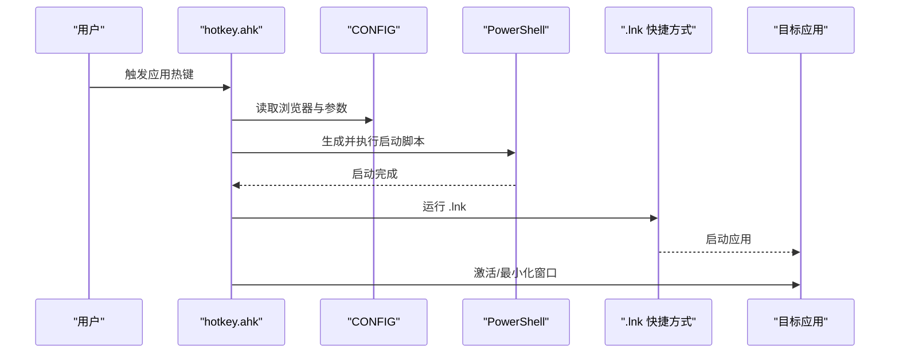
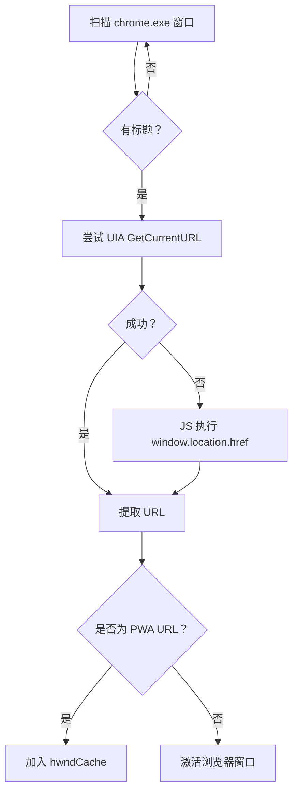
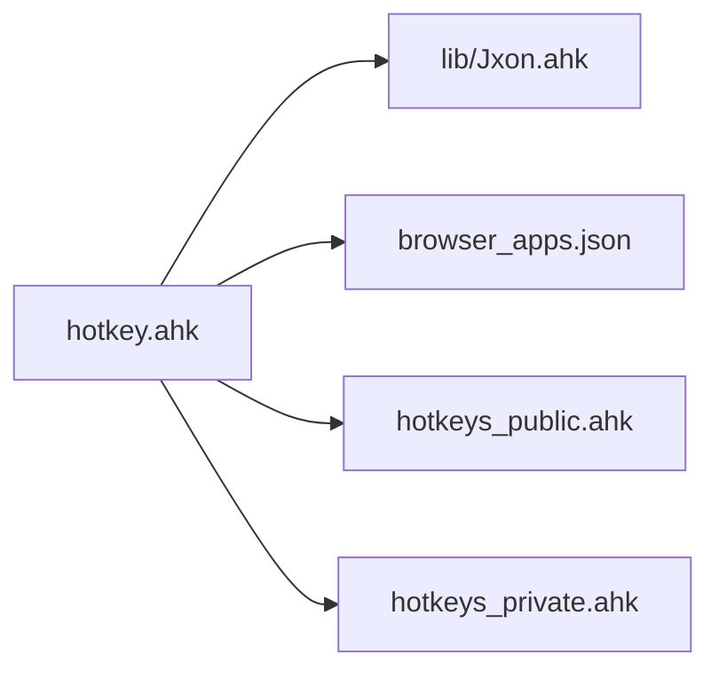

# 配置管理

<cite>
**本文引用的文件**
- [browser_apps.json](file://browser_apps.json)
- [hotkey.ahk](file://hotkey.ahk)
- [hotkeys_public.ahk](file://hotkeys_public.ahk)
- [hotkeys_private.ahk](file://hotkeys_private.ahk)
- [lib/Jxon.ahk](file://lib/Jxon.ahk)
- [README.md](file://README.md)
</cite>

## 目录
1. [简介](#简介)
2. [项目结构](#项目结构)
3. [核心组件](#核心组件)
4. [架构总览](#架构总览)
5. [详细组件分析](#详细组件分析)
6. [依赖关系分析](#依赖关系分析)
7. [性能考量](#性能考量)
8. [故障排查指南](#故障排查指南)
9. [结论](#结论)
10. [附录](#附录)

## 简介
本文件聚焦于 hotkey 项目的配置管理，围绕以下目标展开：
- 深入解释 browser_apps.json 的结构与配置项含义
- 说明热键配置的语法与规则（公共热键与私有热键）
- 提供配置验证与错误处理的最佳实践
- 讨论配置迁移、版本兼容性与备份恢复
- 给出常见与高级使用场景的配置示例与建议

hotkey 项目基于 AutoHotkey v2，通过 JSON 配置驱动浏览器应用的快捷启动与热键绑定，并通过公共与私有热键文件提供便捷的文本替换与常用片段注入能力。

**章节来源**
- [README.md:1-2](file://README.md#L1-L2)

## 项目结构
hotkey 项目采用“配置驱动 + 脚本编排”的组织方式：
- 配置层：browser_apps.json 定义浏览器、通用参数与应用清单
- 脚本层：hotkey.ahk 加载配置、解析 JSON、注册热键、生成启动脚本
- 热键层：hotkeys_public.ahk 提供公共热字符串；hotkeys_private.ahk 提供私有热字符串
- 工具库：lib/Jxon.ahk 提供轻量 JSON 解析与序列化

**图表来源**
- [hotkey.ahk:14-19](file://hotkey.ahk#L14-L19)
- [browser_apps.json:1-48](file://browser_apps.json#L1-L48)
- [lib/Jxon.ahk:1-301](file://lib/Jxon.ahk#L1-L301)

**章节来源**
- [hotkey.ahk:14-19](file://hotkey.ahk#L14-L19)
- [browser_apps.json:1-48](file://browser_apps.json#L1-L48)

## 核心组件
- browser_apps.json：集中定义浏览器安装路径、配置文件夹、通用启动参数，以及应用清单（名称、标题、URL、浏览器、内存星级、热键、AUMID 等）
- hotkey.ahk：负责加载配置、解析 JSON、注册热键、生成启动脚本、窗口切换与缓存管理
- hotkeys_public.ahk：公共热字符串（如 SQL 片段、常用命令等），面向团队共享
- hotkeys_private.ahk：私有热字符串（如个人邮箱、电话、地址等），仅本地使用
- lib/Jxon.ahk：轻量 JSON 解析与序列化库，用于从 JSON 文本构建对象结构

**章节来源**
- [browser_apps.json:1-48](file://browser_apps.json#L1-L48)
- [hotkey.ahk:14-19](file://hotkey.ahk#L14-L19)
- [hotkeys_public.ahk:1-57](file://hotkeys_public.ahk#L1-L57)
- [hotkeys_private.ahk:1-18](file://hotkeys_private.ahk#L1-L18)
- [lib/Jxon.ahk:1-301](file://lib/Jxon.ahk#L1-L301)

## 架构总览
hotkey 的配置驱动流程如下：
- 启动时加载 browser_apps.json 并通过 Jxon.ahk 解析为对象
- 遍历应用清单，按应用热键注册全局热键
- 当触发热键时，根据应用配置尝试激活已有窗口或生成启动脚本并启动
- 通过 UIA/JS 技术识别 PWA 窗口并建立 URL→窗口句柄的缓存，加速后续激活

**图表来源**
- [hotkey.ahk:2132-2149](file://hotkey.ahk#L2132-L2149)
- [browser_apps.json:1-48](file://browser_apps.json#L1-L48)
- [lib/Jxon.ahk:10-48](file://lib/Jxon.ahk#L10-L48)

## 详细组件分析

### browser_apps.json 结构与配置项详解
- browsers
  - chrome/path：Chrome 可执行文件路径
  - chrome/profile：Chrome 配置文件夹（如 Default）
  - edge/path、edge/profile：同上，适用于 Microsoft Edge
- commonArgs：通用启动参数数组，用于所有浏览器应用启动
- apps：应用清单数组，每项包含
  - name：应用名称（用于生成文件名与界面展示）
  - title：窗口标题（用于精确匹配）
  - url：应用 URL（支持 PWA 场景）
  - browser：浏览器标识（chrome/edge）
  - memory：内存星级（用于界面展示与逻辑参考）
  - hotkey：应用热键（见“热键语法与规则”）
  - aumid：应用 AUMID（用于 Windows 应用关联）

**图表来源**
- [browser_apps.json:2-11](file://browser_apps.json#L2-L11)
- [browser_apps.json:13-23](file://browser_apps.json#L13-L23)
- [browser_apps.json:25-46](file://browser_apps.json#L25-L46)

**章节来源**
- [browser_apps.json:2-11](file://browser_apps.json#L2-L11)
- [browser_apps.json:13-23](file://browser_apps.json#L13-L23)
- [browser_apps.json:25-46](file://browser_apps.json#L25-L46)

### 热键语法与规则（公共与私有）
- 热键注册与绑定
  - hotkey.ahk 在加载配置后，遍历 apps 并为每个 app["hotkey"] 注册全局热键，绑定 ActivateApp 函数
  - 热键格式遵循 AutoHotkey v2 的修饰键约定：#（Win）、!（Alt）、^（Ctrl）、+（Shift）
  - 示例：应用 ChatGPT 的热键为“#g”，即 Win+g
- 公共热键（hotkeys_public.ahk）
  - 采用热字符串语法，提供团队共享的常用片段（如 SQL、命令模板）
  - 例如：以“:o:”或“:*:”开头的热字符串，分别控制是否覆盖模式与是否即时触发
- 私有热键（hotkeys_private.ahk）
  - 与公共热键相同，但仅存放个人敏感信息（如邮箱、电话、地址等）
  - 通过条件包含（#Include *i）在脚本启动时按需加载，避免泄露

**图表来源**
- [hotkey.ahk:2132-2149](file://hotkey.ahk#L2132-L2149)
- [browser_apps.json:32-33](file://browser_apps.json#L32-L33)
- [browser_apps.json:42-43](file://browser_apps.json#L42-L43)

**章节来源**
- [hotkey.ahk:2132-2149](file://hotkey.ahk#L2132-L2149)
- [hotkeys_public.ahk:1-57](file://hotkeys_public.ahk#L1-L57)
- [hotkeys_private.ahk:1-18](file://hotkeys_private.ahk#L1-L18)

### 配置加载与热键注册流程
- 加载配置：FileRead 读取 browser_apps.json，使用 Jxon_Load 解析为对象
- 注册热键：遍历 CONFIG["apps"]，对每个 app["hotkey"] 调用 Hotkey 注册
- 激活应用：触发热键后，先尝试从 hwndCache 中定位目标 URL 的窗口，若无则运行生成的启动脚本

**图表来源**
- [hotkey.ahk:2132-2149](file://hotkey.ahk#L2132-L2149)
- [lib/Jxon.ahk:10-48](file://lib/Jxon.ahk#L10-L48)

**章节来源**
- [hotkey.ahk:2132-2149](file://hotkey.ahk#L2132-L2149)
- [lib/Jxon.ahk:10-48](file://lib/Jxon.ahk#L10-L48)

### 应用生成与启动流程
- 生成启动脚本：根据浏览器配置与 commonArgs，拼装启动参数，生成 PowerShell 脚本与 .lnk 快捷方式
- 运行启动脚本：通过 RunWait 调用 PowerShell 执行，完成后在托盘提示“点击热键可激活应用”
- 激活应用：优先从 hwndCache 中定位窗口，否则运行 .lnk 启动

**图表来源**
- [hotkey.ahk:2058-2111](file://hotkey.ahk#L2058-L2111)
- [hotkey.ahk:2221-2245](file://hotkey.ahk#L2221-L2245)

**章节来源**
- [hotkey.ahk:2058-2111](file://hotkey.ahk#L2058-L2111)
- [hotkey.ahk:2221-2245](file://hotkey.ahk#L2221-L2245)

### 窗口缓存与 PWA 识别
- 缓存构建：扫描 chrome.exe 窗口，过滤无标题的后台窗口，尝试通过 UIA 或 JS 获取 URL
- PWA 识别：针对特定 URL（如 ChatGPT/DMS）建立 URL→HWND 缓存，加速后续激活
- 激活策略：若缓存命中则激活/最小化对应窗口，否则运行启动脚本

**图表来源**
- [hotkey.ahk:2160-2206](file://hotkey.ahk#L2160-L2206)

**章节来源**
- [hotkey.ahk:2160-2206](file://hotkey.ahk#L2160-L2206)

## 依赖关系分析
- hotkey.ahk 依赖
  - lib/Jxon.ahk：JSON 解析与序列化
  - browser_apps.json：应用与浏览器配置
  - hotkeys_public.ahk / hotkeys_private.ahk：热键定义
- hotkeys_private.ahk 通过条件包含（#Include *i）在启动时按需加载，避免未创建时的错误

**图表来源**
- [hotkey.ahk:14-19](file://hotkey.ahk#L14-L19)
- [lib/Jxon.ahk:1-301](file://lib/Jxon.ahk#L1-L301)

**章节来源**
- [hotkey.ahk:14-19](file://hotkey.ahk#L14-L19)
- [lib/Jxon.ahk:1-301](file://lib/Jxon.ahk#L1-L301)

## 性能考量
- JSON 解析成本：Jxon.ahk 为轻量实现，解析 browser_apps.json 的开销较小，适合一次性加载
- 热键注册：按应用数量线性注册，通常不影响启动时间
- 窗口扫描与缓存：BuildBrowserCache 在用户触发“重建缓存”热键时执行，避免启动时阻塞
- 启动参数合并：commonArgs 与浏览器参数拼接为字符串，注意避免过长参数导致启动失败

[本节为通用指导，无需具体文件来源]

## 故障排查指南
- JSON 解析失败
  - 现象：启动时报错或无法加载配置
  - 排查：检查 browser_apps.json 语法（逗号、引号、缩进），确保 UTF-8 编码
  - 参考：Jxon_Load 的错误抛出位置
- 热键冲突
  - 现象：应用热键无效或与其他热键冲突
  - 排查：确认 app["hotkey"] 未与系统或第三方软件冲突；必要时更换修饰键组合
- 浏览器路径或配置文件夹错误
  - 现象：启动脚本无法运行或启动失败
  - 排查：核对 browsers.chrome.path 与 browsers.chrome.profile；确认路径存在且可执行
- PWA 窗口未识别
  - 现象：热键无法激活已有窗口
  - 排查：确认 URL 匹配逻辑（如 ChatGPT/DMS）；必要时手动重建缓存
- 私有热键未生效
  - 现象：私有热字符串不触发
  - 排查：确认 hotkeys_private.ahk 存在且被条件包含加载；检查热字符串语法

**章节来源**
- [lib/Jxon.ahk:100-101](file://lib/Jxon.ahk#L100-L101)
- [hotkey.ahk:2132-2149](file://hotkey.ahk#L2132-L2149)
- [hotkey.ahk:2058-2111](file://hotkey.ahk#L2058-L2111)
- [hotkey.ahk:2160-2206](file://hotkey.ahk#L2160-L2206)

## 结论
hotkey 项目通过 browser_apps.json 实现配置驱动的应用热键体系，结合公共与私有热键文件满足团队与个人需求。其核心优势在于：
- 配置集中、易于维护与迁移
- 通过缓存与 UIA/JS 识别提升激活效率
- 轻量 JSON 解析库降低复杂度

建议在团队内统一配置规范与命名约定，定期备份 browser_apps.json，并在升级前验证热键与 URL 匹配规则。

[本节为总结，无需具体文件来源]

## 附录

### 配置验证与错误处理最佳实践
- 验证 JSON 语法：使用在线 JSON 校验工具或 IDE 插件
- 编码一致性：确保 browser_apps.json 保存为 UTF-8
- 热键唯一性：避免重复注册同一热键
- 路径可用性：启动前校验浏览器可执行文件与配置文件夹存在
- 错误捕获：在生成脚本与运行时增加 try/catch 并弹窗提示

**章节来源**
- [hotkey.ahk:2132-2149](file://hotkey.ahk#L2132-L2149)
- [hotkey.ahk:2113-2126](file://hotkey.ahk#L2113-L2126)

### 配置迁移、版本兼容性与备份恢复
- 迁移策略
  - 新增应用：在 apps 数组中添加新条目，确保 hotkey 与 aumid 合理
  - 浏览器变更：更新 browsers 下对应项的 path 与 profile
  - 参数调整：在 commonArgs 中统一调整启动参数
- 兼容性
  - 保持 JSON 结构稳定，新增字段建议提供默认值或在代码中做健壮性判断
  - 热键语法遵循 AutoHotkey v2 规范，避免平台差异
- 备份与恢复
  - 定期备份 browser_apps.json 至版本控制系统或外部存储
  - 恢复时先停用脚本，替换文件后重启脚本并验证热键注册

**章节来源**
- [browser_apps.json:1-48](file://browser_apps.json#L1-L48)
- [hotkey.ahk:2132-2149](file://hotkey.ahk#L2132-L2149)

### 配置示例与使用场景
- 常见场景
  - 快速打开 ChatGPT：设置 name/title/url/browser/memory/hotkey/aumid
  - 快速打开 DMS：同上，热键可设为 #d
- 高级场景
  - 多浏览器支持：在 browsers 中同时配置 chrome 与 edge，并在 apps 中按需选择
  - PWA 识别优化：确保 URL 匹配规则与实际站点一致，必要时扩展缓存逻辑
  - 私有热字符串：在 hotkeys_private.ahk 中添加个人敏感信息，避免泄露

**章节来源**
- [browser_apps.json:25-46](file://browser_apps.json#L25-L46)
- [hotkeys_private.ahk:1-18](file://hotkeys_private.ahk#L1-L18)