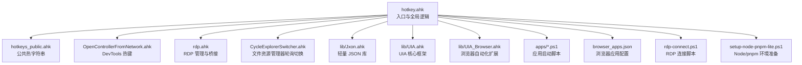
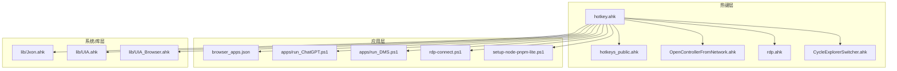
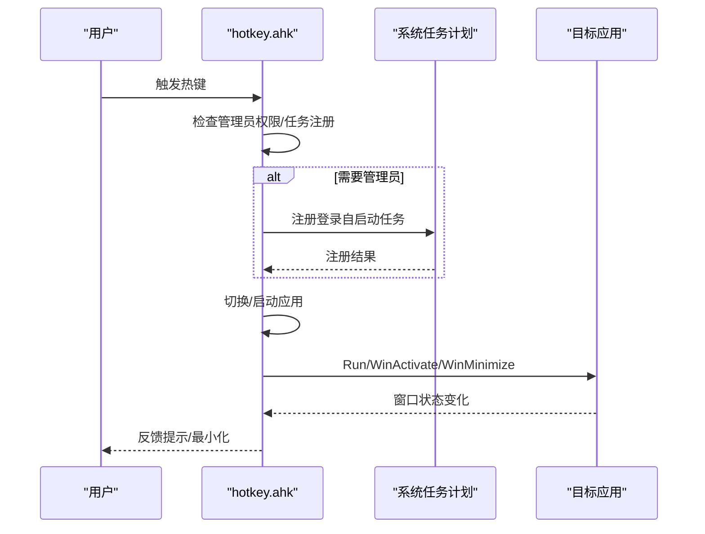
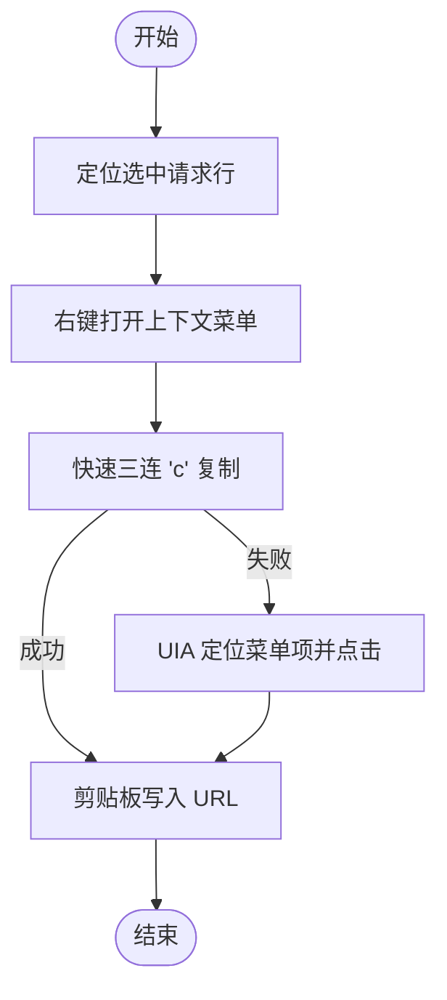
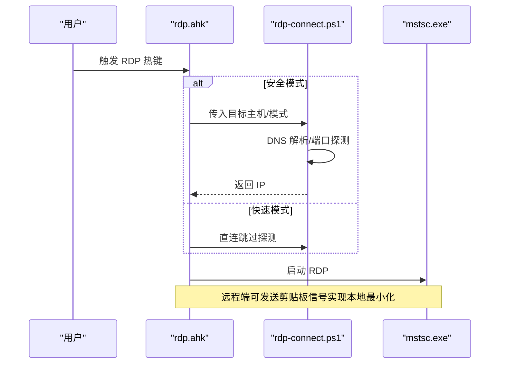
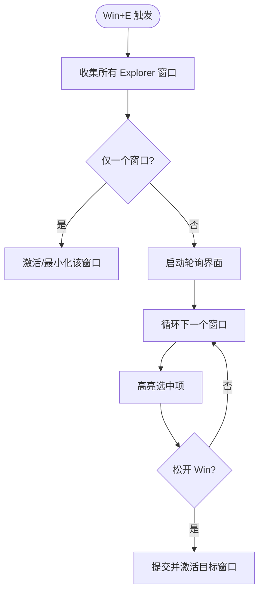
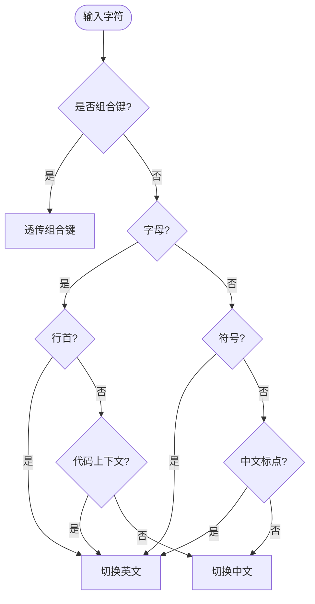
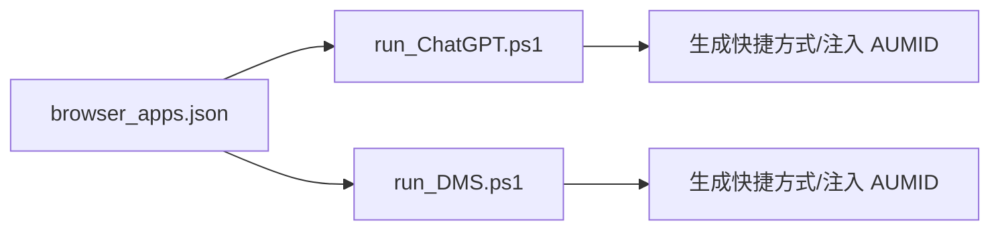
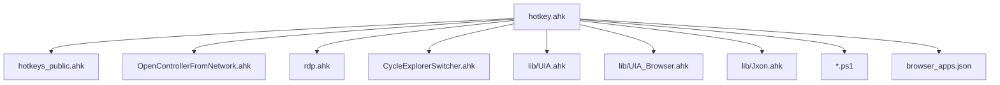

# 项目概述

<cite>
**本文档引用的文件**
- [README.md](file://README.md)
- [hotkey.ahk](file://hotkey.ahk)
- [hotkeys_public.ahk](file://hotkeys_public.ahk)
- [lib/Jxon.ahk](file://lib/Jxon.ahk)
- [lib/UIA.ahk](file://lib/UIA.ahk)
- [lib/UIA_Browser.ahk](file://lib/UIA_Browser.ahk)
- [CycleExplorerSwitcher.ahk](file://CycleExplorerSwitcher.ahk)
- [OpenControllerFromNetwork.ahk](file://OpenControllerFromNetwork.ahk)
- [rdp.ahk](file://rdp.ahk)
- [apps/run_ChatGPT.ps1](file://apps/run_ChatGPT.ps1)
- [apps/run_DMS.ps1](file://apps/run_DMS.ps1)
- [browser_apps.json](file://browser_apps.json)
- [rdp-connect.ps1](file://rdp-connect.ps1)
- [setup-node-pnpm-lite.ps1](file://setup-node-pnpm-lite.ps1)
</cite>

## 目录
1. [简介](#简介)
2. [项目结构](#项目结构)
3. [核心组件](#核心组件)
4. [架构总览](#架构总览)
5. [详细组件分析](#详细组件分析)
6. [依赖关系分析](#依赖关系分析)
7. [性能考量](#性能考量)
8. [故障排查指南](#故障排查指南)
9. [结论](#结论)
10. [附录](#附录)

## 简介
hotkey 是一个基于 AutoHotkey v2 的桌面自动化与热键管理项目，旨在通过统一的热键体系实现应用程序的快速启动、窗口切换与控制、浏览器自动化、远程桌面连接与剪贴板桥接等功能。项目强调“轻量、可靠、可扩展”的设计理念，通过模块化组织与清晰的职责划分，为用户提供高效稳定的桌面操作体验。

- 项目目标：以热键为核心入口，统一管理常用应用与工具，简化高频操作流程，提升桌面生产力。
- 主要特性：
  - 热键驱动的应用开关与窗口切换
  - 浏览器自动化（DevTools 热键、URL 抽取、标签页管理）
  - 远程桌面连接与最小化桥接（剪贴板信号）
  - 输入法智能切换与标点转换
  - JSON 配置与热字符串扩展
  - 文件资源管理器多窗口轮询切换
- 技术基础：AutoHotkey v2 的强健语法、对象模型、COM/UIA 支持、热键与钩子机制、系统进程与窗口 API。

**章节来源**
- [README.md:1-2](file://README.md#L1-L2)

## 项目结构
项目采用“入口脚本 + 子模块 + 库函数 + 辅助脚本”的组织方式，便于维护与扩展。

**图表来源**
- [hotkey.ahk:1-200](file://hotkey.ahk#L1-L200)
- [lib/Jxon.ahk:1-301](file://lib/Jxon.ahk#L1-L301)
- [lib/UIA.ahk:1-200](file://lib/UIA.ahk#L1-L200)
- [lib/UIA_Browser.ahk:1-200](file://lib/UIA_Browser.ahk#L1-L200)
- [OpenControllerFromNetwork.ahk:1-120](file://OpenControllerFromNetwork.ahk#L1-L120)
- [rdp.ahk:1-150](file://rdp.ahk#L1-L150)
- [CycleExplorerSwitcher.ahk:1-120](file://CycleExplorerSwitcher.ahk#L1-L120)
- [apps/run_ChatGPT.ps1:1-18](file://apps/run_ChatGPT.ps1#L1-L18)
- [apps/run_DMS.ps1:1-18](file://apps/run_DMS.ps1#L1-L18)
- [browser_apps.json:1-48](file://browser_apps.json#L1-L48)
- [rdp-connect.ps1:1-120](file://rdp-connect.ps1#L1-L120)
- [setup-node-pnpm-lite.ps1:1-121](file://setup-node-pnpm-lite.ps1#L1-L121)

**章节来源**
- [hotkey.ahk:1-200](file://hotkey.ahk#L1-L200)

## 核心组件
- 入口与生命周期管理
  - 权限自提升与任务计划注册
  - 程序路径前缀互换与启动容错
  - 窗口切换与最小化/激活逻辑
  - 脚本生命周期钩子（启动/重载/退出）
- 热键与热字符串
  - 公共热字符串（SQL 片段、常用命令等）
  - 应用热键（浏览器、聊天工具、数据库客户端等）
- 浏览器自动化
  - DevTools 热键：复制选中请求 URL 并解析为 API 路径
  - UIA 定位菜单项，支持缓存与自适应重试
- 远程桌面（RDP）
  - 快速直连与安全探测（DNS + 端口探测）
  - 本地最小化桥接（剪贴板信号）
  - 日志记录与调试信息
- 文件资源管理器轮询切换
  - 多窗口高亮与选择，支持 Esc 取消
- 输入法与标点
  - 输入拦截与智能中英文切换
  - 标点中英文互转与拼音转中文
- JSON 配置与工具
  - 轻量 JSON 解析/序列化
  - 浏览器应用配置（名称、URL、快捷键等）

**章节来源**
- [hotkey.ahk:24-120](file://hotkey.ahk#L24-L120)
- [hotkey.ahk:120-220](file://hotkey.ahk#L120-L220)
- [hotkeys_public.ahk:1-57](file://hotkeys_public.ahk#L1-L57)
- [OpenControllerFromNetwork.ahk:28-96](file://OpenControllerFromNetwork.ahk#L28-L96)
- [lib/UIA.ahk:1-200](file://lib/UIA.ahk#L1-L200)
- [lib/UIA_Browser.ahk:1-200](file://lib/UIA_Browser.ahk#L1-L200)
- [rdp.ahk:47-146](file://rdp.ahk#L47-L146)
- [CycleExplorerSwitcher.ahk:26-96](file://CycleExplorerSwitcher.ahk#L26-L96)
- [lib/Jxon.ahk:10-301](file://lib/Jxon.ahk#L10-L301)
- [browser_apps.json:1-48](file://browser_apps.json#L1-L48)

## 架构总览
hotkey 的整体架构围绕“入口脚本”为中心，通过模块化 include 与库函数协作，形成“热键层 -> 应用层 -> 系统层”的分层结构。

**图表来源**
- [hotkey.ahk:1-200](file://hotkey.ahk#L1-L200)
- [hotkeys_public.ahk:1-57](file://hotkeys_public.ahk#L1-L57)
- [OpenControllerFromNetwork.ahk:1-120](file://OpenControllerFromNetwork.ahk#L1-L120)
- [rdp.ahk:1-150](file://rdp.ahk#L1-L150)
- [CycleExplorerSwitcher.ahk:1-120](file://CycleExplorerSwitcher.ahk#L1-L120)
- [lib/Jxon.ahk:1-301](file://lib/Jxon.ahk#L1-L301)
- [lib/UIA.ahk:1-200](file://lib/UIA.ahk#L1-L200)
- [lib/UIA_Browser.ahk:1-200](file://lib/UIA_Browser.ahk#L1-L200)
- [browser_apps.json:1-48](file://browser_apps.json#L1-L48)
- [apps/run_ChatGPT.ps1:1-18](file://apps/run_ChatGPT.ps1#L1-L18)
- [apps/run_DMS.ps1:1-18](file://apps/run_DMS.ps1#L1-L18)
- [rdp-connect.ps1:1-120](file://rdp-connect.ps1#L1-L120)
- [setup-node-pnpm-lite.ps1:1-121](file://setup-node-pnpm-lite.ps1#L1-L121)

## 详细组件分析

### 热键与生命周期管理
- 权限自提升与任务注册
  - 首次运行检查管理员权限，必要时以最高权限重启自身
  - 注册登录自启动任务，确保开机即用
- 程序路径前缀互换
  - 针对 x86/x64 Program Files 路径差异，自动尝试替代路径
- 窗口切换与最小化
  - 通过 WinExist/WinActive/WinMinimize/WinActivate 实现“显示/隐藏/切换”
- 生命周期钩子
  - 启动/重载/退出时执行回调，支持跨模块共享状态

**图表来源**
- [hotkey.ahk:24-120](file://hotkey.ahk#L24-L120)
- [hotkey.ahk:120-220](file://hotkey.ahk#L120-L220)

**章节来源**
- [hotkey.ahk:24-120](file://hotkey.ahk#L24-L120)
- [hotkey.ahk:120-220](file://hotkey.ahk#L120-L220)

### 浏览器自动化（DevTools 热键）
- 功能要点
  - 一键复制 DevTools 中选中网络请求的 URL
  - 解析为 API 路径并写入剪贴板
  - UIA 定位菜单项，支持缓存锚点、自适应重试与全/局部扫描
- 流程概览

**图表来源**
- [OpenControllerFromNetwork.ahk:139-195](file://OpenControllerFromNetwork.ahk#L139-L195)
- [OpenControllerFromNetwork.ahk:471-581](file://OpenControllerFromNetwork.ahk#L471-L581)
- [lib/UIA.ahk:1-200](file://lib/UIA.ahk#L1-L200)

**章节来源**
- [OpenControllerFromNetwork.ahk:28-96](file://OpenControllerFromNetwork.ahk#L28-L96)
- [OpenControllerFromNetwork.ahk:139-195](file://OpenControllerFromNetwork.ahk#L139-L195)
- [OpenControllerFromNetwork.ahk:471-581](file://OpenControllerFromNetwork.ahk#L471-L581)
- [lib/UIA.ahk:1-200](file://lib/UIA.ahk#L1-L200)

### 远程桌面（RDP）管理与桥接
- 连接模式
  - 快速直连：解析主机名后直接启动 mstsc
  - 安全探测：DNS 解析 + TCP 端口探测（3389）后再连接
- 本地最小化桥接
  - 通过剪贴板写入信号，远程端检测后最小化本地 mstsc
- 日志与调试
  - 连接过程与失败原因记录至日志文件
  - 调试信息显示当前窗口/根窗口/会话状态

**图表来源**
- [rdp.ahk:165-207](file://rdp.ahk#L165-L207)
- [rdp.ahk:364-402](file://rdp.ahk#L364-L402)
- [rdp-connect.ps1:190-242](file://rdp-connect.ps1#L190-L242)

**章节来源**
- [rdp.ahk:47-146](file://rdp.ahk#L47-L146)
- [rdp.ahk:165-207](file://rdp.ahk#L165-L207)
- [rdp.ahk:364-402](file://rdp.ahk#L364-L402)
- [rdp-connect.ps1:190-242](file://rdp-connect.ps1#L190-L242)

### 文件资源管理器轮询切换
- 功能要点
  - Win+E 轮询当前所有“文件资源管理器”窗口
  - 高亮显示当前选中项，Esc 取消
  - 支持自定义主题与字体渲染
- 流程概览

**图表来源**
- [CycleExplorerSwitcher.ahk:68-96](file://CycleExplorerSwitcher.ahk#L68-L96)
- [CycleExplorerSwitcher.ahk:98-153](file://CycleExplorerSwitcher.ahk#L98-L153)
- [CycleExplorerSwitcher.ahk:383-404](file://CycleExplorerSwitcher.ahk#L383-L404)

**章节来源**
- [CycleExplorerSwitcher.ahk:26-96](file://CycleExplorerSwitcher.ahk#L26-L96)
- [CycleExplorerSwitcher.ahk:98-153](file://CycleExplorerSwitcher.ahk#L98-L153)
- [CycleExplorerSwitcher.ahk:383-404](file://CycleExplorerSwitcher.ahk#L383-L404)

### 输入法与标点智能切换
- 功能要点
  - 输入拦截（InputHook）结合上下文判断（行首、代码上下文、标点）
  - 自动切换中/英文输入法，支持标点中英文互转
  - Win+Z 快捷键触发拼音/英文单词转换
- 流程概览

**图表来源**
- [hotkey.ahk:367-404](file://hotkey.ahk#L367-L404)
- [hotkey.ahk:453-563](file://hotkey.ahk#L453-L563)

**章节来源**
- [hotkey.ahk:308-404](file://hotkey.ahk#L308-L404)
- [hotkey.ahk:453-563](file://hotkey.ahk#L453-L563)

### JSON 配置与浏览器应用管理
- JSON 库
  - 轻量实现 JSON Load/Save，支持 Map/Array
- 浏览器应用配置
  - 定义浏览器与应用清单（名称、URL、快捷键、AUMID 等）
  - 结合 PowerShell 脚本生成应用快捷方式并注入 AUMID

**图表来源**
- [browser_apps.json:1-48](file://browser_apps.json#L1-L48)
- [apps/run_ChatGPT.ps1:1-18](file://apps/run_ChatGPT.ps1#L1-L18)
- [apps/run_DMS.ps1:1-18](file://apps/run_DMS.ps1#L1-L18)

**章节来源**
- [lib/Jxon.ahk:10-301](file://lib/Jxon.ahk#L10-L301)
- [browser_apps.json:1-48](file://browser_apps.json#L1-L48)
- [apps/run_ChatGPT.ps1:1-18](file://apps/run_ChatGPT.ps1#L1-L18)
- [apps/run_DMS.ps1:1-18](file://apps/run_DMS.ps1#L1-L18)

## 依赖关系分析
- 模块耦合
  - hotkey.ahk 作为中枢，集中 include 各子模块，耦合度低、内聚性高
  - UIA 与 UIA_Browser 为浏览器自动化提供底层能力，彼此独立
- 外部依赖
  - AutoHotkey v2 核心 API（热键、窗口、剪贴板、进程）
  - Windows 系统 API（UIA、mstsc、剪贴板信号）
  - PowerShell 脚本（RDP 连接、Node/pnpm 环境准备）

**图表来源**
- [hotkey.ahk:1-200](file://hotkey.ahk#L1-L200)
- [lib/UIA.ahk:1-200](file://lib/UIA.ahk#L1-L200)
- [lib/UIA_Browser.ahk:1-200](file://lib/UIA_Browser.ahk#L1-L200)
- [lib/Jxon.ahk:1-301](file://lib/Jxon.ahk#L1-L301)

**章节来源**
- [hotkey.ahk:1-200](file://hotkey.ahk#L1-L200)

## 性能考量
- UIA 定位与菜单扫描
  - 优先局部锚点与缓存，避免全桌面扫描
  - 自适应重试与等待，兼顾稳定性与响应速度
- RDP 连接
  - 快速模式跳过探测，提升响应速度；安全模式增加可靠性
  - TCP 端口探测与 DNS 解析并行优化
- 输入法切换
  - 通过输入拦截与上下文判断，减少误触与无效切换
- 资源占用
  - 采用延迟加载与条件 include，避免不必要的模块初始化

[本节为通用指导，无需具体文件引用]

## 故障排查指南
- 管理员权限问题
  - 现象：任务计划注册失败或启动受限
  - 处理：以管理员身份运行脚本；检查系统策略与账户权限
- RDP 连接失败
  - 现象：端口不可达或解析失败
  - 处理：启用安全探测模式；检查 DNS/ARP/MAC 映射；查看日志文件
- DevTools 菜单定位失败
  - 现象：无法复制 URL 或菜单项未命中
  - 处理：调整重试次数与等待时间；启用全桌面扫描；检查 UIA 版本
- 剪贴板桥接异常
  - 现象：远程端最小化请求未生效
  - 处理：确认剪贴板信号格式；避免用户复制覆盖；检查本地 mstsc 窗口可见性

**章节来源**
- [hotkey.ahk:24-52](file://hotkey.ahk#L24-L52)
- [rdp.ahk:189-221](file://rdp.ahk#L189-L221)
- [OpenControllerFromNetwork.ahk:471-581](file://OpenControllerFromNetwork.ahk#L471-L581)

## 结论
hotkey 通过 AutoHotkey v2 的强大能力，构建了一个以热键为核心的桌面自动化平台。其模块化设计、完善的错误处理与性能优化，使其在复杂场景下仍能保持稳定与高效。无论是应用快速启动、浏览器自动化、远程桌面桥接，还是输入法与标点智能切换，hotkey 都提供了简洁而实用的解决方案，适合追求效率与定制化的用户与团队。

[本节为总结性内容，无需具体文件引用]

## 附录
- 适用场景
  - 高频应用启动与窗口切换
  - 开发者调试（DevTools 热键、URL 抽取）
  - 远程办公（RDP 连接与本地最小化）
  - 多窗口管理（文件资源管理器轮询切换）
- 设计理念
  - “少即是多”：以最少的热键承载最多的功能
  - “可扩展”：模块化结构便于新增功能与第三方集成
  - “稳健”：完善的错误处理与日志记录，保障长期可用性
- 与其他工具的区别
  - 更贴近桌面原生 API（UIA、窗口句柄、系统服务）
  - 更灵活的热键与上下文控制
  - 更强的浏览器自动化与远程协作能力

[本节为概念性内容，无需具体文件引用]